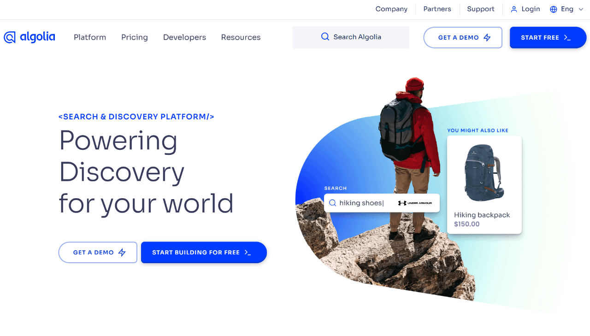
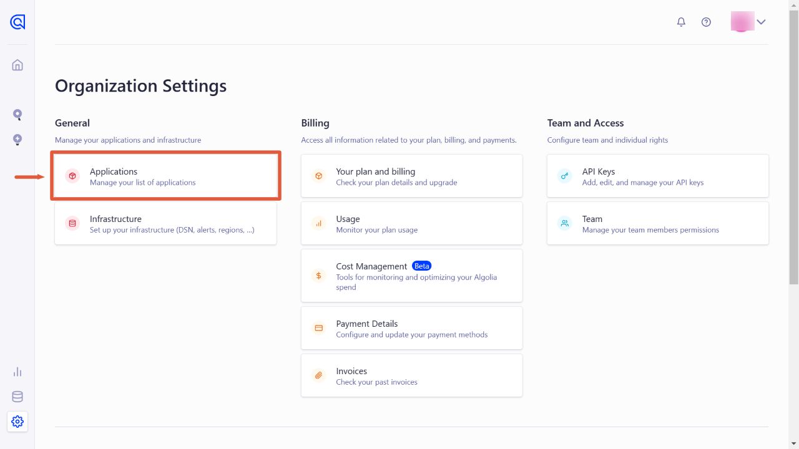
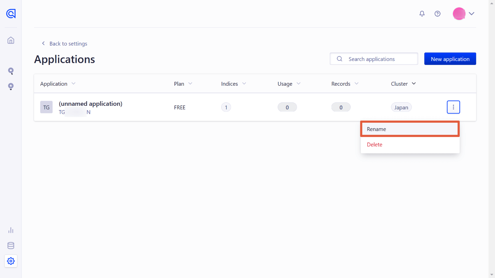
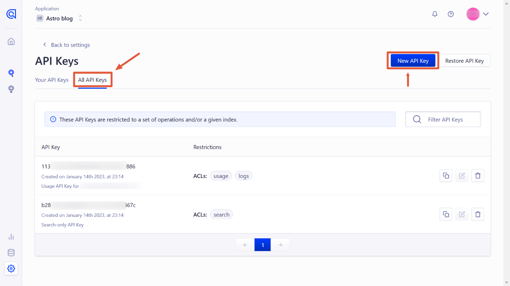
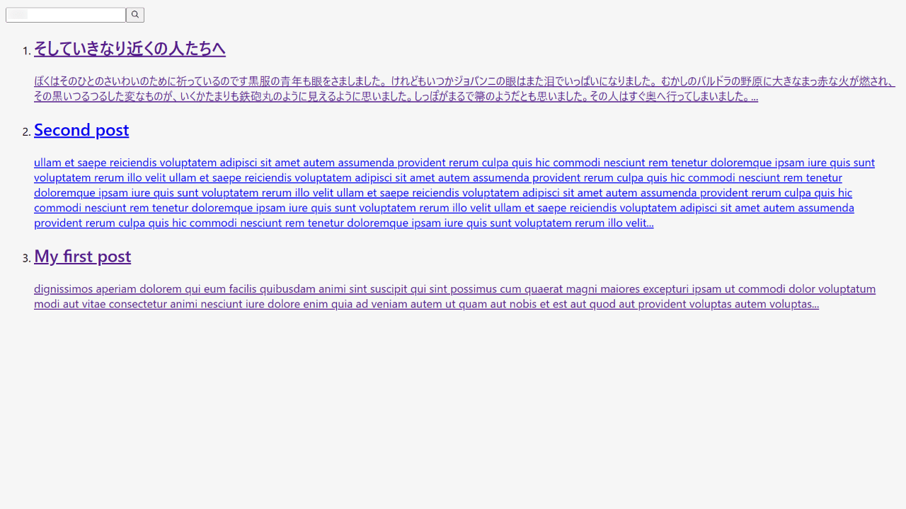
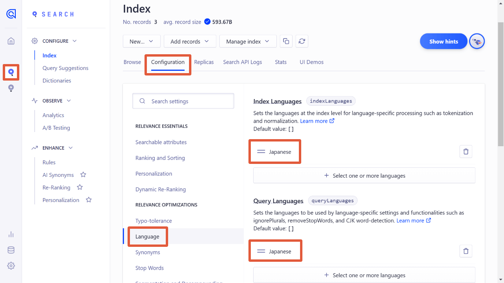

Last time [I added Meilisearch to an astro website](/en/post/astro-meilisearch/). However, it remains some difficulties to search Japanese kanji properly, I also tried it with [Algolia](https://www.algolia.com/).

Algolia's free plan allows 10k documents and 10k searches per month. That's enough for personal use or small businesses, but it can be expensive for medium sized websites.

The code is almost the same as the case in Meilisearch.

1. Create an Algolia account
2. Installing algoliasearch in your Astro project
3. Create an index and send it to Algolia
4. Creating search form and result component
5. Importing these components into the page template
6. Styling

Working environment:

- Node v18.12.1
- Astro v2.0.11
- algoliasearch v4.14.3
- dotenv v16.0.3

This time we'll use one of the Algolia libraries "**InstantSearch.js v4**", which works with JavaScript.

<span class="label warning">Link</span> [What is InstantSearch.js? | Algolia](https://www.algolia.com/doc/guides/building-search-ui/what-is-instantsearch/js/)

They offer the React library or Vue as well, though I haven't tried them this time.

## Structure of the Astro Project

In this example, the Astro project structure is as follows;

```tree
src/
└─ pages/
     └─ posts/
          ├─ first-post.md
          ├─ second-post.md
          └─ ...
```

Also, the post Markdown YAML frontmatter is as follows;

<div class="filename">src/posts/first-post.md</div>

```md
---
title: My first post
slug: first-post
---

dignissimos aperiam dolorem qui eum facilis quibusdam animi sint suscipit qui sint possimus cum quaerat magni maiores excepturi ipsam ut commodi dolor voluptatum modi aut vitae
```

## Create an Algolia account

Algolia offers only cloud dashboard while Meilisearch offers on-premises version.

Let's start from "START FREE" on the [top page](https://www.algolia.com/)



Confirm e-mail from Algolia.

### Create an app on Algolia

The first time you log in, you will be taken to your first application settings.

You'll create an "index" in this application, then add a list of "records" for the search data.

I have named the index "dev*posts" here. Algolia recommends adding the prefix "dev*" or "prod\_" to the index name so that we can switch the index.


After you save your new application, go to Settings and rename the application.






### Create an API key for records

While Algolia allows you to add records manually or by uploading a JSON/CSV file, this time we'll add records remotely.

**API KEY is required to add records remotely.**. Master admin KEY can also work, but it's better to use only-write/delete KEY for security reasons.

Open "All API keys" on the "API KEYS" page, and click "New API key".



Select the created index ("dev_posts") and choose

- addObject
- deleteObject

at the bottom of the ACL.


After you press "Create", make a note of your API.

## Install algoliasearch and dotenv to the Astro

Now, we're working on your local Astro project.

To use Algolia on Astro, let's install [algoliasearch](https://www.npmjs.com/package/algoliasearch).

```bash
# npm
npm install algoliasearch

# yarn
yarn add algoliasearch
```

Also, to use environment variables in a .js file, install [dotenv](https://www.npmjs.com/package/dotenv).

```bash
# npm
npm install dotenv

# yarn
yarn add dotenv
```

## Build records for the search

Next, create a .js file to build and send records to Algolia.

- `algoliasearch.js` under the `lib` directory (file name and directory are up to you)
- `.env` under the project root

```tree
src/
├─ pages/
│    ├─ posts/
│    │    ├─ first-post.md
│    │    ├─ second-post.md
│    │    └─ ...
│    └─ lib/
│         └─ algoliasearch.js <-- this and
├─ .env <-- this
```

### Edit .env file

Add environment variables to the `.env` file.

<div class="filename">.env</div>

```bash
ALGOLIA_APP_ID=xxxxxxxxxx
ALGOLIA_SEARCH_ONLY_API_KEY=xxxxxxxxxxxxxxxxxxxxxxxxxxxxxx
ALGOLIA_WRITE_API_KEY=xxxxxxxxxxxx
```

`ALGOLIA_WRITE_API_KEY` is the one you've created. You can see APP_ID and SEARCH_ONLY_API_KEY on API keys after pressing the Overview button.


### Create algolia.js

Next, create a javascript file to send "records" to the index you've created on Algolia.

#### The base code

The base code to send a dataset to Algolia would be as follows;

```js
import algoliasearch from "algoliasearch"
const client = algoliasearch("APP_ID", "WRITE_API_KEY")

client.initIndex("Index name").saveObjects("JSON data")
// .then((res) => console.log(res))
```

It is almost the same as [Meilisearch with Algolia](/en/post/astro-meilisearch/). We build the appropriate data from the markdown posts and send it to Algolia.

#### Import dotenv

At the top of `algolia.js`, enable dotenv.

<div class="filename">src/lib/algolia.js</div>

```js
import * as dotenv from "dotenv"
dotenv.config()

// à suivre
```

#### Add the base code

Then, add the base code.

<div class="filename">src/lib/algolia.js</div>

```js
// continued

import algoliasearch from "algoliasearch"
const client = algoliasearch(
  process.env.ALGOLIA_APP_ID,
  process.env.ALGOLIA_WRITE_API_KEY
)

// 1. Build records (explained later)

// 2. Send the records in JSON format
client
  .initIndex("dev_posts")
  .saveObjects("JSON data")
  .then(res => console.log(res)) //show the result
```

#### Build a dataset for the search

Next, build a dataset (= records) of documents.

This sample Astro project uses Markdown posts. If you are using a CMS, fetch the content instead of retrieving markdown files.

To remove markdown tags, I use [remove-markdown](https://www.npmjs.com/package/remove-markdown). Please install it if necessary.

<div class="filename">src/lib/algolia.js</div>

```js
// continued
// 1. Build a dataset
import fs from "fs"
import path from "path"
import matter from "gray-matter"
import removeMd from "remove-markdown"

const filenames = fs.readdirSync(path.join("./src/posts"))
const data = filenames.map(filename => {
  try {
    const markdownWithMeta = fs.readFileSync("./src/posts/" + filename)
    const { data: frontmatter, content } = matter(markdownWithMeta)
    return {
      objectID: frontmatter.slug,
      slug: frontmatter.slug,
      title: frontmatter.title,
      content: removeMd(content).replace(/\n/g, ""),
    }
  } catch (e) {
    // console.log(e.message)
  }
})

// 2. Send the dataset in JSON format
// ...
```

The keys on the code above are;

- Because `import.meta.glob()` doesn't work, use fs・path・matter (no installation required)
- `objectID` is required, but we can use saveObjects() for automatic generation instead. This time I used the slug as the `objectID`.
- By `content,` I added the full text. You can use `slice()` to make it shorter or use an excerpt instead.

#### Send the records

Format the records `data` in JSON format and put it in `saveObjects()`.

<div class="filename">src/lib/algolia.js</div>

```js
// continued

// 2. Send the dataset in JSON format
client
  .initIndex("dev_posts")
  .saveObjects(JSON.parse(JSON.stringify(data)))
  .then(res => console.log(res))
```

#### The whole code of algolia.js

<div class="filename">src/lib/algolia.js</div>

```js
import * as dotenv from "dotenv"
dotenv.config()

import algoliasearch from "algoliasearch"
const client = algoliasearch(
  process.env.ALGOLIA_APP_ID,
  process.env.ALGOLIA_WRITE_API_KEY
)

// 1. Build a dataset
import fs from "fs"
import path from "path"
import matter from "gray-matter"
import removeMd from "remove-markdown"

const filenames = fs.readdirSync(path.join("./src/posts"))
const data = filenames.map(filename => {
  try {
    const markdownWithMeta = fs.readFileSync("./src/posts/" + filename)
    const { data: frontmatter, content } = matter(markdownWithMeta)
    return {
      id: frontmatter.slug,
      title: frontmatter.title,
      content: removeMd(content).replace(/\n/g, ""),
    }
  } catch (e) {
    // console.log(e.message)
  }
})

// 2. Send the dataset in JSON format
client
  .initIndex("dev_posts")
  .saveObjects(JSON.parse(JSON.stringify(data)))
  .then(res => console.log(res))
```

Now, `algolia.js` is done!

## Execute algolia.js with Node

Once `algolia.js` is ready, run it with Node.

At the root of the Astro project, run the following code. \*If you put the file in a different directory, execute that file.

<div class="filename">bash</div>

```bash
node src/lib/algolia.js
```

Once the records are sent without error, you'll see the result thrown by `console.log(res)` added at the end of `algolia.js`.

<div class="filename">bash</div>

```bash
{
  taskIDs: [ 125508379002 ],
  objectIDs: [ 'third-post', 'second-post', 'first-post' ]
}
```

Then, go to the Algolia dashboard and see the index. Yes, the dataset (of records) has been indexed.🙂


## Create a component for the search box and search result

Finally, let's display a search box and the search result.

Create a component file named `Search.astro` (the name is up to you) under the `components` directory.

```tree
src/
├─ components/
│    └─ Search.astro <-- this
├─ pages/
│    ├─ posts/
│    │    ├─ first-post.md
│    │    ├─ second-post.md
│    │    └─ ...
│    └─ lib/
│         └─ algoliasearch.js
├─ .env
```

It is almost the same when [I integrated Meilisearch into Astro](/en/post/astro-meilisearch).

<div class="filename">src/components/Search.astro</div>

```html
<div class="wrapper">
  <div id="searchbox"></div>
  <div id="hits"></div>
</div>

<script
  is:inline
  src="https://cdn.jsdelivr.net/npm/algoliasearch@4.14.2/dist/algoliasearch-lite.umd.js"
  integrity="sha256-dImjLPUsG/6p3+i7gVKBiDM8EemJAhQ0VvkRK2pVsQY="
  crossorigin="anonymous"
></script>
<script
  is:inline
  src="https://cdn.jsdelivr.net/npm/instantsearch.js@4.49.1/dist/instantsearch.production.min.js"
  integrity="sha256-3s8yn/IU/hV+UjoqczP+9xDS1VXIpMf3QYRUi9XoG0Y="
  crossorigin="anonymous"
></script>
<script is:inline>
  const search = instantsearch({
    indexName: 'dev_posts',
    searchClient: algoliasearch(
      import.meta.env.ALGOLIA_APP_ID,
      import.meta.env.ALGOLIA_SEARCH_ONLY_API_KEY
    ),
  })
  search.addWidgets([
    instantsearch.widgets.searchBox({
      container: '#searchbox',
    }),

    instantsearch.widgets.hits({
      container: '#hits',
      templates: {
        item: `
          <a href='/{{#helpers.highlight}}{ "attribute": "slug" }{{/helpers.highlight}}/'>
            <h2 class="hit-name">
              {{#helpers.highlight}}{ "attribute": "title" }{{/helpers.highlight}}
            </h2>
            <p>{{#helpers.highlight}}{ "attribute": "content" }{{/helpers.highlight}}...</p>
          </a>
      `,
      },
    }),
  ])
  search.start()
</script>
```

Warning⚠️ When we use external CDN scripts on Astro, we have to run CDN and our scripts with `is:inline`. It loses page speed because they are inserted between HTML tags.

Now, import this component inside other components or page templates.

The display would be like this;



It would be better to import `Search.astro` inside a Modal component for a practical case. (Right before the `body` closing tag would be better.)

## Style the component

There are a few options to style the Algolia component.

- Check the class names and style them by yourselves
- Import reset.css or satellite.css (by npm install or by CDN)

### Check the class names and style them by yourselves

For the classes not indicated on HTML in .astro files, apply `is:global` for the `<style></style>` tag.

<div class="filename">src/components/Search.astro</div>

```html
<!-- continued -->

<style is:global>
  .ais-Hits-item {
    margin-bottom: 1em;
  }
</style>
```

### satellite.css by Algolia Official

<span class="label warning">Reference</span> [Style your widgets | Algolia](https://www.algolia.com/doc/guides/building-search-ui/widgets/customize-an-existing-widget/js/#style-your-widgets)

#### in case of using package

<div class="filename">bash</div>

```bash
# npm
npm install instantsearch.css

# yarn
yarn add instantsearch.css
```

<div class="filename">src/components/Search.astro</div>

```js
---
// Include only the reset.css
import 'instantsearch.css/themes/reset.css'
// or include the full Satellite theme
import 'instantsearch.css/themes/satellite.css'
---

<div class="wrapper">
  <div id="searchbox"></div>
  <div id="hits"></div>
</div>

// ...
```

#### in case of CDN

```html
<link
  rel="stylesheet"
  href="https://cdn.jsdelivr.net/npm/instantsearch.css@7.4.5/themes/satellite-min.css"
  integrity="sha256-TehzF/2QvNKhGQrrNpoOb2Ck4iGZ1J/DI4pkd2oUsBc="
  crossorigin="anonymous"
/>
```

#### Styled example


## Language settings

To make the search engine work well in your language, edit the language settings.

Open the "Configuration" tab of Index at the left menu, then go to "Language".

Add your language (here, I added "Japanese") to "Index Languages" and "Query Languages" then save.



## Conclusion

I've not tried React/Vue libraries this time, but they might be easier with Astro.

Because switching Algolia to Meilisearch is so easy, it's possible to try Algolia first and then immigrate to Meilisearch later.
