À la dernière article, [j'ai ajouté Meilisearch à un site web Astro](/fr/post/astro-meilisearch/). Cependant, parce qu'il reste quelques difficultés pour rechercher correctement les kanji japonais, j'ai aussi essayé [Algolia](https://www.algolia.com/).

Le plan gratuit d'Algolia permet 10 000 documents et 10 000 recherches par mois. C'est suffisant pour un usage personnel ou pour les petites entreprises, mais cela peut être coûteux pour les sites web de taille moyenne.

Le code est presque le même que dans le cas de Meilisearch.

1. Créer un compte Algolia
2. Installer algoliasearch dans votre projet Astro
3. Créer un index et l'envoyer à Algolia
4. Créer un champ de recherche et un composant de résultat
5. Importer ces composants dans le modèle de page
6. Stylisation

Environnement:

- Node v18.12.1
- Astro v2.0.11
- algoliasearch v4.14.3
- dotenv v16.0.3

Cette fois-ci, nous allons utiliser l'une des bibliothèques Algolia "**InstantSearch.js v4**", qui fonctionne avec JavaScript.

<span class="label warning">Link</span> [What is InstantSearch.js? | Algolia](https://www.algolia.com/doc/guides/building-search-ui/what-is-instantsearch/js/)

Ils offrent la bibliothèque React ou Vue également, bien que je ne les ai pas essayés cette fois-ci.

## Structure du projet Astro

Dans cet exemple, la structure du projet Astro est la suivante ;

```text
├ src/
│  ├ pages/
│  │  └ ...
│  └ posts/
│    ├ first-post.md
│    ├ second-post.md
│    └ ...
```

En outre, le post Markdown YAML frontmatter est le suivant ;

<div class="filename">src/posts/first-post.md</div>

```md
---
title: My first post
slug: first-post
---

dignissimos aperiam dolorem qui eum facilis quibusdam animi sint suscipit qui sint possimus cum quaerat magni maiores excepturi ipsam ut commodi dolor voluptatum modi aut vitae
```

## Créer un compte Algolia

Algolia ne propose qu'un tableau de bord en nuage, tandis que Meilisearch propose une version on-premises.

Commençons par "START FREE" sur [la page d'accueil](https://www.algolia.com/)

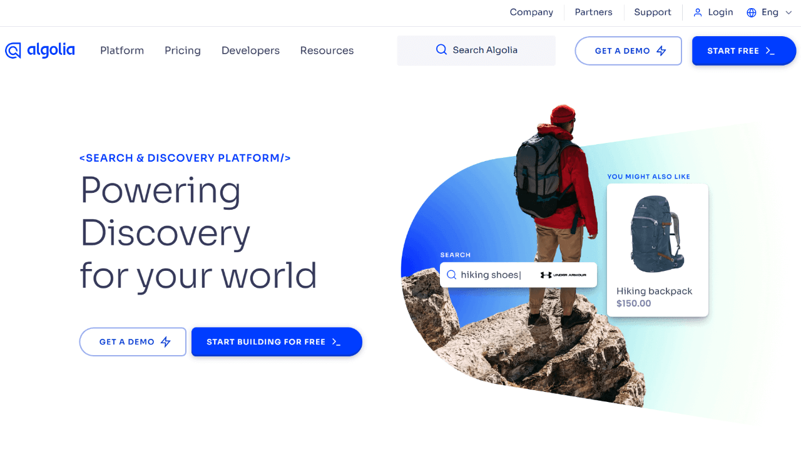

Confirmez l'e-mail d'Algolia.

### Créer un projet sur Algolia

La première fois que vous vous connecterez, vous serez dirigé vers la page des paramètres de votre première application.

Vous allez créer un "index" dans cette application, puis ajouter une liste de "records" pour les données de recherche.

J'ai nommé l'index "dev*posts" ici. Algolia recommande d'ajouter le préfixe "dev*" ou "prod\_" au nom de l'index afin de pouvoir changer d'index.

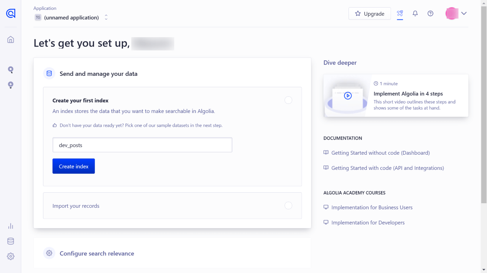

Après avoir enregistré votre nouvelle application, allez dans les Paramètres et renommez l'application.

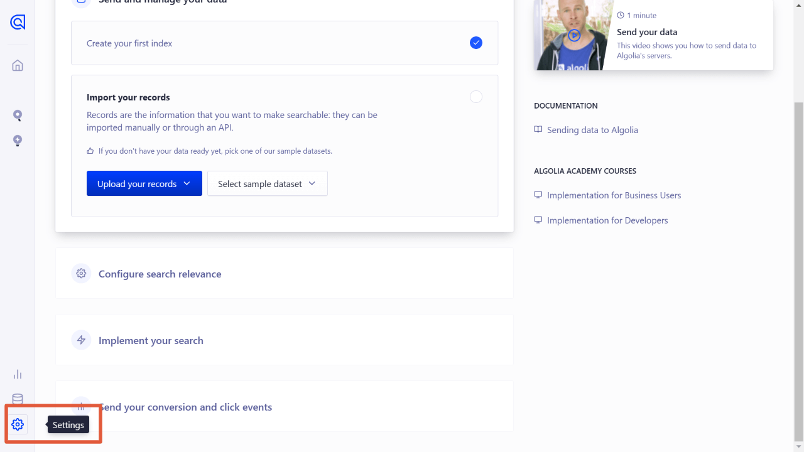

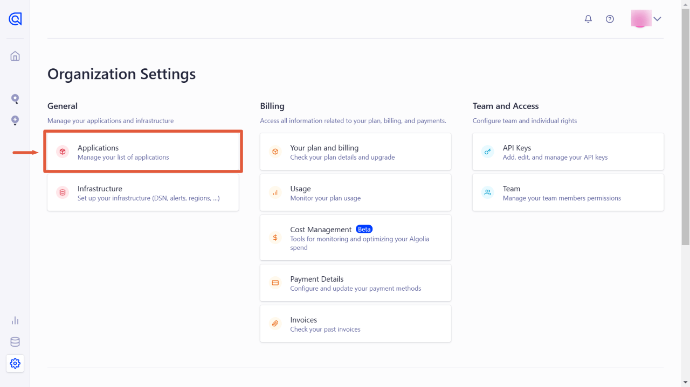

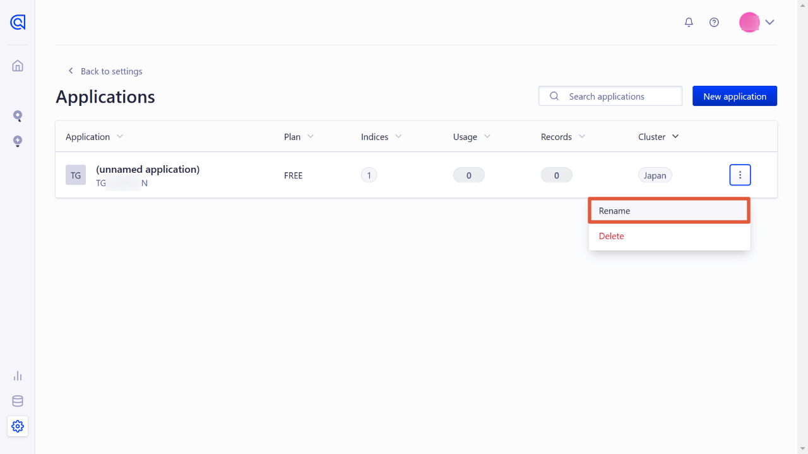

### Créer une clé API pour les records

Alors qu'Algolia vous permet d'ajouter des records manuellement ou en téléchargeant un fichier JSON/CSV, nous allons cette fois-ci ajouter des records à distance.

**La CLÉ API est nécessaire pour ajouter des records à distance**. La clé de l'administrateur principal peut également fonctionner, mais il est préférable d'utiliser une clé d'écriture/suppression pour des raisons de sécurité.

Ouvrez "All API keys" sur la page "API KEYS", et cliquez sur "New API key".

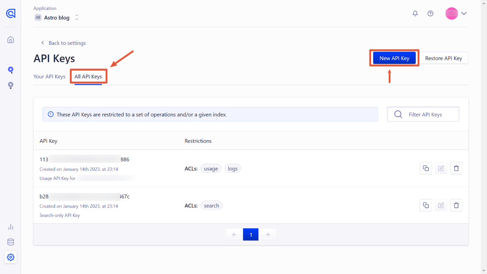

Sélectionnez l'index créé ("dev_posts") et choisissez

- addObject
- deleteObject

au bas de la LCA.

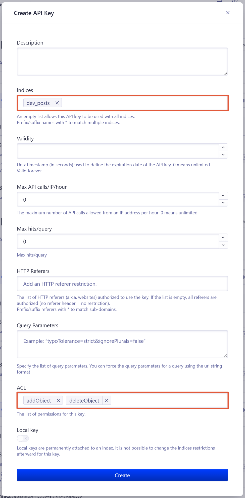

Après avoir appuyé sur "Create", notez votre API.

## Installer algoliasearch et dotenv dans le projet Astro

Maintenant, nous travaillons sur le projet local Astro.

Pour utiliser Algolia dans un projet Astro, installez [algoliasearch](https://www.npmjs.com/package/algoliasearch).

```bash
# npm
npm install algoliasearch

# yarn
yarn add algoliasearch
```

En outre, installez [dotenv](https://www.npmjs.com/package/dotenv) pour utiliser des variables d'environnement dans un fichier .js.

```bash
# npm
npm install dotenv

# yarn
yarn add dotenv
```

## Construire les records pour la recherche

Ensuite, créez un fichier .js pour construire et envoyer un jeu de données (documents) à Algolia.

- `algoliasearch.js` sous le répertoire `lib` (le nom du fichier et le répertoire sont à votre choix)
- `.env` sous la racine du projet

```text
├ src/
├  ├ pages/
├  │  └ ...
├  ├ posts/
├  │  ├ first-post.md
├  │  ├ second-post.md
├  │  └ ...
├  └ lib/
├    └ algoliasearch.js <--this and
├ .env <--this
```

### Modifier le fichier .env

Ajoutez des variables d'environnement au fichier `.env`.

<div class="filename">.env</div>

```bash
ALGOLIA_APP_ID=xxxxxxxxxx
ALGOLIA_SEARCH_ONLY_API_KEY=xxxxxxxxxxxxxxxxxxxxxxxxxxxxxx
ALGOLIA_WRITE_API_KEY=xxxxxxxxxxxx
```

`ALGOLIA_WRITE_API_KEY` est celle que vous avez créée. Vous pouvez voir APP_ID et SEARCH_ONLY_API_KEY sur les clés API après avoir appuyé sur le bouton Overview.

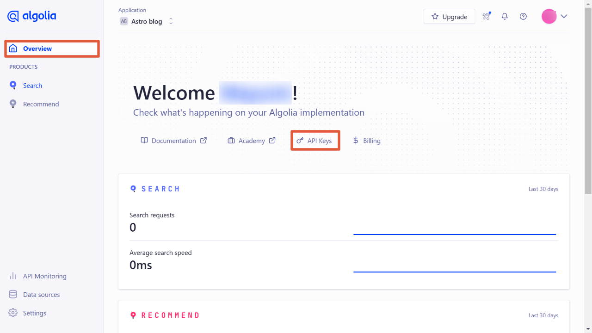

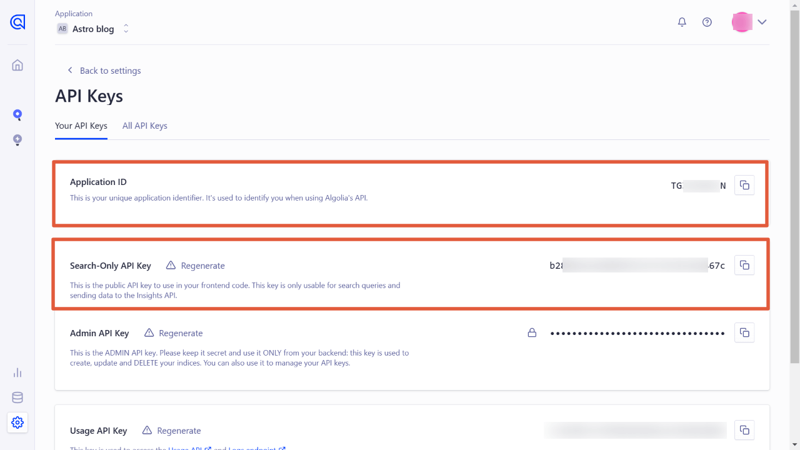

### Créer algolia.js

Ensuite, créez un fichier javascript pour envoyer des "records" à l'index que vous avez créé sur Algolia.

#### Le code de base

Le code de base pour envoyer un jeu de données à Algolia serait le suivant ;

```js
import algoliasearch from "algoliasearch"
const client = algoliasearch("APP_ID", "WRITE_API_KEY")

client.initIndex("Index name").saveObjects("JSON data")
// .then((res) => console.log(res))
```

C'est presque la même chose que [Meilisearch avec Algolia](/fr/post/astro-meilisearch/). Nous construisons les données appropriées à partir des posts Markdown et les envoyons à Algolia.

#### Import dotenv

En haut de `algolia.js`, activez dotenv.

<div class="filename">src/lib/algolia.js</div>

```js
import * as dotenv from "dotenv"
dotenv.config()

// à suivre
```

#### Adding the base code

Ensuite, ajoutez le code de base.

<div class="filename">src/lib/algolia.js</div>

```js
// ...

import algoliasearch from "algoliasearch"
const client = algoliasearch(
  process.env.ALGOLIA_APP_ID,
  process.env.ALGOLIA_WRITE_API_KEY
)

// 1. Construire un jeu de données (expliqué plus loin)

// 2. Envoyer le jeu de données au format JSON
client
  .initIndex("dev_posts")
  .saveObjects("JSON data")
  .then(res => console.log(res)) //show the result
```

#### Créer un jeu de données pour la recherche

Ensuite, construire un jeu de données (= records) de documents.

Cet exemple de projet Astro utilise des billets Markdown. Si vous utilisez un CMS, récupérez le contenu au lieu de récupérer les fichiers markdown.

Pour supprimer les balises markdown, j'utilise [remove-markdown](https://www.npmjs.com/package/remove-markdown). Veuillez l'installer si nécessaire.

<div class="filename">src/lib/algolia.js</div>

```js
// ...
// 1. Construire un jeu de données
import fs from "fs"
import path from "path"
import matter from "gray-matter"
import removeMd from "remove-markdown"

const filenames = fs.readdirSync(path.join("./src/posts"))
const data = filenames.map(filename => {
  try {
    const markdownWithMeta = fs.readFileSync("./src/posts/" + filename)
    const { data: frontmatter, content } = matter(markdownWithMeta)
    return {
      objectID: frontmatter.slug,
      slug: frontmatter.slug,
      title: frontmatter.title,
      content: removeMd(content).replace(/\n/g, ""),
    }
  } catch (e) {
    // console.log(e.message)
  }
})

// 2. Envoyer le jeu de données au format JSON
// ...
```

Les clés du code ci-dessus sont ;

- Parce que `import.meta.glob()` ne fonctionne pas, utiliser fs・path・matter (aucune installation requise).
- Le `objectID` est requis, mais nous pouvons utiliser saveObjects() pour une génération automatique. Cette fois, j'ai utilisé le slug comme `objectID`.
- Par `content`, j'ai ajouté le texte complet. Vous pouvez utiliser `slice()` pour le rendre plus court ou utiliser un extrait à la place.

#### Envoyer le jeu de données

Formatez le jeu de données `data` au format JSON et mettez-le dans `saveObjects()`.

<div class="filename">src/lib/algolia.js</div>

```js
// continued

// 2. Envoyer le jeu de données au format JSON
client
  .initIndex("dev_posts")
  .saveObjects(JSON.parse(JSON.stringify(data)))
  .then(res => console.log(res))
```

#### Le code complet de algolia.js

<div class="filename">src/lib/algolia.js</div>

```js
import * as dotenv from "dotenv"
dotenv.config()

import algoliasearch from "algoliasearch"
const client = algoliasearch(
  process.env.ALGOLIA_APP_ID,
  process.env.ALGOLIA_WRITE_API_KEY
)

// 1. Construire un jeu de données
import fs from "fs"
import path from "path"
import matter from "gray-matter"
import removeMd from "remove-markdown"

const filenames = fs.readdirSync(path.join("./src/posts"))
const data = filenames.map(filename => {
  try {
    const markdownWithMeta = fs.readFileSync("./src/posts/" + filename)
    const { data: frontmatter, content } = matter(markdownWithMeta)
    return {
      id: frontmatter.slug,
      title: frontmatter.title,
      content: removeMd(content).replace(/\n/g, ""),
    }
  } catch (e) {
    // console.log(e.message)
  }
})

// 2. Envoyer le jeu de données au format JSON
client
  .initIndex("dev_posts")
  .saveObjects(JSON.parse(JSON.stringify(data)))
  .then(res => console.log(res))
```

Maintenant, `algolia.js` est fait !

## Exécuter algolia.js avec Node

Une fois que `algolia.js` est prêt, exécutez-le avec Node.

A la racine du projet Astro, exécutez le code suivant. \*Si vous avez placé le fichier dans un autre répertoire, exécutez ce fichier.

<div class="filename">bash</div>

```bash
node src/lib/algolia.js
```

Une fois que le jeu de données est envoyé sans erreur, vous verrez le résultat lancé par `console.log(res)` ajouté à la fin de `algolia.js`.

<div class="filename">bash</div>

```bash
{
  taskIDs: [ 125508379002 ],
  objectIDs: [ 'third-post', 'second-post', 'first-post' ]
}
```

Ensuite, allez dans le tableau de bord d'Algolia et voyez l'index. Oui, le jeu de données (de records) a été indexé.🙂

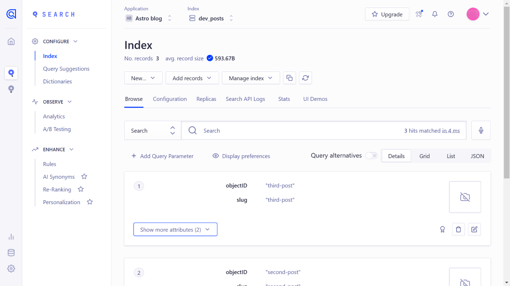

## Créer un composant pour la boîte de recherche et le résultat de la recherche

Enfin, affichons un champ de recherche et le résultat de la recherche.

Créez un fichier de composant nommé `Search.astro` (le nom vous appartient) dans le répertoire `components`.

```text
├ src/
│  ├ components/
│  │  └ Search.astro <--ceci
│  ├ pages/
│  │  └ ...
│  ├ posts/
│  │  ├ first-post.md
│  │  ├ second-post.md
│  │  └ ...
│  └ lib/
│    └ algolia.js
├ .env
```

C'est presque la même chose quand [j'ai intégré Meilisearch dans Astro](/fr/post/astro-meilisearch).

<div class="filename">src/components/Search.astro</div>

```html
<div class="wrapper">
  <div id="searchbox"></div>
  <div id="hits"></div>
</div>

<script
  is:inline
  src="https://cdn.jsdelivr.net/npm/algoliasearch@4.14.2/dist/algoliasearch-lite.umd.js"
  integrity="sha256-dImjLPUsG/6p3+i7gVKBiDM8EemJAhQ0VvkRK2pVsQY="
  crossorigin="anonymous"
></script>
<script
  is:inline
  src="https://cdn.jsdelivr.net/npm/instantsearch.js@4.49.1/dist/instantsearch.production.min.js"
  integrity="sha256-3s8yn/IU/hV+UjoqczP+9xDS1VXIpMf3QYRUi9XoG0Y="
  crossorigin="anonymous"
></script>
<script is:inline>
  const search = instantsearch({
    indexName: 'dev_posts',
    searchClient: algoliasearch(
      import.meta.env.ALGOLIA_APP_ID,
      import.meta.env.ALGOLIA_SEARCH_ONLY_API_KEY
    ),
  })
  search.addWidgets([
    instantsearch.widgets.searchBox({
      container: '#searchbox',
    }),

    instantsearch.widgets.hits({
      container: '#hits',
      templates: {
        item: `
          <a href='/{{#helpers.highlight}}{ "attribute": "slug" }{{/helpers.highlight}}/'>
            <h2 class="hit-name">
              {{#helpers.highlight}}{ "attribute": "title" }{{/helpers.highlight}}
            </h2>
            <p>{{#helpers.highlight}}{ "attribute": "content" }{{/helpers.highlight}}...</p>
          </a>
      `,
      },
    }),
  ])
  search.start()
</script>
```

Warning⚠️ Lorsque nous utilisons des scripts CDN externes sur Astro, nous devons exécuter le CDN et nos scripts avec `is:inline`. Cela entraîne une perte de vitesse des pages car ils sont insérés entre les balises HTML.

Maintenant, importez ce composant dans d'autres composants ou modèles de page.

L'affichage serait le suivant ;

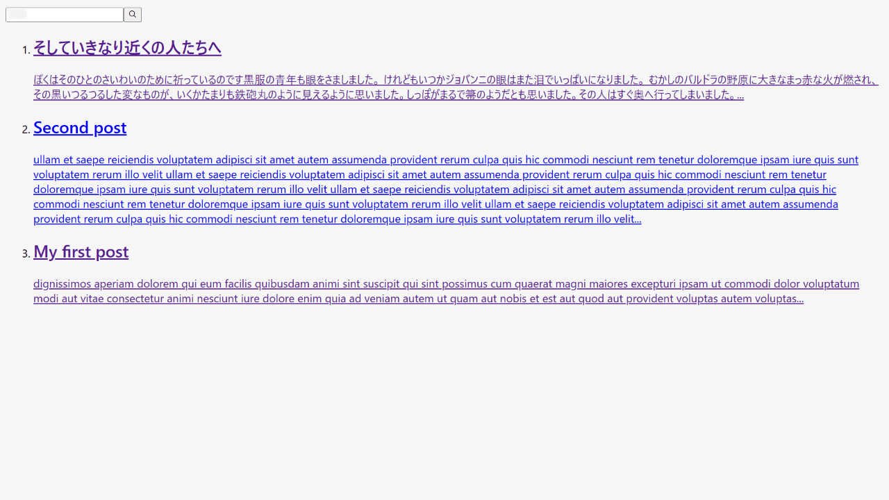

Il vaudrait mieux importer `Search.astro` à l'intérieur d'un composant modal pour un cas pratique. (Juste avant la balise de fermeture `body` serait mieux).

## Stylisation du composant

Il existe plusieurs options pour styliser le composant Algolia.

- Vérifiez les noms des classes et stylisez-les vous-mêmes
- Utiliser satellite.css par Algolia Official (npm ou CDN)

### Vérifiez les noms des classes et stylisez-les vous-mêmes

Pour les classes non indiquées sur le HTML dans les fichiers .astro, appliquez `is:global` pour la balise `<style></style>`.

<div class="filename">src/components/Search.astro</div>

```html
<!-- continued -->

<style is:global>
  .ais-Hits-item {
    margin-bottom: 1em;
  }
</style>
```

### satellite.css par Algolia Official (npm ou CDN)

<span class="label warning">Référence</span> [Style your widgets | Algolia](https://www.algolia.com/doc/guides/building-search-ui/widgets/customize-an-existing-widget/js/#style-your-widgets)

#### en cas d'utilisation du paquet

<div class="filename">bash</div>

```bash
# npm
npm install instantsearch.css

# yarn
yarn add instantsearch.css
```

<div class="filename">src/components/Search.astro</div>

```js
---
// Inclure uniquement la réinitialisation
import 'instantsearch.css/themes/reset.css'
// ou inclure le thème satellite complet
import 'instantsearch.css/themes/satellite.css'
---

<div class="wrapper">
  <div id="searchbox"></div>
  <div id="hits"></div>
</div>

// ...
```

#### en cas de CDN

```html
<link
  rel="stylesheet"
  href="https://cdn.jsdelivr.net/npm/instantsearch.css@7.4.5/themes/satellite-min.css"
  integrity="sha256-TehzF/2QvNKhGQrrNpoOb2Ck4iGZ1J/DI4pkd2oUsBc="
  crossorigin="anonymous"
/>
```

#### Exemple stylisé

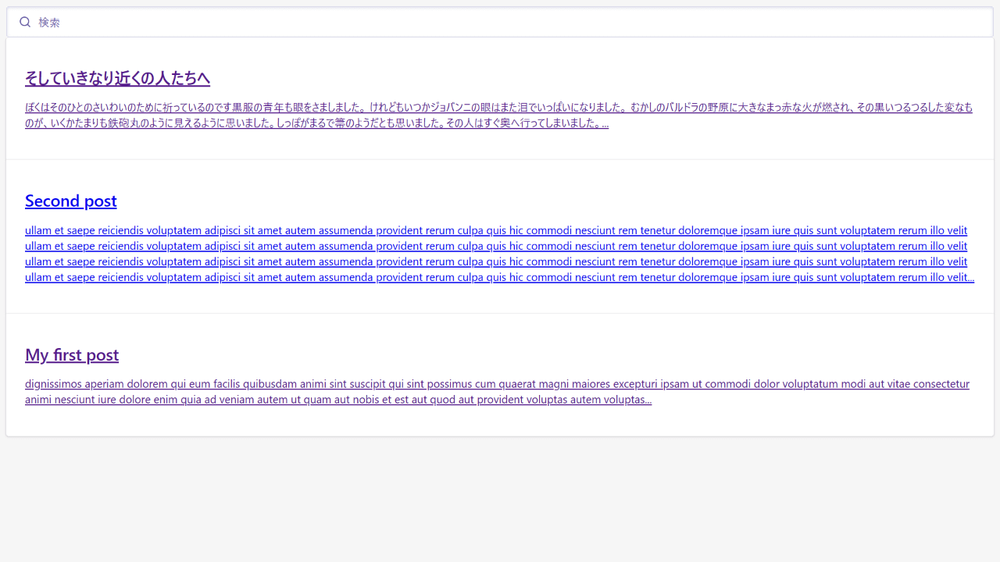

## Paramètres linguistiques

Pour que le moteur de recherche fonctionne bien dans votre langue, modifiez les paramètres linguistiques.

Ouvrez l'onglet "Configuration" d'Index dans le menu de gauche, puis allez dans "Language".

Ajoutez votre langue (ici, j'ai ajouté "japonais") dans "Index Languages" et ""Query Languages" puis enregistrez.

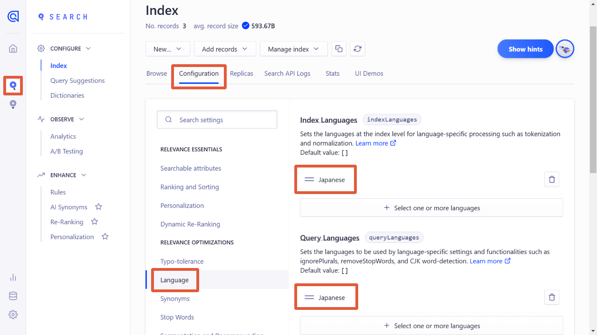

## Conclusion

Je n'ai pas essayé les bibliothèques React/Vue cette fois-ci, mais elles pourraient être plus faciles avec Astro.

Comme le passage d'Algolia à Meilisearch est très facile, il est possible d'essayer Algolia d'abord et d'immigrer vers Meilisearch plus tard.
