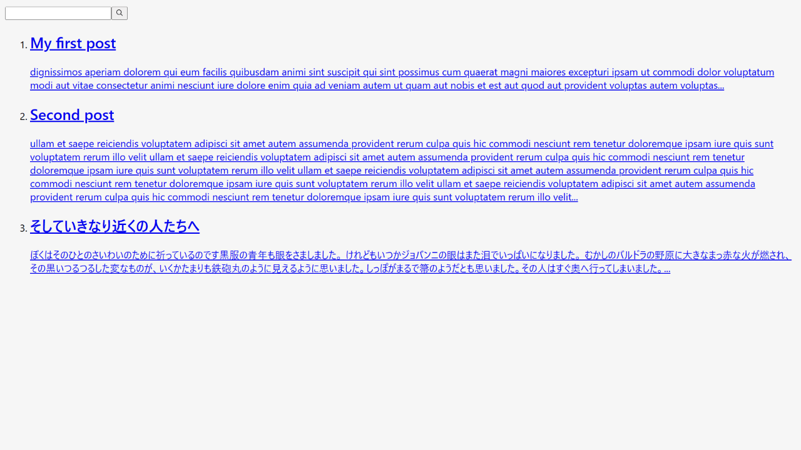
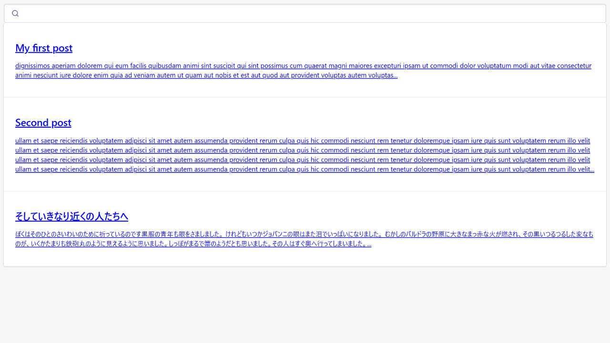
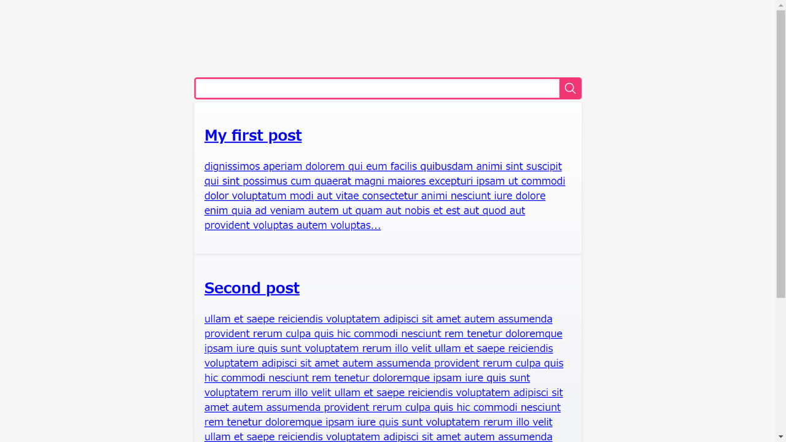

Integration of a search system to an Astro website is a bit troubling. 

Astro doesn't provide any search system plugin now, as Gatsby.js does.

You may consider Google Custom Search, but it makes the fast static website slower.

This time, I tried [Meilisearch](https://www.meilisearch.com/) - the newest search engine. I liked their simple system and succeeded in adding it to an Astro website.

The flow would be;

1. Create a Meilisearch account
2. Install meilisearch to the Astro project
3. Build a dataset and send them to Meilisearch Cloud
4. Create a search form/result component
5. Import and show the component inside a component/page template
6. Style the component

Working environment:

- Node v18.12.1
- Astro v2.0.11
- meilisearch v0.3.1
- dotenv v16.0.3

## About Meilisearch

Though I've started using it, I have some following impressions:

- The newest search engine
- Self-hosted plan or cloud (freemium)
- The same parameters as Algolia (Algolia's docs can be helpful)
- Small problems remain for the Japanese language as of v.0.3.x

On Jan. 11th, 2023, Meilisearch pre-released v1.0.0-RC. (I haven't tried it in this post.)

## Structure of the Astro project

In this example, the Astro project structure is as follows;

```text
├ src/
│  ├ pages/
│  │  └ ...
│  └ posts/
│    ├ first-post.md
│    ├ second-post.md 
│    └ ...
```

Also, the post Markdown YAML frontmatter is as follows;

<div class="filename">src/posts/first-post.md</div>

```md
---
title: My first post
slug: first-post
---

dignissimos aperiam dolorem qui eum facilis quibusdam animi sint suscipit qui sint possimus cum quaerat magni maiores excepturi ipsam ut commodi dolor voluptatum modi aut vitae
```

## Create a Meilisearch account

Though it's possible to run a self-hosted Meilisearch, we are using its Cloud version for this time.

The free plan includes 100,000 documents and 10,000 searches/per month. Enough for personal or small business websites!

Start it on their [register page](https://cloud.meilisearch.com/register).


Confirm e-mail from Meilisearch.

### Create a project on Meilisearch

Press "New Project" on Meilisearch Cloud after logging in, and start to create a new project.


Choose the closest region from the "Select a region" and "Build $0 / month" plan.


Then, press "Create" - it's ready!

### Node is required for creating an index

If you already know Algolia, you might be flustered that Meilisearch doesn't accept editing/uploading data on the cloud.

The dataset (of documents) must be sent by running a javascript file with Node. I'll explain it later.

## Install meilisearch and dotenv into the Astro project

To use Meilisearch in an Astro project, install [meilisearch](https://www.npmjs.com/package/meilisearch).

```bash
# for npm
npm install meilisearch

# for yarn
yarn add meilisearch
```

Besides, install [dotenv](https://www.npmjs.com/package/dotenv) to use environment variables inside a .js file.

```bash
# for npm
npm install dotenv

# for yarn
yarn add dotenv
```

## Build a dataset for the search

Next, create a .js file to build and send a dataset (documents) to Meilisearch Cloud.

- `meilisearch.js` under the `lib` directory (file name and directory are up to you)
- `.env` under the project root

```text
├ src/
├  ├ pages/
├  │  └ ...
├  ├ posts/
├  │  ├ first-post.md
├  │  ├ second-post.md 
├  │  └ ...
├  └ lib/
├    └ meilisearch.js <--this and
├ .env <--this
```

### Edit .env file

Add environment variables to the `.env` file.

<div class="filename">.env</div>

```bash
PUBLIC_MEILISEARCH_HOST=https://ms-1234567890ab-1234.xxx.meilisearch.io/
PUBLIC_MEILISEARCH_SEARCH_KEY=xxxxxxxxxxxxxxxxxxxxxxxxxxxxxxxxxxx
MEILISEARCH_MASTER_KEY=xxxxxxxxxxxxxxxxxxxxxxxxxxxxxxxxxxx
```

You can find the host and keys on Meilisearch Cloud by clicking "Build" of the project.


### Create meilisearch.js

Next, create a javascript file to send index documents to Meilisearch Cloud.

#### The base code

The base code to send a dataset to Meilisearch Cloud would be as follows;

```js
import { MeiliSearch } from 'meilisearch'
const client = new MeiliSearch({
  host: 'HOST URL',
  apiKey: 'API KEY',
})

client
  .index('INDEX NAME')
  .addDocuments('JSON DATA')
  // .then((res) => console.log(res))
```

We need to collect data from all the posts and provide it as "JSON DATA" to Meilisearch Cloud.

#### Import dotenv

At the top of `meilisearch.js`, enable dotenv.

<div class="filename">src/lib/meilisearch.js</div>

```js
import * as dotenv from 'dotenv'
dotenv.config()

// to be continued
```

#### Add the base code

Then, add the base code; I named the index "posts" (it's up to you).

<div class="filename">src/lib/meilisearch.js</div>

```js
// continued

import { MeiliSearch } from 'meilisearch'
const client = new MeiliSearch({
  host: process.env.PUBLIC_MEILISEARCH_HOST,
  apiKey: process.env.MEILISEARCH_MASTER_KEY,
})

// 1. Build a dataset (explained later)

// 2. Send the dataset in JSON format
client
  .index('posts')
  .addDocuments('JSON DATA')
  .then((res) => console.log(res)) //show the result
```

#### Build a dataset for the search

Next, build a dataset of documents.

This example Astro project uses Markdown posts. If you use a CMS, fetch the content instead of retrieving markdown files.

To remove markdown tags, I use [remove-markdown](https://www.npmjs.com/package/remove-markdown). Please install it if needed.

<div class="filename">src/lib/meilisearch.js</div>

```js
// continued
// 1. Build a dataset
import fs from 'fs'
import path from 'path'
import matter from 'gray-matter'
import removeMd from "remove-markdown"

const filenames = fs.readdirSync(path.join('./src/posts'))
const data = filenames.map((filename) => {
  try {
    const markdownWithMeta = fs.readFileSync('./src/posts/' + filename)
    const { data: frontmatter, content } = matter(markdownWithMeta)
    return {
      id: frontmatter.slug,
      title: frontmatter.title,
      content: removeMd(content).replace(/\n/g, ""),
    }
  } catch (e) {
    // console.log(e.message)
  }
})

// 2. Send the dataset in JSON format
// ...
```

The keys on the code above are;

- Because `import.meta.glob()` doesn't work, use fs・path・matter (no installation required)
- `id` is required. I put the slug as id.
- By `content,` I added the full text. You can use `slice()` to make it shorter or use an excerpt instead.

#### Send the dataset

Format the dataset `data` as JSON format and put it in `addDocuments()`.

<div class="filename">src/lib/meilisearch.js</div>

```js
// continued
// 2. Send the dataset in JSON format
client
  .index('posts')
  .addDocuments(JSON.parse(JSON.stringify(data))) //<--this
  .then((res) => console.log(res)) //show the result
```

#### The whole code of meilisearch.js

<div class="filename">src/lib/meilisearch.js</div>

```js
import * as dotenv from 'dotenv'
dotenv.config()

import { MeiliSearch } from 'meilisearch'
const client = new MeiliSearch({
  host: process.env.MEILISEARCH_HOST,
  apiKey: process.env.MEILISEARCH_MASTER_KEY,
})

// 1. Build a dataset
import fs from 'fs'
import path from 'path'
import matter from 'gray-matter'
import removeMd from "remove-markdown"

const filenames = fs.readdirSync(path.join('./src/posts'))
const data = filenames.map((filename) => {
  try {
    const markdownWithMeta = fs.readFileSync('./src/posts/' + filename)
    const { data: frontmatter, content } = matter(markdownWithMeta)
    return {
      id: frontmatter.slug,
      title: frontmatter.title,
      content: removeMd(content).replace(/\n/g, ""),
    }
  } catch (e) {
    // console.log(e.message)
  }
})

// 2. Send the dataset in JSON format
client
  .index('posts')
  .addDocuments(JSON.parse(JSON.stringify(data)))
  .then((res) => console.log(res)) //show the result
```

Now, `meilisearch.js` is done!

## Execute meilisearch.js with Node

Once `meilisearch.js` is ready, execute it with Node.

At the root of the Astro project, run the following code. *If you put the file under another directory, run that file.

<div class="filename">bash</div>

```bash
node src/lib/meilisearch.js
```

Once the dataset is sent without error, you'll see the result thrown by `console.log(res)` added at the end of `meilisearch.js`.

<div class="filename">bash</div>

```bash
EnqueuedTask {
  taskUid: 0,
  indexUid: 'posts',
  status: 'enqueued',
  type: 'documentAdditionOrUpdate',
  enqueuedAt: 2023-01-13T04:45:26.891Z
}
```

Then, go to Meilisearch Cloud and see the index. Yes, the dataset (of documents) has been indexed.🙂


## Create a component for the search box and search result

Finally, let's display a search box and the search result.

Create a component file named `Search.astro` (the name is up to you) under the `components` directory.

```text
├ src/
│  ├ components/
│  │  └ Search.astro <--this
│  ├ pages/
│  │  └ ...
│  ├ posts/
│  │  ├ first-post.md
│  │  ├ second-post.md 
│  │  └ ...
│  └ lib/
│    └ meilisearch.js
├ .env
```

Referring to the [official guidance](https://github.com/meilisearch/instant-meilisearch#-usage), I developed the component as follows;

<div class="filename">src/components/Search.astro</div>

```html
<div class="wrapper">
  <div id="searchbox"></div>
  <div id="hits"></div>
</div>

<script
  is:inline
  src="https://cdn.jsdelivr.net/npm/@meilisearch/instant-meilisearch/dist/instant-meilisearch.umd.min.js"
></script>
<script is:inline src="https://cdn.jsdelivr.net/npm/instantsearch.js@4"
></script>
<script is:inline>
  const search = instantsearch({
    indexName: 'posts',
    searchClient: instantMeiliSearch(
      import.meta.env.PUBLIC_MEILISEARCH_HOST,
      import.meta.env.PUBLIC_MEILISEARCH_SEARCH_KEY
    ),
  })
  search.addWidgets([
    instantsearch.widgets.searchBox({
      container: '#searchbox',
    }),
    instantsearch.widgets.configure({ hitsPerPage: 8 }),
    instantsearch.widgets.hits({
      container: '#hits',
      templates: {
        item: `
            <a href='/{{#helpers.snippet}}{ "attribute": "id" }{{/helpers.snippet}}/'>
              <h2 class="hit-name">
                    {{#helpers.highlight}}{ "attribute": "title" }{{/helpers.highlight}}
              </h2>
              <p>{{#helpers.snippet}}{ "attribute": "content" }{{/helpers.snippet}}...</p>
            </a>
          `,
      },
    }),
  ])
  search.start()
</script>
```

(Updated Jan 23, 2023) When we use external CDN scripts on Astro, we have to run CDN and our own scripts with `is:inline`. It loses page speed because they are inserted between HTML tags.

Now, import this component inside other components or page templates.

The display would be like this;



It would be better to import `Search.astro` inside a Modal component for a practical case. (Right before the `body` closing tag would be better.)

## Styling the component

There are some options to style the Meilisearch component.

- Check the class names and style them by yourselves
- Use satellite.css by Algolia Official (npm ou CDN)
- Use basic_search.css by Meilisearch Official (CDN)

Because Meilisearch applies the same class names as Algolia, we can use the same styling.

### Check the class names and style them by yourselves

For the classes not indicated on HTML in .astro files, apply `is:global` for the `<style></style>` tag.

<div class="filename">src/components/Search.astro</div>

```html
<!-- continued -->

<style is:global>
  .ais-Hits-item {
    margin-bottom: 1em;
  }
</style>
```

### satellite.css by Algolia Official

<span class="label warning">Reference</span> [Style your widgets](https://www.algolia.com/doc/guides/building-search-ui/widgets/customize-an-existing-widget/js/#style-your-widgets)

#### in case of using package

<div class="filename">bash</div>

```bash
# for npm
npm install instantsearch.css

# for yarn
yarn add instantsearch.css
```

<div class="filename">src/components/Search.astro</div>

```js
---
// Include only the reset.css
import 'instantsearch.css/themes/reset.css'
// or include the full Satellite theme
import 'instantsearch.css/themes/satellite.css'
---

<div class="wrapper">
  <div id="searchbox"></div>
  <div id="hits"></div>
</div>

// ...
```

#### in case of CDN

```html
<link
  rel="stylesheet"
  href="https://cdn.jsdelivr.net/npm/instantsearch.css@7.4.5/themes/satellite-min.css"
  integrity="sha256-TehzF/2QvNKhGQrrNpoOb2Ck4iGZ1J/DI4pkd2oUsBc="
  crossorigin="anonymous"
/>
```

#### Styled example



### basic_search.css by Meilisearch Official (CDN)

Load the stylesheet from CDN.

```html
<link
  rel="stylesheet"
  href="https://cdn.jsdelivr.net/npm/@meilisearch/instant-meilisearch/templates/basic_search.css"
/>
```

#### Styled example



## Conclusion

The explanation is long, but these steps are not complicated, I suppose.

Because Meilisearch is the newest search result service, its free plan offers some better conditions than Algolia (though there are not as many high-tech features as Algolia)

Meilisearch can be a good choice if you want a "just a normal" search function.