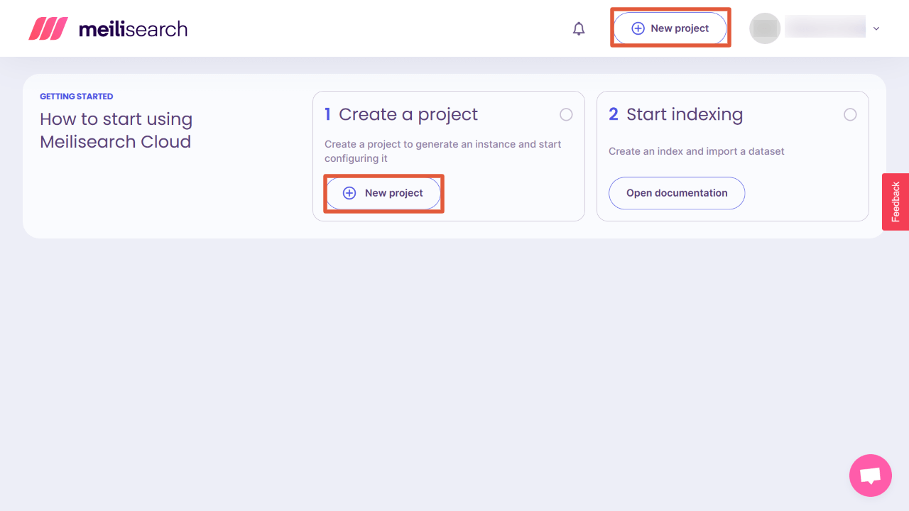
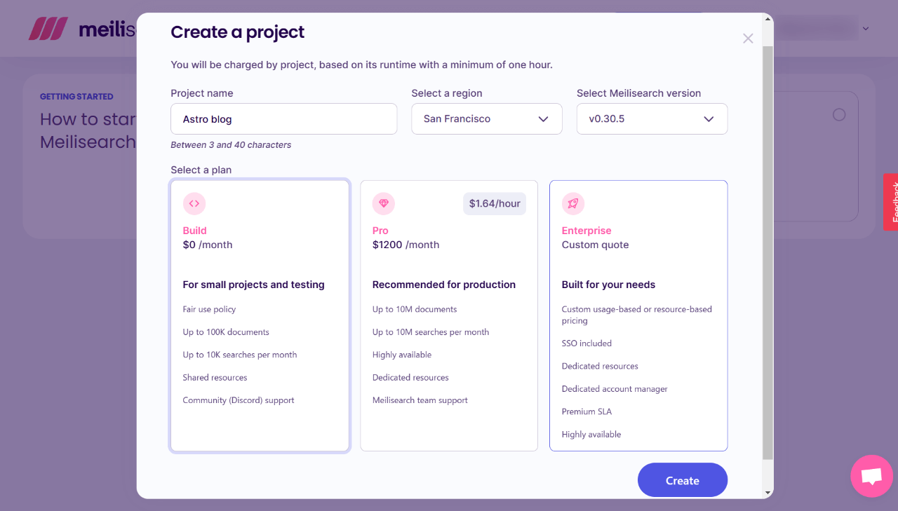
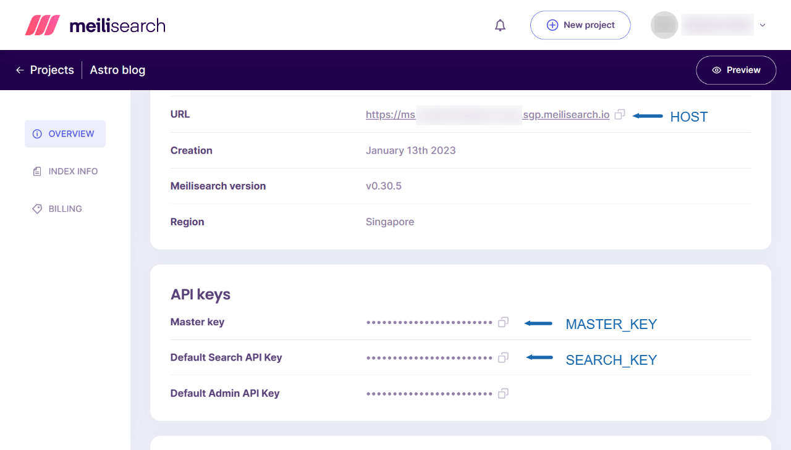
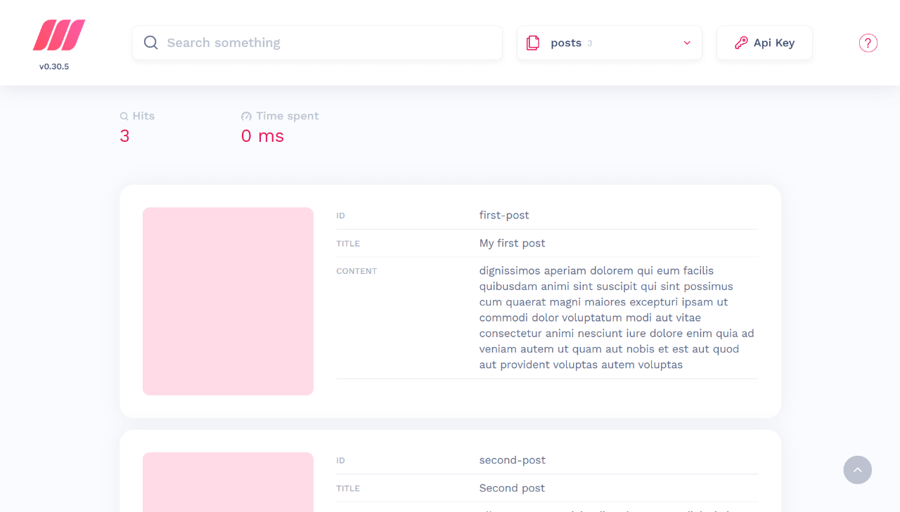
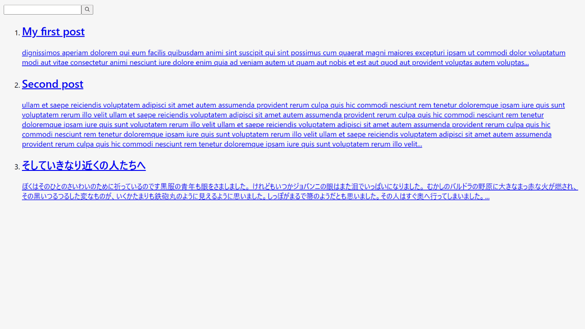
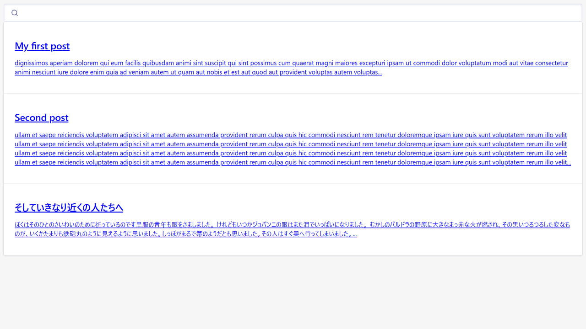
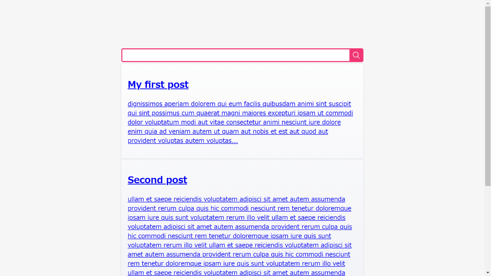

L'intégration d'un système de recherche à un site Web Astro est un peu troublante.

Astro ne fournit pas actuellement de plugin de système de recherche, contrairement à Gatsby.js.

Vous pouvez penser à Google Custom Search, mais cela rend le site statique rapide plus lent.

Cette fois, j'ai essayé [Meilisearch](https://www.meilisearch.com/) - le tout nouveau moteur de recherche. J'ai aimé leur système simple et j'ai réussi à l'ajouter à un site web Astro.

Le flux serait ;

1. Créer un compte Meilisearch
2. Installer Meilisearch sur le projet Astro.
3. Créer un ensemble de données et les envoyer à Meilisearch Cloud
4. Créer un composant de formulaire/résultat de recherche
5. Importer et afficher le composant dans un modèle de composant/page.
6. Styliser le composant

Environnement de fonctionnement :

- Node v18.12.1
- Astro v2.0.11
- meilisearch v0.3.1
- dotenv v16.0.3

## À propos de Meilisearch

Bien que je n'aie commencé à l'utiliser, j'ai quelques impressions suivantes :

- Le tout nouveau moteur de recherche
- Plan auto-hébergé ou cloud (freemium)
- Les mêmes paramètres qu'Algolia (les docs d'Algolia peuvent être utiles)
- De petits problèmes subsistent pour la langue japonaise avec la v.0.3.x.

Le 11 janvier 2023, Meilisearch a pré-livré la v1.0.0-RC. (Je ne l'ai pas essayé dans ce post).

## Structure du projet Astro

Dans cet exemple, la structure du projet Astro est la suivante ;

```tree
src/
└─ pages/
     └─ posts/
          ├─ first-post.md
          ├─ second-post.md
          └─ ...
```

En outre, le post Markdown YAML frontmatter est le suivant ;

<div class="filename">src/posts/first-post.md</div>

```md
---
title: My first post
slug: first-post
---

dignissimos aperiam dolorem qui eum facilis quibusdam animi sint suscipit qui sint possimus cum quaerat magni maiores excepturi ipsam ut commodi dolor voluptatum modi aut vitae
```

## Créer un compte Meilisearch

Bien qu'il soit possible d'héberger soi-même Meilisearch, nous utilisons pour l'instant sa version Cloud.

Le plan gratuit comprend 100 000 documents et 10 000 recherches par mois. C'est suffisant pour les sites Web personnels ou ceux des petites entreprises !

Démarrez-le sur leur [page d'enregistrement].(https://cloud.meilisearch.com/register).


Confirmez l'e-mail de Meilisearch.

### Créer un projet sur Meilisearch

Cliquez sur "Nouveau projet" sur Meilisearch Cloud après vous être connecté, et commencez à créer un nouveau projet.



Choisissez la région la plus proche à partir du plan "Sélectionnez une région" et "Build $0 / month".



Ensuite, appuyez sur "Créer" - c'est prêt !

### Node est nécessaire pour créer un index

Si vous connaissez déjà Algolia, vous serez peut-être perturbé par le fait que Meilisearch n'accepte pas l'édition / téléchargement de données sur le cloud.

Le jeu de données (de documents) doit être envoyé en exécutant un fichier javascript avec Node. Je l'expliquerai plus tard.

## Installer meilisearch et dotenv dans le projet Astro

Pour utiliser Meilisearch dans un projet Astro, installez [meilisearch](https://www.npmjs.com/package/meilisearch).

```bash
# pour npm
npm install meilisearch

# pour yarn
yarn add meilisearch
```

En outre, installez [dotenv](https://www.npmjs.com/package/dotenv) pour utiliser des variables d'environnement dans un fichier .js.

```bash
# pour npm
npm install dotenv

# pour yarn
yarn add dotenv
```

## Construire un jeu de données pour la recherche

Ensuite, créez un fichier .js pour construire et envoyer un jeu de données (documents) à Meilisearch Cloud.

- `meilisearch.js` sous le répertoire `lib` (le nom du fichier et le répertoire sont à votre choix)
- `.env` sous la racine du projet

```tree
src/
├─ pages/
│    ├─ posts/
│    │    ├─ first-post.md
│    │    ├─ second-post.md
│    │    └─ ...
│    └─ lib/
│         └─ meilisearch.js <-- ceci et
├─ .env <-- ceci
```

### Modifier le fichier .env

Ajoutez des variables d'environnement au fichier `.env`.

<div class="filename">.env</div>

```bash
PUBLIC_MEILISEARCH_HOST=https://ms-1234567890ab-1234.xxx.meilisearch.io/
PUBLIC_MEILISEARCH_SEARCH_KEY=xxxxxxxxxxxxxxxxxxxxxxxxxxxxxxxxxxx
MEILISEARCH_MASTER_KEY=xxxxxxxxxxxxxxxxxxxxxxxxxxxxxxxxxxx
```

Vous pouvez trouver l'hôte et les clés sur Meilisearch Cloud en cliquant sur "Build" du projet.



### Créer meilisearch.js

Ensuite, créer une fichier de javascript pour envoyer les documents indexés vers Meilisearch Cloud.

#### Le code de base

Le code de base pour envoyer un jeu de données à Meilisearch Cloud serait le suivant ;

```js
import { MeiliSearch } from "meilisearch"
const client = new MeiliSearch({
  host: "HOST URL",
  apiKey: "API KEY",
})

client.index("INDEX NAME").addDocuments("JSON DATA")
// .then((res) => console.log(res))
```

Nous devons collecter les données de tous les postes et les fournir en tant que "JSON DATA" à Meilisearch Cloud.

#### Importer dotenv

En haut de `meilisearch.js`, activez dotenv.

<div class="filename">src/lib/meilisearch.js</div>

```js
import * as dotenv from "dotenv"
dotenv.config()

// à suivre
```

#### Ajouter le code de base

Ensuite, ajoutez le code de base ; j'ai nommé l'index "posts" (c'est à vous de choisir).

<div class="filename">src/lib/meilisearch.js</div>

```js
// ...

import { MeiliSearch } from "meilisearch"
const client = new MeiliSearch({
  host: process.env.PUBLIC_MEILISEARCH_HOST,
  apiKey: process.env.MEILISEARCH_MASTER_KEY,
})

// 1. Construire un jeu de données (expliqué plus loin)

// 2. Envoyer le jeu de données au format JSON
client
  .index("posts")
  .addDocuments("JSON DATA")
  .then(res => console.log(res)) //montrer le résultat
```

#### Créer un jeu de données pour la recherche

Ensuite, construire un jeu de données de documents.

Cet exemple de projet Astro utilise des billets Markdown. Si vous utilisez un CMS, récupérez le contenu au lieu de récupérer les fichiers markdown.

Pour supprimer les balises markdown, j'utilise [remove-markdown](https://www.npmjs.com/package/remove-markdown). Veuillez l'installer si nécessaire.

<div class="filename">src/lib/meilisearch.js</div>

```js
// suite
// 1. Construire un jeu de données
import fs from "fs"
import path from "path"
import matter from "gray-matter"
import removeMd from "remove-markdown"

const filenames = fs.readdirSync(path.join("./src/posts"))
const data = filenames.map(filename => {
  try {
    const markdownWithMeta = fs.readFileSync("./src/posts/" + filename)
    const { data: frontmatter, content } = matter(markdownWithMeta)
    return {
      id: frontmatter.slug,
      title: frontmatter.title,
      content: removeMd(content).replace(/\n/g, ""),
    }
  } catch (e) {
    // console.log(e.message)
  }
})

// 2. Envoyer le jeu de données au format JSON
// ...
```

Les clés du code ci-dessus sont ;

- Parce que `import.meta.glob()` ne fonctionne pas, utiliser fs・path・matter (aucune installation requise).
- `id` est nécessaire. J'ai mis le slug comme l'id.
- Par `content`, j'ai ajouté le texte complet. Vous pouvez utiliser `slice()` pour le rendre plus court ou utiliser un extrait à la place.

#### Envoyer le jeu de données

Formatez le jeu de données `data` au format JSON et mettez-le dans `addDocuments()`.

<div class="filename">src/lib/meilisearch.js</div>

```js
// suite
// 2. Envoyer le jeu de données au format JSON
client
  .index("posts")
  .addDocuments(JSON.parse(JSON.stringify(data))) //<--ceci
  .then(res => console.log(res)) //montrer le résultat
```

#### Le code complet de meilisearch.js

<div class="filename">src/lib/meilisearch.js</div>

```js
import * as dotenv from "dotenv"
dotenv.config()

import { MeiliSearch } from "meilisearch"
const client = new MeiliSearch({
  host: process.env.MEILISEARCH_HOST,
  apiKey: process.env.MEILISEARCH_MASTER_KEY,
})

// 1. Construire un jeu de données
import fs from "fs"
import path from "path"
import matter from "gray-matter"
import removeMd from "remove-markdown"

const filenames = fs.readdirSync(path.join("./src/posts"))
const data = filenames.map(filename => {
  try {
    const markdownWithMeta = fs.readFileSync("./src/posts/" + filename)
    const { data: frontmatter, content } = matter(markdownWithMeta)
    return {
      id: frontmatter.slug,
      title: frontmatter.title,
      content: removeMd(content).replace(/\n/g, ""),
    }
  } catch (e) {
    // console.log(e.message)
  }
})

// 2. Envoyer le jeu de données au format JSON
client
  .index("posts")
  .addDocuments(JSON.parse(JSON.stringify(data)))
  .then(res => console.log(res)) //show the result
```

Maintenant, `meilisearch.js` est fait !

## Exécuter meilisearch.js avec Node

Une fois que `meilisearch.js` est prêt, exécutez-le avec Node.

A la racine du projet Astro, exécutez le code suivant. \*Si vous avez placé le fichier dans un autre répertoire, exécutez ce fichier.

<div class="filename">bash</div>

```bash
node src/lib/meilisearch.js
```

Une fois que le jeu de données est envoyé sans erreur, vous verrez le résultat lancé par `console.log(res)` ajouté à la fin de `meilisearch.js`.

<div class="filename">bash</div>

```bash
EnqueuedTask {
  taskUid: 0,
  indexUid: 'posts',
  status: 'enqueued',
  type: 'documentAdditionOrUpdate',
  enqueuedAt: 2023-01-13T04:45:26.891Z
}
```

Ensuite, allez sur Meilisearch Cloud et consultez l'index. Oui, l'ensemble de données (de documents) a été indexé.🙂



## Créer un composant pour la boîte de recherche et le résultat de la recherche

Enfin, nous allons afficher une boîte de recherche et le résultat de la recherche.

Créez un fichier de composant nommé `Search.astro` (le nom vous appartient) dans le répertoire `components`.

```tree
src/
├─ components/
│    └─ Search.astro <-- ceci
├─ pages/
│    ├─ posts/
│    │    ├─ first-post.md
│    │    ├─ second-post.md
│    │    └─ ...
│    └─ lib/
│         └─ meilisearch.js
├─ .env
```

En me référant aux [orientations officielles](https://github.com/meilisearch/instant-meilisearch#-usage), j'ai développé le composant comme suit ;

<div class="filename">src/components/Search.astro</div>

```html
<div class="wrapper">
  <div id="searchbox"></div>
  <div id="hits"></div>
</div>

<script
  is:inline
  src="https://cdn.jsdelivr.net/npm/@meilisearch/instant-meilisearch/dist/instant-meilisearch.umd.min.js"
></script>
<script
  is:inline
  src="https://cdn.jsdelivr.net/npm/instantsearch.js@4"
></script>
<script is:inline>
  const search = instantsearch({
    indexName: 'posts',
    searchClient: instantMeiliSearch(
      import.meta.env.PUBLIC_MEILISEARCH_HOST,
      import.meta.env.PUBLIC_MEILISEARCH_SEARCH_KEY
    ),
  })
  search.addWidgets([
    instantsearch.widgets.searchBox({
      container: '#searchbox',
    }),
    instantsearch.widgets.configure({ hitsPerPage: 8 }),
    instantsearch.widgets.hits({
      container: '#hits',
      templates: {
        item: `
            <a href='/{{#helpers.snippet}}{ "attribute": "id" }{{/helpers.snippet}}/'>
              <h2 class="hit-name">
                    {{#helpers.highlight}}{ "attribute": "title" }{{/helpers.highlight}}
              </h2>
              <p>{{#helpers.snippet}}{ "attribute": "content" }{{/helpers.snippet}}...</p>
            </a>
          `,
      },
    }),
  ])
  search.start()
</script>
```

(Modifié le 23 janvier 2023) Lorsque nous utilisons des scripts CDN externes sur Astro, nous devons exécuter le CDN et nos propres scripts avec `is:inline`. Cela fait perdre de la vitesse de pages car ils sont insérés entre les balises HTML.

Maintenant, importez ce composant dans d'autres composants ou modèles de page.

L'affichage serait le suivant ;



Il vaudrait mieux importer `Search.astro` à l'intérieur d'un composant modal pour un cas pratique. (Juste avant la balise de fermeture `body` serait mieux).

## Stylisation du composant

Il existe plusieurs options pour styliser le composant Meilisearch.

- Vérifiez les noms des classes et stylisez-les vous-mêmes
- Utiliser satellite.css par Algolia Official (npm ou CDN)
- Utilisez basic_search.css par Meilisearch Officiel (CDN)

Comme Meilisearch utilise les mêmes noms de classe qu'Algolia, nous pouvons utiliser le même style.

### Vérifiez les noms des classes et stylisez-les vous-mêmes

Pour les classes non indiquées sur le HTML dans les fichiers .astro, appliquez `is:global` pour la balise `<style></style>`.

<div class="filename">src/components/Search.astro</div>

```html
<!-- suite -->

<style is:global>
  .ais-Hits-item {
    margin-bottom: 1em;
  }
</style>
```

### satellite.css par Algolia Official (npm ou CDN)

<span class="label warning">Référence</span> [Style your widgets](https://www.algolia.com/doc/guides/building-search-ui/widgets/customize-an-existing-widget/js/#style-your-widgets)

#### en cas d'utilisation du paquet

<div class="filename">bash</div>

```bash
# pour npm
npm install instantsearch.css

# pour yarn
yarn add instantsearch.css
```

<div class="filename">src/components/Search.astro</div>

```js
---
// Inclure uniquement la réinitialisation
import 'instantsearch.css/themes/reset.css'
// ou inclure le thème satellite complet
import 'instantsearch.css/themes/satellite.css'
---

<div class="wrapper">
  <div id="searchbox"></div>
  <div id="hits"></div>
</div>

// ...
```

#### en cas de CDN

```html
<link
  rel="stylesheet"
  href="https://cdn.jsdelivr.net/npm/instantsearch.css@7.4.5/themes/satellite-min.css"
  integrity="sha256-TehzF/2QvNKhGQrrNpoOb2Ck4iGZ1J/DI4pkd2oUsBc="
  crossorigin="anonymous"
/>
```

#### Exemple stylisé



### basic_search.css par Meilisearch Official (CDN)

Chargez la feuille de style à partir du CDN.

```html
<link
  rel="stylesheet"
  href="https://cdn.jsdelivr.net/npm/@meilisearch/instant-meilisearch/templates/basic_search.css"
/>
```

#### Exemple stylisé



## Conclusion

L'explication est longue, mais ces étapes ne sont pas compliquées, je suppose.

Parce que Meilisearch est le service de résultats de recherche le plus récent, sa formule gratuite offre de meilleures conditions qu'Algolia (bien qu'il n'y ait pas autant de fonctionnalités high-tech qu'Algolia).

Meilisearch peut être un bon choix si vous voulez une fonction de recherche "juste normale".
