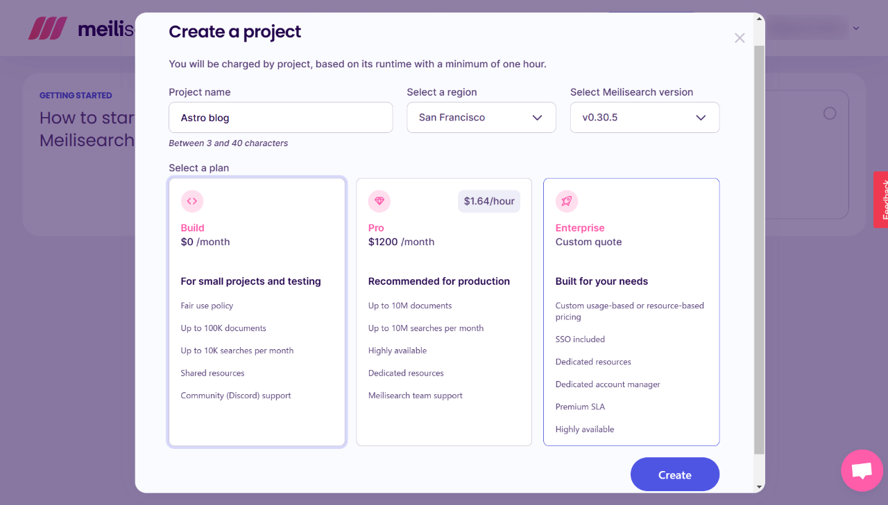
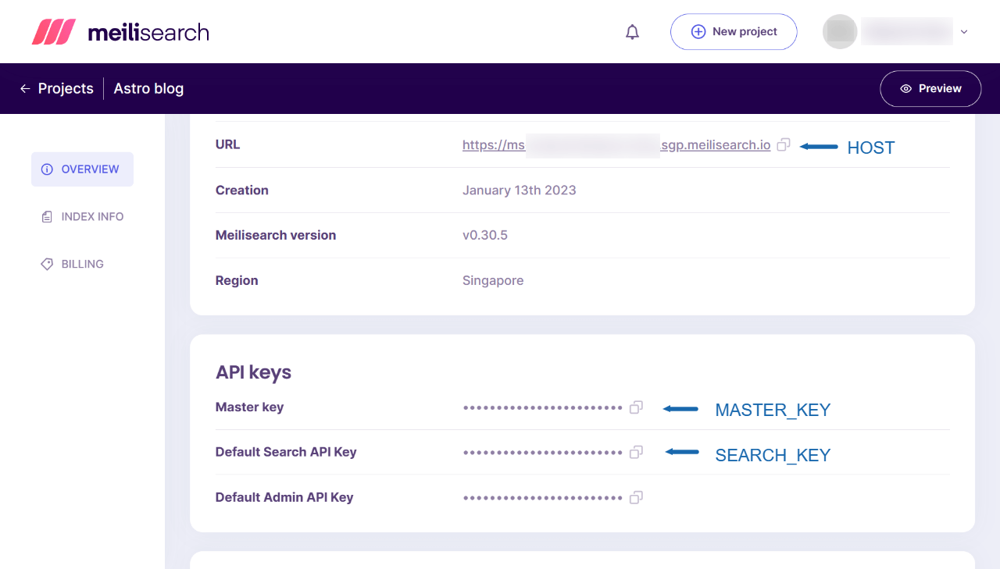
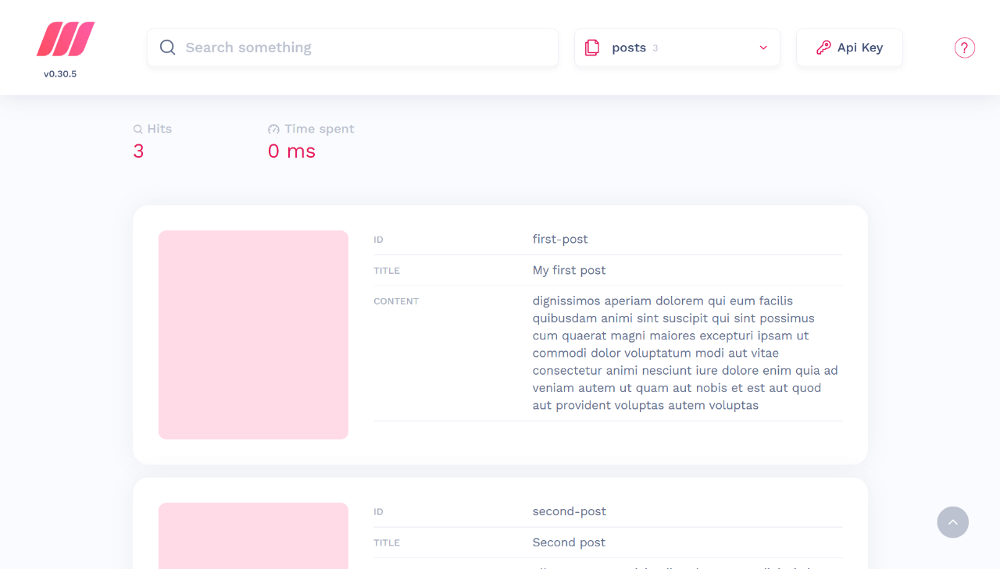

Astroで作る静的サイトで悩ましい問題の一つが、検索機能の実装です。

Gatsby.jsのようにAlgolia等のプラグインが用意されていれば多少は楽なのですが、Astroの場合は現時点ではそのようなものはありません。

一方、導入が手軽なGoogleカスタム検索では、せっかく高速な静的サイトが重くなってしまいます。

今回、全文検索エンジンとしては新興の[Meilisearch](https://www.meilisearch.com/)を試したところ、非常にスムーズに導入できたので紹介します。

ざっくりした流れとしては、

1. Meilisearch Cloudにユーザー登録
2. Astroプロジェクト内にmeilisearchをインストール
3. 検索用のデータを構築してMeilisearchに送信
4. 検索フォーム・検索結果表示用コンポーネントを作成
5. ページ内で検索コンポーネントを読み込む
6. スタイリング

となります。

動作環境:

- Node v18.12.1
- Astro v2.0.11
- meilisearch v0.3.1（クラウド側はv1.0.0）
- dotenv v16.0.3

## Meilisearchについて

私もまだ使い始めたところですが、ざっくりした印象としては以下のようなイメージ。

- 最も後発の全文検索エンジン
- セルフホスト版・クラウド版あり
- Algoliaと同じパラメーターが使える（Algoliaのドキュメントがほぼそのまま？使える）
- 日本語検索にやや難あり？（随時改善中）

2023年1月13日現在、Meilisearchはv1.0.0-RCがプレリリースされています（今回は試していません）。

v.1.0以上になれば、日本語検索の精度も良くなってきそうです。

## Astroプロジェクトの構造

今回は、以下の構造でAstroサイトを作ることとします。

```tree
src/
└─ pages/
     └─ posts/
          ├─ first-post.md
          ├─ second-post.md
          └─ ...
```

さらに、MarkdownのデータのYAML frontmatterは以下ようにしています。

<div class="filename">src/posts/first-post.md</div>

```md
---
title: My first post
slug: first-post
---

dignissimos aperiam dolorem qui eum facilis quibusdam animi sint suscipit qui sint possimus cum quaerat magni maiores excepturi ipsam ut commodi dolor voluptatum modi aut vitae
```

## Meilisearchに登録

Meilisearchはセルフホストも可能ですが、今回はクラウド版を利用します。セルフホスト構築ができる環境にある方は、もちろんそうして頂いてかまいません。

クラウド版では、ドキュメント数100,000・月10,000サーチまでが無料です。個人や小規模のサイトには十分ですね。

[登録ページ](https://cloud.meilisearch.com/register)から登録を進めましょう。


確認メールで認証リンクを押せば登録完了です。

### Meilisearch上でプロジェクトの作成

Meilisearchログイン後の上部メニューから「New Project」をクリックして、プロジェクトを作成します。


地域（Select a region）は、最も近い場所を選びます。日本からなら「シンガポール」です。プランは「Build $0 / month」。尚、シンガポールを選んでも、検索体験は非常に高速です。



「Create」を押せば、プロジェクト作成完了です。

### 検索データの作成はリモートのみ

Algoliaを使ったことがある方は、Meilisearchでは検索データの手入力やファイルのアップロードができない点に少し戸惑うかもしれません。

MeilisearchはNodeを使ってjsファイルを実行することで、検索データを追加したり削除したりします。残念ながら手入力・ファイルアップロードはできません。データの追加方法は、後ほど解説します。

## Astroにmeilisearchとdotenvをインストール

AstroでMeilisearchを利用するために、プロジェクト内に[meilisearch](https://www.npmjs.com/package/meilisearch)をインストールします。

```bash
# npmの場合
npm install meilisearch

# yarnの場合
yarn add meilisearch
```

さらに、環境変数をjsファイル内で扱うため、[dotenv](https://www.npmjs.com/package/dotenv)をインストールします。

```bash
# npmの場合
npm install dotenv

# yarnの場合
yarn add dotenv
```

## 検索用データの構築

次に、検索データを構築・送信するため、ファイルを作成します。

- libフォルダー内に、`meilisearch.js`（ファイル名、ファイルの場所は任意）
- ルート直下に`.env`

```tree
src/
├─ pages/
│    │  └─ ...
│    ├─ posts/
│    │    ├─ first-post.md
│    │    ├─ second-post.md
│    │    └─ ...
│    └─ lib/
│         └─ meilisearch.js <--これと
├─ .env <--これ
```

### .envファイルの編集

.envファイルに、以下の環境変数を入れておきます。

<div class="filename">.env</div>

```bash
PUBLIC_MEILISEARCH_HOST=https://ms-1234567890ab-1234.xxx.meilisearch.io/
PUBLIC_MEILISEARCH_SEARCH_KEY=xxxxxxxxxxxxxxxxxxxxxxxxxxxxxxxxxxx
MEILISEARCH_MASTER_KEY=xxxxxxxxxxxxxxxxxxxxxxxxxxxxxxxxxxx
```

これらのデータは、Meilisearchのプロジェクト一覧から当該プロジェクトの「Build」をクリックすると確認できます。



### meilisearch.jsの作成

次に、投稿からデータを集めてMeilisearchに送信するためのファイルを作成します。

#### 基本形

Meilisearchにデータを送信するためのコードの基本形は、こんな感じです。

```js
import { MeiliSearch } from "meilisearch"
const client = new MeiliSearch({
  host: "ホストのアドレス",
  apiKey: "APIキー",
})

client.index("インデックス名").addDocuments("JSONデータ")
// .then((res) => console.log(res))
```

「JSONデータ」の部分に、必要なデータを投稿から集めて送ればいい訳です。

#### dotenvをインポート

`meilisearch.js`のファイル冒頭で、dotenvを有効にします。

<div class="filename">src/lib/meilisearch.js</div>

```js
import * as dotenv from "dotenv"
dotenv.config()

// 続ã
```

#### 送信部分を記述

続いて、骨格部分を追加。インデックス名は「posts」としました（任意）。

<div class="filename">src/lib/meilisearch.js</div>

```js
// 続ã

import { MeiliSearch } from "meilisearch"
const client = new MeiliSearch({
  host: process.env.PUBLIC_MEILISEARCH_HOST,
  apiKey: process.env.MEILISEARCH_MASTER_KEY,
})

// 1. ここでデータセットを作る（後述）

// 2. JSONデータを作ってから送信
client
  .index("posts")
  .addDocuments("JSONデータ")
  .then(res => console.log(res)) //送信結果表示用
```

#### 検索用データセットの作成

次に、検索用のデータセット（documents）を作ります。

今回はMarkdownによる投稿を例としています。外部CMSを使っている場合は`fetch()`等でデータを取得するなど、適宜アレンジしてください。

Markdownのタグを除去するため、[remove-markdown](https://www.npmjs.com/package/remove-markdown)を利用しています。必要な場合はインストールしてください。

<div class="filename">src/lib/meilisearch.js</div>

```js
// 続ã
// 1. ここでJSONデータを作る
import fs from "fs"
import path from "path"
import matter from "gray-matter"
import removeMd from "remove-markdown"

const filenames = fs.readdirSync(path.join("./src/posts"))
const data = filenames.map(filename => {
  try {
    const markdownWithMeta = fs.readFileSync("./src/posts/" + filename)
    const { data: frontmatter, content } = matter(markdownWithMeta)
    return {
      id: frontmatter.slug,
      title: frontmatter.title,
      content: removeMd(content).replace(/\n/g, ""),
    }
  } catch (e) {
    // console.log(e.message)
  }
})

// 2. JSONデータを作ってから送信
// 略
```

ポイントは以下の通り。

- `import.meta.glob()`はここでは動かないため、fs・path・matterを使用（インストール不要）
- `id`は必須。今回はslugをidとして利用
- ここでは`content`を使い、全文を取得。`slice()`などを使って短くしても良い

#### 送信データを代入

作った`data`をJSON形式にして、`addDocuments()`に投入。

<div class="filename">src/lib/meilisearch.js</div>

```js
// 続ã

// 2. JSONデータを作ってから送信
client
  .index("posts")
  .addDocuments(JSON.parse(JSON.stringify(data))) //<--これ
  .then(res => console.log(res)) //送信結果表示用
```

#### meilisearch.jsコードまとめ

<div class="filename">src/lib/meilisearch.js</div>

```js
import * as dotenv from "dotenv"
dotenv.config()

import { MeiliSearch } from "meilisearch"
const client = new MeiliSearch({
  host: process.env.MEILISEARCH_HOST,
  apiKey: process.env.MEILISEARCH_MASTER_KEY,
})

// 1. ここでJSONデータを作る
import fs from "fs"
import path from "path"
import matter from "gray-matter"
import removeMd from "remove-markdown"

const filenames = fs.readdirSync(path.join("./src/posts"))
const data = filenames.map(filename => {
  try {
    const markdownWithMeta = fs.readFileSync("./src/posts/" + filename)
    const { data: frontmatter, content } = matter(markdownWithMeta)
    return {
      id: frontmatter.slug,
      title: frontmatter.title,
      content: removeMd(content).replace(/\n/g, ""),
    }
  } catch (e) {
    // console.log(e.message)
  }
})

// 2. JSONデータを作ってから送信
client
  .index("posts")
  .addDocuments(JSON.parse(JSON.stringify(data)))
  .then(res => console.log(res))
```

以上で`meilisearch.js`は完成です。

## 検索用データ（documents）を送信

`meilisearch.js`ファイルができたら、Nodeを使って実行します。

Astroプロジェクトのルートで、以下を実行。※`meilisearch.js`を違う場所に置いたり他のファイル名にした場合は、その場所とファイル名を指定。

<div class="filename">bash</div>

```bash
node src/lib/meilisearch.js
```

無事にデータが送信完了すると、ファイル内に記述した`console.log(res)`によって、以下のように表示されます。

<div class="filename">bash</div>

```bash
EnqueuedTask {
  taskUid: 0,
  indexUid: 'posts',
  status: 'enqueued',
  type: 'documentAdditionOrUpdate',
  enqueuedAt: 2023-01-13T04:45:26.891Z
}
```

Meilisearchのホストに移動して、インデックスを確認してみましょう。登録されていますね🙂



## 検索結果を表示するコンポーネントの作成

`src`フォルダー直下の`components`ディレクトリ（なければ作成）下に、検索ボックス+検索結果を表示するコンポーネントを作成。ここではファイル名を「Search.astro」としました。

```tree
src/
├─ components/
│    └─ Search.astro <--これ
├─ pages/
│    ├─ posts/
│    │    ├─ first-post.md
│    │    ├─ second-post.md
│    │    └─ ...
│    └─ lib/
│         └─ meilisearch.js
├─ .env
```

[公式ガイド](https://github.com/meilisearch/instant-meilisearch#-usage)を参考に、こんな風にしてみました。

<div class="filename">src/components/Search.astro</div>

```html
<div class="wrapper">
  <div id="searchbox"></div>
  <div id="hits"></div>
</div>

<script
  is:inline
  src="https://cdn.jsdelivr.net/npm/@meilisearch/instant-meilisearch/dist/instant-meilisearch.umd.min.js"
></script>
<script
  is:inline
  src="https://cdn.jsdelivr.net/npm/instantsearch.js@4"
></script>
<script is:inline>
  const search = instantsearch({
    indexName: 'posts',
    searchClient: instantMeiliSearch(
      import.meta.env.PUBLIC_MEILISEARCH_HOST,
      import.meta.env.PUBLIC_MEILISEARCH_SEARCH_KEY
    ),
  })
  search.addWidgets([
    instantsearch.widgets.searchBox({
      container: '#searchbox',
    }),
    instantsearch.widgets.configure({ hitsPerPage: 8 }),
    instantsearch.widgets.hits({
      container: '#hits',
      templates: {
        item: `
            <a href='/{{#helpers.snippet}}{ "attribute": "id" }{{/helpers.snippet}}/'>
              <h2 class="hit-name">
                    {{#helpers.highlight}}{ "attribute": "title" }{{/helpers.highlight}}
              </h2>
              <p>{{#helpers.snippet}}{ "attribute": "content" }{{/helpers.snippet}}...</p>
            </a>
          `,
      },
    }),
  ])
  search.start()
</script>
```

（2023-1-23更新）Astroで外部のCDNスクリプトを利用する場合、`is:inline`を使ってコンポーネント内でスクリプトを走らせることになります。そうするとHTML内にスクリプトが挿入されることになり、ページの表示速度が損なわれますのでご注意ください。

このコンポーネントを他のコンポーネントやテンプレート内で読み込めばOKです。

表示は以下のようになります。


モーダル表示用のコンポーネントを作って、その中でこのSearch.astroを読み込んで表示させるのがいいですね（なるべくBodyの閉じタグ直前）。

## スタイルを適用させる

スタイルの適用方法としては、いくつか選択肢があります。

- クラス名を確認して自分で作る
- Algoliaが作ったsatellite.cssを読み込む（npm または CDN）
- Meilisearch純正のbasic_search.cssを読み込む（CDN）

MeilisearchはAlgoliaと同じクラス名を使って表示をしているので、Algoliaの検索結果表示のスタイルが使えます。

### クラス名を確認して自分で作る

コンポーネント内に表示されていないクラス名は、`is:global`を使って適用させます。

<div class="filename">src/components/Search.astro</div>

```html
<!-- 続き -->

<style is:global>
  .ais-Hits-item {
    margin-bottom: 1em;
  }
</style>
```

### Algolia用のsatellite.css

<span class="label warning">参考</span> [Style your widgets](https://www.algolia.com/doc/guides/building-search-ui/widgets/customize-an-existing-widget/js/#style-your-widgets)

#### インストールする場合

<div class="filename">bash</div>

```bash
# npmの場合
npm install instantsearch.css

# yarnの場合
yarn add instantsearch.css
```

<div class="filename">src/components/Search.astro</div>

```js
---
// リセットCSSのみ
import 'instantsearch.css/themes/reset.css'
// または、サテライトテーマ（リセットCSS含む）
import 'instantsearch.css/themes/satellite.css'
---

<div class="wrapper">
  <div id="searchbox"></div>
  <div id="hits"></div>
</div>

// ...
```

#### CDNで読み込む場合

```html
<link
  rel="stylesheet"
  href="https://cdn.jsdelivr.net/npm/instantsearch.css@7.4.5/themes/satellite-min.css"
  integrity="sha256-TehzF/2QvNKhGQrrNpoOb2Ck4iGZ1J/DI4pkd2oUsBc="
  crossorigin="anonymous"
/>
```

#### 表示例


### Meilisearch純正のbasic_search.css

以下のCDNを読み込みます。

```html
<link
  rel="stylesheet"
  href="https://cdn.jsdelivr.net/npm/@meilisearch/instant-meilisearch/templates/basic_search.css"
/>
```

#### 表示例


## まとめ

説明が長くなりましたが、試してみるとそこまで複雑ではないと思います。

Meilisearchは後続なだけあり、無料プランでもAlgoliaより登録可能レコード数においては条件が良いです。

Algoliaのような高度な機能はありませんが、「普通の」検索機能であれば、十分ですね。今後の日本語対応に期待したいところです。
