I made this website (route360.dev) with Next.js and Markdown in 3 languages (English, French and Japanese).

As I explained in "[Frontend architecture of this website](/en/post/architecture/)", I was building this with DatoCMS at the beginning.

Though there is no need to think about Headless CMS seriously if you are developing a website in one language, it could be hard to choose the one if it is an multilingual website, especially in 3 or more languages.

Here I'd like to review some major Headless CMS from the point of view of internationalization.

note The screenshots are those in September/October 2022. Price or numbers may change in future. Please check the latest version in each service.

The order is [G2.com](https://www.g2.com/categories/headless-cms) score ranking in October 2022.

## SanityCMS

https://www.sanity.io/

- Local + Cloud
- Records for free plan: 10,000
- Locales for free plan: unlimited
- Users for free plan: unlimited

<!-- out of toc -->
### I like:

- Real-time view reflection between Local and Cloud
- No limit for locales

<!-- out of toc -->
### I don't really like:

- Fields for all locales in one editor view
- Not that clear where posted data are stored
- Cumbersome on settings

SanityCMS is the most popular CMS in the world, as stated by [G2.com](https://www.g2.com/categories/headless-cms). However, I couldn't be so satisfied with their UI/UX about internationalization/localization.

In the editor, the fields for translation appear in the same view.

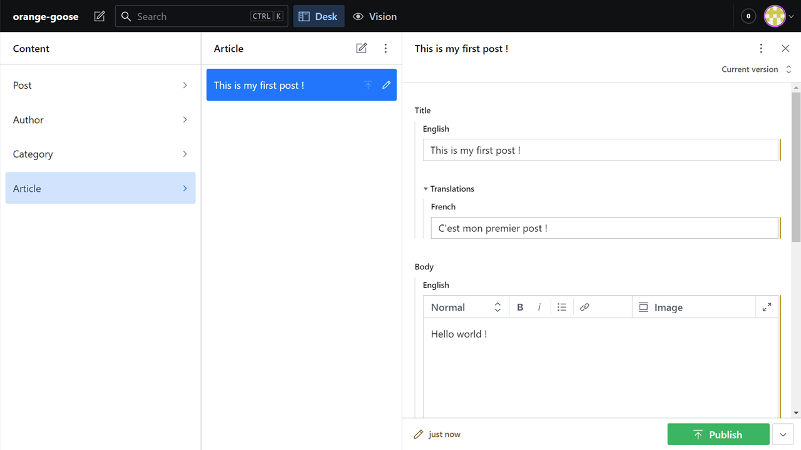

You can post a translated article as an another post. But in that case, those posts can't share the same slug, which makes complicated to switch languages of the post in frontend.

In some of the CMS I'll review later, translation editor consists of different view with tabs or dropdown for switching locales. That's shame Sanity isn't so.

Plus, it's cumbersome developing settings locally, whereas the data are stored in the cloud. You need to take time and learn their unique system. It doesn't seem for beginners.

## StoryBlok

https://www.storyblok.com/

- Cloud
- Records for free plan: 10,000
- Locales for free plan: unlimited
- Users for free plan: 1
- Visual Editor

<!-- out of toc -->
### I like:

- One locale in one editor view
- Unlimited locales

<!-- out of toc -->
### I don't really like:

- Their rich Visual Editor is too much for this type of blog/website

A Headless CMS growing recently. Their Visual Editor reminds Gutenberg Editor of WordPress (it's not super flexible like Gutenberg, though).

There is a dropdown on the top bar which we can switch locales with.

For example, once you post in the default locale,

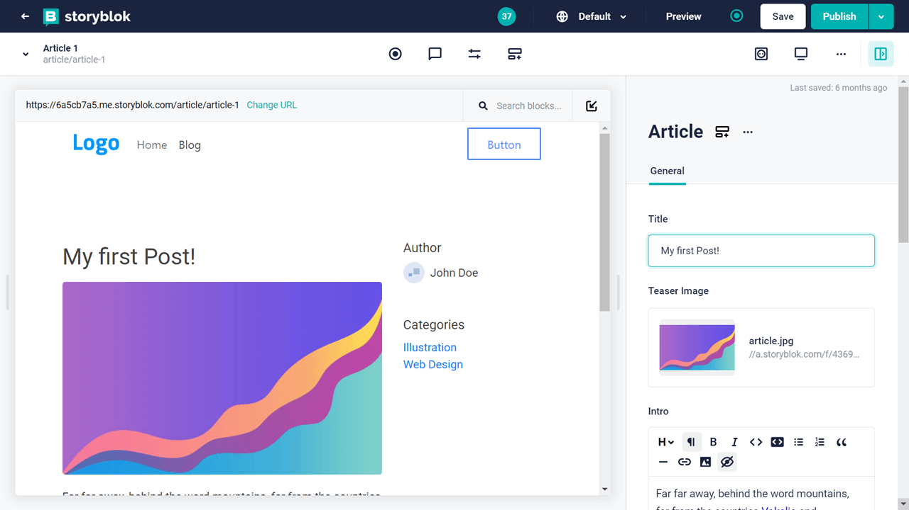

you can write its translation (the screenshot below is in French locale).

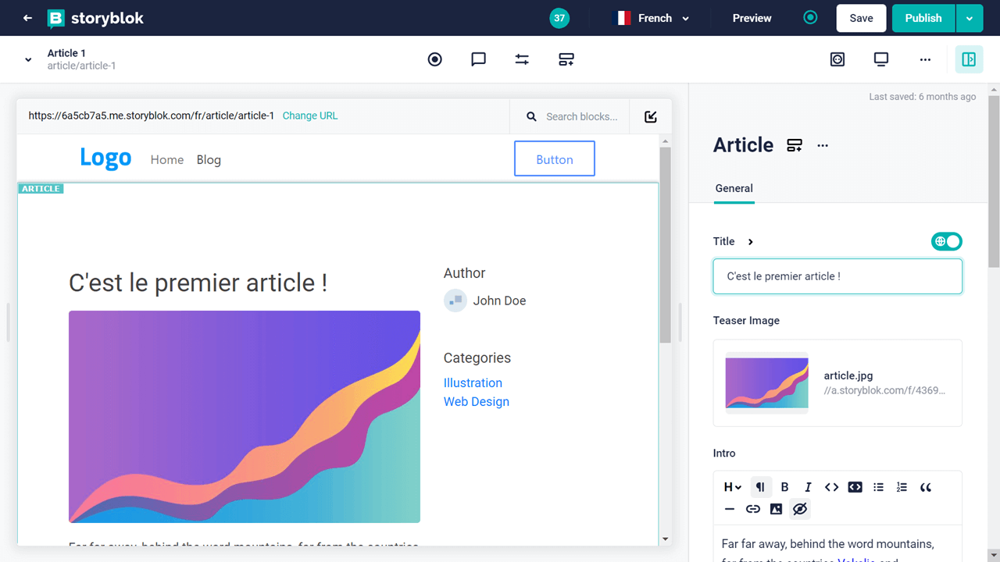

The only thing I was disappointed in is it's impossible to filter the post list by locales, which is possible with DatoCMS or Prismic.

This CMS must be a good choice when non-programmers will edit the posts.

## Contentful

https://www.contentful.com/

- Cloud
- Records for free plan: 25,000
- Locales for free plan: 2
- Users for free plan: 5

<!-- out of toc -->
### I like:

- One of the pioneers of Headless CMS, lots of knowledge on the web
- Enough recodes - no worry for free plan for personal use

<!-- out of toc -->
### I don't really like:

- Fields for all locales in one editor view
- Only 2 locales for free plan

Like SanityCMS, Contentful displays the fields for all locales on the same editor view.

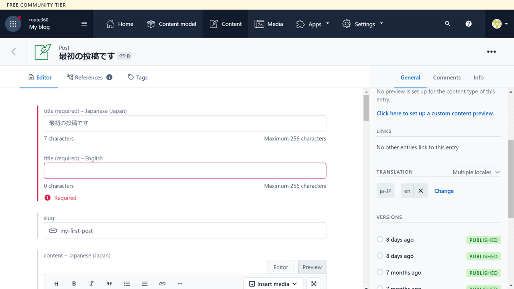

For example, when "title" is a required field, you can't leave its translation title empty in draft (as the field is required for all locales) but have to input something even though you want to do it later.

It's not practical when you want to translate little by little. However, it'll be okay if you always publish all the translations at the same time or if the website isn't not edited that frequently.

## Strapi

https://strapi.io/

- Local or VPS installation
- Recodes for free plan: unlimited
- Locales for free plan: unlimited
- Users for free plan: unlimited

Rather than saying "free plan", it's completely free as Strapi is an open source CMS. You need to run it by yourself locally, or on some VPS. Their Cloud version is being developed as of October 2022.

<!-- out of toc -->
### I like:

- Unlimited locales
- Sophisticated UI
- One locale in one editor view
- **Official DeepL plugin**

<!-- out of toc -->
### I don't really like:

- It wouldn't be free of charge if you install it on VPS (≥ 10 USD)

Installation is required. It is possible to run Strapi locally, but you'd need to upload your project data after build.

Their UI is remarkably sophisticated, and translation experience is also great.

Once edited in default locale (English in this example),

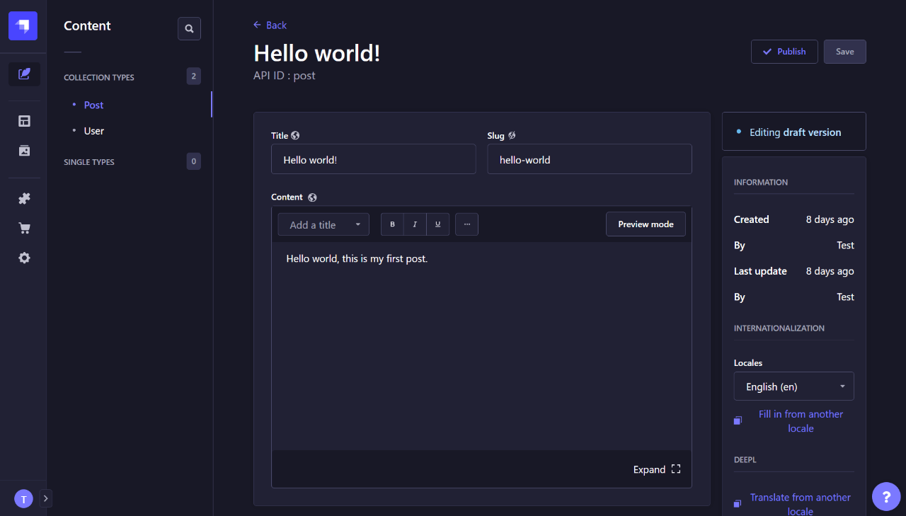

Easy to translate in another locale (French).

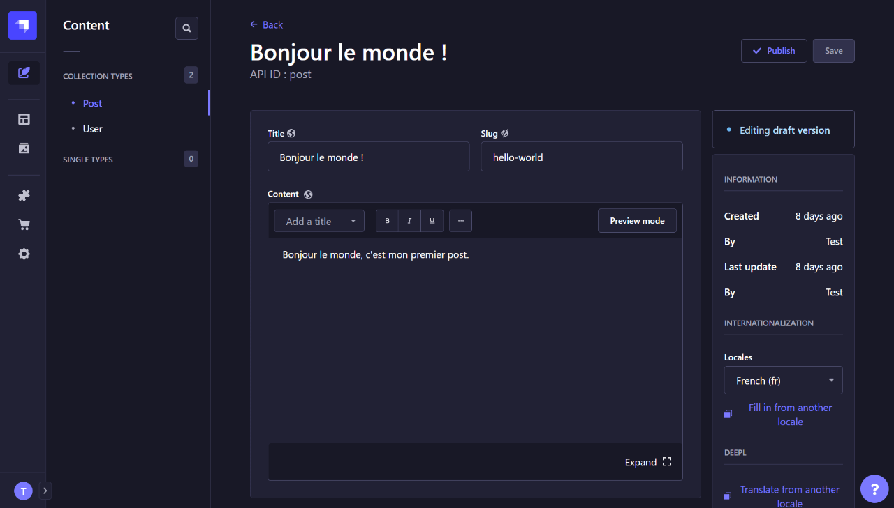

Plus, they provide the official DeepL plugin that makes possible to translate the contents easily (with DeepL free API account). That's huge.

Reference [DeepL | Strapi Market](https://market.strapi.io/plugins/strapi-plugin-deepl)

Talking about the cost, if you need to edit posts with others, installation on a VPS will be needed, while local installation is enough for one person.

*Because it requires Node.js, it doesn't work on traditional shared hosting servers like you had been doing with WordPress.

As its minimum memory requirement is 2GB RAM (recommended 4GB+), 10 USD plan of [DigitalOcean](https://www.digitalocean.com/) or [AWS lightsail](https://aws.amazon.com/jp/lightsail/pricing/) would be needed. -> [Strapi Docs](https://docs.strapi.io/developer-docs/latest/setup-deployment-guides/deployment.)

## Hygraph

https://hygraph.com/

- Cloud
- Records for free plan: 1,000
- Locales for free plan: 2
- Users for free plan: 3

<!-- out of toc -->
### I like:

- Easy to edit contents by locale
- Flexible to add/remove locales to each article

<!-- out of toc -->
### I don't really like:

- Smaller number of records (1,000), though it's enough for personal/small business use

It's a CMS we can feel its strong philosophy, especially in content editor UI. I love it.

The number of locales is 2 for their free plan like [Contentful](#contentful), but their UI is very different from Contentful's;

- You add translation very only when you want
- You can hide/show fields par locale

So it's much more user friendly.

After editing in English,

 &copy;Hygraph")

Then, you can add Japanese if you want. If you don't want, you can just leave it.

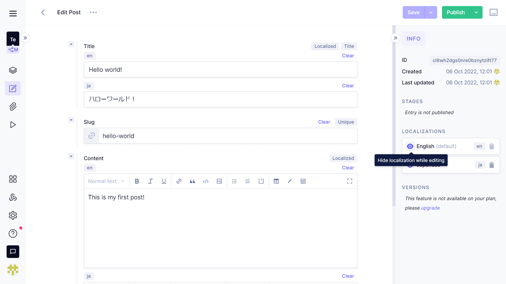

You can even decide in which language you'll publish the article.

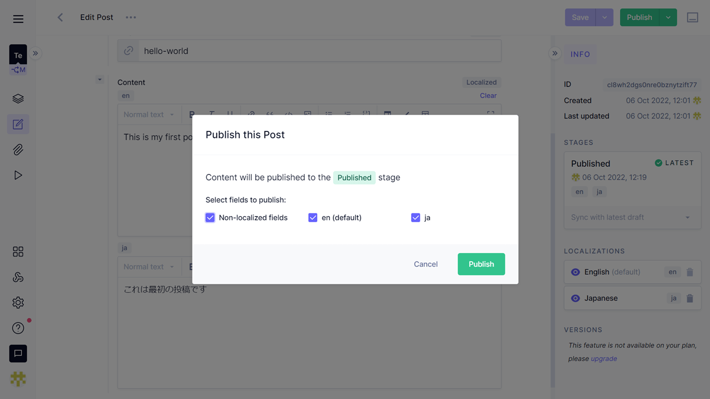

If the website goes with two languages only with about 300 articles, you can go for free.

In addition, their official DeepL plugins is "coming soon" (as of October 2022). Though the detail isn't announced yet, it'll take a huge advantage against other CMS.

## DatoCMS

https://www.datocms.com/

- Cloud
- Records for free plan: 300
- Locales for free plan: 10
- Users for free plan: 1

<!-- out of toc -->
### I like:

- Enough locales
- Easy UI
- Filter post list by locales

<!-- out of toc -->
### I don't really like:

- Only 300 records for free plan
- It's difficult to adjust whitespace when editing Markdown contents.

I liked their translation experience.

For Japanese locale, the view for Japanese.

 &copy;DatoCMS")

You can decide which posts will have translations. If you want, you add it. Even if you don't, no problem.

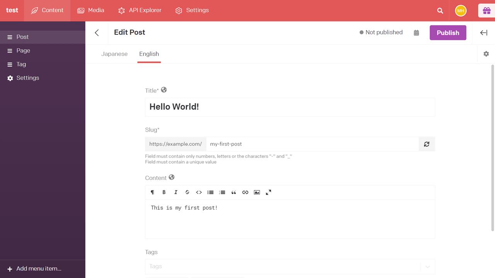

The only problem of DatoCMS is that you are allowed only 300 records on their free plan. It is far less than 25,000 of Contentful, or 2,500 of StoryBlok. If three locales are set, only 100 posts can be created literally. Because a category or an image consumes a record, it could be even less than 100.

So, I consider that DatoCMS' free plan works as a good choice for small businesses whose website has limited contents.

It's easy to set up because the system is just like Contentful. Their tutorial videos on YouTube or starter projects/templates on GitHub are also helpful.

## Prismic

https://prismic.io/

- Local + Cloud
- Records for free plan: unlimited
- Locales for free plan: unlimited
- Users for free plan: 1

<!-- out of toc -->
### I like:

- Unlimited locales
- Switch locales easily from dropdown, one locale in the edit view
- Each translation can have different field blocks (called Slices)
- Real-time view reflection between Local and Cloud
- Filter post list by locales

<!-- out of toc -->
### I don't really like:

- Cumbersome on settings

Though I tried Prismic only for some hours, I really liked their UI and unlimited records/locales. You can even filter posts by locales.

After editing a post in English,

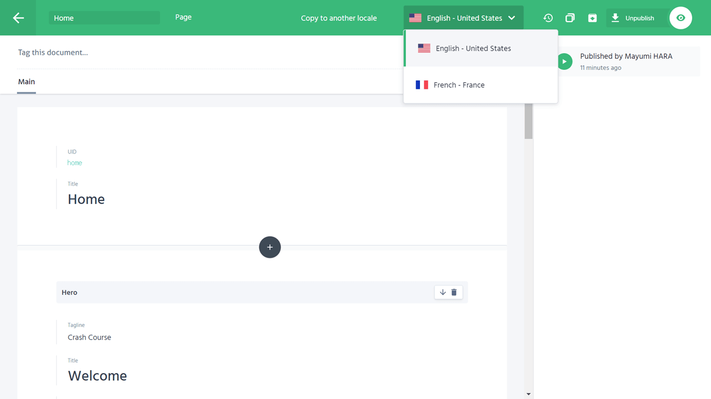

add a translation only when you want.

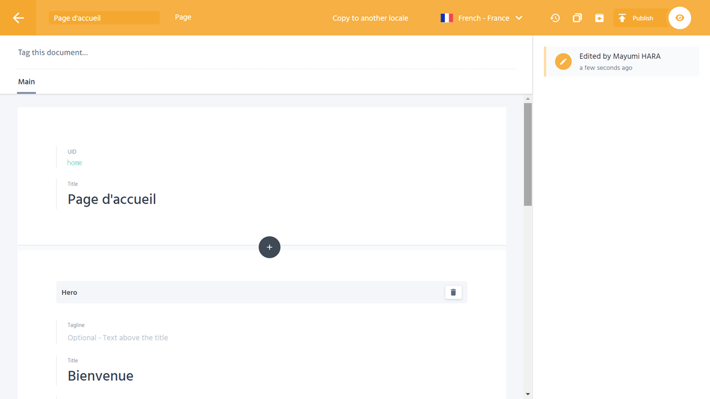

The Slices, the field blocks in Prismic, and Content Types can be moderated by Slice Machine on local.

Setting on local itself is the same as [SanityCMS](#sanitycms), but Prismic's Slice Machine offers a beautiful UI, whereas you only edit code in SanityCMS.

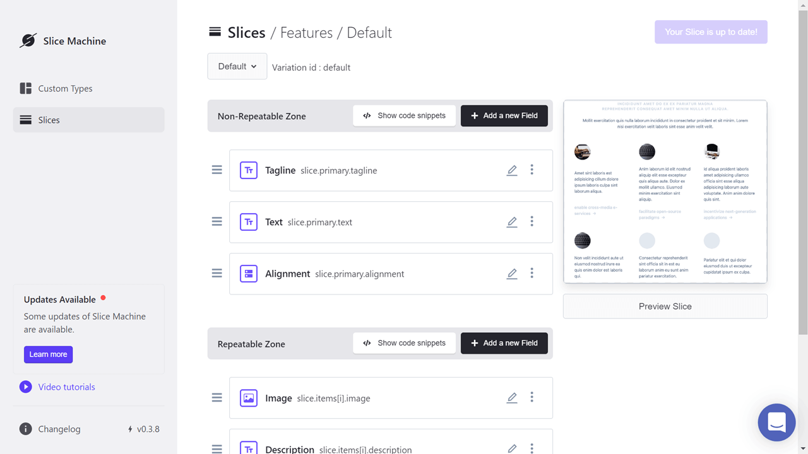

This Slice editing system is similar to Gutenberg editor of WordPress. It's interesting.

As the concept is unique, there are things to learn. However, I like Prismic very much because its translation experience is just I wanted.

## Markdown

It's completely free of charge with no restriction because all the contents are managed inside your project. In this blog, I use local Markdown only.

<!-- out of toc -->
### I like:

- Free of charge
- Everything is under your control

<!-- out of toc -->
### I don't really like

- You need to design its architecture, and learn how to fetch contents for each locale
- No relationship system like categorizing/tagging *with [Front Matter](https://frontmatter.codes/) some problems can be solved.

It always becomes much more complicated building multilingual website than monolingual ones, even with a Headless CMS.

This website is generated with Next.js, and my first Next.js website. It took me a couple of days to learn and understand how to publish local Markdown files in several languages, though the internationalization was easier than Gatsby.js.

If you have to edit Markdown posts with others, GitHub review would be helpful, I guess.

This might be off topic, but [Front Matter](https://frontmatter.codes/) is a good VS Code plugin when you edit Markdown files locally. It makes much easier managing meta datas (such as title, slug, categories or date).

## Conclusion

Each Headless CMS has pros and cons. It might not be easy to decide the one you go. Try them.

I'm personally satisfied with local Markdown for now, because I'm free from anything outside.

If I had to choose one Headless CMS,

- For 3+ languages: 1st Prismic, 2nd Strapi
- For 2 languages: 1st Hygraph, 2nd Contentful

It'd be nice if you share your favorite CMS through the comments! 😊

