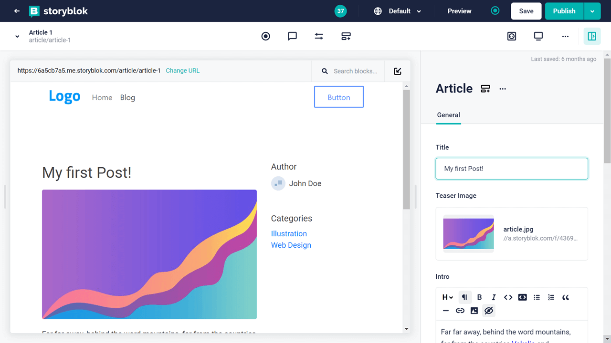
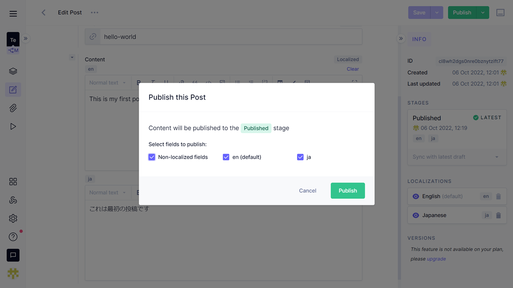

このサイト（route360.dev）は、Next.jsとMarkdown、そして3つの言語（日・英・仏）で作られています。

「[このサイトのフロントエンド構造について](/ja/post/architecture/)」でも説明したように、当初はDatoCMSを使ってサイト構築を行っていました。

単一の言語でのサイト構築であれば一切悩む必要はありませんが、多言語（こと3カ国語以上）となると、コンテンツの保存場所・ヘッドレスCMSの選定が非常に難しくなってきます。

DatoCMS以外にも色々と試してみたので、多言語サイト構築という観点から、その感想を書いてみます。

尚、各サービスの編集画面は2022年10月時点のものです。各サービスとも常に機能を更新し続けているので、最新情報は直接チェックしてみてください。

（2022年10月時点の[G2.com](https://www.g2.com/categories/headless-cms)のスコア順）

## SanityCMS

https://www.sanity.io/

- ローカル + クラウド
- 無料枠でのレコード数: 10,000
- 無料枠での言語ロケール数: ∞（制限なし）
- 無料枠でのユーザー数: ∞（制限なし）

<!-- out of toc -->

### 好きな点

- ローカルで環境構築→クラウドに即反映
- ロケール数に制限なし

<!-- out of toc -->

### 好きではない点

- ひとつの投稿画面にすべての言語の入力枠
- どこに投稿データが保管されているのかわかりづらい
- セットアップ・環境構築が面倒

現在、世界トップクラスの人気を誇るCMSです。ただ、多言語編集の観点から見た場合、UIや使い勝手（UX）がややイマイチに感じます。（設定も面倒ですが・・・）

SanityCMSでは、ひとつの投稿を多言語化する場合、同じ画面上に複数の言語の入力欄が表示される仕様です。

もしくは、言語を指定して別の投稿として作成できるようにする方法もありますが、slugは重複不可（と思われる）なので、フロントエンドでの同記事の言語切り替えに難が出ます。

後述する他のいくつかのCMSでは、ひとつの投稿でもタブやドロップダウンで言語表示が切り替わるので、それと比べてしまうともう一歩の印象。

また、データ量の管理はオンラインでもローカルで環境構築が必要だったり、ブロックはjsファイルで作成する点など、他のCMSに比べて独自性が強く学習コストもかかります。玄人向けのCMSという印象です。

## StoryBlok

https://www.storyblok.com/

- クラウド
- 無料枠のレコード数: 10,000
- 無料枠での言語ロケール数: ∞（制限なし）
- 無料枠でのユーザー数: 1
- ビジュアルエディタが最大の特徴

<!-- out of toc -->

### 好きな点

- 編集画面は1画面に1言語でわかりやすい
- 言語追加は無制限

<!-- out of toc -->

### 好きではない点

- ビジュアルエディターはこのような技術ブログにはオーバースペック

このところ勢いを感じるCMSです。でき上がり画面を見ながら編集できる点は、イメージとしてはWordPressの編集画面に近いです（Gutenbergの自由度には及びませんが）。

こちらは上部メニューバーの言語ピッカーで編集画面を切り替えます。

たとえば、デフォルト言語で編集をした後、

言語を切り替えて編集が可能です（以下画像はフランス語で編集）。

残念なのは、記事一覧を言語毎に切り替えできない点くらいでしょうか（DatoCMSやPrismicでは可能）。

技術者以外がコンテンツを管理することが想定される場合に向いているCMSですね。

## Contentful

https://www.contentful.com/

- クラウド
- 無料枠でのレコード数: 25,000
- 無料枠での言語ロケール数: 2
- 無料枠でのユーザー数: 5

<!-- out of toc -->

### 好きな点

- 言わずと知れたヘッドレスCMSの先駆け・ウェブ上にノウハウも多い
- 個人利用には十分すぎる、無料で25,000というレコード数

<!-- out of toc -->

### 好きではない点

- ひとつの投稿画面にすべての言語ロケールの入力枠
- 無料枠では3言語以上はできない

ContentfulもSanityCMSと同様、「ひとつの投稿画面にすべての言語ロケールの入力枠」というスタイルです。

たとえばタイトルを「必須」に設定していた場合、「日本語だけ先に記事を作っておいて、英語は下書きにしておこう」というときに、空欄のままで保存できません。

言語毎に記事を少しずつ翻訳していきたい場合は使いづらいですが、最初からすべての言語で投稿する場合や、ほぼ内容が固定される企業サイト等であれば問題ないでしょう。

## Strapi

https://strapi.io/

- ローカル or VPSインストール
- 無料枠でのレコード数: ∞（制限なし）
- 無料枠での言語ロケール数: ∞（制限なし）
- 無料枠でのユーザー数: ∞（制限なし）

「無料枠」と言うより、自分でインストールして使うオープンソースのCMSですので、そもそもすべて無料です。（2022年10月現在、クラウド版が開発進行中）

<!-- out of toc -->

### 好きな点

- 言語ロケール数に制限がない
- 使いやすいインターフェイス
- 投稿編集画面は1画面に1言語でわかりやすい
- **DeepLプラグイン**で翻訳可

<!-- out of toc -->

### 好きではない点

- VPSにインストールするとなると、それなりにコストがかかる

こちらは自分でVPSなりにインストールして使うタイプのヘッドレスCMSです。ローカルのみで運用する場合は、プロジェクトについてはローカルでビルドしてからアップロードという作業が必要になります。

UIが非常に洗練されており、多言語での投稿体験も良好です。

英語で編集↓

同じエントリーをフランス語で編集↓

また、公式でDeepLプラグインが用意されており、DeepLの無料APIを利用して翻訳を作ることも可能です。これは大きいですね。

参考 [DeepL | Strapi Market](https://market.strapi.io/plugins/strapi-plugin-deepl)

金額に関しては、自分一人だけで運営するならローカル環境だけで良いですが、複数の人数で別々のPCからの編集が想定される場合は、VPSへのインストールが必要になってきます。

※Node.jsが必要なので、良くある安いレンタルサーバーではWordPressのようにインストールはできません。

最低要件の1つに2GB RAMがあるため、[DigitalOcean](https://www.digitalocean.com/)や[AWS lightsail](https://aws.amazon.com/jp/lightsail/pricing/)などでは少なくとも月10ドルプランなどの契約が必要になってきます。 -> [公式情報](jp/lightsail/pricing/)

## Hygraph

https://hygraph.com/

- クラウド
- 無料枠のレコード数: 1,000
- 無料枠での言語ロケール数: 2
- 無料枠でのユーザー数: 3

<!-- out of toc -->

### 好きな点

- 言語ロケール毎の編集がしやすい
- ロケールの追加・削除は自由

<!-- out of toc -->

### 好きではない点

- レコード数が1,000と、やや少ない（個人・小規模企業の利用には十分ですが）

編集画面に理念を感じられるCMSです。非常に使いやすい。

無料プランの場合は言語ロケール数は2で[Contentful](#contentful)と同じですが、Contentfulが言語毎のフィールドを固定表示にするのに対し、こちらのHygraphは

- 追加したい時だけ追加
- 言語毎に表示・非表示ができる

という点で優れています。

↓英語で記事を執筆

↓その後、日本語を追加。追加しない場合は追加ボタンを押さなければOK。

複数ロケールで編集時でも、どの言語分を公開するかも自由に決められます。

利用予定が2言語のみ・想定される記事数もざっくり各300程度であれば、問題なく無料の範囲で使えそうですね。

さらに、公式のDeepLプラグインもcoming soonとなっています（2022年10月現在）。どのように使えるのかはまだわかりませんが、多言語サイト作成においては大きなアドバンテージになりそうです。

## DatoCMS

https://www.datocms.com/

- クラウド
- 無料枠のレコード数: 300
- 無料枠での言語ロケール数: 10
- 無料枠でのユーザー数: 1

<!-- out of toc -->

### 好きな点

- 言語ロケール数は十分
- 編集画面ではタブで言語切り替え、わかりやすい
- 投稿一覧も言語ロケール別にリスト表示可能

<!-- out of toc -->

### 好きではない点

- 無料枠ではレコードが300しか作れない
- Markdownで書くと、プラグラミングコード部分の空白の調整が難しかった

多言語での投稿体験はダントツに良いです。

日本語には日本語の投稿画面を表示。

記事毎に、英語や他の言語の追加も自由です。追加したい場合だけその言語を追加、あるいは不要であればそのままでも問題ありません。

一方、最大のネックは無料枠では300というレコード数の少なさ。

Contentfulの25,000、StoryBlokの2,500と比べても、極端に少ないです。単純計算で3言語では無料枠下では100記事となってしまいます（カテゴリーやタグ、画像等もレコードとしてカウントされるため、実際はその分さらに減る）。

無料での運用を考える場合、コンテンツがあまり増えない、オーナーなど特定の一人が管理する小規模なお店等のホームページなどには良いでしょう。

YouTubeにも導入動画が公開されていますし、CMSとしての基本的な使い方はContentfulと同じなので、導入の敷居も低いです。

## Prismic

https://prismic.io/

- ローカル + クラウド
- 無料枠のレコード数: ∞（制限なし）
- 無料枠での言語ロケール数: ∞（制限なし）
- 無料枠でのユーザー数: 1

<!-- out of toc -->

### 好きな点

- 言語ロケール数に制限なし
- 編集画面ではプルダウンメニューで言語切り替え、わかりやすい
- 投稿内容はブロック（スライス）単位なので、言語によって内容を柔軟に変えられる
- ローカルで環境構築→クラウドに即反映

<!-- out of toc -->

### 好きではない点

- セットアップ・環境構築が面倒

試用の段階のみですが、投稿数や言語ロケール数に制限がなく、かつUIもわかりやすい。記事一覧も言語別に表示OK。

英語で編集↓

仏語で編集↓

フィールドブロックは「スライス」と呼称され、コンテンツタイプや各スライスはローカル上で「スライスマシン」を立ち上げて編集します。

ローカル上でコンテンツタイプなどを管理する点は[SanityCMS](#sanitycms)と同じですが、完全にコードのみで管理するSanityCMSとは違い、わかりやすいUIが用意されています。

「スライス」を使って編集する点は、WordPressのブロックエディタ編集と似ています。他のヘッドレスCMSではあまり見られない面白いシステムですね。

ローカルで環境構築する点でやはり学習コストがかかりますが、編集の自由度の高さ、多言語投稿でもその自由度が損なわれないという点で、非常に好印象です。

## Markdown

プロジェクト内にコンテンツを入れるだけなので完全に無料、制限も当然ありません。このサイトのコンテンツ管理は、ローカルでのMarkdownのみです。

<!-- out of toc -->

### 良い点

- 無料
- すべてを自分のコントロール下における

<!-- out of toc -->

### 良くない点

- 多言語導入には学習コストが必要
- 関連付けシステムはない ※[Front Matter](https://frontmatter.codes/)にて対応

ひとつの言語であれば簡単にできるサイト構築も、多言語になると途端に難易度が増します。

このサイトはNext.jsを使って構築していますが、Gatsby.jsに比べると多言語化は楽ではあったものの、はじめて作ったNext.jsサイトであることもあり、ローカルのMarkdownファイルを使ってのページ生成・記事リスト生成の学習に数日を要しました。

今回は一人で管理しているのでローカル環境のみですが、多人数で管理する場合はGitHub上でレビューを行う等の設定をすれば行けそうです。

余談ですが、ローカルのMarkdownで記事を作る場合は、VS Codeのプラグイン[Front Matter](https://frontmatter.codes/)がオススメ。スラッグ・カテゴリーなどの関連付けが必要なメタデータの管理が各段に楽になります。

## 多言語用ヘッドレスCMSの試用感想 - まとめ

それぞれに長所・短所があるので一概にこれが良いと決めるのは難しいですが、私はローカルのMarkdown編集で現状は満足しています。外部要因に一切左右されない安心感・開放感は捨てがたい。

もしも多言語サイト用にローカルのMarkdownではなくヘッドレスCMSを選べと言われたら、

- 3言語以上: Prismic 次点でStrapi
- 2言語まで: Hygraph 次点でContentful

ですね。他に多言語サイトにオススメのCMSがあれば、是非コメントで教えてください😊
