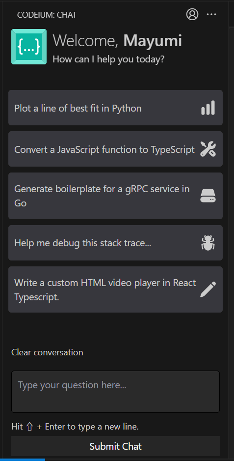

This year has been dominated by ChatGPT and other AI programming support topics.

In this entry, I'd like to introduce [**Codeium**](https://codeium.com/), an AI code completion extension for IDEs (Integrated Development Environments). Codeium suggests the best code completion candidates according to your coding style and context.

I started using Codeium last month to ride the wave of AI coding. It is very comfortable to use and I am beyond satisfied and impressed. Most of all, Codeium is free. Give it a try!

## Codeium Overview and Comparison with Other Services

### What is Codeium?

Codeium is an AI coding support extension for IDEs like VS Code or JetBrains.

First, see how it works. The gray italicized text is the suggestion from Codeium. I just typed the very first `!`, `<header>`, enter key and the tab key to confirm.

Codeium is being developed by the team at [Exafunction](https://exafunction.com/), a U.S. start-up company founded in 2021 that is developing an accelerated platform for deep learning. They had raised $25 million in Series A funding from Greenoaks in 2022.

### Other AI coding support services

Similar coding support extensions include:

- [GitHub Copilot](https://github.com/features/copilot/) (Microsoft)
- [AWS CodeWhisperer](https://aws.amazon.com/jp/codewhisperer/) (Amazon)
- [Tabnine](https://www.tabnine.com/)
- [Replit Ghostwriter](https://replit.com/site/ghostwriter) only on Replit

Tell me if there are any!

### Codeium Features and Benefits

- It works fast enough
- Completely free
- Not trained by GPL licensed code

Code suggestions, which were very slow on AWS CodeWhisperer, are very smooth on this Codeium. However, AWS Code Whisperer was just released in April 2023, so the edge server may just not be in Japan (where I am) yet.

#### "Not Trained by the GPL License Code" means...

While there is concern that GitHub Copilot uses GPL-licensed code in its proposals and consequently creates a risk of violating the GPL license for the companies that use that code*, Codeium has declared that it will not use GPL-licensed code in its training of AI. *A filter can be turned on to display suggestions (off by default).

Link - [GitHub Copilot Emits GPL. Codeium Does Not.](https://codeium.com/blog/copilot-trains-on-gpl-codeium-does-not)

### Supported languages

Codeium prend en charge 70+ langues (in the following excerpt, 62) au 13 mai 2023.

> Assembly, C, C++, C#, Clojure, CMake, COBOL, CoffeeScript, Crystal, CSS, CUDA, Dart, Delphi, Dockerfile, Elixir, Erlang, F#, Fortran, Go, Gradle, Groovy, Haskell, HCL, HTML, Java, JavaScript, Julia, JSON, Kotlin, LISP, Less, Lua, Makefile, MATLAB, Objective-C, OCaml, pbtxt, PHP, Protobuf, Python, Perl, PowerShell, R, Ruby, Rust, SAS, Sass, Scala, SCSS, shell, Solidity, SQL, Starlark, Swift, Svelte, TypeScript, TeX, TSX, VBA, Vimscript, Vue, YAML
> <cite>[What programming languages do you support? | Codeium](https://codeium.com/faq)</cite>

For other services, you can find the supported languages below:

- GitHub Copilot: [GitHub language support](https://docs.github.com/en/enterprise-cloud@latest/get-started/learning-about-github/github-language-support)
- Tabnine: [How many languages does Tabnine support?](https://support.tabnine.com/hc/en-us/articles/5755707074961-How-many-languages-does-Tabnine-support-)
- AWS CodeWhisperer: [Language and IDE support in Amazon CodeWhisperer](https://docs.aws.amazon.com/codewhisperer/latest/userguide/language-ide-support.html#language-support)

## Using Codeium

### Display and selection of code candidates

The code suggestion appears automatically as you type.

Just hit the tab when you're happy with it and confirm it.

Codeium also learns how you name constants or class names. Once you have named the first ones, Codeium will suggest the following names.

### AI Chat

Codeium also has a chat function, like ChatGPT. Buttons such as "Plot a line of best fit in Python", "Convert a JavaScript function to TypeScript" and etc. are also available.

Its interface is in English, but I was also able to talk to it in Japanese and French.

## Codeium Demo

The following is a gif animation when I tested writing a form component in React.

What we need to do is now hit the confirmation tab...

## Summary and Impressions

Even though I've only used Codeium for React or sometimes Python, it's too convenient.

And it's free.

I always like to pay for services if it helps the quality of the work, but I don't hate free.

Codeium helped me a lot when I migrated this multilingual blog from Next.js to Gatsby.js!

What I only hope is that Google aims to buy it, since they haven't released any code assistance AI yet.

### Links

- [Codeium](https://codeium.com/)
- [@codeiumdev - Twitter](https://twitter.com/codeiumdev)
