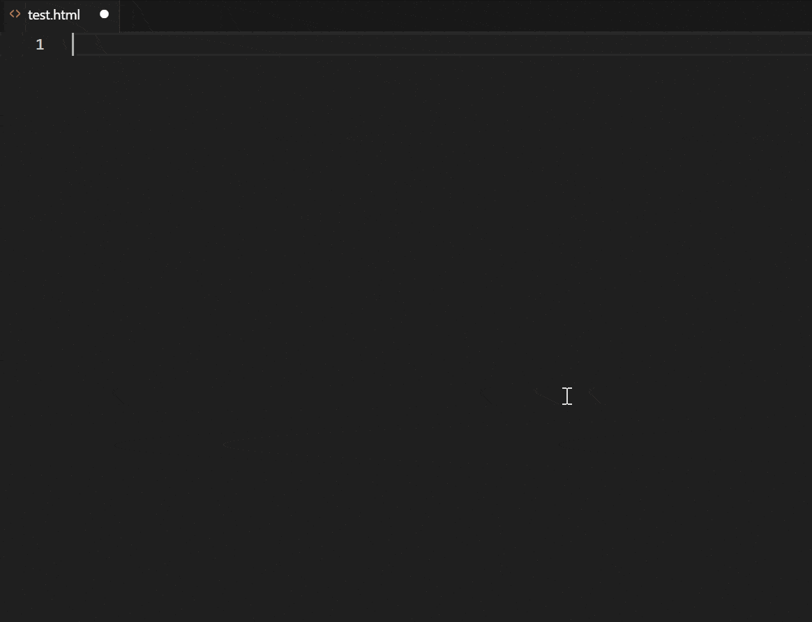
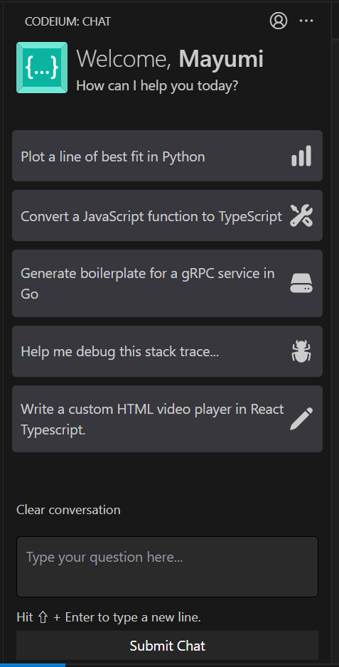
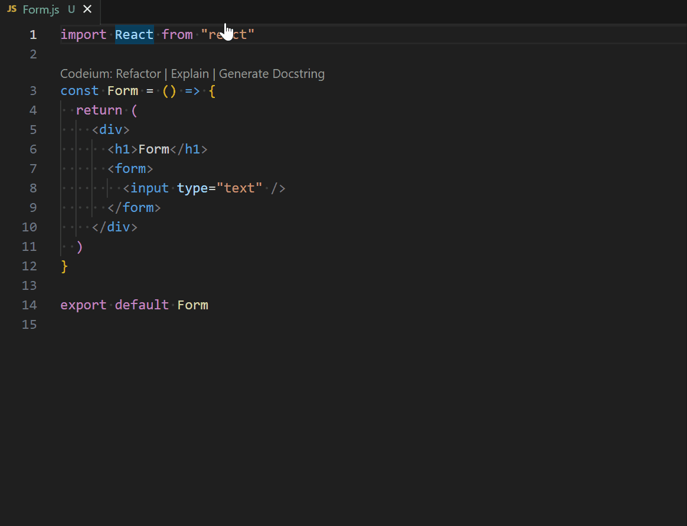

Cette année est dominée par ChatGPT et d'autres sujets relatifs à l'aide à la programmation de l'IA.

Dans cet article, j'aimerais présenter [**Codeium**](https://codeium.com/), une extension de complétion de code pour les IDE (environnements de développement intégrés). Codeium suggère les meilleurs candidats à la complétion de code en fonction de votre style de codage et du contexte.

J'ai commencé à utiliser Codeium le mois dernier pour surfer sur la vague du codage IA. Il est très facile à utiliser et je suis très satisfaite et impressionnée. Et surtout, Codeium est gratuit. Essayez-le !

## Aperçu du Codeium et comparaison avec d'autres services

### Qu'est-ce que le Codeium ?

Codeium est une extension d'aide au codage IA pour les IDE comme VS Code ou JetBrains.

Tout d'abord, voyons comment cela fonctionne. Le texte en italique gris est la suggestion de Codeium. Je n'ai fait que taper le tout premier `!`, `<header>`, la touche d'Enter et la touche de Tab pour confirmer.

Codeium est développé par l'équipe d'[Exafunction](https://exafunction.com/), une société américaine fondée en 2021 qui développe une plateforme accélérée pour l'apprentissage profond. Il a levé 25 millions de dollars en financement de série A auprès de Greenoaks en 2022.

### Autres services d'aide au codage de l'IA

Les extensions similaires de l'aide au codage comprennent :

- [GitHub Copilot](https://github.com/features/copilot/) (Microsoft)
- [AWS CodeWhisperer](https://aws.amazon.com/jp/codewhisperer/) (Amazon)
- [Tabnine](https://www.tabnine.com/)
- [Replit Ghostwriter](https://replit.com/site/ghostwriter) seulement sur Replit

Dites-moi s'il y en d'autres !

### Caractéristiques et avantages du Codeium

- Il fonctionne assez rapidement
- Entièrement gratuit
- Il n'est pas entraîné par le code sous licence GPL

Les suggestions de code, qui étaient très lentes sur AWS CodeWhisperer, sont très fluides sur ce Codeium. Cependant, AWS Code Whisperer vient d'être lancé en avril 2023, il se peut donc que le serveur périphérique ne soit pas encore au Japon (où je suis).

#### "pas entraîné par le code sous licence GPL" signifie...

Bien que l'on s'inquiète du fait que GitHub Copilot utilise du code sous licence GPL dans ses propositions et crée par conséquent un risque de violation de la licence GPL pour les entreprises qui utilisent ce code*, Codeium a déclaré qu'il n'utiliserait pas de code sous licence GPL dans son apprentissage de l'IA. *Un filtre peut être activé pour afficher les suggestions (désactivé par défaut).

Lien - [GitHub Copilot Emits GPL. Codeium Does Not.](https://codeium.com/blog/copilot-trains-on-gpl-codeium-does-not)

### Langues supportées

Codeium prend en charge 70+ langues (dans l'extrait ci-dessous, 62) en date du 13 mai 2023.

> Assembly, C, C++, C#, Clojure, CMake, COBOL, CoffeeScript, Crystal, CSS, CUDA, Dart, Delphi, Dockerfile, Elixir, Erlang, F#, Fortran, Go, Gradle, Groovy, Haskell, HCL, HTML, Java, JavaScript, Julia, JSON, Kotlin, LISP, Less, Lua, Makefile, MATLAB, Objective-C, OCaml, pbtxt, PHP, Protobuf, Python, Perl, PowerShell, R, Ruby, Rust, SAS, Sass, Scala, SCSS, shell, Solidity, SQL, Starlark, Swift, Svelte, TypeScript, TeX, TSX, VBA, Vimscript, Vue, YAML
> <cite>[What programming languages do you support? | Codeium](https://codeium.com/faq)</cite>

Pour les autres services, vous pouvez trouver les langues supportées ci-dessous :

- GitHub Copilot: [GitHub language support](https://docs.github.com/en/enterprise-cloud@latest/get-started/learning-about-github/github-language-support)
- Tabnine: [How many languages does Tabnine support?](https://support.tabnine.com/hc/en-us/articles/5755707074961-How-many-languages-does-Tabnine-support-)
- AWS CodeWhisperer: [Language and IDE support in Amazon CodeWhisperer](https://docs.aws.amazon.com/codewhisperer/latest/userguide/language-ide-support.html#language-support)

## Utilisation de Codeium

### Affichage et sélection des codes candidats

La suggestion de code apparaît automatiquement au fur et à mesure que vous tapez.

Il vous suffit d'appuyer sur la touche de tabulation lorsque vous êtes satisfait et de confirmer.

Codeium apprend également comment vous nommez les constantes ou les noms de classe. Une fois que vous avez nommé les premiers, Codeium vous proposera les noms suivants.

### Chat AI

Codeium dispose également d'une fonction de chat, comme ChatGPT. Des boutons tels que "Plot a line of best fit in Python", "Convert a JavaScript function to TypeScript", etc. sont également disponibles.

Son interface est en anglais, mais j'ai pu lui parler en japonais et en français.

## Codeium Demo

Ce qui suit est une animation gif lorsque j'ai testé l'écriture d'un composant de formulaire en React.

Nous devons maintenant cliquer sur l'onglet de confirmation...

## Résumé et impressions

Même si je n'ai utilisé Codeium que pour React ou parfois Python, c'est trop pratique.

Et c'est gratuit.

J'aime toujours payer pour des services si cela contribue à la qualité du travail, mais je ne déteste pas la gratuité.

Codeium m'a beaucoup aidée lorsque j'ai migré ce blog multilingue de Next.js à Gatsby.js !

Ce que j'espère, c'est que Google vise à l'acheter, puisqu'ils n'ont pas encore publié de code d'assistance à l'IA.

### Liens

- [Codeium](https://codeium.com/)
- [@codeiumdev - Twitter](https://twitter.com/codeiumdev)
