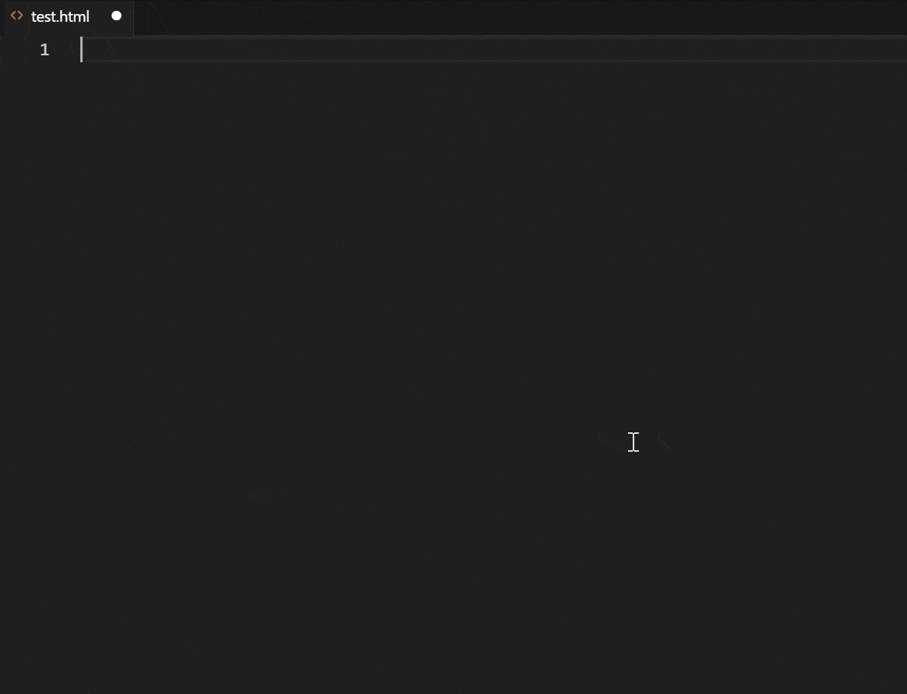

今年はChatGPTをはじめとする、AIによるプログラミングサポートの話題が席巻していますね。

このエントリーで紹介するのは、IDE（統合開発環境）向けのAIコード補完拡張機能「[**Codeium**](https://codeium.com/)」（コーディウム）です。Codeiumは自分のコーディングスタイルや文脈に合わせて、最適なコード補完候補を提案してくれます。

私もAIコーディングの波に乗るべく、先月からCodeiumを使い始めました。非常に使い心地が良く、満足を通り越して感動です。何よりもCodeiumは無料です。良かったら是非お試しください。

## Codeiumの概要と他のサービスとの比較

### Codeiumとは

Codeiumとは、VS CodeやJetBrains等のIDE（統合開発環境）で使える、AIによるコード補完の拡張機能です。

まずは見てください。グレーの斜体文字がCodeiumの提案です。私は最初の`!`、`<header>`、改行とTabキーしか打っていません。

Codeiumは2021年設立の米[Exafunction](https://exafunction.com/)社が開発しています。Exafunction社はディープラーニングの高速プラットフォームの開発スタートアップ企業で、2022年にGreenoaksから2,500万ドルのシリーズA資金を調達しています。

### 他のAIコード補完の拡張機能サービス

類似のコーディングサポート拡張機能としては、以下が挙げられます。

- [GitHub Copilot](https://github.com/features/copilot/) | コパイロット（Microsoft）
- [AWS CodeWhisperer](https://aws.amazon.com/jp/codewhisperer/) | コードウィスパラー（Amazon）
- [Tabnine](https://www.tabnine.com/) | タブナイン
- [Replit Ghostwriter](https://replit.com/site/ghostwriter) | ゴーストライター ※Replitのみ

他にもあったら教えてください。

### Codeiumの特徴とメリット

- コード提案が迅速
- 完全無料
- GPLライセンスコードでトレーニングされていない

AWS CodeWhispererでは非常に低速だったコード提案も、このCodeiumでは非常にスムーズです。ただ、AWS Code Whispererは2023年4月にリリースされたばかりなので、エッジサーバーがまだ日本にないだけなのかもしれません。

#### 「GPLライセンスコードでトレーニングされていない」とは

GitHub CopilotがGPLライセンスのコードを提案に使い、結果としてそのコードを使った企業にGPLライセンス違反のリスクを発生させる懸念がある（※）のに対して、CodeiumはAIのトレーニングにGPLライセンスのコードを使用しないことを宣言しています。※フィルターをオンにして提案を表示させることも可能（デフォルトではオフ）

リンク - [GitHub Copilot Emits GPL. Codeium Does Not.](https://codeium.com/blog/copilot-trains-on-gpl-codeium-does-not)

### Codeiumのサポート言語

2023年5月13日時点でのCodeiumのサポート言語は公称70以上だそうです（以下抜粋では62）。

> Assembly, C, C++, C#, Clojure, CMake, COBOL, CoffeeScript, Crystal, CSS, CUDA, Dart, Delphi, Dockerfile, Elixir, Erlang, F#, Fortran, Go, Gradle, Groovy, Haskell, HCL, HTML, Java, JavaScript, Julia, JSON, Kotlin, LISP, Less, Lua, Makefile, MATLAB, Objective-C, OCaml, pbtxt, PHP, Protobuf, Python, Perl, PowerShell, R, Ruby, Rust, SAS, Sass, Scala, SCSS, shell, Solidity, SQL, Starlark, Swift, Svelte, TypeScript, TeX, TSX, VBA, Vimscript, Vue, YAML
> <cite>[What programming languages do you support? | Codeium](https://codeium.com/faq)</cite>

その他のサービスについてのサポート言語は以下のサイトに掲載されています。

- GitHub Copilot: [GitHub language support](https://docs.github.com/en/enterprise-cloud@latest/get-started/learning-about-github/github-language-support)
- Tabnine: [How many languages does Tabnine support?](https://support.tabnine.com/hc/en-us/articles/5755707074961-How-many-languages-does-Tabnine-support-)
- AWS CodeWhisperer: [Language and IDE support in Amazon CodeWhisperer](https://docs.aws.amazon.com/codewhisperer/latest/userguide/language-ide-support.html#language-support)

## Codeiumの使い方

### コードの候補の表示と選択

コードを打っていると、自動でコードの候補が表示されます。

表示されたコードを採用する場合は、そのままTabキーを押すだけです。

また、定数・変数の命名パターンも読み取ってくれるので、ひとつ定数・変数名をつければ次の定数・変数名の提案もしてくれます。

### チャット機能

ChatGPTのような、チャット機能もついています。「Pythonのラインを最適化する」「JavaScriptをTypeScriptに変換する」などのボタンも用意。

インターフェイスは英語ですが、日本語でのチャットも可能です。

## Codeiumのデモ動画

Reactでフォームコンポーネントを作ってみたGIFです。

確認タブを押すこと以外、ほとんどやることがなくなりますね・・・。

## まとめと感想

私は基本的にReactでのフロントエンドの開発や、ごくたまにPythonでしか使っていませんが、非常に快適です。

**何より無料なのが素晴らしい。**

もちろん、生産性が上がるのなら有料サービスに課金することもやぶさかではありませんが、無料が嫌いなわけではありません。

私はつい先日、このサイトをNext.jsからGatsby.jsに作り替えましたが、もちろんこのCodeiumは大活躍しました！

まだコードアシストAIをリリースしていないGoogleに買収されないことを願うばかりです（ありえそうで怖い）。

### リンク

- [Codeium](https://codeium.com/)
- [@codeiumdev - Twitter](https://twitter.com/codeiumdev)
