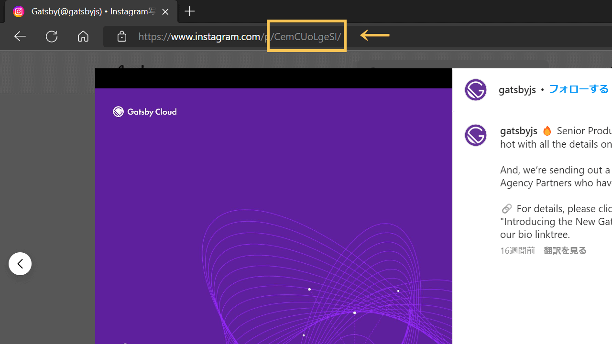

This is how to embed Instagram (or Twitter) to Markdown files without any plugins or libraries.

In general, their embed code doesn't work in Markdown as Markdown ignores `<script>` tags. Thus, we need some kind of idea.

## Option1: Copy & paste from HTML result

- No script is needed
- Cumbersome

Yes, it's cumbersome but it's lighter because no script tag would be used. Prepare an easy html file and paste the official embed code, then look up the output.

It would be an easier way if it doesn't happen very often.

### Prepare an easy HTML file

Just make an almost empty HTML file.

```html
<!Doctype html>
<html>
  <head>
  <title>TEST</title>
  </head>
  <body>
    We are going to put content here.
  </body>
</html>
```

Inside the `<body>`tag, paste the embed code you want to use in Markdown.

***

Note📖: Because the script `src` of the embed code is

`//www.instagram.com/embed.js`,

it wouldn't be loaded if you output it in local. In that case, rewrite it to:

`https://www.instagram.com/embed.js`

(note: end)

***

Open the HTML file in your browser, and check its code with F12.

Then, copy `iframe` of the instagram post.


Once you copied it, just paste it into your Markdown file. That's it.

It would be displayed like as follows;

<iframe class="instagram-media instagram-media-rendered" id="instagram-embed-0" src="https://www.instagram.com/p/CemCUoLgeSI/embed/captioned/?cr=1&amp;v=14&amp;wp=810&amp;rd=file%3A%2F%2F&amp;rp=%2FC%3A%2FUsers%2Fharab%2FOneDrive%2F%25E3%2583%2589%25E3%2582%25AD%25E3%2583%25A5%25E3%2583%25A1%25E3%2583%25B3%25E3%2583%2588%2FExcelPython%2Ftest.html#%7B%22ci%22%3A0%2C%22os%22%3A209.19999998807907%2C%22ls%22%3A121.59999999403954%2C%22le%22%3A199.19999998807907%7D" allowtransparency="true" allowfullscreen="true" frameborder="0" height="937" data-instgrm-payload-id="instagram-media-payload-0" scrolling="no" style="background: white; max-width: 540px; width: calc(100% - 2px); border-radius: 3px; border: 1px solid rgb(219, 219, 219); box-shadow: none; min-width: 326px; padding: 0px;"></iframe>

Of course, we don't need to embed any `<script>` tags anywhere.

## Option2: Load script inside head tag

- `script` would be loaded in all the pages unless with routing condition
- Once it's set, it would be easy afterword

Because script is loaded inside `<head>` in this case, it affects loading time in all the pages unless with routing condition.

So, this option must be for the case the embed happens very often.

### Load the Instagram script code

Add Instagram embed script to `_app.js` for Next.js, or `gatsby-ssr.js` for Gatsby.js

#### for Next.js

<div class="filename">/pages/_app.js</div>

```js
import 'styles/globals.css'
import Layout from 'components/layout'

function MyApp({ Component, pageProps }) {
  return (
    <>
      <script async src="https://www.instagram.com/embed.js" />
      <Layout>
        <Component {...pageProps} />
      </Layout>
    </>
  )
}

export default MyApp
```

#### for Gatsby.js

<div class="filename">gatsby-ssr.js</div>

```js
const React = require("react")

const HeadComponents = [
  <script async src="https://www.instagram.com/embed.js" key="instagram" />,
]

exports.onRenderBody = ({
  setHeadComponents,
}) => {
  setHeadComponents(HeadComponents)
}
```

In case of Gatsby.js, `key` is required; `key` can be any string but duplication isn't allowed like as `.map()`.

<span class="label warning">Reference</span> [Gatsby Server Rendering APIs | Gatsby.js](https://www.gatsbyjs.com/docs/reference/config-files/gatsby-ssr/)

### Add iframe code into Markdown content

The general embed code from Instagram returns an `<iframe>` on frontend.

To do so by yourself, copy the code below and replace `[postID]` to post ID. Modify the style as you like (the following style is the one generated by Instagram embed code).

```html
<iframe src="https://www.instagram.com/reel/[postID]/embed/" style=" background: white; max-width: 540px; width: calc(100% - 2px); border-radius: 3px; border: 1px solid rgb(219, 219, 219); box-shadow: none; display: block; margin: 0px 0px 12px; min-width: 326px; padding: 0px;"></iframe>
```

It Instagram post ID can be found by its URL.



## Addition - in case of Twitter

With those methods, twitter post can also be embedded into Markdown files.

If your site is built with Gatsby.js, you can use [their Official Twitter plugin](https://www.gatsbyjs.com/plugins/gatsby-plugin-twitter/). It's useful because the plugin controls the script loading; no script is loaded for the content which doesn't have Twitter embed.