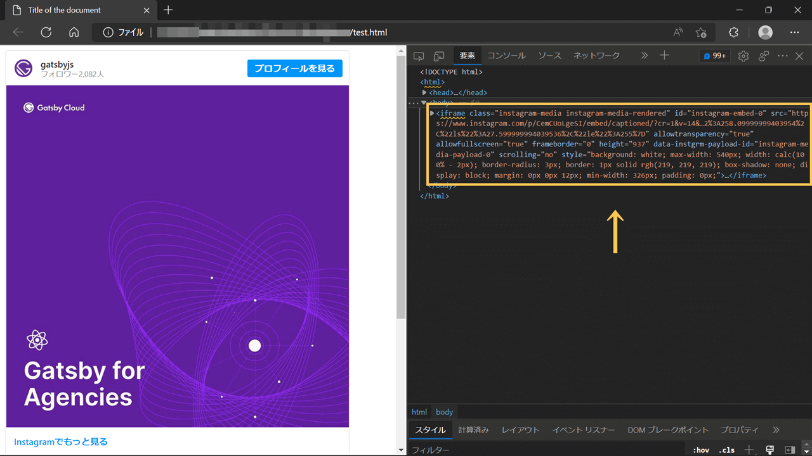
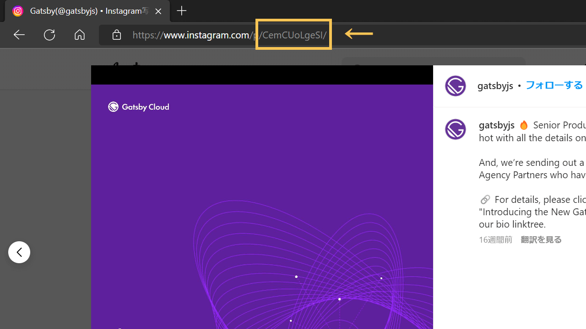

Voici comment intégrer Instagram (ou Twitter) à de fichiers Markdown san aucun plugin ou aucun bibliothèque.

En général, leur code d'intégration ne fonctionne pas dans Markdown car Markdown ignore les balises `<script>`. Ainsi, nous avons besoin d'une sorte d'idée.

## Option1 : Copier & coller à partir du résultat HTML

- Aucune balise de script n'est nécessaire
- Encombrant

Oui, c'est encombrant mais c'est plus léger car aucune balise de script ne sera utilisée. On prépare un fichier html simple et colle le code d'intégration du Instagram, puis regardez le résultat.

Ce serait un moyen plus facile si cela n'arrive pas très souvent.

### Préparer un fichier HTML simple

Il suffit de créer un fichier HTML presque vide.

```html
<!Doctype html>
<html>
  <head>
  <title>TESTE</title>
  </head>
  <body>
    On va mettre le contenu ici.
  </body>
</html>
```

À l'intérieur de la balise `<body>`, collez le code d'intégration que vous voulez utiliser en Markdown.

***

Remarque 📖: Parce que le script `src` du code d'intégration est

`//www.instagram.com/embed.js`,

il ne sera pas chargé si vous l'éditez en local. Dans ce cas, réécrivez-le en :

`https://www.instagram.com/embed.js`

(remarque : fin)

***

Ouvrir le fichier HTML dans un navigateur, et vérifier le code avec F12.

Ensuite, copier `iframe` du post Instagram.



Une fois que vous l'avez copié, il suffit de le coller dans votre fichier Markdown. C'est tout.

Il s'afficherait comme suit ;

<iframe class="instagram-media instagram-media-rendered" id="instagram-embed-0" src="https://www.instagram.com/p/CemCUoLgeSI/embed/captioned/?cr=1&amp;v=14&amp;wp=810&amp;rd=file%3A%2F%2F&amp;rp=%2FC%3A%2FUsers%2Fharab%2FOneDrive%2F%25E3%2583%2589%25E3%2582%25AD%25E3%2583%25A5%25E3%2583%25A1%25E3%2583%25B3%25E3%2583%2588%2FExcelPython%2Ftest.html#%7B%22ci%22%3A0%2C%22os%22%3A209.19999998807907%2C%22ls%22%3A121.59999999403954%2C%22le%22%3A199.19999998807907%7D" allowtransparency="true" allowfullscreen="true" frameborder="0" height="937" data-instgrm-payload-id="instagram-media-payload-0" scrolling="no" style="background: white; max-width: 540px; width: calc(100% - 2px); border-radius: 3px; border: 1px solid rgb(219, 219, 219); box-shadow: none; min-width: 326px; padding: 0px;"></iframe>

Bien sûr, nous n'avons pas besoin d'intégrer de balises `<script>` nulle part.

## Option2 : Charger le script dans la balise head

- `script` serait chargé dans toutes les pages, sauf si la condition de routage est remplie
- Une fois que c'est fixé, ce serait facile après coup

Comme le script est chargé à l'intérieur de `<head>` dans ce cas, cela affecte le temps de chargement de toutes les pages sauf si la condition de routage est remplie.

Donc, cette option doit être pour le cas où l'intégration se produit très souvent.

### Charger le code du script Instagram

Ajouter le script d'intégration d'Instagram à `_app.js` pour Next.js, ou `gatsby-ssr.js` pour Gatsby.js.

#### pour Next.js

<div class="filename">/pages/_app.js</div>

```js
import 'styles/globals.css'
import Layout from 'components/layout'

function MyApp({ Component, pageProps }) {
  return (
    <>
      <script async src="https://www.instagram.com/embed.js" />
      <Layout>
        <Component {...pageProps} />
      </Layout>
    </>
  )
}

export default MyApp
```

#### pour Gatsby.js

<div class="filename">gatsby-ssr.js</div>

```js
const React = require("react")

const HeadComponents = [
  <script async src="https://www.instagram.com/embed.js" key="instagram" />,
]

exports.onRenderBody = ({
  setHeadComponents,
}) => {
  setHeadComponents(HeadComponents)
}
```

Dans le cas de Gatsby.js, `key` est requis ; `key` peut être n'importe quelle chaîne mais la duplication n'est pas autorisée comme `.map()`.

<span class="label warning">Référence</span> [Gatsby Server Rendering APIs | Gatsby.js](https://www.gatsbyjs.com/docs/reference/config-files/gatsby-ssr/)

### Ajouter un code iframe dans un contenu Markdown

Le code d'intégration général d'Instagram renvoie un `<iframe>` sur le frontend.

Pour le faire soi-même, copier le code ci-dessous et remplacer `[postID]` par l'ID du post. Modifiez le style comme vous le souhaitez (le style suivant est celui généré par le code d'intégration Instagram).

```html
<iframe src="https://www.instagram.com/reel/[postID]/embed/" style=" background: white; max-width: 540px; width: calc(100% - 2px); border-radius: 3px; border: 1px solid rgb(219, 219, 219); box-shadow: none; display: block; margin: 0px 0px 12px; min-width: 326px; padding: 0px;"></iframe>
```

L'ID du post Instagram peut être trouvé par son URL.



## Ajout - en cas de Twitter

Grâce à ces méthodes, les posts Twitter peuvent également être intégrés dans des fichiers Markdown.

Si votre site est construit avec Gatsby.js, vous pouvez utiliser [leur plugin Twitter officiel](https://www.gatsbyjs.com/plugins/gatsby-plugin-twitter/). C'est utile car le plugin contrôle le chargement du script ; aucun script n'est chargé pour le contenu qui n'a pas d'intégration Twitter.