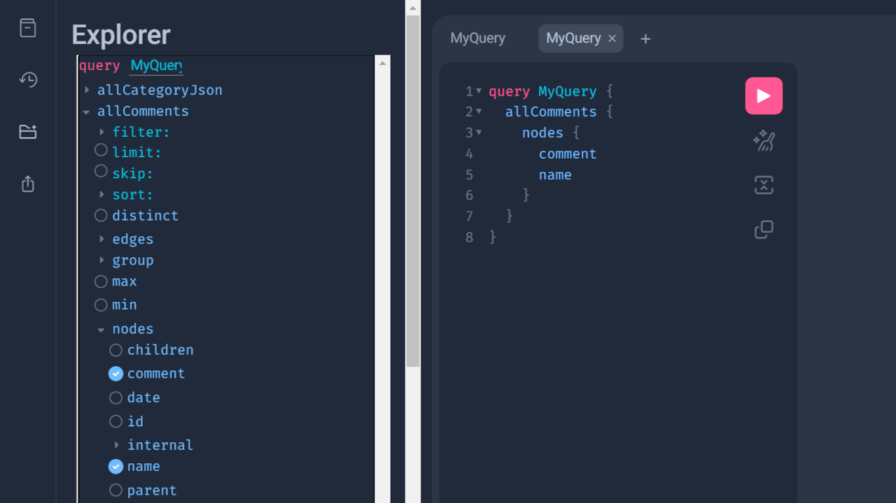
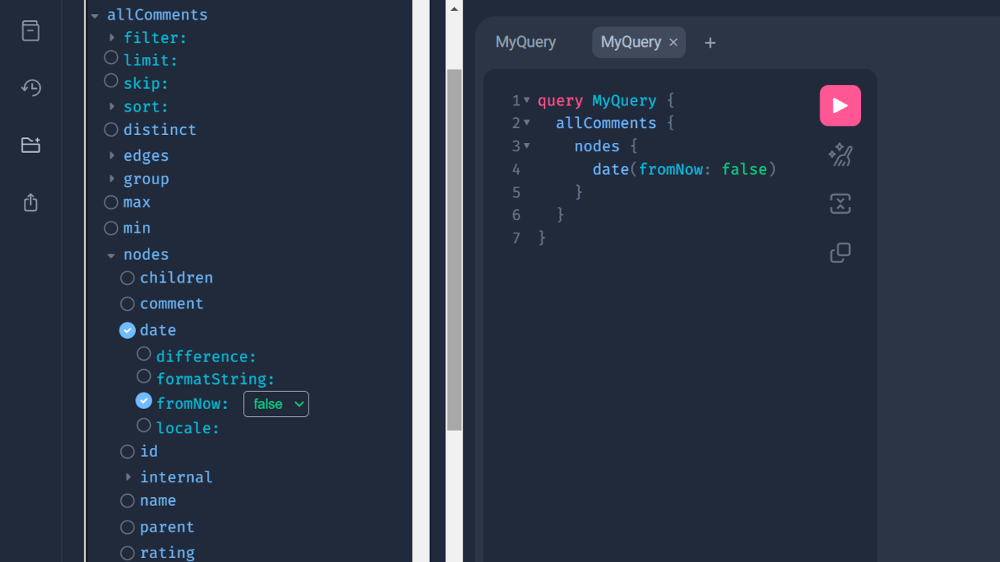
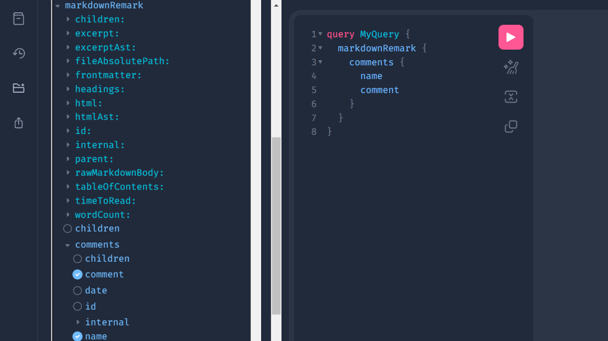

This entry is my notes when I made a review system for a Gatsby.js website with [Google Firebase](https://firebase.google.com/).

Firebase is a platform for application developments and you can store login data, cart data etc. there.

The "Realtime Database," one of Firebase's functions, can read and write data in json format and access data via javascript HTTP requests, making it easy to use for comment systems.

I created a comment system with Firebase Realtime Database for a Gatsby site, but if you devise the display part, it should also work for Next.js sites.

Also, since you can add any input tags you want with the comment system using Firebase, it would be good for e-commerce sites that want to add a review (star rating) function to their products.

*Because I'm not very used to Firebase, any advice would be appreciated if I write something wrong🙇‍♀️

Working environment:

- Node v18.12.1
- React v18.2.0
- Gatsby v5.7.0 / v4.25.0

## Creating a Realtime Database

Please proceed after you register with Firebase.

### Adding a new project

First, add a new project.


The name of the project is up to you. I named it "comments".


As I don't use Google Analytics this time, I disabled Google Analytics here.


Your new project will be ready in ten seconds after you click "Create Project".

### Creating a Realtime Database

Inside your project, create a Realtime Database.


Start in locked mode for your security rules so that nobody can access to your database.


## Preparing to access the Realtime Database

In general, we can access the Realtime Database by adding the json filename to the end of the database URL.

```text
https://[yourproject].firebasedatabase.app/comments.json
```

However, the strict default security rules prevent any access even from admin. So we use the secret key for authentication.

### Checking the secret key

From the top left of the ⚙️ icon, go to "Project Settings" -> "Service Accounts", then to the "Database Secrets" tab. There you will find your secret key.


This secret key, added to the end of the database URL, allows access to the REST API.

```js
fetch(`https://[yourproject].firebasedatabase.app/comments.json?auth=[secret]`)
```

However, the secret keys are treated as legacy on Google Firebase, and it is recommended to use the Firebase Admin SDK to obtain an access token instead.

The access tokens (Google OAuth2 access tokens) can be generated using one of the [Google API client libraries](https://developers.google.com/api-client-library/)* by passing a private key json file of the Realtime Database. *The one for Node.js would be easier for React users.

On the other hand, access tokens expire after a short period of time. This means that you must generate a new access token for each build. Try it if you are motivated.

<span class="label warning">Reference</span> [Authenticate REST Requests | Firebase Realtime Database](https://firebase.google.com/docs/database/rest/auth)

## Creating a comment form component

The following code is the simplest example; I have omitted form validations, a modal window, or a captcha challenge. Add them as needed.

Also, since I built this component for a Gatsby site, I added `GATSBY_FIREBASE_TOKEN` as the environment variable.* Change it as needed.

*Since the comment form submission works on the client side, we need to add a prefix `GATSBY_` for Gatsby or `NEXT_` for Next.js sites.

<div class="filename">/src/components/commentForm.js</div>

```jsx
import React, { useState } from "react"

const CommentForm = (props) => {
  const [enteredRating, setEnteredRating] = useState("")
  const [enteredComment, setEnteredComment] = useState("")
  const [enteredName, setEnteredName] = useState("")
  const [enteredEmail, setEnteredEmail] = useState("")

  const submitHandler = (event) => {
    event.preventDefault()
    const dburl = `https://[yourproject].firebasedatabase.app/comments.json?auth=${process.env.GATSBY_FIREBASE_TOKEN}`

    const response = await fetch(dbUrl, {
      method: "POST",
      body: JSON.stringify({
        slug: props.slug, // post slug
        name: enteredName,
        email: enteredEmail,
        rating: Number(enteredRating),
        comment: `<p>${enteredComment
          .replaceAll("\n\n", "</p><p>")
          .replaceAll("\n", "<br />")}</p>`,
        date: new Date().toISOString(),
        approved: false,
      }),
    })

    if (!response.ok) {
      return
    }

    setEnteredRating("")
    setEnteredComment("")
    setEnteredName("")
    setEnteredEmail("")
  }

  return (
    <form id="commentform" onSubmit={submitHandler}>
      <label htmlFor="rating">
        Rating
        <fieldset id="rating">
          <input
            type="radio"
            id="p-rating_5"
            name="rating"
            defaultValue={5}
            checked={enteredRating === "5"}
            required
          />
          <label htmlFor="p-rating_5">5</label>
          <input
            type="radio"
            id="p-rating_4"
            name="rating"
            defaultValue={4}
            checked={enteredRating === "4"}
          />
          <label htmlFor="p-rating_4">4</label>
          <input
            type="radio"
            id="p-rating_3"
            name="rating"
            defaultValue={3}
            checked={enteredRating === "3"}
          />
          <label htmlFor="p-rating_3">3</label>
          <input
            type="radio"
            id="p-rating_2"
            name="rating"
            defaultValue={2}
            checked={enteredRating === "2"}
          />
          <label htmlFor="p-rating_2">2</label>
          <input
            type="radio"
            id="p-rating_1"
            name="rating"
            defaultValue={1}
            checked={enteredRating === "1"}
          />
          <label htmlFor="p-rating_1">1</label>
        </fieldset>
      </label>
      <label htmlFor="comment">
        Comment
        <textarea
          id="comment"
          name="comment"
          maxLength={1000}
          required
          value={enteredComment}
        />
      </label>
      <label htmlFor="author">
        Your name
        <input
          id="author"
          name="name"
          type="text"
          required
          value={enteredName}
        />
      </label>
      <label htmlFor="email">
        Your e-mail
        <input
          id="email"
          name="email"
          type="email"
          required
          value={enteredEmail}
        />
      </label>
      <button type="submit">Submit</button>
    </form>
  )
}

export default CommentForm
```

### Points of the above code

1. Using `useState` to get input values.
2. Getting `slug` of the single page through `props`.
3. Sending input values with body key to the Realtime Database with `submitHandler` on form submission.
4. Sending the `approved` key (default `false`) at the same time, so that we can review the comments before they are displayed.
5. Reset all input values after submission.

There is nothing very difficult, just `useState` and a submit handler, which are the basics of React.

In most practical cases, many things would be required, such as input validations, a captcha challenge, a modal function after comment submission, and so on.

Inside the single page template. Pass the page `slug' to the component so that we know which page the comment was submitted to.

<div class="filename">/src/templates/singlePage.js</div>

```js
import React from 'react'
import CommentForm from '../components/commentForm'
...

const SinglePage = () => {
  ...
  return (
    ...
    <CommentForm slug={`your post slug`} />
    ...
  )
}

export default SinglePage
```

## Retrieve the comments from the Realtime Database

This time I'm using Gatsby.js as the frontend framework.

Gatsby.js allows us to generate a new GraphQL schema by adding some code to `gatsby-node.js`.

So we won't send an HTTP request inside the single page template, but add code to generate a comments schema in `gatsby develop` or `gatsby build`.

### Adding comments schema to GraphQL

<div class="filename">gatsby-node.js</div>

```js
require("dotenv").config({
  path: `.env.${process.env.NODE_ENV}`,
})

const fetch = require("node-fetch")

exports.sourceNodes = async ({
  actions: { createNode },
  createContentDigest,
  createNodeId,
}) => {
  const response = await fetch(
    `https://[yourproject].firebasedatabase.app/comments.json?auth=${process.env.FIREBASE_TOKEN}`
  )
  const data = await response.json()

  Object.entries(data).map(([key, value]) => {
    value.approved && // if approved is true
      createNode({
        id: key,
        date: value.date,
        name: value.name,
        comment: value.comment,
        rating: value.rating,
        slug: value.slug,
        parent: null,
        children: [],
        internal: {
          type: "Comments",
          contentDigest: createContentDigest(value),
        },
      })
  })
}
```

After adding the above code to `gatsb-node.js`, run `gatsby develop`. You can see the comments data on the GraphQL.



In this case, the email is not reflected in GraphQL for display purposes. We can save build time by not generating unnecessary schemas.

### Adding date formatting arguments

In my experience, Gatsby v4 automatically enables date formatting arguments, but Gatsby v5 doesn't.

If you want to add date formatting arguments to the comment date value, add the following code to `gatsby-node.js`.

<div class="filename">gatsby-node.js</div>

```js
exports.createSchemaCustomization = ({ actions }) => {
  const { createTypes } = actions
  const typeDefs = `
  type Comments implements Node {
    date: Date @dateformat
  }
  `
  createTypes(typeDefs)
}
```

Then the date format arguments become available.



### Connecting comments and posts

In addition, if a comment scheme is associated with each post, comment numbers or star ratings can be displayed on archive pages. The common element between posts and comments is the slug, so each matching `slug` should be linked together.

There are several functions to connect two schemas, I used [createResolvers](https://www.gatsbyjs.com/docs/reference/config-files/gatsby-node/#createResolvers) in this case.

*Below is an example where the site content is managed in Markdown. If you are using a headless CMS, replace `MarkdownRemark` or filter with appropriate ones.

<div class="filename">gatsby-node.js</div>

```js
exports.createResolvers = ({ createResolvers }) => {
  const resolvers = {
    MarkdownRemark: {
      comments: {
        type: ["Comments"],
        resolve: async (source, args, context, info) => {
          const { comments } = await context.nodeModel.findAll({
            query: {
              filter: {
                slug: { eq: source.frontmatter.slug },
              },
            },
            type: "Comments",
          })
          return comments
        },
      },
    },
  }
  createResolvers(resolvers)
}
```

Run `gatsby develop` after adding the above code. Now you should see comments inside of the post schema.



## Migrating comments from your current commenting system

Since we can import json data into the Realtime Database, it's possible to migrate from other commenting systems if you can prepare current comments json data.

For example, prepare the current comments as follows;

<div class="filename">comments.json</div>

```json
{
  "comments": {
    "0": {
      "date": "2022-08-29T00:00:00:000Z",
      "email": "test0@example.com",
      "comments": "<p>It was so delicious!</p>",
      "name": "John Smith",
      "rating": 4,
      "slug": "honey00",
      "approved": true
    },
    "1": {
      "date": "2023-01-30T00:00:00:000Z",
      "email": "test1@example.com",
      "comments": "<p>I liked it!</p>",
      "name": "Tom",
      "rating": 5,
      "slug": "flower01",
      "approved": true
    }
  }
}
```

To import your json data, go to the top page of the Realtime Database and click on the three-dot icon.


## Conlcusion (and other things to do)

This is just an idea if you're not happy with Disqus or other commenting systems.

Since these codes contain only basic functions, there is still a lot to do before launch;

- [Getting the client IP](/en/post/get-ip-react/)
- Captcha challenge
- [e-mail validation](/en/post/email-validation/)
- Notification of new comments
- Add like button to every comment
- Add a reply system

Also, in this case, we have to approve every comment on Firebase by hand. You may need to develop a different UI page for comments if you find this cumbersome.

I had personally used [Yotpo](https://www.yotpo.com/) as a review system. There are other review system services out there (they usually offer a free tier). It would be much easier to consider them if you're not so motivated to develop your own rating system.