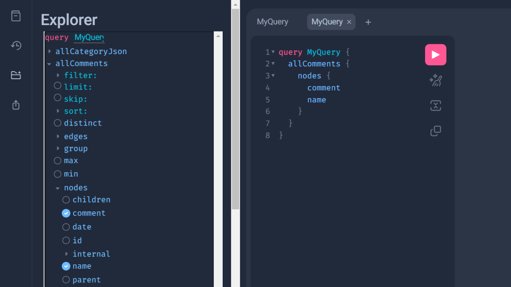
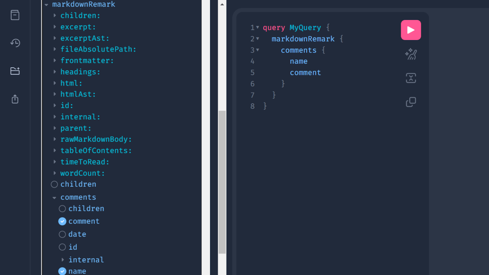

Gatsby.jsサイト用に[Google Firebase](https://firebase.google.com/)を使ってコメントシステムを作った際の、備忘録です。

Firebaseとは、アプリ開発用のプラットフォームで、ログインシステムやカートシステム等のデータを格納したり読み書きが出来る機能を提供しています。

Firebaseの機能の一つである「Realtime Database」は、json形式でデータを読み書き出来る上、javascriptのHTTPリクエスト等でデータにアクセス出来るため、コメントシステムにも使いやすいかと思います。

私がFirebaseのRealtime Databaseでコメントシステムを作ったのはGatsbyサイト用でしたが、表示部分を工夫すればNext.js等でも使えるはずです。

また、Firebaseを利用したコメントシステムでは**入力項目が自由に設定出来る**ため、製品にレビュー（星評価）機能をつけたいECサイト用にもいいかと思います。

※私自身はFirebaseに明るいとはとても言えないレベルのため、間違いや改善点がありましたら何なりとご指摘下さい🙇‍♀️

動作環境:

- Node v18.12.1
- React v18.2.0
- Gatsby v5.7.0 / v4.25.0

## Realtime Databaseでデータベースを作る

Firebaseには既に登録済みという前提で進めます。

### プロジェクトの作成

まずは新しいプロジェクトを作成。


プロジェクト名は自由です。今回は「comments」としました。


今回はGoogle Analyticsは使わないので、アナリティクスとの連携はオフにしています。


「プロジェクトの作成」ボタンをクリックすると、10秒もかからずプロジェクトが作成されます。

### Realtime Databaseの作成

プロジェクトの中に、Realtime Databaseというデータベースを作成します。


セキュリティルールは「ロックモードで開始」でかまいません。


## Realtime Databaseに接続する準備

Realtime Databaseでは、データベースのURLの末尾にjsonファイル名を指定するだけで、データベースの中身にアクセスが出来ます。

```text
https://[yourproject].firebasedatabase.app/comments.json
```

一方、セキュリティルールの初期設定（readとwriteともfalse）のままでは管理者でも何もできないため、「シークレット」キーを認証キーとして使います。

### シークレットキーを確認

トップの⚙️アイコンから、「プロジェクトの設定」→「サービスアカウント」タブ「Database Secrets」で、シークレットを確認します。


このシークレットが認証AUTHとなり、`fetch()`内のHTTPリクエスト用URLの末尾に追加することで、Firebase のREST APIへアクセスが出来るようになります。

```js
fetch(`https://[yourproject].firebasedatabase.app/comments.json?auth=[secret]`)
```

ただ、このシークレットキーはGoogle Firebase上ではレガシー扱いとなっており、Firebase Admin SDKを使用してアクセストークンを取得することが推奨されています。

アクセストークンはRealtime Databaseの「秘密鍵」を生成した上で、[Google APIクライアントライブラリ](https://developers.google.com/api-client-library/)を利用して発行出来ます。（Node.js版を使うのが楽でしょうか。）

一方、この方法で発行できるアクセストークンは短時間で無効になってしまうため、ビルドの度にアクセストークン取得用ファイルを実行する必要があり、難易度が上がります。出来る方はチャレンジしてみて下さい。

<span class="label warning">参考</span> [REST リクエストの認証 | Firebase Realtime Database](https://firebase.google.com/docs/database/rest/auth?hl=ja)

## 投稿フォームのコンポーネントの作成

以下のコードは、説明のためにフォームバリデーションなどを省略するなど、かなり簡略化しています。実際の場合では実装して下さい。

また、今回はGatsby.jsでの実装のため、環境変数は`GATSBY_FIREBASE_TOKEN`としています（※）。必要に応じて変更して下さい。

※クライアント側で実行する場合の環境変数は、Gatsbyなら「GATSBY_」、Next.jsなら「NEXT_」等と接頭辞を付与する必要があります。

<div class="filename">/src/components/commentForm.js</div>

```jsx
import React, { useState } from "react"

const CommentForm = (props) => {
  const [enteredRating, setEnteredRating] = useState("")
  const [enteredComment, setEnteredComment] = useState("")
  const [enteredName, setEnteredName] = useState("")
  const [enteredEmail, setEnteredEmail] = useState("")

  const submitHandler = (event) => {
    event.preventDefault()
    const dburl = `https://[yourproject].firebasedatabase.app/comments.json?auth=${process.env.GATSBY_FIREBASE_TOKEN}`

    const response = await fetch(dbUrl, {
      method: "POST",
      body: JSON.stringify({
        slug: props.slug, // コメントが投稿されたページのスラッグ
        name: enteredName,
        email: enteredEmail,
        rating: Number(enteredRating),
        comment: `<p>${enteredComment
          .replaceAll("\n\n", "</p><p>")
          .replaceAll("\n", "<br />")}</p>`,
        date: new Date().toISOString(),
        approved: false,
      }),
    })

    if (!response.ok) {
      return
    }

    setEnteredRating("")
    setEnteredComment("")
    setEnteredName("")
    setEnteredEmail("")
  }

  return (
    <form id="commentform" onSubmit={submitHandler}>
      <label htmlFor="rating">
        評価
        <fieldset id="rating">
          <input
            type="radio"
            id="p-rating_5"
            name="rating"
            defaultValue={5}
            checked={enteredRating === "5"}
            required
          />
          <label htmlFor="p-rating_5">5</label>
          <input
            type="radio"
            id="p-rating_4"
            name="rating"
            defaultValue={4}
            checked={enteredRating === "4"}
          />
          <label htmlFor="p-rating_4">4</label>
          <input
            type="radio"
            id="p-rating_3"
            name="rating"
            defaultValue={3}
            checked={enteredRating === "3"}
          />
          <label htmlFor="p-rating_3">3</label>
          <input
            type="radio"
            id="p-rating_2"
            name="rating"
            defaultValue={2}
            checked={enteredRating === "2"}
          />
          <label htmlFor="p-rating_2">2</label>
          <input
            type="radio"
            id="p-rating_1"
            name="rating"
            defaultValue={1}
            checked={enteredRating === "1"}
          />
          <label htmlFor="p-rating_1">1</label>
        </fieldset>
      </label>
      <label htmlFor="comment">
        コメント
        <textarea
          id="comment"
          name="comment"
          maxLength={1000}
          required
          value={enteredComment}
        />
      </label>
      <label htmlFor="author">
        お名前
        <input
          id="author"
          name="name"
          type="text"
          required
          value={enteredName}
        />
      </label>
      <label htmlFor="email">
        メールアドレス
        <input
          id="email"
          name="email"
          type="email"
          required
          value={enteredEmail}
        />
      </label>
      <button type="submit">送信する</button>
    </form>
  )
}

export default CommentForm
```

### 上記コードのポイント

1. フォームの入力値を取得するために、Reactフックの`useState`を利用
2. コメントが投稿されたページの判断のために、`props`から`slug`を取得しておく
3. 送信ボタンを押した時に、`submitHandler`関数を発火させる。その中で、HTTPリクエストのPOSTを使って、取得した入力値をbody要素としてRealtime Databaseに送信
4. `approved`キー（初期値`false`）をbody内で同時に送信し、Firebase上で`true`にすることでコメント承認
5. 送信後は入力値をリセット（空欄に戻す）

フォーム自体は、Reactの基本であるuseStateとサブミットハンドラを使ったものです。

実際の場面ではこれに加えて、入力値のバリデーション（検証）、reCaptchaチャレンジ、送信後のモーダル表示（「コメントが送信されました」等）などを実装することになると思います。

このフォームコンポーネントを個別の投稿ページや製品ページ等に設置。フォームコンポーネントに`slug`を渡すことで、どのページに投稿があったかを記録します。

<div class="filename">/src/templates/singlePage.js</div>

```js
import React from 'react'
import CommentForm from '../components/commentForm'
...

const SinglePage = () => {
  ...
  return (
    ...
    <CommentForm slug={`ページのslug`} />
    ...
  )
}

export default SinglePage
```

## 投稿内容の読み取り

今回はフロントエンドのフレームワークとして、Gatsbyを使用します。

Gatsby.jsでは`gatsby-node.js`内にコードを追加することによって、外部APIからGraphQLを生成することが可能です。

そのため、テンプレート内でのHTTPリクエストはせず、`gatsby develop`または`gatsby build`の際にクエリを生成するコードを追加します。

### コメント内容をGraphQLに追加する

<div class="filename">gatsby-node.js</div>

```js
require("dotenv").config({
  path: `.env.${process.env.NODE_ENV}`,
})

const fetch = require("node-fetch")

exports.sourceNodes = async ({
  actions: { createNode },
  createContentDigest,
  createNodeId,
}) => {
  const response = await fetch(
    `https://[yourproject].firebasedatabase.app/comments.json?auth=${process.env.FIREBASE_TOKEN}`
  )
  const data = await response.json()

  Object.entries(data).map(([key, value]) => {
    value.approved && //approved === trueの場合
      createNode({
        id: key,
        date: value.date,
        name: value.name,
        comment: value.comment,
        rating: value.rating,
        slug: value.slug,
        parent: null,
        children: [],
        internal: {
          type: "Comments",
          contentDigest: createContentDigest(value),
        },
      })
  })
}
```

上記内容を追記した上で`gatsby develop`を実行すると、GraphQLでコメント情報が取得できるようになります。



尚、今回は「投稿者のe-mailを表示しない」という前提で、表示用としてはe-mailをGraphQLに反映させていません。不必要なデータをGraphQLとして生成しなければ、ビルド時間を節約することが出来ます。

### コメントの日付フォーマットオプションを有効にする

Gatsby v4では日付のフォーマットオプション（表示形式編集・今から何日前の表示等）がデフォルトで有効になっていますが、Gatsby v5では追加したスキーマの日付フォーマットのオプションがデフォルトで無効になっているようです。

日付フォーマットのオプションを有効にしたい場合は、`gatsby-node.js`に以下を追記します。

<div class="filename">gatsby-node.js</div>

```js
exports.createSchemaCustomization = ({ actions }) => {
  const { createTypes } = actions
  const typeDefs = `
  type Comments implements Node {
    date: Date @dateformat
  }
  `
  createTypes(typeDefs)
}
```

これで日付フォーマットのオプションが有効になります。


### コメントを投稿に紐付けする

更に、コメントを各投稿と紐付けすれば、記事一覧ページでもコメント数や星の数を表示することが可能になります。投稿とコメントの共通項はスラッグなので、`slug`が一致するそれぞれを結びつけます。

異なるクエリを紐付けるにはいくつか方法がありますが、今回は[createResolvers](https://www.gatsbyjs.com/docs/reference/config-files/gatsby-node/#createResolvers)を使いました。

※以下はサイトコンテンツがMarkdownで管理されている場合の例です。ヘッドレスCMSからデータを引っ張ってきている場合は、MarkdownRemarkやfilterの部分をよしなに変更して下さい。

<div class="filename">gatsby-node.js</div>

```js
exports.createResolvers = ({ createResolvers }) => {
  const resolvers = {
    MarkdownRemark: {
      comments: {
        type: ["Comments"],
        resolve: async (source, args, context, info) => {
          const { comments } = await context.nodeModel.findAll({
            query: {
              filter: {
                slug: { eq: source.frontmatter.slug },
              },
            },
            type: "Comments",
          })
          return comments
        },
      },
    },
  }
  createResolvers(resolvers)
}
```

`gatsby-node.js`に上記コードを追加した上で`gatsby develop`を実行すると、投稿にコメントが紐付けられているのが確認できます。



## 既存のコメントシステムからの引っ越し

Realtime Databaseはjsonデータのインポートも可能なので、既存のコメントをjsonデータに変換すればコメントシステムをFirebaseに引っ越すことも出来ます。

例えば、今までのコメントを以下のようにまとめます。

<div class="filename">comments.json</div>

```json
{
  "comments": {
    "0": {
      "date": "2022-08-29T00:00:00:000Z",
      "email": "test0@example.com",
      "comments": "<p>とても美味しかったです。</p>",
      "name": "山田太郎",
      "rating": 4,
      "slug": "honey00",
      "approved": true
    },
    "1": {
      "date": "2023-01-30T00:00:00:000Z",
      "email": "test1@example.com",
      "comments": "<p>素敵な商品でした。</p>",
      "name": "佐藤花子",
      "rating": 5,
      "slug": "flower01",
      "approved": true
    }
  }
}
```

Realtime Databaseのトップページ（「データ」タブ）の右の3点マークから、jsonデータがインポート出来ます。


## まとめ（その他課題など）

Disqusなど既存のコメントシステムで満足出来ない場合の代替手段として、Firebaseを使った方法を紹介しました。

今回のコードは動作部分の説明だけですので、コメントシステムとしては入力値のバリデーションも含めて、他にもやることは色々あります。

- [投稿者IPの取得](/ja/post/get-ip-react/)
- reCaptcha等によるボット対策
- [e-mailの有効性確認](/ja/post/email-validation/)
- コメントが投稿された場合は通知が来るようにする
- コメントにいいねボタンをつける
- 返信システムをつける

また、コメント承認がFirebase上で手入力が必要なのもやや不便ではあります。クライアントによっては、コメント用のUIページを別途用意する・・・など、追加の作業が必要になりますね。

ちなみに、レビューと星評価付きのコメントシステムとしては、筆者は[Yotpo](https://www.yotpo.com/)を利用したことがあります。無料枠でもある程度使えるので、高機能を求めるならそちらや類似サービスを使った方が早いですね（当たり前）。