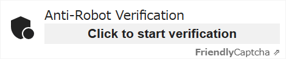
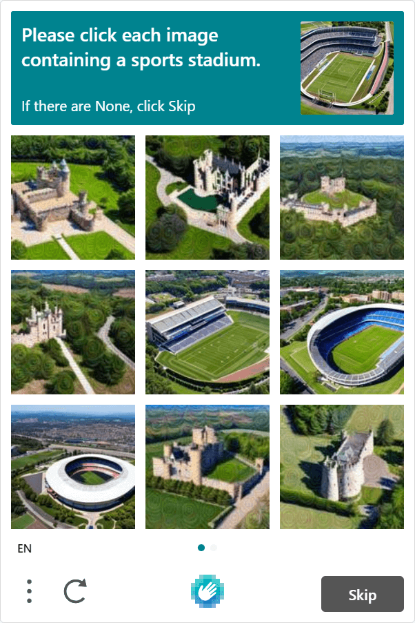

I have been testing several form builders since these days, and came across [Friendly Captcha](https://friendlycaptcha.com/) by chance.

Although Google reCAPTCHA still holds the majority share, new alternatives are trying to reach us recently, such as Cloudflare Turnstile just released last automn.

Friendly Captcha is also the one of the Google reCAPTCHA alternative, an anti-bot challenge for form submission.

## What is Friendly Captcha?

[Friendly Captcha](https://friendlycaptcha.com/) is a privacy friendly anti-bot product that protects online services or websites from spam. It is operated by Interlink, a German company, which means it is GDPR compliant.

Friendly Captcha provides a convinient captcha challenge without image selection using blockchain system.

### Problems with Google reCAPTCHA and other alternatives

The main problem with Google reCAPTCHA is that it doesn't completely eliminate all risks related to GDPR compliance. It doesn't really matter if your business only applies outside of Europe, but if it doesn't, you need to consider it.

As of June 2023, there are several alternatives to Google reCAPTCHA. The numbers below are the monthly request limit included in their free tier (except GeeTest Captcha).

- [Friendly Captcha](https://friendlycaptcha.com/) - this article : 1K
- [Cloudflare Turnstile](https://www.cloudflare.com/products/turnstile/): 1M, beta
- [hCaptcha](https://www.hcaptcha.com/): 1M, or 100K for WAF/DDoS
- [MTCaptcha](https://www.mtcaptcha.com/): 200K
- [BotPoison](https://botpoison.com/): 250
- [mCaptcha](https://mcaptcha.org/): unlimited (open source)
- [GeeTest Captcha](https://www.geetest.com/): paid plans only

I have already tried hCaptcha and Cloudflare Turnstile and found both to be useful. Friendly Captcha is also easy to integrate.

It's good we have a choice now.

## Integrating Friendly Captcha to a React Project

First of all, register to [Friendly Captcha](https://friendlycaptcha.com/) and get your own site key.

### Official library

To use Friendly Captcha in React, install the official instance library.

```bash
# npm
npm install friendly-challenge

# yarn
yarn add friendly-challenge
```

### Create a custom component for React

They provide [an example of a React component](https://docs.friendlycaptcha.com/#/widget_api?id=full-example-in-react-with-react-hooks). The following code is almost identical.

```js
import React, { useEffect, useRef } from "react"
import { WidgetInstance } from "friendly-challenge"

const FriendlyCaptcha = () => {
  const container = useRef()
  const widget = useRef()

  const doneCallback = solution => {
    console.log("Captcha was solved. The form can be submitted.")
    console.log(solution)
  }

  const errorCallback = err => {
    console.log("There was an error when trying to solve the Captcha.")
    console.log(err)
  }

  useEffect(() => {
    if (!widget.current && container.current) {
      widget.current = new WidgetInstance(container.current, {
        startMode: "none", // disable auto start
        doneCallback: doneCallback,
        errorCallback: errorCallback,
        language: "en", // Default is "en". Change this if you prefer other language.
      })
    }

    return () => {
      if (widget.current !== undefined) widget.current.reset()
    }
  }, [container])

  return (
    <div
      ref={container}
      className="frc-captcha"
      data-sitekey={process.env.YOUR_FRC_SITE_KEY}
    />
  )
}

export default FriendlyCaptcha
```

Link - [Full example in React (with React Hooks)| Friendly Captcha](https://docs.friendlycaptcha.com/#/widget_api?id=full-example-in-react-with-react-hooks)

### Disable automatic verification

Friendly Captcha has a feature that automatically starts verification as soon as the page loads.

However, its free plan provides only 1,000 requests per month. If the page with captcha gets more than 1,000 page views per month, it's better to disable the automatic start.

`startMode` values

| value   | verification starts                   |
| ------- | ------------------------------------- |
| "none"  | manually                              |
| "focus" | when one of the input tags is focused |
| "auto"  | on page load                          |

### Client-Side Environment Variable

The `YOUR_FRC_SITE_KEY` in the above code must be a client-side environment variable. That is, the variable must start with `NEXT_` or `GATSBY_`, depending on the framework you are using.

<div class="filename">.env</div>

```bash
# Gatsby.js
GATSBY_FRC_SITE_KEY=123456789

# Next.js
NEXT_FRC_SITE_KEY=123456789

# Astro
PUBLIC_FRC_SITE_KEY=123456789
```

## Impression of Friendy Captcha

Because it's not an iframe, it doesn't affect page speed at all. It's nice that we can choose the language to be displayed.



You may think it's too simple, but you can style it with CSS as you always do (class names are fixed). This means that even the font can be styled.

One thing I feel disappointed is that they don't provide the test key for local validations(\*) and we have to consume the requests of the account.

\*They don't mention anything, but the site key of the demo code on their [home page](https://friendlycaptcha.com/) can work.

### Comparison between hCaptcha and Friendly Captcha (free tier)

|                    | hCaptcha          | Friendly Captcha  |
| ------------------ | ----------------- | ----------------- |
| Image challenge    | ❌ yes            | ✅ no             |
| React library      | ✅ yes (official) | ✅ yes (official) |
| DNS of your site   | ✅ wherever       | ✅ wherever       |
| Number of requests | ✅ 1M             | ❌ 1K             |
| GDPR               | ✅ says compliant | ✅ compliant      |
| Commercial use     | ✅ yes            | ❌ no             |

hCaptcha free plan always requires an image challenge to visitors, like Google reCAPTCHA v2. You need to subscribe to the Enterprise plan to use invisible verification.



Friendly Captcha, on the other hand, doesn't and provides a better user experience.

Each React library is a little different. The one from hCaptcha is a component library and easy to use, but the one from Friendly Captcha is an instance library. This means you have to create a React component yourself when you use Friendly Captcha. (just copy & paste though)

### Comparison between Cloudflare Turnstile and Friendly Captcha (free tier)

|                    | Cloudflare Turnstile            | Friendly Captcha  |
| ------------------ | ------------------------------- | ----------------- |
| Image challenge    | ✅ no                           | ✅ no             |
| React library      | ✅ yes (unofficial)             | ✅ yes (official) |
| DNS of your site   | ❌ Cloudflare only              | ✅ wherever       |
| Number of requests | ✅ 1M                           | ❌ 1K             |
| GDPR               | ❔ better than Google reCAPTCHA | ✅ compliant      |
| Commercial use     | ✅ yes                          | ❌ no             |

To use Cloudflare Turnstile, you must migrate your site to Cloudflare DNS. If you still want to use other DNS, you can't use Cloudflare Turnstile.

With Friendy Captcha, you don't need migrate your site anywhere.

However, Cloudflare Turnstile offers 1 million requests per month (\*) for free. That's a big advantage over Friendly Captcha's 1,000 requests. If you still prefer Friendly Captcha but need more than 1,000 requests, you will have to sing up their Growth plan (39€/month, 5,000 requests).

For Cloudflare Turnstile, there are a few React component open source libraries from third parties. These are easy to implement, like the one from hCaptcha, but still unofficial and not guaranteed for future updates.

## Pros and Cons of Friendly Captcha

According to the comparisons above, I could say pros and cons for Friendly Captcha as follows;

### Pros

- GDPR compliant (German company)
- Easy to integrate
- No image challenge - user friendly
- No iFrame
- No Cloudflare account required
- Can be styled with CSS

### Cons (for free tier)

- No commercial use allowed
- Only 1,000 requests per month
- You need to create a React component yourself
- No trial key provided
- Documents are still not enough

## Conclusion

It is shame that Friendly Captcha doesn't allow commercial use with their free plan, despite its convenience installation. If you still prefer anti-bot captcha, there is no reason to choose it.

However, the biggest advantage of Friendly Captcha is that it's GDPR compliant because it's run by an EU company. It's still risky to use Google reCAPTCHA in Europe, and hCaptcha and Cloudflare Turnstile are operated by US companies, even though they claim their products are GDPR compliant.

For a contact form of a personal website, Friendly Captcha is more than enough. (I use it for this blog, maybe...)

Link - [Friendly Captcha](https://friendlycaptcha.com/)
