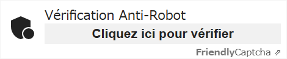
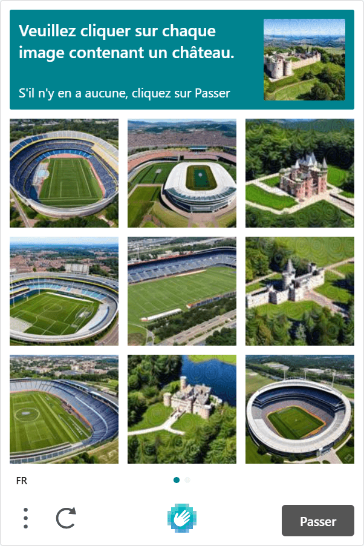

J'ai testé plusieurs constructeurs de formulaires depuis ces derniers jours, et je suis tombée par hasard sur [Friendly Captcha](https://friendlycaptcha.com/).

Bien que Google reCAPTCHA détienne toujours la majorité des parts, de nouvelles alternatives tentent de nous atteindre récemment, comme Cloudflare Turnstile qui vient d'être lancé l'automne dernier.

Friendly Captcha est également l'une des alternatives à Google reCAPTCHA, un défi anti-bot pour la soumission de formulaires.

## Qu'est-ce que Friendly Captcha ?

[Friendly Captcha](https://friendlycaptcha.com/) est un produit anti-bot respectueux de la vie privée qui protège les services en ligne ou les sites web contre le spam. Il est exploité par Interlink, une société allemande, ce qui signifie qu'il est conforme au GDPR.

Friendly Captcha propose un défi captcha convaincant sans sélection d'image en utilisant le système blockchain.

### Problèmes avec Google reCAPTCHA et autres alternatives

Le principal problème de Google reCAPTCHA est qu'il n'élimine pas complètement tous les risques liés à la conformité au GDPR. Cela n'a pas vraiment d'importance si votre activité ne s'applique qu'en dehors de l'Europe, mais si ce n'est pas le cas, vous devez l'envisager.

À partir de juin 2023, il existe plusieurs alternatives à Google reCAPTCHA. Les chiffres ci-dessous correspondent à la limite mensuelle de requêtes incluse dans leur niveau gratuit (à l'exception de GeeTest Captcha).

- [Friendly Captcha](https://friendlycaptcha.com/) - ce billet : 1K
- [Cloudflare Turnstile](https://www.cloudflare.com/products/turnstile/): 1M, beta
- [hCaptcha](https://www.hcaptcha.com/): 1M, ou 100K pour WAF/DDoS
- [MTCaptcha](https://www.mtcaptcha.com/): 200K
- [BotPoison](https://botpoison.com/): 250
- [mCaptcha](https://mcaptcha.org/): illimité (open source)
- [GeeTest Captcha](https://www.geetest.com/): plans payants uniquement

J'ai déjà essayé hCaptcha et Cloudflare Turnstile et j'ai trouvé les deux utiles. Friendly Captcha est également facile à intégrer.

C'est une bonne chose que nous ayons le choix maintenant.

## Intégrer Friendly Captcha à un projet React

Tout d'abord, inscrivez-vous à [Friendly Captcha](https://friendlycaptcha.com/) et obtenez votre propre clé de site.

### Bibliothèque officielle

Pour utiliser Friendly Captcha dans React, installez la bibliothèque officielle de l'instance.

```bash
# npm
npm install friendly-challenge

# yarn
yarn add friendly-challenge
```

### Créer un composant personnalisé pour React

Ils fournissent [un exemple de composant React](https://docs.friendlycaptcha.com/#/widget_api?id=full-example-in-react-with-react-hooks). Le code suivant est presque identique.

```js
import React, { useEffect, useRef } from "react"
import { WidgetInstance } from "friendly-challenge"

const FriendlyCaptcha = () => {
  const container = useRef()
  const widget = useRef()

  const doneCallback = solution => {
    console.log("Captcha was solved. The form can be submitted.")
    console.log(solution)
  }

  const errorCallback = err => {
    console.log("There was an error when trying to solve the Captcha.")
    console.log(err)
  }

  useEffect(() => {
    if (!widget.current && container.current) {
      widget.current = new WidgetInstance(container.current, {
        startMode: "none", // désactiver le démarrage automatique
        doneCallback: doneCallback,
        errorCallback: errorCallback,
        language: "fr", // La valeur par défaut est "en". Modifiez-la si vous préférez une autre langue.
      })
    }

    return () => {
      if (widget.current !== undefined) widget.current.reset()
    }
  }, [container])

  return (
    <div
      ref={container}
      className="frc-captcha"
      data-sitekey={process.env.YOUR_FRC_SITE_KEY}
    />
  )
}

export default FriendlyCaptcha
```

Lien - [Full example in React (with React Hooks)| Friendly Captcha](https://docs.friendlycaptcha.com/#/widget_api?id=full-example-in-react-with-react-hooks)

### Désactiver la vérification automatique

Friendly Captcha dispose d'une fonction qui lance automatiquement la vérification dès le chargement de la page.

Cependant, sa version gratuite ne prévoit que 1 000 requêtes par mois. Si la page avec captcha est consultée plus de 1 000 fois par mois, il est préférable de désactiver le démarrage automatique.

Valeurs de `startMode

| valeur  | la vérification commence                                |
| ------- | ------------------------------------------------------- |
| "none"  | manuellement                                            |
| "focus" | lorsque l'une des balises d'entrée est mise en évidence |
| "auto"  | au chargement de la page                                |

### Variable d'environnement côté client

Le `YOUR_FRC_SITE_KEY` dans le code ci-dessus doit être une variable d'environnement côté client. C'est-à-dire que la variable doit commencer par `NEXT_` ou `GATSBY_`, selon le framework que vous utilisez.

<div class="filename">.env</div>

```bash
# Gatsby.js
GATSBY_FRC_SITE_KEY=123456789

# Next.js
NEXT_FRC_SITE_KEY=123456789

# Astro
PUBLIC_FRC_SITE_KEY=123456789
```

## Impression de Friendy Captcha

Comme il ne s'agit pas d'une iframe, cela n'affecte pas du tout la vitesse de la page. Il est agréable de pouvoir choisir la langue d'affichage.



Vous pouvez penser que c'est trop simple, mais vous pouvez le styliser avec CSS comme vous le faites toujours (les noms de classe sont fixes). Cela signifie que même la police peut être stylisée.

Ce qui me déçoit, c'est qu'ils ne fournissent pas la clé de test pour les validations locales (\*) et que nous devons consommer les requêtes du compte.

\*Ils ne mentionnent rien, mais la clé de site du code de démonstration sur leur [page d'accueil](https://friendlycaptcha.com/) peut fonctionner.

### Comparaison entre hCaptcha et Friendly Captcha (version gratuite)

|                    | hCaptcha          | Friendly Captcha  |
| ------------------ | ----------------- | ----------------- |
| Défi de l'image    | ❌ oui            | ✅ non            |
| Bibliothèque React | ✅ oui (officiel) | ✅ oui (officiel) |
| DNS de votre site  | ✅ n'importe où   | ✅ n'importe où   |
| Nombre de requêtes | ✅ 1M             | ❌ 1K             |
| GDPR               | ✅ dit conforme   | ✅ conforme       |
| Usage commercial   | ✅ oui            | ❌ non            |

La version gratuite de hCaptcha requiert toujours un défi d'image pour les visiteurs, comme Google reCAPTCHA v2. Vous devez souscrire au plan Entreprise pour utiliser la vérification invisible.



Friendly Captcha, en revanche, ne le fait pas et offre une meilleure expérience à l'utilisateur.

Chaque bibliothèque React est légèrement différente. Celle de hCaptcha est une bibliothèque de composants et est facile à utiliser, mais celle de Friendly Captcha est une bibliothèque d'instances. Cela signifie que vous devez créer un composant React vous-même lorsque vous utilisez Friendly Captcha. (il suffit de faire un copier-coller)

### Comparaison entre Cloudflare Turnstile et Friendly Captcha (version gratuite)

|                    | Cloudflare Turnstile          | Friendly Captcha  |
| ------------------ | ----------------------------- | ----------------- |
| Défi de l'image    | ✅ non                        | ✅ non            |
| Bibliothèque React | ✅ oui (unofficial)           | ✅ oui (officiel) |
| DNS de votre site  | ❌ Cloudflare only            | ✅ n'importe où   |
| Nombre de requêtes | ✅ 1M                         | ❌ 1K             |
| GDPR               | ❔ mieux que Google reCAPTCHA | ✅ conforme       |
| Usage commercial   | ✅ oui                        | ❌ non            |

Pour utiliser Cloudflare Turnstile, vous devez migrer votre site vers les DNS de Cloudflare. Si vous voulez toujours utiliser d'autres DNS, vous ne pouvez pas utiliser le Cloudflare Turnstile.

Avec Friendy Captcha, vous n'avez pas besoin de migrer votre site.

Cependant, Cloudflare Turnstile offre 1 million de requêtes par mois (\*) gratuitement. C'est un grand avantage par rapport aux 1 000 requêtes de Friendly Captcha. Si vous préférez toujours Friendly Captcha mais que vous avez besoin de plus de 1.000 requêtes, vous devrez souscrire à leur plan Growth (39€/mois, 5.000 requêtes).

Pour Cloudflare Turnstile, il existe quelques bibliothèques open source de composants React provenant de tiers. Celles-ci sont faciles à mettre en œuvre, comme celle de hCaptcha, mais restent non officielles et ne sont pas garanties pour les futures mises à jour.

## Avantages et inconvénients de Friendly Captcha

D'après les comparaisons ci-dessus, je pourrais dire que les avantages et les inconvénients de Friendly Captcha sont les suivants ;

### Avantages

- GDPR conforme (Entreprise allemande)
- Facile à intégrer
- Pas de challenge d'image - facile à utiliser
- Pas d'iFrame
- Pas de compte Cloudflare nécessaire
- Peut être stylisé avec CSS

### Inconvénients (pour la version gratuite)

- Aucune utilisation commerciale n'est autorisée
- Seulement 1 000 demandes par mois
- Vous devez créer un composant React vous-même
- Aucune clé d'essai n'est fournie
- Les documents ne sont pas encore suffisants

## Conclusion

Il est dommage que Friendly Captcha ne permette pas une utilisation commerciale avec sa version gratuite, malgré sa facilité d'installation. Si vous préférez toujours un captcha anti-bot, il n'y a aucune raison de le choisir.

Cependant, le plus grand avantage de Friendly Captcha est qu'il est conforme au GDPR parce qu'il est géré par une entreprise de l'UE. Il est toujours risqué d'utiliser Google reCAPTCHA en Europe, et hCaptcha et Cloudflare Turnstile sont exploités par des entreprises américaines, même si elles affirment que leurs produits sont conformes au GDPR.

Pour un formulaire de contact d'un site web personnel, Friendly Captcha est plus que suffisant. (Je l'utilise pour ce blog, peut-être...)

Lien - [Friendly Captcha](https://friendlycaptcha.com/)
