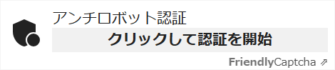
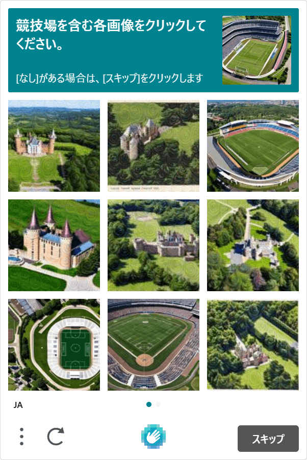

ここ数日さまざまなフォームビルダーを試していますが、リサーチ中に見つけたスパム・ボット対策の[Friendly Captcha](https://friendlycaptcha.com/)を試してみたので紹介します。

ボット対策と言えばGoogle reCAPTCHAの一強時代が続いていますが、hCaptchaや昨年ベータ版がリリースされたCloudflare Turnstileなど、近年は選択肢が増えてきていますね。

Friendly Captchaも、フォームのボット対策に使える選択肢の1つです。

## Friendly Captchaとは

[Friendly Captcha](https://friendlycaptcha.com/)とは、ウェブサイトやオンラインサービスをスパムや悪用から守るためのプライバシー重視のボット対策プロダクトです。開発企業はドイツのインターリンク社で、サービスはGDPRに準拠しています。

Friendly Captchaはブロックチェーンの仕組みを利用し、ユーザーに画像選択をさせない簡単な認証が特徴となっています。

### Google reCAPTCHAの問題点と代替案

Google reCAPTCHAの問題点は、やはりGDPR（EU一般データ保護規則）やCCPA（カリフォルニア州の消費者プライバシー法）への対応に不安が払拭できていないことです。日本でのみサービスを展開する場合はいいですが、世界を対象にするサービスでは利用に注意する必要があります。

2023年6月現在、Google reCAPTCHAに代わるサービスの選択肢も増えてきています。以下表示の回数は、無料枠の場合のリクエスト数（GeeTest Captchaを除く）です。

- [Friendly Captcha](https://friendlycaptcha.com/)（この記事）: 月1,000回
- [Cloudflare Turnstile](https://www.cloudflare.com/ja-jp/products/turnstile/): 月100万回（ベータ版）
- [hCaptcha](https://www.hcaptcha.com/): 月100万回、または月10万回（WAF/DDoS攻撃対策の場合）
- [MTCaptcha](https://www.mtcaptcha.com/): 月20万回
- [BotPoison](https://botpoison.com/): 月250回
- [mCaptcha](https://mcaptcha.org/): 回数無制限？（オープンソース）
- [GeeTest Captcha](https://www.geetest.com/)（有料、大企業向け）

私はhCaptchaとCloudflare Turnstileを使ったことがありますが、いずれも使いやすく、また今回のFriendly Captchaも同じように非常に使いやすかったです。

選択肢が増えるのはありがたいことですね。

## Friendly CaptchaをReactプロジェクトに導入する手順

あらかじめ[Friendly Captcha](https://friendlycaptcha.com/)に登録し、サイトキーを取得しておきます。

### ライブラリのインストール

Reactで使う場合、インスタンスの公式ライブラリが用意されているのでインストールします。

```bash
# npm
npm install friendly-challenge

# yarn
yarn add friendly-challenge
```

### React用のカスタムコンポーネントの作成

[公式サイトにコンポーネント例](https://docs.friendlycaptcha.com/#/widget_api?id=full-example-in-react-with-react-hooks)があるので、ほぼそれをコピペしたものです。

```js
import React, { useEffect, useRef } from "react"
import { WidgetInstance } from "friendly-challenge"

const FriendlyCaptcha = () => {
  const container = useRef()
  const widget = useRef()

  const doneCallback = solution => {
    console.log("Captcha was solved. The form can be submitted.")
    console.log(solution)
  }

  const errorCallback = err => {
    console.log("There was an error when trying to solve the Captcha.")
    console.log(err)
  }

  useEffect(() => {
    if (!widget.current && container.current) {
      widget.current = new WidgetInstance(container.current, {
        startMode: "none", // 自動スタートを無効化
        doneCallback: doneCallback,
        errorCallback: errorCallback,
        language: "ja", // 日本語
      })
    }

    return () => {
      if (widget.current !== undefined) widget.current.reset()
    }
  }, [container])

  return (
    <div
      ref={container}
      className="frc-captcha"
      data-sitekey={process.env.YOUR_FRC_SITE_KEY}
    />
  )
}

export default FriendlyCaptcha
```

リンク - [Full example in React (with React Hooks)| Friendly Captcha](https://docs.friendlycaptcha.com/#/widget_api?id=full-example-in-react-with-react-hooks)

### 自動スタートを無効化

Friendly CaptchaはCloudflare Turnstileと同様に、ページロードだけで「私は人間です」認証を行える機能があります。

しかし、無料で認証ができるのは月1,000件までです。Friendly Captchaを設置したページが月1,000ページビュー以上で枠をできるだけ消費させたくない場合は、自動スタートは無効化しておきましょう。

`startMode`の設定値

| 設定値  | 認証のタイミング                         |
| ------- | ---------------------------------------- |
| "none"  | 手動                                     |
| "focus" | 入力フォームにカーソルがフォーカスした時 |
| "auto"  | ページロード                             |

### サイトキーはクライアントサイド用の環境変数を用意

上記コードの`YOUR_FRC_SITE_KEY`は、クライアントサイド用の環境変数キーを用意。つまり、フレームワークによって接頭辞に`NEXT_`や`GATSBY_`などが必要です。

<div class="filename">.env</div>

```bash
# Gatsby.js
GATSBY_FRC_SITE_KEY=123456789

# Next.js
NEXT_FRC_SITE_KEY=123456789

# Astro
PUBLIC_FRC_SITE_KEY=123456789
```

## Friendy Captchaを使ってみた感想

iFrameの読み込みではないため、表示が非常に速いです。日本語にも対応していていいですね。



モノクロデザインで味気なく感じるかもしれませんが、CSSで簡単にスタイリングができます（クラス名は固定）。つまり、フォントも簡単にサイトに合わせられます。

不満な部分は、hCaptchaやTurnstileにあるような動作確認のためのテスト用キーが公開されていない（※）ので、テスト環境でも認証回数を消費してしまう点。

※「テストキー」と明記はされていませんが、[トップページ](https://friendlycaptcha.com/)に掲載されているコード例のサイトキーはなぜか動きます。

### hCaptchaとFriendly Captchaの性能比較（無料枠）

|                   | hCaptcha        | Friendly Captcha |
| ----------------- | --------------- | ---------------- |
| 画像チャレンジ    | ❌ あり         | ✅ なし          |
| React用ライブラリ | ✅ あり（公式、コンポーネント） | ✅ あり（公式、インスタンス）  |
| サイトのDNS       | ✅ 任意         | ✅ 任意          |
| 無料枠            | ✅ 月100万回    | ❌ 月1,000回     |
| GDPR              | ✅ 安全と主張   | ✅ 準拠          |

hCaptchaの無料プランでは、Google reCAPTCHA v2と同様に、画像チャレンジが発生します。最上位のEnterpriseプランでは、非表示の自動認証が選択可能です。



Friendly Captchaは画像チャレンジがないため、ユーザー体験はhCaptchaより上です。

一方React用のライブラリは、hCaptcha用のものはコンポーネント型ですぐに使えますが、Friendly Captchaではインスタンスのライブラリとなっています。そのため、コンポーネントは自作が必要です。（と言ってもほぼコピペで済みますが）

### Cloudflare TurnstileとFriendly Captchaの性能比較（無料枠）

|                   | Cloudflare Turnstile          | Friendly Captcha |
| ----------------- | ----------------------------- | ---------------- |
| 画像チャレンジ    | ✅ なし                       | ✅ なし          |
| React用ライブラリ | ✅ あり（非公式、コンポーネント）             | ✅ あり（公式、インスタンス）          |
| サイトのDNS       | ❌ Cloudflare固定             | ✅ 任意          |
| 無料枠            | ✅ 月100万回                  | ❌ 月1,000回     |
| GDPR              | ❔ Google reCAPTCHAよりはいい | ✅ 準拠          |

Cloudflare Turnstileを使うには、ウェブサイトをCloudflare（のDNS）に必ず登録する必要があります。CloudflareのCDNを使う場合にはいいですが、違うサーバーで運用したい場合は使えません。

その点、Friendy Captchaは自サイトのサーバーにとらわれずに使えるので、導入しやすいと言えます。

一方、Cloudflare Turnstileの無料枠は月100万回（※）です。Friendy Captchaの無料プランは月1,000回の制限があるので、大規模なサイトでFriendy Captchaを使う場合は有料プランを検討する必要があります。

※Cloudflare Turnstileは2023年6月現在、ベータ版です。正式リリースになると、無料枠のリクエスト回数が変更になる可能性もあります。

Cloudflare TurnstileをReactで使う場合には、サードパーティー製のライブラリが出ています。hCaptchaの公式ライブラリと同じようにコンポーネント型で非常に使いやすいですが、公式ではないため更新や動作が担保されているわけではない点には注意です。

## Friendly Captchaのメリットとデメリット

以上の他サービスとの比較から、Friendly Captchaのメリットとデメリットをまとめると以下のようになります。

### メリット

- GDPRに準拠（ドイツ企業）
- 導入も比較的簡単
- ユーザー体験が良い（煩わしい画像認証はない）
- iFrame読み込みがない
- Cloudflareに登録しなくても使える
- CSSでスタイリングが可能

### デメリット

- 無料枠では商用利用不可
- 無料枠・最低料金プランでは、月1,000回と他サービスと比べると少ない
- Reactコンポーネントは自作する必要あり
- テストキーが公開されていない
- ドキュメントがまだそれほど充実していない

## まとめ

Friendy Captchaは導入がしやすいものの、無料プランでの商用利用は不可とされています。商用でも無料で使いたい場合には、このサービスが選択肢に入ってくることはないでしょう。

一方で一番の魅力は、欧州企業が開発しておりGDPRに準拠している点。欧州ではGoogle reCAPTCHAの利用にリスクがありますし、アメリカ企業が開発するhCaptchaやCloudflare Turnstileを使うよりも安心感があります。

主に個人サイトの問い合わせフォームのボット対策としては、十分な機能と認証回数です。（このサイトにも入れようかな・・・）

リンク - [Friendly Captcha](https://friendlycaptcha.com/)
