When I was planning to migrate my WordPress project to Jamstack, I tried many headless CMS like Contentful, Craft CMS, Strapi or WordPress as headless. However, I couldn't find one that met my needs even after a few months.

Then I came across [Front Matter CMS](https://frontmatter.codes/), a VS Code extension. It's exactly what I wanted. It's possible to manage content with such a complicated archtecture.

So today, I would like to introduce this great headless CMS with gratitude!

## Introduction: What is Front Matter CMS?

Front Matter CMS is one of the VS Code extensions, a headless CMS (Content Management System) for only markdown content on local, developed by [@eliostruyf](https://twitter.com/eliostruyf) in Belgium.

The latest version is 9.2.0 as of the end of September 2023. It was version 7 when I started using it in the spring of 2022.

Front Matter CMS wins 1,400 stars (end of September 2023). I wish it would become more popular!

## Front Matter CMS Features

### First of all, what is a headless CMS?

A headless CMS is the back-end part of a CMS that, unlike a traditional CMS, separates the front-end from the back-end.

In the case of WordPress,

- Front-end: the pages that people can see
- Back-end: admin/control panel that only you can see

WordPress is a traditional CMS; both run on the same server.

Websites built with a headless CMS have the great advantage of being very secure because the back-end is completely separate from the front-end.

Also, because the front-end only displays pre-generated HTML code, its pagespeed gets much faster than WordPress, which always connects to a database to display the page.

The most popular headless CMSs are Contentful, Sanity CMS or Strapi. They provide content management only as a "backend".

Front Matter CMS also provides content management, but it's totally different from these famous CMSs as it runs only on VS Code.

### Advantages of Front Matter CMS

The advantages of Front Matter CMS over other (online) headless CMSs are;

- free of charge
- free designing
- offline = rapid & secure

The biggest advantage I think is that **you don't have to rely on any freemium headless CMS** and you can build your own CMS.

When choosing a headless CMS, we always have to consider how to manage taxonomies and global menus, its backup/export system, or pricing as we scale.

But with Front Matter CMS, you don't have to worry about systems, because we can build and manage a CMS the way you want it, as well as the pricing, even if you add thousands of pieces of content or images.

And because Front Matter CMS works offline, there are no network delays. All files can be saved instantly.

### Disadvantages of Front Matter CMS

- Difficult to use for non-technical user
- No rich text editor (only for Markdown)
- VS Code only
- English only

The biggest disadvantages of Front Matter CMS is, it couldn't be deliverables for non-technical clients because it's a VS Code extension.

To add/edit content, you need to use something like GitHub or build locally and then upload to the server.

It also requires PC settings such as Git installation, which makes it harder for non-technical user to manage content than online headless CMSs.

And because Front Matter CMS is not localized, the menus are only in English (you can add any titles or names for your own menus in frontmatter.json, though).

## What can we do with Front Matter CMS?

We manage with Front Matter CMS;

- CMS settings with `frontmatter.json`
- Taxonomies, image metadata with json file under `.frontmatter/database/`

And also your own json files for categories or global menus can be linked in `frontmatter.json` to manage them in the dashboard.

### Content management in Markdown

After the initial settings of Front Matter CMS, we see the following data elements in the left sidebar when we edit a Markdown file.

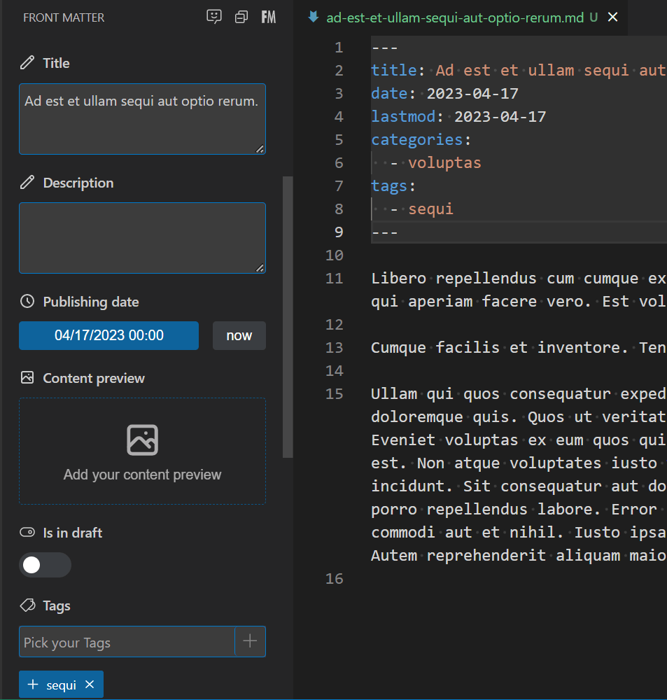

This is the Markdown frontmatter metadata we are used to.

We can edit this frontmatter in the file itself or in the sidebar.

It's possible to select categories from a dropdown menu if you add some settings to `frontmatter.json`.

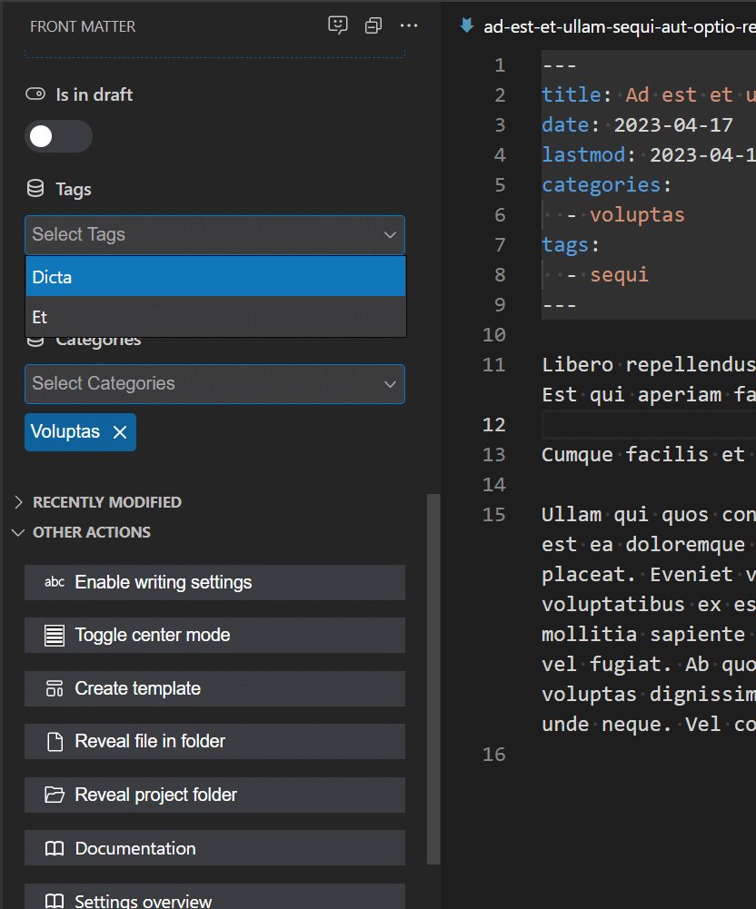

You can also add a setting to show a checkbox to toggle the auto-update of the last update date.

### Sort and filter the contents list

The list of content on the Front Matter CMS dashboard can be sorted and filtered.

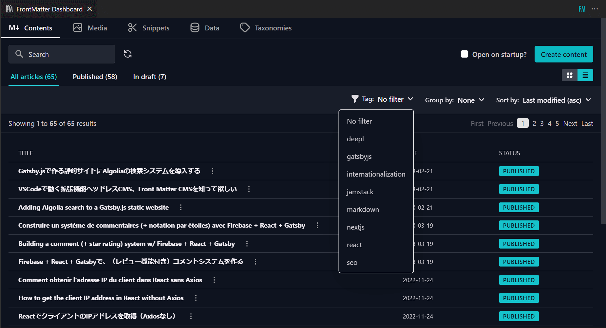

### Management of taxonomies and menus

WordPress-like taxonomy/menu management is also possible. They can be freely rearranged.

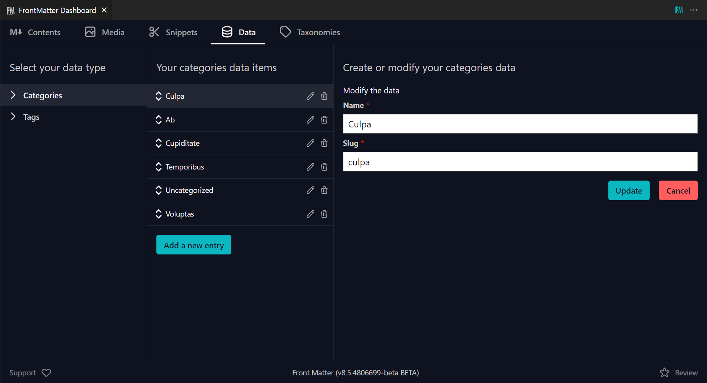

To control those data, we use the Data function; add the `frontMatter.data.files` setting to `frontmatter.json`.

### Management of metadata for images

We can still add metadata to images.

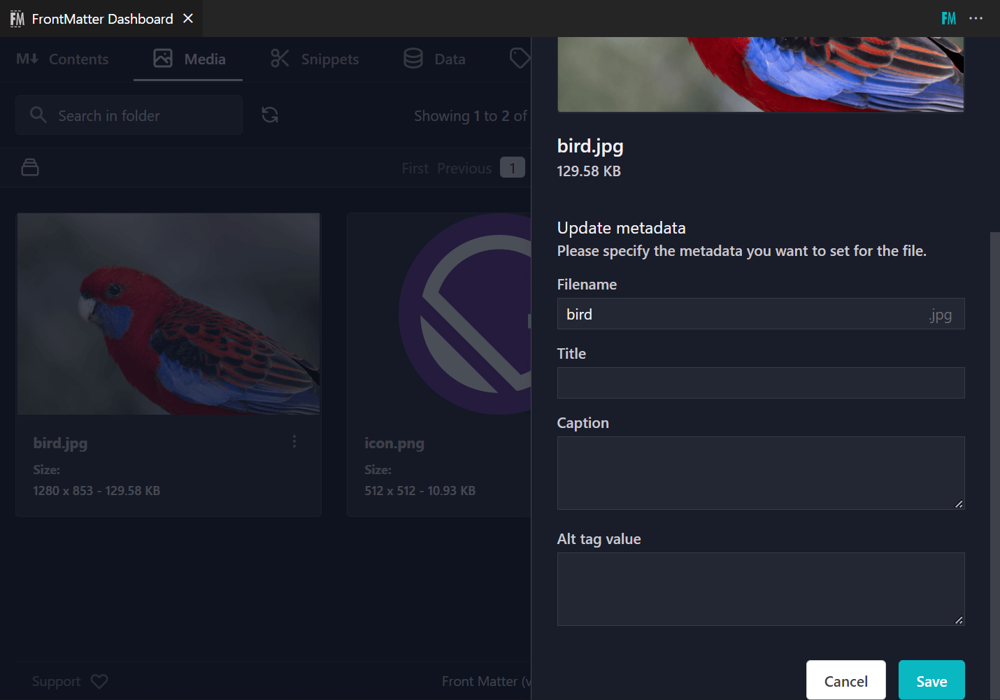

These metadata are stored in `.frontmatter/database/mediaDb.json`, and the alt data would be automatically retrieved when we add an image via the editor icon.

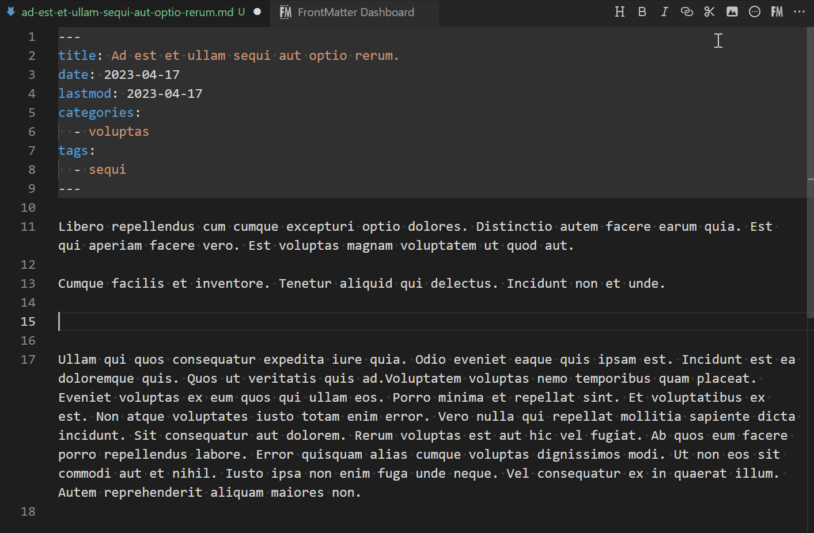

### Registering snippets

Although Markdown is far from the WordPress Gutenberg, you can store your own snippets such as alerts or cards.

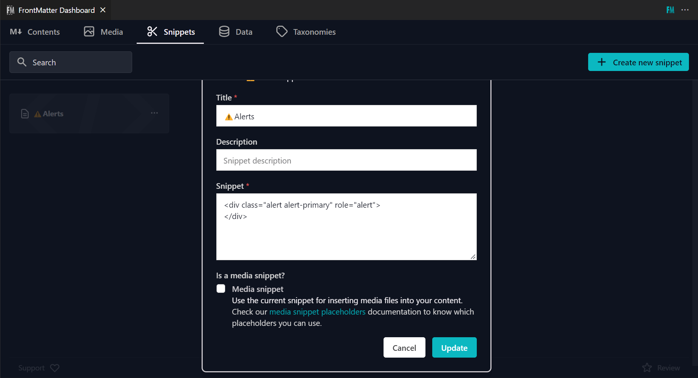

### Integration with Static Site Generator

During initialization, Front Matter CMS automatically detects the Static Site Generator in your project and adds it to `frontmatter.json`.

```json
{
  "frontMatter.taxonomy.contentTypes": [
    {
      "frontMatter.framework.id": "gatsby",
      "frontMatter.preview.host": "http://localhost:8000"
    }
  ]
}
```

After that, you can start/stop the local server using the buttons on the left sidebar without typing `gatsby develop` or `yarn dev`.

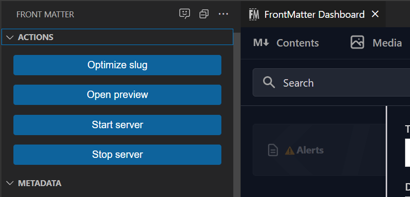

### Repeater Fields

With its Block Field feature, we can add repeater fields like WordPress' Advanced Custom Fields (ACF).

```json
"frontMatter.taxonomy.fieldGroups": [
  {
    "id": "author",
    "labelField": "name",
    "fields": [
      {
        "title": "Author Name",
        "name": "name",
        "type": "string",
        "single": true
      },
      {
        "title": "Social link",
        "name": "social",
        "type": "string",
        "single": true
      }
    ]
  }
]
"frontMatter.taxonomy.contentTypes": [
  {
    "name": "default",
    "fields": [
      {
        "title": "Authors",
        "name": "authors",
        "type": "block",
        "fieldGroup": "author"
      },
      // ...
    ]
  }
],
```

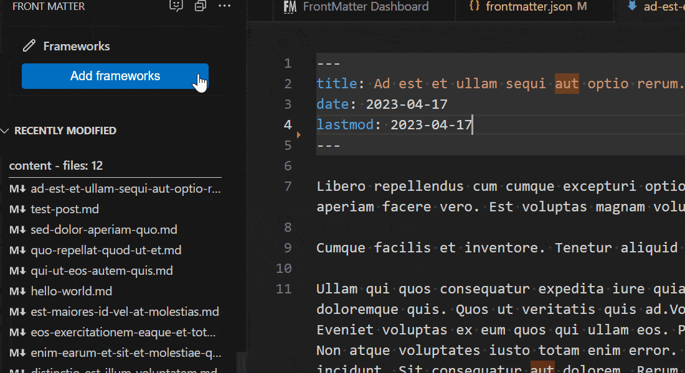

### Adding Custom Actions

The [Custom Actions](https://frontmatter.codes/docs/custom-actions) feature allows you to add commands to run your original scripts.

#### Generating OG images automatically (or with a single click)

For example, Elio demonstrates how to generate OG images with the Custom Actions using [node-html-to-image](https://www.npmjs.com/package/node-html-to-image).

<iframe width="560" height="315" src="https://www.youtube.com/embed/wvH9Tn5LQ2c?si=RZMdfrr-Qxt-6sPz" title="YouTube video player" frameborder="0" allow="accelerometer; autoplay; clipboard-write; encrypted-media; gyroscope; picture-in-picture; web-share" allowfullscreen></iframe>

- [[s02e01] Using the Front Matter CMS with Elio Struyf | YouTube](https://www.youtube.com/live/YX4HBXHojOA?si=BmKyunhEJ2SUNsxN&t=2207) \*36:47~
- [Generate open graph preview image in Code with Front Matter](https://www.eliostruyf.com/generate-open-graph-preview-image-code-front-matter/)

Just enter the title when creating a new article, or just click the command button, and an OG image is automatically generated.

#### Get address from postal code, or coordinates from address

I personally tried to add custom actions that connect to APIs and get the address from the zip code, or the latitude and longitude from the address.

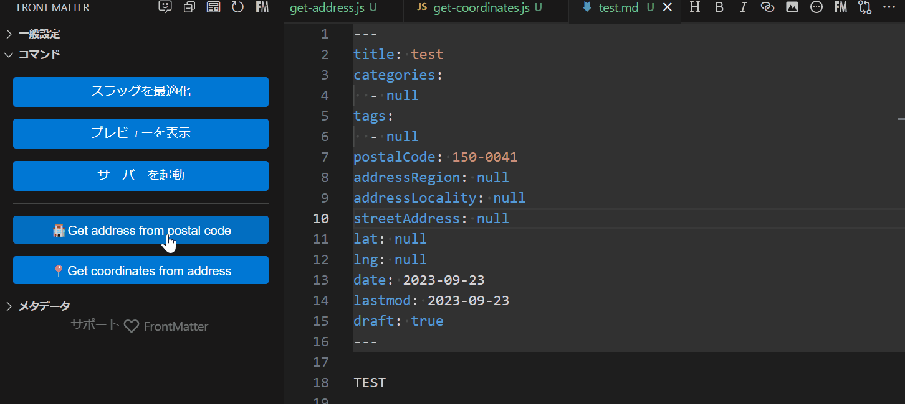

\*The language/text of the buttons is up to you.

Because we can run any scripts, I feel a wide posibilities of Front Matter CMS.

## What can't we do with Front Matter CMS?

### No rich text editor

As I mentioned earlier, because Front Matter CMS is only for Markdown content. We can't wish for a rich text WYSIWYG editor.

However, there are support buttons for Markdown input, making it easier to mark up images, lists, or block quotes.

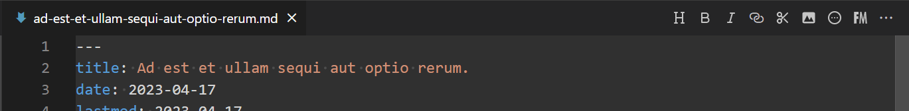

It's possible to apply a WYSIWYG editor to metadata fields. I could say that it's not really comfortable to use...

```json
"frontMatter.taxonomy.contentTypes": [
  {
    "name": "default",
    {
      "title": "Description",
      "name": "description",
      "type": "string",
      "wysiwyg": true
    },
    //...
  }
]
```

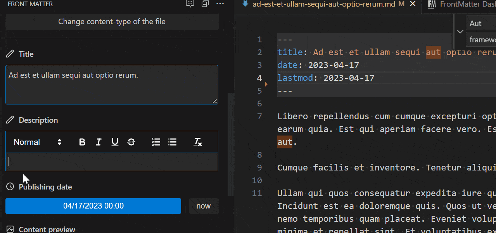

## Conclusion

### Front Matter CMS is a great extension

If you're considering running a website with Jamstack + Markdown, it's worth giving Front Matter CMS a try. With settings it's possible to manage a complex Markdown content.

Frequent updates are being added, and usability is constantly improving.

### Future Outlook

With v8.4.0 an AI chat was added. Compared to the chat AIs that are currently flourishing, the functionality is a bit old-fashioned...but I am sure it will evolve over time.

And if VS Code Online could add extensions like this, it would make online collaborative content management easier. That is, it could be used for deliverables.

## References

- [Front Matter](https://frontmatter.codes/)
- [estruyf/vscode-front-matter | GitHub](https://github.com/estruyf/vscode-front-matter)
