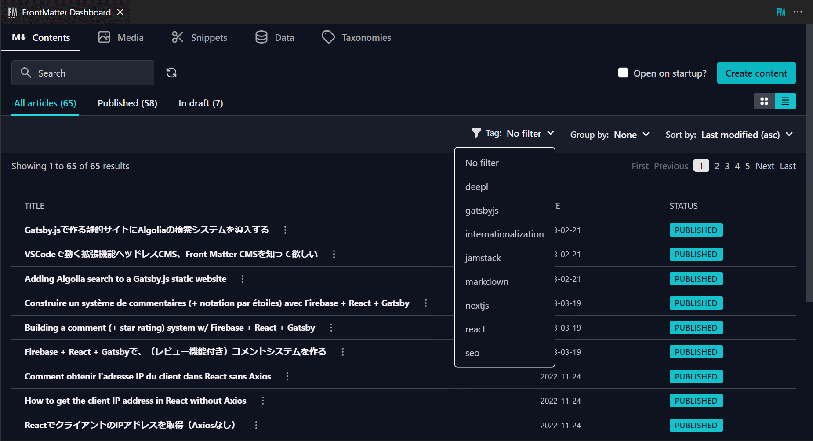
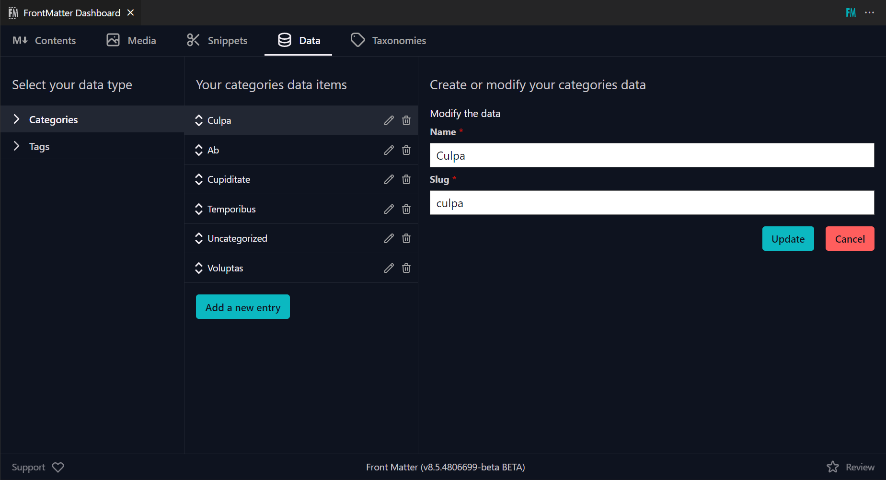
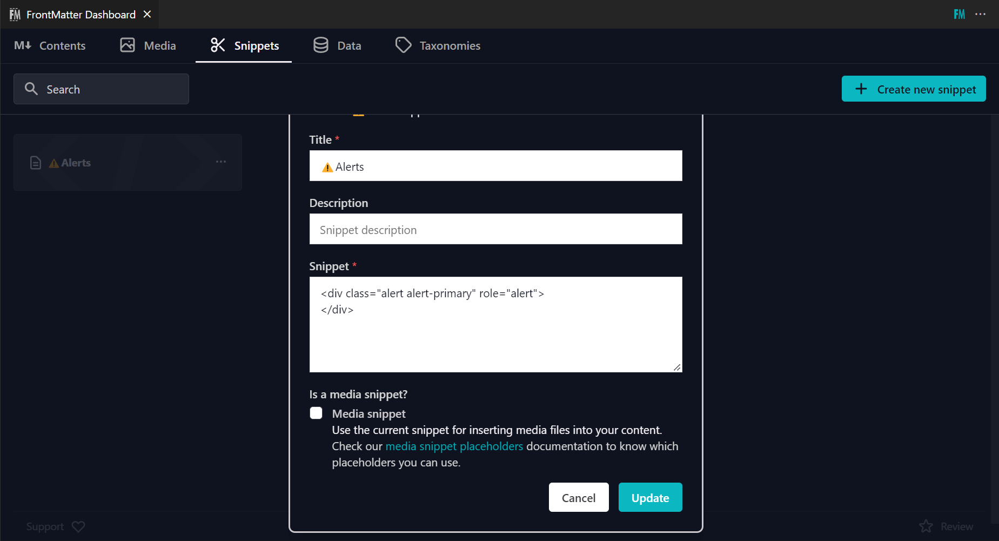

Lorsque j'ai envisagé de migrer mon projet WordPress vers Jamstack, j'ai essayé de nombreux CMS sans tête comme Contentful, Craft CMS, Strapi ou WordPress comme headless. Cependant, je n'ai pas trouvé celui qui répondait à mes besoins, même après quelques mois.

C'est alors que je suis tombée sur [Front Matter CMS](https://frontmatter.codes/), une extension de VS Code. C'est exactement ce que je voulais. Il est possible de gérer du contenu avec une architecture aussi compliquée.

Aujourd'hui, j'aimerais donc vous présenter ce CMS sans tête avec gratitude !

## Introduction : Qu'est-ce que Front Matter CMS ?

Front Matter CMS est une des extensions de VS Code, un CMS (Content Management System) sans tête pour du contenu markdown en local, développé par [@eliostruyf](https://twitter.com/eliostruyf) en Belgique.

La dernière version est la v8.4.0 à la fin du mois d'avril 2023. C'était la version 7 lorsque j'ai commencé à l'utiliser au printemps 2022.

Front Matter CMS remporte 1 200 étoiles (fin avril 2023). J'aimerais qu'il devienne plus populaire !

## Fonctionnalités de Front Matter CMS

### Tout d'abord, qu'est-ce qu'un CMS sans tête ?

Un CMS sans tête (ou, headless CMS) est la partie back-end d'un CMS qui, contrairement à un CMS traditionnel, sépare le front-end du back-end.

Dans le cas de WordPress,

- Front-end : les pages que les internautes peuvent voir
- Back-end : panneau d'administration/de contrôle que vous êtes le seul à voir

WordPress est un CMS traditionnel ; les deux fonctionnent sur le même serveur.

Les sites web construits avec un CMS sans tête ont le grand avantage d'être très sécurisés parce que le back-end est complètement séparé du front-end.

De plus, comme le front-end n'affiche que du code HTML pré-généré, sa vitesse de défilement est beaucoup plus rapide que celle de WordPress, qui se connecte toujours à une base de données pour afficher la page.

Les CMSs sans tête les plus populaires sont Contentful, Sanity CMS ou Strapi. Ils n'offrent qu'une gestion de contenu en tant que "backend".

Front Matter CMS fournit également une gestion de contenu, mais il est totalement différent de ces CMSs célèbres car il fonctionne uniquement sur VS Code.

### Avantages de Front Matter CMS

Les avantages de Front Matter CMS par rapport à d'autres systèmes de gestion de contenu (en ligne) sont les suivants ;

- gratuit
- conception libre
- hors ligne = rapide

Le plus grand avantage est que **vous n'avez pas à vous fier à un CMS sans tête freemium** et que vous pouvez construire votre propre CMS.

Lorsque l'on choisit un CMS sans tête, il faut toujours se demander comment gérer les taxonomies et les menus globaux, son système de sauvegarde/exportation, ou son prix lorsque l'on passe à l'échelle supérieure.

Mais avec Front Matter CMS, vous n'avez pas à vous soucier des systèmes, car nous pouvons construire et gérer un CMS comme vous le souhaitez, ainsi que la tarification, même si vous ajoutez des milliers d'éléments de contenu ou d'images.

Et comme Front Matter CMS fonctionne hors ligne, il n'y a pas de retard de réseau. Tous les fichiers peuvent être sauvegardés instantanément.

### Désavantages de Front Matter CMS

- Difficile à utiliser pour le personnel non technique
- Pas d'éditeur de texte riche (seulement pour Markdown)
- VS Code uniquement
- Anglais uniquement

Le plus grand inconvénient de Front Matter CMS est qu'il ne peut pas être livré à des clients non techniques parce qu'il s'agit d'une extension VS Code.

Pour ajouter/modifier du contenu, vous devez utiliser quelque chose comme GitHub ou construire localement et ensuite télécharger sur le serveur.

Il nécessite également des paramètres PC tels que l'installation de Git, ce qui rend la gestion du contenu plus difficile pour le personnel non technique que pour les CMS sans tête en ligne.

Et comme Front Matter CMS n'est pas localisé, les menus sont uniquement en anglais (vous pouvez cependant ajouter des titres ou des noms pour vos propres menus dans frontmatter.json).

## Que pouvons-nous faire avec Front Matter CMS ?

Nous gérons avec le CMS Front Matter ;

- Les paramètres du CMS avec `frontmatter.json`
- Les taxonomies, les métadonnées des images avec un fichier json sous `.frontmatter/database/`

Et aussi vos propres fichiers json pour les catégories ou les menus globaux peuvent être liés dans `frontmatter.json` pour les gérer dans le tableau de bord.

### Gestion de contenu en Markdown

Après les réglages initiaux de Front Matter CMS, nous voyons les éléments de données suivants dans la barre latérale gauche lorsque nous éditons un fichier Markdown.


Il s'agit de la métadonnée Markdown frontmatter à laquelle nous sommes habitués.

Nous pouvons éditer ce frontmatter dans le fichier lui-même ou dans la barre latérale.

Il est possible de sélectionner des catégories à partir d'un menu déroulant si vous ajoutez quelques paramètres à `frontmatter.json`.


Vous pouvez également ajouter un paramètre permettant d'afficher une case à cocher pour activer la mise à jour automatique de la date de la dernière mise à jour.

### Trier et filtrer la liste des contenus

La liste des contenus sur le tableau de bord de Front Matter CMS peut être triée et filtrée.



### Gestion des taxonomies et des menus

Une gestion des taxonomies et des menus similaire à celle de WordPress est également possible. Ils peuvent être réorganisés librement.



Pour contrôler ces données, nous utilisons la fonction Data ; ajoutez le paramètre `frontMatter.data.files` à `frontmatter.json`.

### Gestion des métadonnées pour les images

Il est aussi possible d'ajouter des métadonnées aux images.


Ces métadonnées sont stockées dans `.frontmatter/database/mediaDb.json`, et les données alt seront automatiquement récupérées lorsque nous ajouterons une image via l'icône de l'éditeur.


### Enregistrement des snippets

Bien que Markdown soit loin de WordPress Gutenberg, vous pouvez enregistrer vos propres snippets tels que des alertes ou des cartes.



### Intégration avec Static Site Generator

Lors de l'initialisation, Front Matter CMS détecte automatiquement le Static Site Generator dans votre projet et l'ajoute à `frontmatter.json`.

```json
{
  "frontMatter.taxonomy.contentTypes": [
    {
      "frontMatter.framework.id": "gatsby",
      "frontMatter.preview.host": "http://localhost:8000"
    }
  ]
}
```

Après cela, vous pouvez démarrer/arrêter le serveur local en utilisant les boutons de la barre latérale gauche sans avoir à taper `gatsby develop` ou `yarn dev`.


### Le champ répéteur

Avec sa fonction Block Field, nous pouvons ajouter des champs répétiteurs comme les Advanced Custom Fields (ACF) de WordPress.

```json
"frontMatter.taxonomy.fieldGroups": [
  {
    "id": "author",
    "labelField": "name",
    "fields": [
      {
        "title": "Author Name",
        "name": "name",
        "type": "string",
        "single": true
      },
      {
        "title": "Social link",
        "name": "social",
        "type": "string",
        "single": true
      }
    ]
  }
]
"frontMatter.taxonomy.contentTypes": [
  {
    "name": "default",
    "fields": [
      {
        "title": "Authors",
        "name": "authors",
        "type": "block",
        "fieldGroup": "author"
      },
      // ...
    ]
  }
],
```


## Que ne pouvons-nous pas faire avec Front Matter CMS ?

### Pas d'éditeur de texte riche

Comme je l'ai déjà mentionné, Front Matter CMS est uniquement destiné au contenu Markdown. Nous ne pouvons pas souhaiter un éditeur WYSIWYG de texte riche.

Cependant, il y a des boutons de support pour la saisie Markdown, ce qui facilite le marquage des images, des listes ou des blocs de guillemets.


Il est possible d'appliquer un éditeur WYSIWYG aux champs de métadonnées. Je pourrais dire que ce n'est pas vraiment confortable à utiliser...

```json
"frontMatter.taxonomy.contentTypes": [
  {
    "name": "default",
    {
      "title": "Description",
      "name": "description",
      "type": "string",
      "wysiwyg": true
    },
    //...
  }
]
```


## Conclusion

### Front Matter CMS est une excellente extension

Si vous envisagez de gérer un site web avec Jamstack + Markdown, cela vaut la peine d'essayer Front Matter CMS. Avec des paramètres, il est possible de gérer un contenu Markdown complexe.

Des mises à jour fréquentes sont ajoutées et la convivialité s'améliore constamment.

### Perspectives d'avenir

Avec la v8.4.0, un chat IA a été ajouté. Comparée aux IA de chat qui fleurissent actuellement, la fonctionnalité est un peu démodée... mais je suis sûr qu'elle évoluera avec le temps.

Et si VS Code Online pouvait ajouter des extensions de ce type, cela faciliterait la gestion de contenu collaboratif en ligne. C'est-à-dire qu'il pourrait être utilisé pour les livrables.

## References

- [Front Matter](https://frontmatter.codes/)
- [estruyf/vscode-front-matter | GitHub](https://github.com/estruyf/vscode-front-matter)
