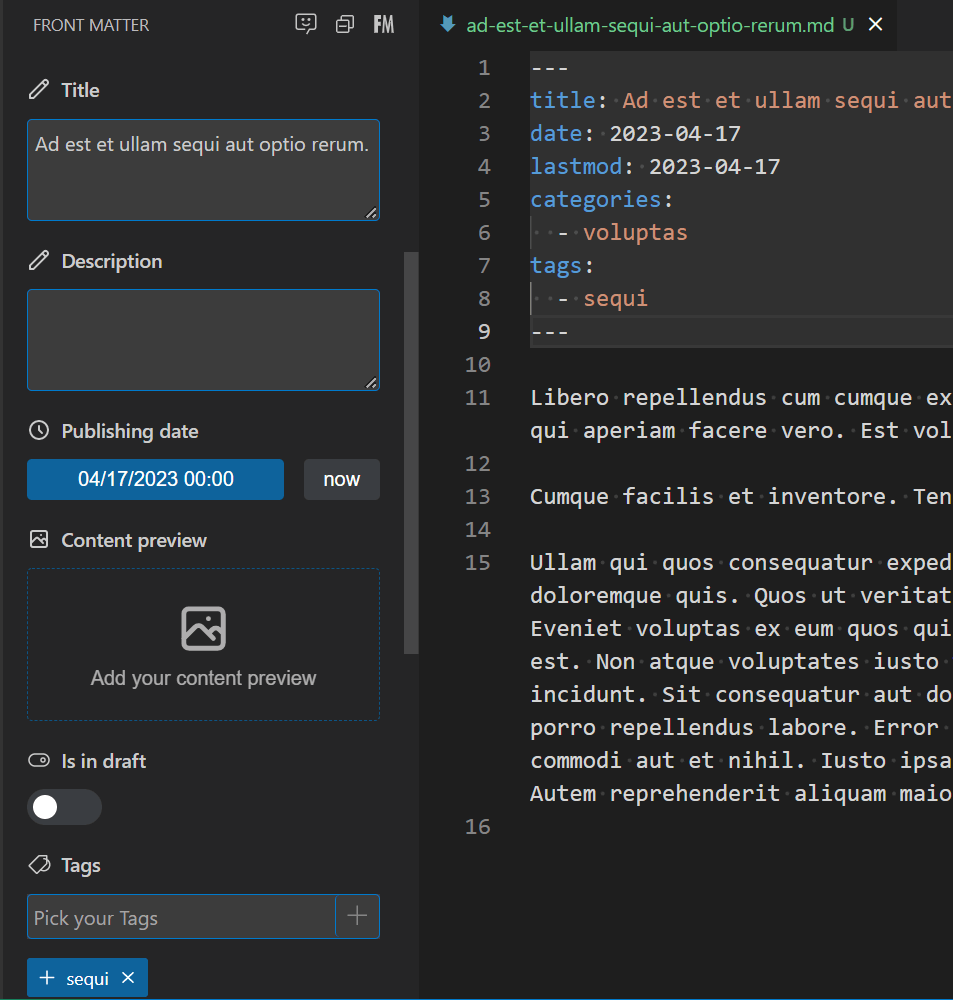
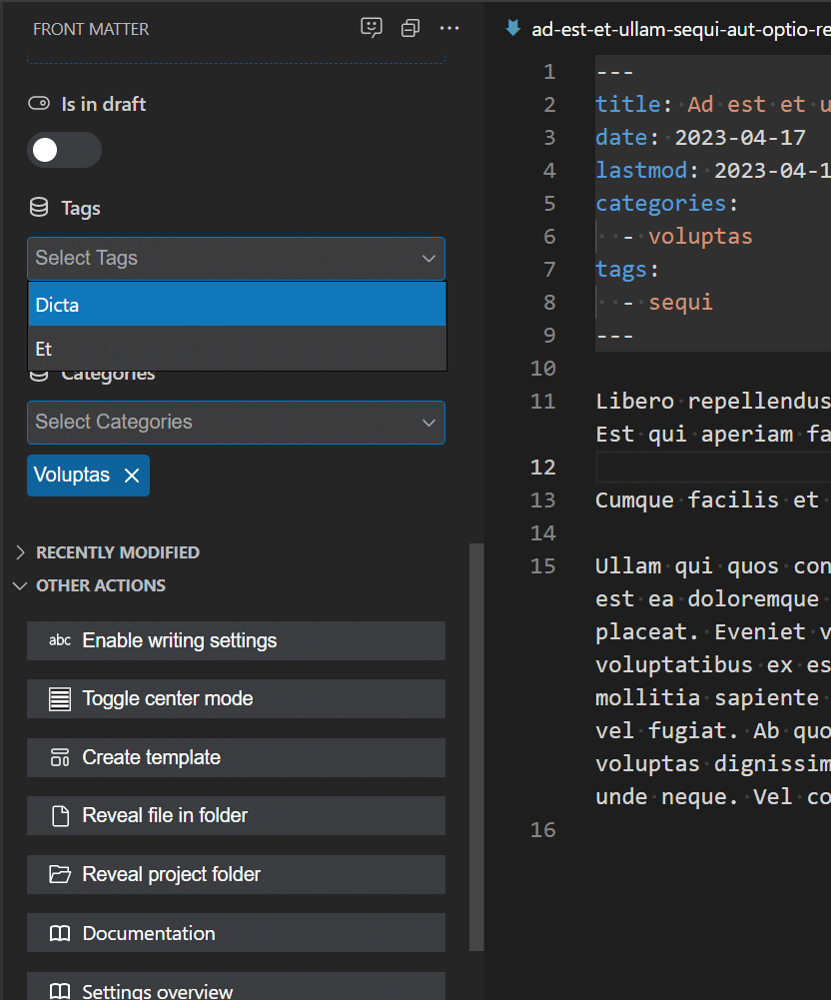
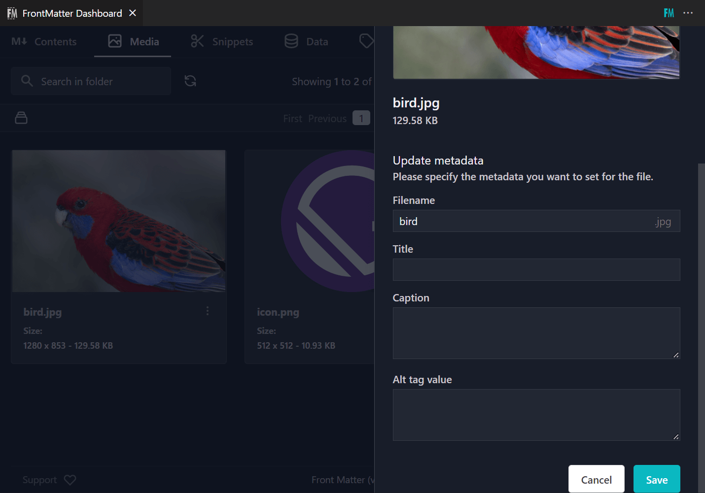
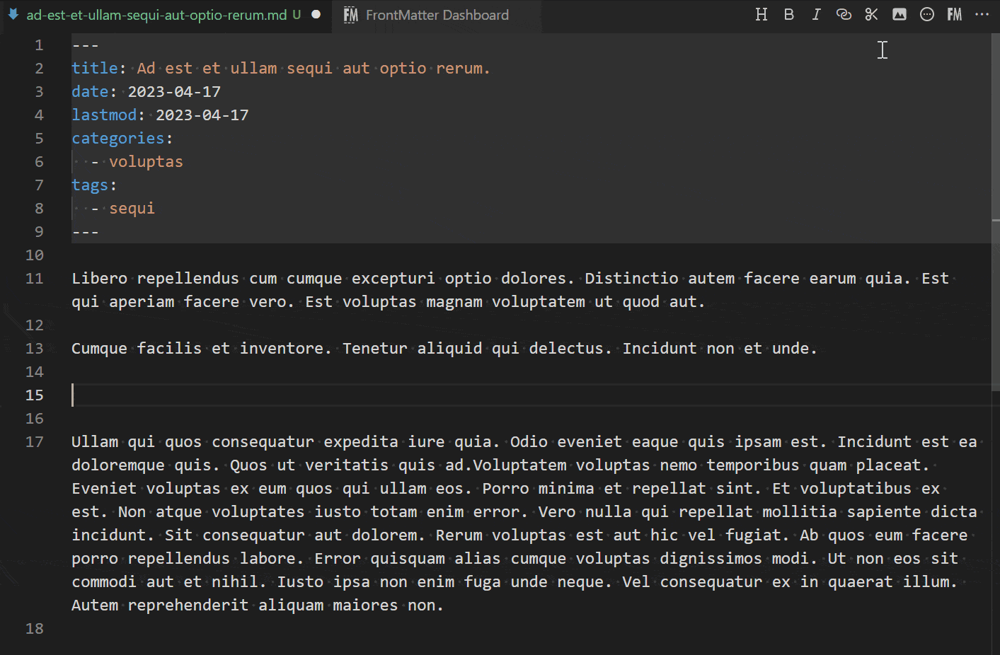
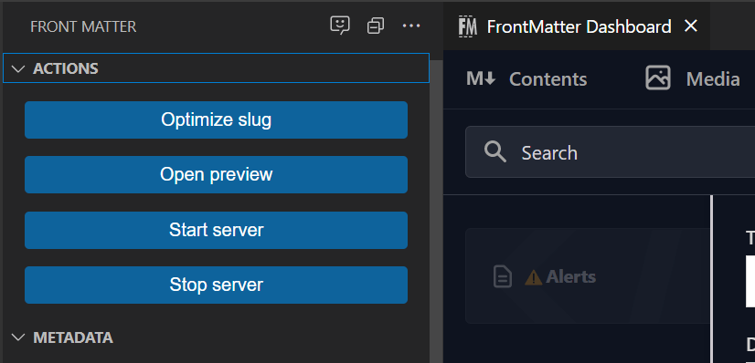
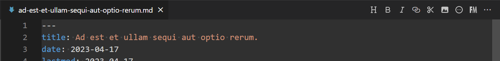
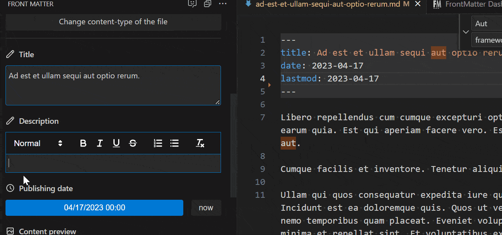

ある個人プロジェクトをWordPressからJamstackに移行する際、私はContentful・CraftCMS・Strapi・WordPressのヘッドレス使いなど、さまざまなヘッドレスCMSを試しました。しかし、数ヶ月かけても自分の要望に合致するものが見つからず。

そんな時に出会ったのがこのVS Codeの拡張機能、[Front Matter CMS](https://frontmatter.codes/)です。ローカルで複雑な構造のコンテンツ群も管理できる素晴らしさ。

感謝の意を込めて、記事にしたいと思います。

## はじめに：Front Matter CMSとは

Front Matter CMSとは、VS Codeの拡張機能で、ローカル・Markdown専用のヘッドレスCMS（コンテンツ・マネジメント・システム）です。ベルギー在住の[@eliostruyf](https://twitter.com/eliostruyf)さんが開発しています。

執筆時点（2023年4月末）でのバージョンは8.4.0です。私が使い始めたのは2022年春頃で、その頃はバージョンは7でした。

GitHubのスター数は約1,200（2023年4月末時点）。もっと人気になってほしい！

## Front Matter CMSの特徴

### そもそも、ヘッドレスCMSとは

ヘッドレスCMSとは、従来のCMSとは異なり、フロントエンドとバックエンドを分離したCMSの、バックエンド部分です。

WordPressで言えば、

- フロントエンドは外部の人から見える部分
- バックエンドは管理画面

ですが、いずれも同じサーバー上で動いていますよね。WordPressは従来型CMSです。

ヘッドレスCMSで作るウェブサイトはバックエンドがフロントエンドから完全に分かれているため、セキュリティに非常に強いという大きなメリットがあります。

また、フロントエンドでは生成されたHTMLだけを表示させるため、常にデータベースと接続しコンテンツを表示させるWordPressと比べて、非常に高速な表示が可能となります。

ヘッドレスCMSとして有名なのは、ContentfulやStrapi、日本ではMicro CMSなどが挙げられます。いずれも「バックエンド」であるコンテンツ管理のみを行えます。

Front Matter CMSも、その「バックエンド」であるコンテンツ管理を行えますが、PC上で編集・管理するという点で、他のヘッドレスCMSとは大きく異なります。

### Front Matter CMSのメリット

他の（オンラインの）ヘッドレスCMSと比較した、Front Matter CMSのメリットは以下の通り。

- 完全無料
- 設計自由
- オフライン = 高速動作

最大のメリットは、**巷のヘッドレスCMSに頼る必要なく、自分で自由なCMSを設計できる点**です。

ヘッドレスCMSを選定する際、カテゴリー等のタクソノミー・グローバルメニューの作り心地や、バックアップやCMSを引っ越す場合のエクスポート機能等、色々と考慮することが多くなります。また、コンテンツ量によっては料金がかかってきます。

その点、Front Matter CMSを使えば、すべて自分で設計・管理ができ、どんなに記事や画像が増えても料金の心配はありません。

また、オフラインでコンテンツ管理が可能なので、インターネット接続によるラグもありません。即座にファイル作成・保存ができます。

### Front Matter CMSのデメリット

- 技術者以外への導入の敷居が高い
- リッチなテキストエディターは使えない（Markdownのみ）
- VS Code以外では動かない
- 英語のみ

Front Matter CMSの一番のデメリットは、VS Codeの拡張機能であるため、技術的素地がないクライアント向け納品物には使いづらい点です。

静的サイトジェネレーターを使う前提ですので、記事の追加・更新には、GitHub等またはローカルでビルドしてのアップロードという作業が必要になります。

さらに、GitのインストールなどのPCの設定も必須となるため、オンラインで記事管理ができるContentful等のヘッドレスCMSに比べて、技術者以外には非常に敷居が高くなります。

また、現時点では多言語でのローカライズはされていないため、項目メニュー等自分で設定できる部分を除いて、Front Matter CMS本体は英語表示になります。

## Front Matter CMSでできること

Front Matter CMSでは、

- CMS設計: `frontmatter.json`
- 画像のメタデータ・タクソノミー: `.frontmatter/database/` フォルダー内のjsonファイル

で管理します。

その他、カテゴリーやメニュー等を任意のフォルダーにjsonファイルで管理し、frontmatter.jsonで読み込むこともあります。

### Markdownによるコンテンツ管理

Front Matter CMSをインストールして初期設定を行うと、Markdownファイルの編集時に、デフォルトでは以下のような項目が左サイドバーに表示されます。



これらの項目は、Markdownではおなじみのfrontmatterメタデータですね。

編集する場合はMarkdownファイル上で直接テキストを編集してもいいですし、サイドバーから編集してももちろんOKです。

カテゴリーはあらかじめ用意したものからドロップダウンで選択する形式にすることもできます。



また、最終更新日の自動更新のオン・オフなどのスイッチ表示も、設定により可能です。

### 記事一覧の表示・絞り込み

Front Matter CMSのダッシュボードからは、記事の一覧が表示され、タグやカテゴリー・下書き等の条件で絞り込みが可能です。


### タクソノミー・グローバルメニューの管理

Markdown単体のみでは難しい、タクソノミー（カテゴリー・タグ等）や、WordPressのようなメニュー管理も可能。並べ替えも自在です。


このようなデータを管理するには、「Data」機能を利用。設定ファイルである`frontmatter.json`に、`frontMatter.data.files`を使ってデータを設定します。

### 画像のメタデータ管理

こちらもMarkdown単体では難しい、画像のメタデータの編集も可能です。



入力した画像メタデータは、`.frontmatter/database/mediaDb.json`に保存され、記事内で画像を呼び出す際に`alt`データも引っ張ってこれます。



### スニペットの登録

MarkdownコンテンツではGutenbergのようなリッチな表現はできないものの、たとえばアラートボックスなど、あらかじめ「よく使う」スニペットデータを保存しておけます。


### 静的サイトジェネレーターとの統合

Front Matter CMSは、多くの静的サイトジェネレーターに対応しており、初期設定の際に自動でプロジェクトのフレームワークを検知、`frontmatter.json`に自動で追記されます。

```json
{
  "frontMatter.taxonomy.contentTypes": [
    {
      "frontMatter.framework.id": "gatsby",
      "frontMatter.preview.host": "http://localhost:8000"
    }
  ]
}
```

その後は、コマンドで`gatsby develop`や`yarn dev`などと入力することなく、左のメニューからワンクリックでサーバーを起動させることが可能になります。



### リピーターフィールドの設定

「Block field」を使えば、WordPressのAdvanced Custom Fields（ACF）のリピーターフィールドのような機能も追加できます。

```json
"frontMatter.taxonomy.fieldGroups": [
  {
    "id": "author",
    "labelField": "name",
    "fields": [
      {
        "title": "Author Name",
        "name": "name",
        "type": "string",
        "single": true
      },
      {
        "title": "Social link",
        "name": "social",
        "type": "string",
        "single": true
      }
    ]
  }
]
"frontMatter.taxonomy.contentTypes": [
  {
    "name": "default",
    "fields": [
      {
        "title": "Authors",
        "name": "authors",
        "type": "block",
        "fieldGroup": "author"
      },
      // ...
    ]
  }
],
```


## Front Matter CMSでできないこと

### リッチテキストエディターは使えない

**Front Matter CMSは、MarkdownコンテンツのためのCMS**です。リッチなテキストエディターを記事に使うことはできません。

ただし、Markdownの入力支援は上部に表示されており、画像やリスト等の挿入がしやすくなっていますし、あらかじめ登録したスニペットを呼び出して使うことができます。



メタデータ入力欄にはWYSIWYGエディターを追加することが可能です。使いやすくはありませんが・・・

```json
"frontMatter.taxonomy.contentTypes": [
  {
    "name": "default",
    {
      "title": "Description",
      "name": "description",
      "type": "string",
      "wysiwyg": true
    },
    //...
  }
]
```



## おわりに

### Front Matter CMSのまとめ

Jamstack + Markdownでコンテンツ管理を考えているなら、是非一度Front Matter CMSを試してみてください。設計によっては、かなり複雑なメタデータ構造を持つMarkdownのコンテンツ管理もできる、素晴らしいヘッドレスCMSです。

頻繁に更新が加えられており、使い勝手も常に向上しています。

### 今後の展望

Front Matter CMSはバージョン8.4.0で、AIチャット機能が追加されました。現在隆盛のチャットAIに比べると機能は一昔前な感じ・・・ではありますが、いずれ進化していくことでしょう。

また、もし今後、VS Code Onlineがこのような拡張機能に対応できれば、オンラインでの共同コンテンツ管理が楽になるので、クライアント向け納品物にも使えるかもしれないかなとも思います。

## 参考サイト

- [Front Matter](https://frontmatter.codes/)
- [estruyf/vscode-front-matter | GitHub](https://github.com/estruyf/vscode-front-matter)
