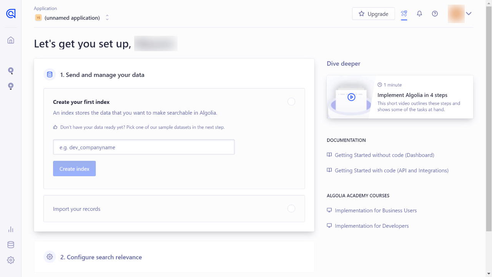
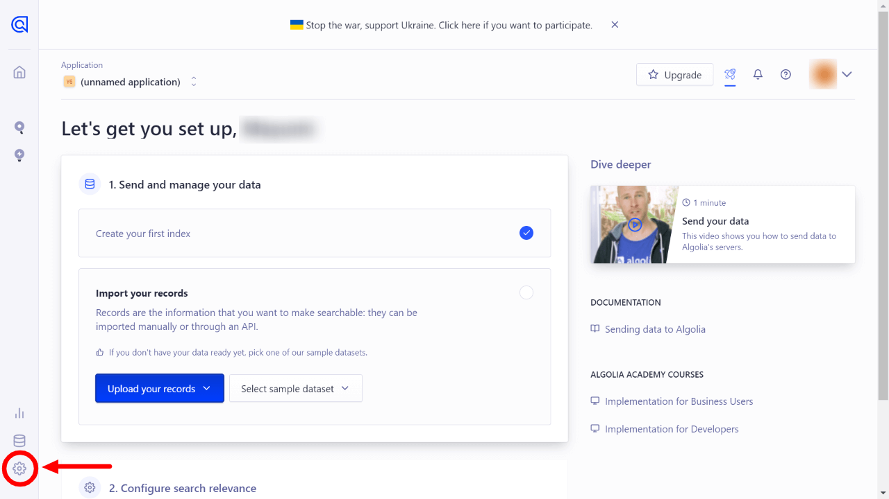
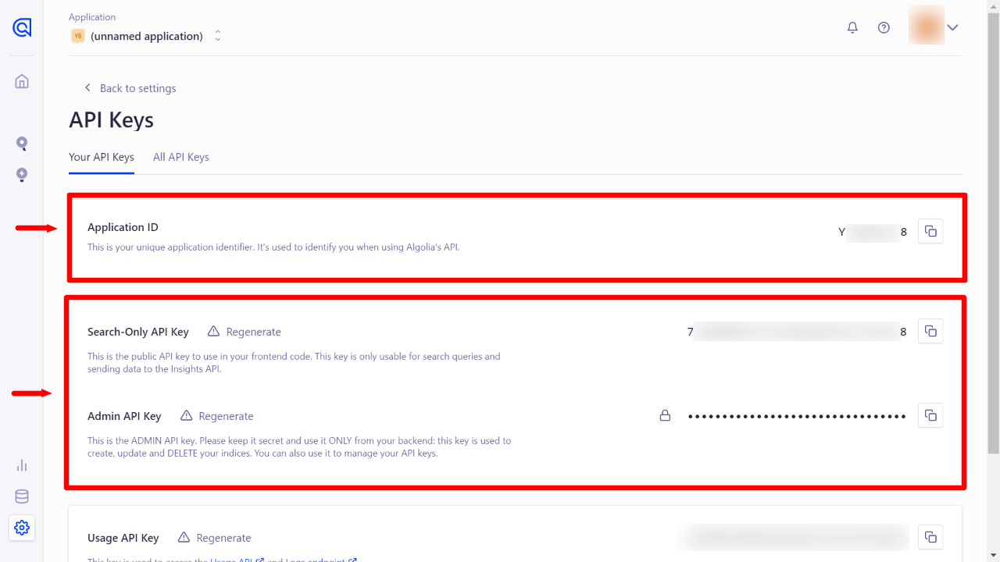
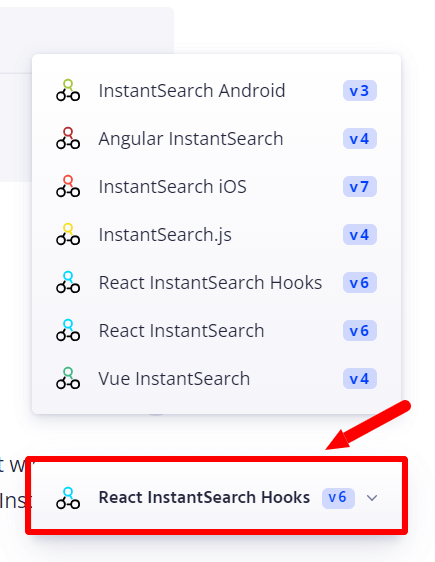
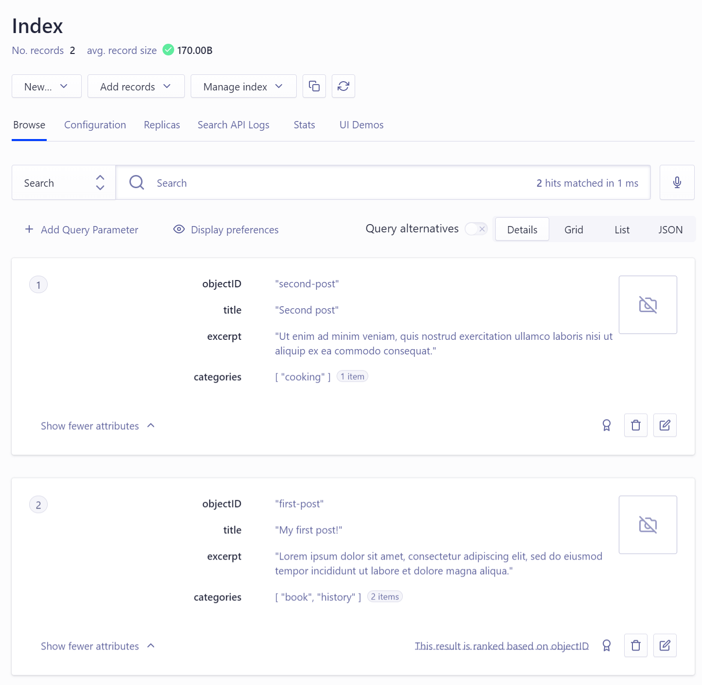

[Algolia](https://www.algolia.com/) is a product by Algolia for implementing a super fast in-site search system.

Since it's already used on many websites, you might have noticed their logo in some documentations. Gatsby.js also uses Algolia for its documentation.

I know that Google Custom Search is also handy, but it slows down performance and kills one of Jamstack's strengths. So this time I tried to integrate Algolia into a Gatsby.js website.

Working environment:

- Node.js v20.14.0
- React v18.3.1
- Gatsby.js v5.13.7
- gatsby-plugin-algolia v1.0.3
- algoliasearch v5.0.0
- react-instantsearch v7.12.4

## Step-by-Step Overview

There are three steps to follow;

1. Register with Algolia and prepare settings for your project
2. Create data (records) for search and store them on Algolia
3. Create a function to display search results on frontend

The condition of this post is "search blog posts written in Markdown". If you use GraphQL queries through any headless CMS, rewrite queries according to your situation.

## Registering with Algolia

First you need to register with Algolia and create a new project.

Name your new index data in the project. Algolia recommends that the index name starts with the prefixes `dev_`, `test_` and `prod_` according to the production stages.



Once you have named the index, do not proceed to "2. Configure search relevance", but first go to ⚙️**Settings -> API Keys** at the bottom left.



Check the following three API keys on the API Keys page.

- Application ID
- Search-Only API Key
- Admin API Key



You'll need them later. Leave the display as is.

### Installing Algolia plugins into your Gatsby.js project

Next, go to your Gatsby.js project and install a plugin and 2 libraries.

#### Official Algolia plugin for Gatsby.js

Install the [gatsby-plugin-algolia](https://www.gatsbyjs.com/plugins/gatsby-plugin-algolia/) provided by Algolia.

```bash
# npm
npm install gatsby-plugin-algolia

# yarn
yarn add gatsby-plugin-algolia
```

Once the installation is complete, add the plugin information to gatsby-config.js.

<div class="filename">gatsby-config.js</div>

```js
require("dotenv").config({
  path: `.env.${process.env.NODE_ENV}`,
})

module.exports = {
  //...
  plugins: [
    //...
    {
      resolve: `gatsby-plugin-algolia`,
      options: {
        appId: process.env.ALGOLIA_APP_ID,
        apiKey: process.env.ALGOLIA_API_KEY,
        indexName: process.env.ALGOLIA_INDEX_NAME,
        queries: [
          {
            query: `{
              // Add query here
            }`,
            transformer: ({ data }) =>
              data.allMarkdownRemark.edges.flatMap(({ node }) => {
                return {
                  // Add objects to register in Algolia by query
                }
              }),
          },
        ],
        chunkSize: 10000,
      },
    },
  ]
}
```

Then, add **APP ID**, **Admin API Key** and index name to `.env.production`.

<div class="filename">.env.production</div>

```text
ALGOLIA_APP_ID=[Application ID]
ALGOLIA_API_KEY=[Admin API Key]
ALGOLIA_INDEX_NAME=[your_index_name]
```

Since generating records only works on `gatsby build`, you don't need to add them to `.env.development` (We will use `ALGOLIA_INDEX_NAME` later).

#### Official Algolia libraries for search results

We'll use [react-instantsearch](https://www.algolia.com/doc/guides/building-search-ui/what-is-instantsearch/react/) this time (React v16.8.0>). Also install [algoliaseach](https://www.npmjs.com/package/algoliasearch) together.

```bash
# npm
npm install algoliasearch react-instantsearch

# yarn
yarn add algoliasearch react-instantsearch
```

Algolia has released several libraries, and [react-instantsearch](https://www.algolia.com/doc/guides/building-search-ui/what-is-instantsearch/react/) is the latest as of Feb 2023 (important).

Because Algolia's docs contain all their libraries in one place, and different libraries use the same name for components (sometimes working the same, sometimes not), we have to be careful when reading the docs.

When you implant Algolia according to this entry, check if the library name on the right bottom is **React InstantSearch v7**.



## Create and store records for search

To use Algolia on your website, you first need to store records as json data on Algolia. To generate/store records we use gatsby-plugin-algolia.

All we have to do is to add query of data to plugin information in `gatsby-config.js`.

However, we must consider **what data must be stored on Algolia**. Too much information consumes cost.

In this example, I added the following data retrieved from Markdown YAML frontmatter.

- title
- slug (used as objectID)
- excerpt
- categories

The query is then set as follows;

<div class="filename">gatsby-config.js</div>

```js
module.exports = {
  //...
  plugins: [
    //...
    {
      resolve: `gatsby-plugin-algolia`,
      options: {
        appId: process.env.ALGOLIA_APP_ID,
        apiKey: process.env.ALGOLIA_API_KEY,
        indexName: process.env.ALGOLIA_INDEX_NAME,
        queries: [
          {
            query: `{
              allMarkdownRemark {
                edges {
                  node {
                    frontmatter {
                      title
                      slug
                      description
                      categories
                    }
                  }
                }
              }
            }`,
            transformer: ({ data }) =>
              data.allMarkdownRemark.edges.flatMap(({ node }) => {
                return {
                  objectID: node.frontmatter.slug,
                  excerpt: node.frontmatter.description,
                  title: node.frontmatter.title,
                  categories: node.frontmatter.categories.map(
                    (category) => category.title
                  ),
                }
              }
            ),
          },
        ],
        chunkSize: 10000,
      },
    }
  ]
}
```

The `objectID` is used for index management, and Algolia checks the difference based on the `objectID`.

Though I added slug as `objectID`, it will waste judging differences if slugs get changed. If slugs can change very often, you should use other data as `objectID`.

### Send records to Algolia on gatsby build

Now you're ready to send records to Algolia.

Run `gatsby build` on local. Near the end of the build, the records will be sent to Algolia.

```bash
gatsby build
...
success index to Algolia - 10.728s - Done!
...
```

You can see that the records are indexed on your Algolia dashboard.



You can also index images by including `image:url` in the query.

## Show the search results

Create a javascript file (called algolia.js here) in your components folder. The following is basic code for displaying the search results.

<div class="filename">/src/components/algolia.js</div>

```js
import React, { useMemo } from "react"
import { algoliasearch } from "algoliasearch"
import { InstantSearch } from "react-instantsearch"

const Algolia = () => {
  const searchClient = useMemo(
    () =>
      algoliasearch(
        process.env.GATSBY_ALGOLIA_APP_ID,
        process.env.GATSBY_ALGOLIA_SEARCH_KEY
      ),
    []
  )

  return (
    <InstantSearch
      searchClient={searchClient}
      indexName={process.env.ALGOLIA_INDEX_NAME}
    >
      {/* add widget here */}
    </InstantSearch>
  )
}

export default Algolia
```

> The `searchClient` variable is memoized to avoid re-creating the Algolia search client when the Search component is re-rendered. 
> <cite>[Adding Search with Algolia | Gatsby](https://www.gatsbyjs.com/docs/adding-search-with-algolia/)</cite>

Specify environment variables in both .env.development and .env.production.

```text
ALGOLIA_INDEX_NAME=[your_index_name]
GATSBY_ALGOLIA_APP_ID=[Application ID]
GATSBY_ALGOLIA_SEARCH_KEY=[Search-Only API Key]
```

*ALGOLIA_INDEX_NAME` is the same as the one we used for the official Algolia plugin for Gatsby.js.

### Create a search box

We can use the [SearchBox](https://www.algolia.com/doc/api-reference/widgets/search-box/react/) widget.

<div class="filename">/src/components/algolia.js</div>

```js
import React, { useMemo } from "react"
import { algoliasearch } from "algoliasearch"
import { InstantSearch, SearchBox } from "react-instantsearch"

const Algolia = () => {
  const searchClient = useMemo(
    () =>
      algoliasearch(
        process.env.GATSBY_ALGOLIA_APP_ID,
        process.env.GATSBY_ALGOLIA_SEARCH_KEY
      ),
    []
  )

  return (
    <InstantSearch
      searchClient={searchClient}
      indexName={process.env.ALGOLIA_INDEX_NAME}
    >
      <SearchBox />
    </InstantSearch>
  )
}

export default Algolia
```

So the Algolia component is ready. You can import this into other components or templates to display a search box.

### Create search results part

To display the search results, we can use the [Hits](https://www.algolia.com/doc/api-reference/widgets/hits/react/) widget.

<div class="filename">/src/components/algolia.js</div>

```js
import React, { useMemo } from "react"
import { algoliasearch } from "algoliasearch"
import { InstantSearch, SearchBox, Hits } from "react-instantsearch"

const Algolia = () => {
  const searchClient = useMemo(
    () =>
      algoliasearch(
        process.env.GATSBY_ALGOLIA_APP_ID,
        process.env.GATSBY_ALGOLIA_SEARCH_KEY
      ),
    []
  )

  const Hit = ({ hit }) => {
    return (
      <Link to={`/blog/${hit.objectID}/`}>
        <article>
          <h1>{hit.title}</h1>
          <p>{hit.excerpt}...</p>
          <ul>{hit.categories.map((category) => <li>{category}</li>)}</ul>
        </article>
      </Link>
    )
  }

  return (
    <InstantSearch
      searchClient={searchClient}
      indexName={process.env.ALGOLIA_INDEX_NAME}
    >
      <SearchBox />
      <Hits hitComponent={Hit} />
    </InstantSearch>
  )
}

export default Algolia
```

### Styling

Now only styling is left. There are two ways to style Algolia widgets;

1. Using original css classes
2. Adding your own `classNames` or `className` to widgets, then Style them

Since Algolia has already added its own class names, you can use them for styling.

Or it is also possible to add your own class names by adding `classNames``className` props to widgets, then style them with CSS modules or Tailwind CSS.

## Settings for gatsby-plugin-algolia (before production release)

### Skip indexing

To skip indexing, you can set the `dryRun: true` option (default: `false`).

<div class="filename">gatsby-config.js</div>

```js
{
resolve: `gatsby-plugin-algolia`,
  options: {
    //...
    dryRun: true,
  }
}
```

Si `dryRun : true` est défini, le résultat de la construction indiquera que l'indexation a été ignorée.

```bash
gatsby build
...
==== THIS IS A DRY RUN ====================
- No records will be pushed to your index
- No settings will be updated on your index
```

Dans mon cas, je ne mets `dryRun : false` que lorsque j'ai besoin d'indexation.

Check the limits for your situation and consider when you send indexing to Algolia.

## Reference

- [Algolia](https://www.algolia.com/)
- [gatsby-plugin-algolia | Gatsby](https://www.gatsbyjs.com/plugins/gatsby-plugin-algolia/)
- [Adding Search with Algolia | Gatsby](https://www.gatsbyjs.com/docs/adding-search-with-algolia/) *A former library react-instantsearch-dom is adopted in this article but still helpful.