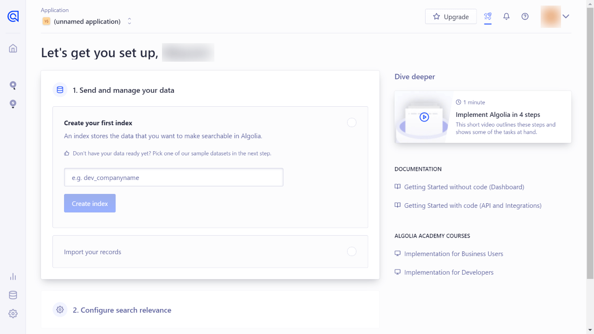

[Algolia](https://www.algolia.com/) est un produit d'Algolia permettant de mettre un système de recherche sur votre site web.

Comme il est déjà utilisé sur de nombreux sites web, vous avez peut-être remarqué leur logo dans certaines documentations. Gatsby.js utilise également Algolia pour sa documentation.

Je sais que Google Custom Search est également pratique, mais il ralentit les performances et tue l'une des forces de Jamstack. Cette fois, j'ai donc essayé d'intégrer Algolia dans un site Gatsby.js.

Environnement :

- Node.js v20.11.0
- React v18.2.0
- Gatsby.js v5.13.3
- gatsby-plugin-algolia v1.0.3
- algoliasearch v4.22.1
- react-instantsearch v7.6.0

## Vue d'ensemble

Il y a trois étapes à suivre ;

1. Enregistrer avec Algolia et préparer les paramètres de votre projet.
2. Créer des données ("records") pour la recherche et les stocker sur Algolia.
3. Créer une fonction pour afficher les résultats de la recherche sur le frontend.

La condition de ce post est "rechercher des articles de blog écrits en Markdown". Si vous utilisez des requêtes GraphQL via un CMS sans tête, réécrivez les requêtes en fonction de votre situation.

## Enregistrement auprès d'Algolia

Vous devez d'abord vous enregistrer auprès d'Algolia et créer un nouveau projet.

Nommez votre nouvel index de données dans le projet. Algolia recommande que le nom de l'index commence par les préfixes `dev_`, `test_` et `prod_` en fonction des étapes de production.



Une fois que vous avez nommé l'index, ne passez pas à "2. Configurer la pertinence de la recherche", mais allez d'abord à ⚙️**Settings -> API Keys** en bas à gauche.


Vérifiez les trois clés API suivantes sur la page Clés API.

- Application ID
- Search-Only API Key
- Admin API Key


Vous en aurez besoin plus tard. Laissez l'écran tel quel.

### Installation des plugins Algolia dans votre projet Gatsby.js

Ensuite, allez dans votre projet Gatsby.js et installez un plugin et 2 bibliothèques.

#### Plugin officiel d'Algolia pour Gatsby.js

Installez le [gatsby-plugin-algolia](https://www.gatsbyjs.com/plugins/gatsby-plugin-algolia/) fourni par Algolia.

```bash
# npm
npm install gatsby-plugin-algolia

# yarn
yarn add gatsby-plugin-algolia
```

Une fois l'installation terminée, ajoutez les informations du plugin à gatsby-config.js.

<div class="filename">gatsby-config.js</div>

```js
require("dotenv").config({
  path: `.env.${process.env.NODE_ENV}`,
})

module.exports = {
  //...
  plugins: [
    //...
    {
      resolve: `gatsby-plugin-algolia`,
      options: {
        appId: process.env.ALGOLIA_APP_ID,
        apiKey: process.env.ALGOLIA_API_KEY,
        indexName: process.env.ALGOLIA_INDEX_NAME,
        queries: [
          {
            query: `{
              // Add query here
            }`,
            transformer: ({ data }) =>
              data.allMarkdownRemark.edges.flatMap(({ node }) => {
                return {
                  // Ajouter des objets à enregistrer dans Algolia par requête
                }
              }),
          },
        ],
        chunkSize: 10000,
      },
    },
  ]
}
```

Ensuite, ajoutez **APP ID**, **Admin API Key** et le nom de l'index à `.env.production`.

<div class="filename">.env.production</div>

```text
ALGOLIA_APP_ID=[Application ID]
ALGOLIA_API_KEY=[Admin API Key]
ALGOLIA_INDEX_NAME=[your_index_name]
```

Puisque la génération d'enregistrements ne fonctionne que sur `gatsby build`, vous n'avez pas besoin de les ajouter à `.env.development` (Nous utiliserons `ALGOLIA_INDEX_NAME` plus tard).

#### Bibliothèques officielles d'Algolia pour les résultats de recherche

Nous utiliserons [react-instantsearch](https://www.algolia.com/doc/guides/building-search-ui/what-is-instantsearch/react/) cette fois-ci (React v16.8.0>). Installez également [algoliaseach](https://www.npmjs.com/package/algoliasearch) ensemble.

```bash
# npm
npm install algoliasearch react-instantsearch

# yarn
yarn add algoliasearch react-instantsearch
```

Algolia a publié plusieurs bibliothèques, et [react-instantsearch](https://www.algolia.com/doc/guides/building-search-ui/what-is-instantsearch/react/) est la dernière en date de février 2023 (important).

Étant donné que la documentation d'Algolia contient toutes ses bibliothèques en un seul endroit, et que différentes bibliothèques utilisent le même nom pour les composants (qui fonctionnent parfois de la même manière, parfois non), nous devons être attentifs lorsque nous lisons la documentation.

Lorsque vous implantez Algolia selon cette entrée, vérifiez si le nom de la bibliothèque en bas à droite est **React InstantSearch v7**.


## Créer et stocker des enregistrements "records" pour la recherche

Pour utiliser Algolia sur votre site web, vous devez d'abord stocker les enregistrements "records" sous forme de données json sur Algolia. Pour générer/stocker les enregistrements, nous utilisons gatsby-plugin-algolia.

Tout ce que nous avons à faire est d'ajouter la requête de données aux informations du plugin dans `gatsby-config.js`.

Cependant, nous devons considérer **les données qui doivent être stockées sur Algolia**. Trop d'information consomme du coût.

Dans cet exemple, j'ai ajouté les données suivantes extraites de Markdown YAML frontmatter.

- title
- slug (used as objectID)
- excerpt
- categories

La requête est alors définie comme suit ;

<div class="filename">gatsby-config.js</div>

```js
module.exports = {
  //...
  plugins: [
    //...
    {
      resolve: `gatsby-plugin-algolia`,
      options: {
        appId: process.env.ALGOLIA_APP_ID,
        apiKey: process.env.ALGOLIA_API_KEY,
        indexName: process.env.ALGOLIA_INDEX_NAME,
        queries: [
          {
            query: `{
              allMarkdownRemark {
                edges {
                  node {
                    frontmatter {
                      title
                      slug
                      description
                      categories
                    }
                  }
                }
              }
            }`,
            transformer: ({ data }) =>
              data.allMarkdownRemark.edges.flatMap(({ node }) => {
                return {
                  objectID: node.frontmatter.slug,
                  excerpt: node.frontmatter.description,
                  title: node.frontmatter.title,
                  categories: node.frontmatter.categories.map(
                    (category) => category.title
                  ),
                }
              }
            ),
          },
        ],
        chunkSize: 10000,
      },
    }
  ]
}
```

Le `objectID` est utilisé pour la gestion de l'index, et Algolia vérifie la différence en se basant sur le `objectID`.

Bien que j'aie ajouté le slug comme `objectID`, cela gaspillera l'évaluation des différences si les slugs sont modifiés. Si les slugs peuvent changer très souvent, vous devriez utiliser d'autres données comme `objectID`.

### Envoyer les enregistrements à Algolia sur la base de gatsby

Maintenant vous êtes prêt(e) à envoyer des enregistrements à Algolia.

Lancez `gatsby build` en local. Vers la fin de la construction, les enregistrements seront envoyés à Algolia.

```bash
gatsby build
...
success index to Algolia - 10.728s - Done!
...
```

Vous pouvez voir que les enregistrements "records" sont indexés sur votre tableau de bord Algolia.


Vous pouvez également indexer les images en incluant `image:url` dans la requête.

## Afficher les résultats de la recherche

Créez un fichier javascript (appelé ici algolia.js) dans votre dossier composants. Ce qui suit est le code de base pour afficher les résultats de la recherche.

<div class="filename">/src/components/algolia.js</div>

```js
import React, { useMemo } from "react"
import algoliasearch from "algoliasearch/lite"
import { InstantSearch } from "react-instantsearch"

const Algolia = () => {
  const searchClient = useMemo(
    () =>
      algoliasearch(
        process.env.GATSBY_ALGOLIA_APP_ID,
        process.env.GATSBY_ALGOLIA_SEARCH_KEY
      ),
    []
  )

  return (
    <InstantSearch
      searchClient={searchClient}
      indexName={process.env.ALGOLIA_INDEX_NAME}
    >
      {/* add widget here */}
    </InstantSearch>
  )
}

export default Algolia
```

> The `searchClient` variable is memoized to avoid re-creating the Algolia search client when the Search component is re-rendered. 
> <cite>[Adding Search with Algolia | Gatsby](https://www.gatsbyjs.com/docs/adding-search-with-algolia/)</cite>

Spécifiez les variables d'environnement dans les fichiers .env.development et .env.production.

```text
ALGOLIA_INDEX_NAME=[your_index_name]
GATSBY_ALGOLIA_APP_ID=[Application ID]
GATSBY_ALGOLIA_SEARCH_KEY=[Search-Only API Key]
```

*ALGOLIA_INDEX_NAME` est le même que celui que nous avons utilisé pour le plugin officiel d'Algolia pour Gatsby.js.

### Create a search box

Nous pouvons utiliser le widget [SearchBox](https://www.algolia.com/doc/api-reference/widgets/search-box/react/).

<div class="filename">/src/components/algolia.js</div>

```js
import React, { useMemo } from "react"
import algoliasearch from "algoliasearch/lite"
import { InstantSearch, SearchBox } from "react-instantsearch"

const Algolia = () => {
  const searchClient = useMemo(
    () =>
      algoliasearch(
        process.env.GATSBY_ALGOLIA_APP_ID,
        process.env.GATSBY_ALGOLIA_SEARCH_KEY
      ),
    []
  )

  return (
    <InstantSearch
      searchClient={searchClient}
      indexName={process.env.ALGOLIA_INDEX_NAME}
    >
      <SearchBox />
    </InstantSearch>
  )
}

export default Algolia
```

Le composant Algolia est donc prêt. Vous pouvez l'importer dans d'autres composants ou modèles pour afficher une boîte de recherche.

### Créer une partie de résultats de recherche

Pour afficher les résultats de la recherche, nous pouvons utiliser le widget [Hits](https://www.algolia.com/doc/api-reference/widgets/hits/react/).

<div class="filename">/src/components/algolia.js</div>

```js
import React, { useMemo } from "react"
import algoliasearch from "algoliasearch/lite"
import { InstantSearch, SearchBox, Hits } from "react-instantsearch"

const Algolia = () => {
  const searchClient = useMemo(
    () =>
      algoliasearch(
        process.env.GATSBY_ALGOLIA_APP_ID,
        process.env.GATSBY_ALGOLIA_SEARCH_KEY
      ),
    []
  )

  const Hit = ({ hit }) => {
    return (
      <Link to={`/blog/${hit.objectID}/`}>
        <article>
          <h1>{hit.title}</h1>
          <p>{hit.excerpt}...</p>
          <ul>{hit.categories.map((category) => <li>{category}</li>)}</ul>
        </article>
      </Link>
    )
  }

  return (
    <InstantSearch
      searchClient={searchClient}
      indexName={process.env.ALGOLIA_INDEX_NAME}
    >
      <SearchBox />
      <Hits hitComponent={Hit} />
    </InstantSearch>
  )
}

export default Algolia
```

### Styling

Il ne reste plus qu'à styliser les widgets. Il existe deux façons de styliser les widgets Algolia ;

1. En utilisant les classes css originales
2. En ajoutant vos propres `classNames` ou `className` aux widgets, puis en les stylisant.

Comme Algolia a déjà ajouté ses propres noms de classe, vous pouvez les utiliser pour le style.

Il est également possible d'ajouter vos propres noms de classe en ajoutant des props `classNames``className` aux widgets, puis de les styliser avec des modules CSS ou Tailwind CSS.

## Paramètres pour gatsby-plugin-algolia (avant la version de production)

### Omettre l'indexation

Pour sauter l'indexation, vous pouvez définir l'option `dryRun : true` (par défaut : `false`).

<div class="filename">gatsby-config.js</div>

```js
{
resolve: `gatsby-plugin-algolia`,
  options: {
    //...
    dryRun: true, // ne pas indexer
  }
}
```

Si `skipIndexing' est défini, le résultat de la construction sur les autres branches signalera que l'indexation a été ignorée.

```bash
gatsby build
...
==== THIS IS A DRY RUN ====================
- No records will be pushed to your index
- No settings will be updated on your index
```

Dans mon cas, je saute l'indexation sauf pour les builds locaux parce que le build de production sur un service d'hébergement dépasse sa limite de fichiers à télécharger.

Vérifiez les limites pour votre situation et réfléchissez au moment où vous envoyez l'indexation à Algolia.

## Référence

- [Algolia](https://www.algolia.com/)
- [gatsby-plugin-algolia | Gatsby](https://www.gatsbyjs.com/plugins/gatsby-plugin-algolia/)
- [Adding Search with Algolia | Gatsby](https://www.gatsbyjs.com/docs/adding-search-with-algolia/) *Une ancienne bibliothèque react-instantsearch-dom est adoptée dans cet article, faites attention.