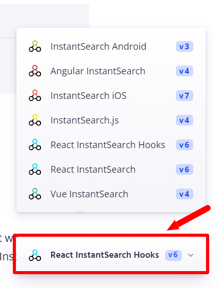

[Algolia](https://www.algolia.com/)は、超高速のサイト内検索を実現する、同名の会社の検索エンジン製品です。

様々なサイトに採用されており、エンジニアの方であればドキュメンテーション系でAlgoliaのロゴをご覧になったこともあると思います。Gatsby.jsのドキュメントでも採用されていますね。

Google Custom Searchは導入の敷居は低いですが、せっかくのJamstackサイトがGoogleのスクリプトで重くなってしまうため、今回このAlgoliaをGatsby.jsサイトに導入してみました。

動作環境：

- Node.js v18.16.0
- React v18.2.0
- Gatsby.js v5.9.0
- gatsby-plugin-algolia v1.0.3
- algoliasearch v4.17.0
- react-instantsearch-hooks-web v6.42.2

ざっくり4ステップです。

1. Algoliaへのアカウント登録・プロジェクト側の設定
2. 検索用データの生成・保存
3. 検索結果をサイトに表示する機能の構築
4. スタイルを整える

尚、今回の例では「Markdownのブログを検索させる」前提とします。ヘッドレスCMSからGraphQLクエリを引っ張ってきている場合は、クエリの取得部分をご自身の状況に合わせて書き換えて下さい。

## Algoliaにアカウント登録

まずはAlgoliaにサインアップし、新規のインデックスデータの名前を作ります。インデックス名は、運用環境により`dev_`や`test_`、`prod_`などの接頭語をつける旨が公式でアドバイスされています。


インデックス名を登録したら、「2. Configure search relevance」を無視して、左下の⚙️**Settings -> API Keys**へ進みます。


「API Keys」ページで、必要なAPIキーを確認。必要なのは、上から3つです。

- Application ID
- Search-Only API Key
- Admin API Key


これらは後に必要になるため、Algoliaの画面はとりあえずこのままにしておきます。

## Gatsby.js用のAlgolia公式プラグイン（検索データ作成用）

Algoliaが用意しているGatsby.js用のプラグイン、[gatsby-plugin-algolia](https://www.gatsbyjs.com/plugins/gatsby-plugin-algolia/)をインストール。

```bash
# npmの場合
npm install gatsby-plugin-algolia

# yarnの場合
yarn add gatsby-plugin-algolia
```

インストールが完了したら、gatsby-config.jsにプラグイン情報を追記します。

<div class="filename">gatsby-config.js</div>

```js
require("dotenv").config({
  path: `.env.${process.env.NODE_ENV}`,
})

module.exports = {
  //...
  plugins: [
    //...
    {
      resolve: `gatsby-plugin-algolia`,
      options: {
        appId: process.env.ALGOLIA_APP_ID,
        apiKey: process.env.ALGOLIA_API_KEY,
        indexName: process.env.ALGOLIA_INDEX_NAME,
        queries: [
          {
            query: `{
              // ここにクエリを追加
            }`,
            transformer: ({ data }) =>
              data.allMarkdownRemark.edges.flatMap(({ node }) => {
                return {
                  // ここにクエリからAlgoliaに登録するオブジェクトを記載
                }
              }),
          },
        ],
        chunkSize: 10000,
      },
    },
  ]
}
```

先ほどのAlgoliaのページで確認したAPIキーのうち、**アプリケーションID**・**Admin API Key**の2つと、作成したインデックス名を環境変数として使用します。`.env.production`ファイルに記載。

<div class="filename">.env.production</div>

```text
ALGOLIA_APP_ID=[Application ID]
ALGOLIA_API_KEY=[Admin API Key]
ALGOLIA_INDEX_NAME=[your_index_name]
```

検索データの構築はビルド時にのみ動くので、`.env.development`には記載不要です（`ALGOLIA_INDEX_NAME`のみ後で使用）。

## 検索用データを生成してAlgoliaに送る

### 検索用データ生成ようのAlgolia製Gatsby.js用プラグイン

Algoliaを使うには、Algolia上に予め検索用のデータを保存しておく必要があります。データ構築・保存作業に使うのが、先ほどインストールしたgatsby-plugin-algoliaです。

`gatsby-config.js`のプラグイン情報に、Algoliaに保存したいインデックスデータのクエリを追記すれば、もう動きます。

とは言え、「**何を検索データとしてAlgoliaに保存しておきたいか**」が重要です。不要なデータもコストを消費してしまうため、厳選しましょう。

当記事の例では、MarkdownのYAML Frontmatterデータから、以下を利用することにします。

- タイトル
- スラッグ（IDとして使用）
- 抜粋文
- カテゴリー

Algoliaに送るクエリはこうなりました。

<div class="filename">gatsby-config.js</div>

```js
module.exports = {
  //...
  plugins: [
    //...
    {
      resolve: `gatsby-plugin-algolia`,
      options: {
        appId: process.env.ALGOLIA_APP_ID,
        apiKey: process.env.ALGOLIA_API_KEY,
        indexName: process.env.ALGOLIA_INDEX_NAME,
        queries: [
          {
            query: `{
              allMarkdownRemark {
                edges {
                  node {
                    frontmatter {
                      title
                      slug
                      description
                      categories
                    }
                  }
                }
              }
            }`,
            transformer: ({ data }) =>
              data.allMarkdownRemark.edges.flatMap(({ node }) => {
                return {
                  objectID: node.frontmatter.slug,
                  excerpt: node.frontmatter.description,
                  title: node.frontmatter.title,
                  categories: node.frontmatter.categories.map(
                    (category) => category.title
                  ),
                }
              }
            ),
          },
        ],
        chunkSize: 10000,
      },
    }
  ]
}
```

Algoliaでは`objectID`がデータ管理に使われており、`objectID`を基準に差分判定がされます。

今回はスラッグを`objectID`にしていますが、スラッグが変更になると、差分判定に無駄が出てしまいます。スラッグが頻繁に変わる可能性がある場合は、他のデータを充てるようにして下さい。

### ビルドをして検索用データをAlgoliaに送る

ここまでで、検索用データの構築・Algoliaへ送信の準備が整いました。

ローカル上でビルドをしてみて、ビルドの終盤にAlgoliaへデータ送信が行われた旨が表示されれば完了です。

```bash
gatsby build
...
success index to Algolia - 10.728s - Done!
...
```

Algoliaのダッシュボードを見ると、インデックスにデータが保存されているのが確認出来ます。


クエリに`image:url`含めて送れば、画像を登録することも可能です。

## 検索結果を表示させる

次に、検索結果をサイト上で表示するための作業を行います。

### ライブラリのインストール

検索結果を表示するために使うライブラリは、[react-instantsearch-hooks-web](https://www.npmjs.com/package/react-instantsearch-hooks-web)です（React v16.8.0以上）。[algoliaseach](https://www.npmjs.com/package/algoliasearch)も必要なので、同時にインストールします。

```bash
# npmの場合
npm install algoliasearch react-instantsearch-hooks-web

# yarnの場合
yarn add algoliasearch react-instantsearch-hooks-web
```

Algoliaはこれまで複数の同様のライブラリをリリースしており、上記[react-instantsearch-hooks-web](https://www.npmjs.com/package/react-instantsearch-hooks-web)が2023年22月時点の最新型となっています（重要ポイント）。

公式ドキュメントではこれまでの全てのライブラリの情報が収められている上、別々のライブラリでも同じ名前のコンポーネントがあるので（互換性もあったりなかったり）、ドキュメント検索時には注意が必要です。

当エントリーを参考にしてAlgoliaを導入する場合は、ドキュメント検索時に画面右下のライブラリ名が「**React InstantSearch Hooks v6**」になっているかを確認して下さい。



### 検索結果を表示させる

componentsフォルダに、algolia.jsというファイルを用意。以下のコードは、検索結果を表示させるための基本の形です。

<div class="filename">/src/components/algolia.js</div>

```js
import React, { useMemo } from "react"
import algoliasearch from "algoliasearch/lite"
import { InstantSearch } from "react-instantsearch-hooks-web"

const Algolia = () => {
  const searchClient = useMemo(
    () =>
      algoliasearch(
        process.env.GATSBY_ALGOLIA_APP_ID,
        process.env.GATSBY_ALGOLIA_SEARCH_KEY
      ),
    []
  )

  return (
    <InstantSearch
      searchClient={searchClient}
      indexName={process.env.ALGOLIA_INDEX_NAME}
    >
      {/* ここにウィジェット */}
    </InstantSearch>
  )
}

export default Algolia
```

`searchClient`は`useMemo()`によりメモ化して、再レンダリングしパフォーマンス向上を図ります（[参考](https://www.gatsbyjs.com/docs/adding-search-with-algolia/)）。

環境変数を.env.developmentと.env.productionの両方に記載。

```text
ALGOLIA_INDEX_NAME=[your_index_name]
GATSBY_ALGOLIA_APP_ID=[Application ID]
GATSBY_ALGOLIA_SEARCH_KEY=[Search-Only API Key]
```

※`ALGOLIA_INDEX_NAME`は先ほど書いたものと同じ

#### 検索ボックスを作る

検索ボックスは、[SearchBox](https://www.algolia.com/doc/api-reference/widgets/search-box/react-hooks/)というウィジェットを利用。

<div class="filename">/src/components/algolia.js</div>

```js
import React, { useMemo } from "react"
import algoliasearch from "algoliasearch/lite"
import { InstantSearch, SearchBox } from "react-instantsearch-hooks-web"

const Algolia = () => {
  const searchClient = useMemo(
    () =>
      algoliasearch(
        process.env.GATSBY_ALGOLIA_APP_ID,
        process.env.GATSBY_ALGOLIA_SEARCH_KEY
      ),
    []
  )

  return (
    <InstantSearch
      searchClient={searchClient}
      indexName={process.env.ALGOLIA_INDEX_NAME}
    >
      <SearchBox />
    </InstantSearch>
  )
}

export default Algolia
```

このAlgoliaコンポーネントを他のコンポーネントやテンプレート内で使えば、サイト上に検索ボックスが表示出来ます。

#### 検索結果表示部分を作る

検索結果表示には、[Hits](https://www.algolia.com/doc/api-reference/widgets/hits/react-hooks/)というウィジェットを利用。

<div class="filename">/src/components/algolia.js</div>

```js
import React, { useMemo } from "react"
import algoliasearch from "algoliasearch/lite"
import { InstantSearch, SearchBox, Hits } from "react-instantsearch-hooks-web"

const Algolia = () => {
  const searchClient = useMemo(
    () =>
      algoliasearch(
        process.env.GATSBY_ALGOLIA_APP_ID,
        process.env.GATSBY_ALGOLIA_SEARCH_KEY
      ),
    []
  )

  const Hit = ({ hit }) => {
    return (
      <Link to={`/blog/${hit.objectID}/`}>
        <article>
          <h1>{hit.title}</h1>
          <p>{hit.excerpt}...</p>
          <ul>{hit.categories.map((category) => <li>{category}</li>)}</ul>
        </article>
      </Link>
    )
  }

  return (
    <InstantSearch
      searchClient={searchClient}
      indexName={process.env.ALGOLIA_INDEX_NAME}
    >
      <SearchBox />
      <Hits hitComponent={Hit} />
    </InstantSearch>
  )
}

export default Algolia
```

## スタイルを整える

後はスタイルを整えるだけです。

1. 独自クラス名を調整する
2. ウィジェットに`classNames`または`className`プロパティを付与

Algoliaによるコードには独自クラス名が割り振られているので、そのクラス名を利用してスタイリングが可能です。

または、`classNames``className`プロパティを使って、CSSモジュールやTailwind CSSなどでスタイリングすることも出来ます。

## （本番前に）Gatsby.jsプラグインの調整

### Algoliaへデータを送信しない設定

Algoliaへビルドの度に送信しないようにするには、`dryRun`を`true`にしておきます。

<div class="filename">gatsby-config.js</div>

```js
{
resolve: `gatsby-plugin-algolia`,
  options: {
    //...
    dryRun: true,
  }
}
```

この設定により、ビルドの最後にAlgoliaへのデータ送信が行われなかった旨が表示されます。

```bash
gatsby build
...
==== THIS IS A DRY RUN ====================
- No records will be pushed to your index
- No settings will be updated on your index
```

私の場合は、必要な時のみ「`dryRun: false`」とし、通常のビルドではAlgoliaへ送信しないようにしています。

状況に応じて、どのポイントのビルドでインデックスをAlgoliaに送るかご判断下さい。

## 参考サイト

- [Algolia](https://www.algolia.com/)
- [gatsby-plugin-algolia](https://www.gatsbyjs.com/plugins/gatsby-plugin-algolia/)
- [Adding Search with Algolia](https://www.gatsbyjs.com/docs/adding-search-with-algolia/) ※以前のライブラリ（react-instantsearch-dom）を使っている点には注意