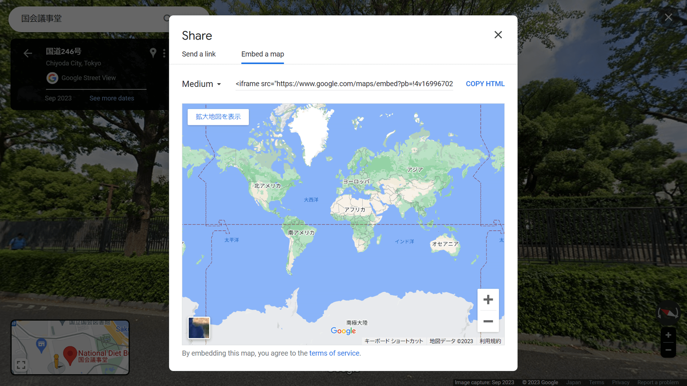

Since the morning of November 10, 2023, I got a huge error on the embed code for Google Street View.



Since Google didn't fix it even after 24 hours, I decided to switch to the Maps Embed API code.

Here are the requirements;

- Already registered with Google Cloud Platform (GCP)
- Already generated a Maps Embed API key

If you haven't already registered with Google Cloud Platform (GCP) or generated an API key, please do so before reading this article.

Note: I have published an automated tool to convert the regular Street View embed code to the Maps Embed API format.

- [Street View Maps Embed API converter](https://profound-arithmetic-7fd00d.netlify.app)
- [GitHub repogitory](https://github.com/mayumih387/streetview-converter)

## What is the Maps Embed API?

The regular iframe embed code for Google Street View is open to everyone and doesn't require a login.

On the other hand, the [Google Maps Embed API](https://developers.google.com/maps/documentation/embed/get-started) requires a registration with Google Cloud Platform (GCP), but allows you to generate more detailed embed code.

It may sound difficult, but it's not to realize the same view as the regular one.

In fact, it's more complicated to manage yourself in the Google Cloud Platform (GCP) than to generate the embed codes; I don't really like the system, though...

## Comparison of embed code parameters

Here is a comparison of the embed code parameters: regular code (after `?pb=`) and Maps Embed API (researched by me).

|                                       |        Regular code         | Maps Embed API |
| ------------------------------------- | :-------------------------: | :------------: |
| Timestamp when you get the code       |             !4v             |       -        |
| Zoom level?                           |             !6m             |     zoom ?     |
| Latitude and longitude                | **!1d** (lat) **!2d** (lng) |  **location**  |
| Panorama ID                           |           **!1s**           |    **pano**    |
| Compass heading of the camera         |           **!3f**           |  **heading**   |
| Angle of the camera                   |           **!4f**           |   **pitch**    |
| Horizontal field of view of the image |             !5f             |      fov       |
| Center of the map view                |              -              |     center     |
| Type of map tiles                     |              -              |    maptype     |
| Language                              |              -              |    language    |
| Region                                |              -              |     region     |

The required parameter for the `streetview` mode is `location` or `pano`. In this entry, I use 5 parameters including the both of them: !1s, !1d, !2d, !3f, !4f.

Please refer to the official documents for the parameters;

Link - [Embedding a map, streetview mode | Maps Embed API | Google for developers](https://developers.google.com/maps/documentation/embed/embedding-map?hl=en#streetview_mode)

## Notes on parameter conversion

### pano

The `pano` takes precedence over `location`, and if `pano` is missing or not found, the latest street view from `location` will be displayed. The `pano` must be specified if you want to display an older street view.

### fov

Most of the original parameters can be used as Maps Embed API url parameters, except `fov`.

`fov` can be considered as the zoom level. Its value can be a degree between 10° - 100°; the smaller the number, the greater the zoom level. According to my tests, the original `!5f` value works like this in the Maps Embed API's `fov`;

```js
const fov = -23.593191040721845 * {`!5f value`} + 93.45191850432671
```

In this entry I ignore the `fov` value because we can't do regex replacement in a text editor. To replace everything with a calculation, we have to program with Python or JavaScript.

### zoom

In my environment, the `zoom` value doesn't work with the Maps Embed API like the official documents indicate.

## Example of converting the code to the Maps Embed API

Here is an example of the conversion of the regular embed code to the Maps Embed API format;

<div class="filename">Before</div>

```text
https://www.google.com/maps/embed
  ?pb=!4v1699670978197
  !6m8
  !1m7
  !1s1hhfamxJUArcEFya_U4ZNQ
  !2m2
  !1d35.67638768398374
  !2d139.7468269623147
  !3f266.70573258721475
  !4f10.567303311921137
  !5f0.7820865974627469
```

<div class="filename">After</div>

```text
https://www.google.com/maps/embed/v1/streetview
  ?location=35.67638768398374%2C139.7468269623147
  &pano=1hhfamxJUArcEFya_U4ZNQ
  &heading=266.70573258721475
  &pitch=10.567303311921137
  &key=YOUR_API_KEY
```

## Doing replace all with regular expressions

This time, I did replace all of the regular iframe Street View embed code in VS Code. Replace `YOUR_API_KEY` as yours.

Note that the original code is assumed to have no line breaks.

### Search regex

```text
<iframe .+!1s(.+)!.+!1d(-?[\d.]+)!2d(-?[\d.]+)!3f(-?[\d.]+)!4f(-?[\d.]+).+</iframe>
```

### Replace regex

```text
<iframe src="https://www.google.com/maps/embed/v1/streetview?location=$2%2C$3&pano=$1&heading=$4&pitch=$5&key=YOUR_API_KEY" width="600" height="450" style="border:0" loading="lazy" allowfullscreen referrerpolicy="no-referrer-when-downgrade"></iframe>
```

### Additional comments

It depends on how you manage your embed code whether you can do replace all.

If you are using WordPress, the Search Regex plugin seems to be good for regular expression replacement. Be sure to save backups beforehand so that you can recover in case of failure.
