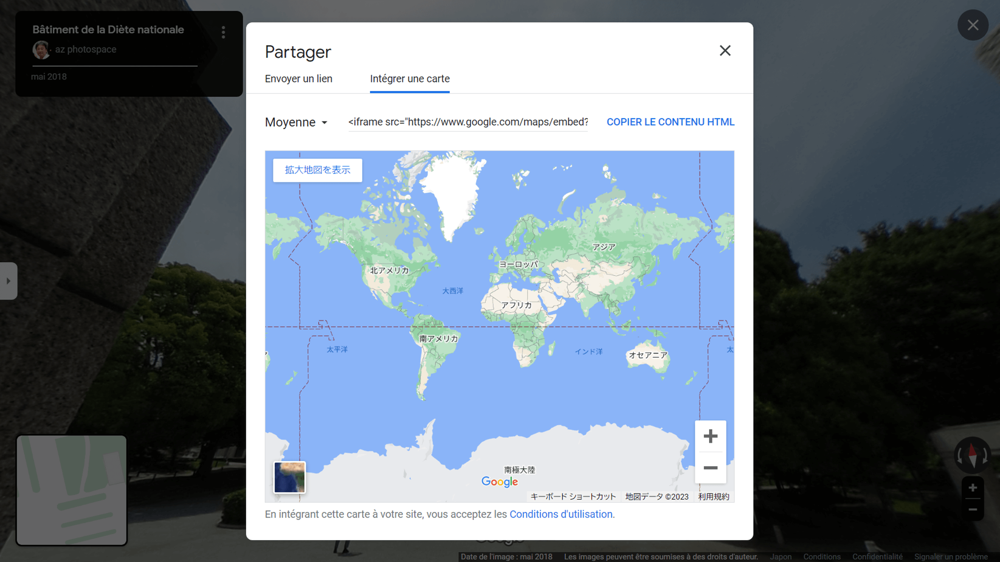

Depuis le matin du 10 novembre 2023, j'ai une énorme erreur sur le code d'intégration de Google Street View.



Comme Google n'a pas résolu le problème même après 24 heures, j'ai décidé de changer pour le code API Maps Embed.

Voici les conditions requises;

- Déjà enregistré auprès de Google Cloud Platform (GCP)
- Déjà généré une clé API Maps Embed

Si vous ne vous êtes pas encore inscrit à Google Cloud Platform (GCP) ou si vous n'avez pas encore généré une clé API, veuillez le faire avant de lire cet article.

Remarque : j'ai publié un outil automatisé pour convertir le code d'intégration générique de Streetview au format l'API Maps Embed.

- [Streetview Maps Embed API converter](https://profound-arithmetic-7fd00d.netlify.app)
- [Répertoire GitHub](https://github.com/mayumih387/streetview-converter)

## Qu'est-ce que l'API Maps Embed ?

Le code d'intégration iframe normal pour Google Street View est ouvert à tous et ne nécessite pas de login.

En revanche, [Google Maps Embed API](https://developers.google.com/maps/documentation/embed/get-started) nécessite un enregistrement auprès de Google Cloud Platform (GCP), mais permet de générer un code d'intégration plus détaillé.

Cela peut sembler difficile, mais il ne s'agit pas de réaliser la même vue que la vue normale.

En fait, il est plus compliqué de se gérer soi-même dans la Google Cloud Platform (GCP) que de générer les codes d'intégration ; je n'aime pas vraiment le système, cependant...

## Comparaison des paramètres du code d'intégration

Voici une comparaison des paramètres du code d'intégration : code normal (après `?pb=`) et l'API Maps Embed (que j'ai recherché).

|                                       |       LE code normal        | l'API Maps Embed |
| ------------------------------------- | :-------------------------: | :--------------: |
| Timestamp de l'obtention du code      |             !4v             |        -         |
| Niveau de zoom ?                      |             !6m             |      zoom ?      |
| Latitude et longitude                 | **!1d** (lat) **!2d** (lng) |   **location**   |
| Panorama ID                           |           **!1s**           |     **pano**     |
| Direction de la boussole de la caméra |           **!3f**           |   **heading**    |
| Angle de la caméra                    |           **!4f**           |    **pitch**     |
| Champ de vision horizontal de l'image |             !5f             |       fov        |
| Centre de la vue plan                 |              -              |      center      |
| Type de tuiles de carte               |              -              |     maptype      |
| Langue                                |              -              |     language     |
| Région                                |              -              |      region      |

Le paramètre requis pour le mode `streetview` est `location` ou `pano`. Dans cet article, j'utilise 5 paramètres incluant les deux : !1s, !1d, !2d, !3f, !4f.

Veuillez vous référer aux documents officiels pour les paramètres ;

Lien - [Intégration d'une carte, mode streetview | l'API Maps Embed | Google for developers](https://developers.google.com/maps/documentation/embed/embedding-map?hl=en#streetview_mode)

## Notes sur la conversion des paramètres

### pano

Le `pano` est prioritaire sur le `location`, et si le `pano` est manquant ou introuvable, la dernière vue de la rue du `location` sera affichée. Le `pano` doit être spécifié si vous souhaitez afficher une vue de rue plus ancienne.

### fov

La plupart des paramètres originaux peuvent être utilisés comme paramètres d'url de l'API Maps Embed, à l'exception de `fov`.

`fov` peut être considéré comme le niveau de zoom. Sa valeur peut être un degré entre 10° et 100° ; plus le nombre est petit, plus le niveau de zoom est élevé. D'après mes tests, la valeur originale `!5f` fonctionne comme suit dans le paramètre `fov` de l'API Maps Embed ;

```js
const fov = -23.593191040721845 * {`!5f valeur`} + 93.45191850432671
```

Dans cette entrée, j'ignore la valeur `fov` parce que nous ne pouvons pas faire de remplacement de regex dans un éditeur de texte. Pour tout remplacer par un calcul, nous devons programmer avec Python ou JavaScript.

### zoom

Dans mon environnement, la valeur `zoom` ne fonctionne pas avec l'API Maps Embed comme l'indiquent les documents officiels.

## Exemple de conversion du code vers l'API Maps Embed

Voici un exemple de conversion du code d'intégration normal au format Maps Embed API ;

<div class="filename">Avant</div>

```text
https://www.google.com/maps/embed
  ?pb=!4v1699670978197
  !6m8
  !1m7
  !1s1hhfamxJUArcEFya_U4ZNQ
  !2m2
  !1d35.67638768398374
  !2d139.7468269623147
  !3f266.70573258721475
  !4f10.567303311921137
  !5f0.7820865974627469
```

<div class="filename">Après</div>

```text
https://www.google.com/maps/embed/v1/streetview
  ?location=35.67638768398374%2C139.7468269623147
  &pano=1hhfamxJUArcEFya_U4ZNQ
  &heading=266.70573258721475
  &pitch=10.567303311921137
  &key=YOUR_API_KEY
```

## Remplacer tout par des expressions régulières

Cette fois-ci, j'ai remplacé tout le code d'intégration de l'iframe streetview dans VS Code. Remplacez `YOUR_API_KEY` par la vôtre.

Notez que le code original est supposé ne pas avoir de sauts de ligne.

### Rechercher les expressions rationnelles

```text
<iframe .+!1s(.+)!.+!1d(-?[\d.]+)!2d(-?[\d.]+)!3f(-?[\d.]+)!4f(-?[\d.]+).+</iframe>
```

### Remplacer les expressions rationnelles

```text
<iframe src="https://www.google.com/maps/embed/v1/streetview?location=$2%2C$3&pano=$1&heading=$4&pitch=$5&key=YOUR_API_KEY" width="600" height="450" style="border:0" loading="lazy" allowfullscreen referrerpolicy="no-referrer-when-downgrade"></iframe>
```

### Commentaires supplémentaires

Cela dépend de la façon dont vous gérez votre code d'intégration, si vous pouvez tout remplacer.

Si vous utilisez WordPress, le plugin Search Regex semble être une bonne solution pour le remplacement des expressions régulières. Veillez à enregistrer des sauvegardes au préalable afin de pouvoir récupérer en cas d'échec.
