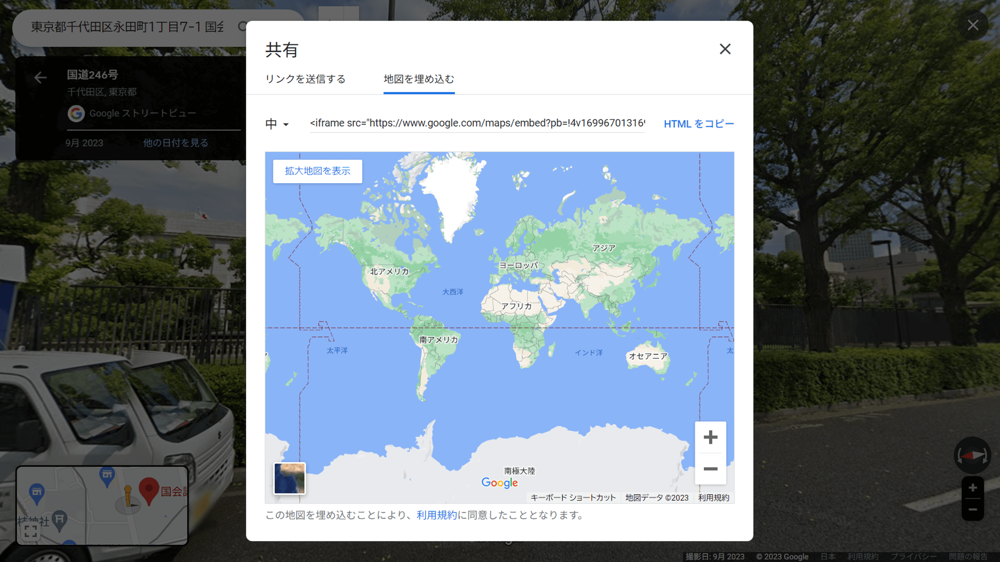

2023年11月10日の朝から突如、Googleマップのストリートビューの埋め込みがおかしくなりました。



1日経っても表示は改善されていなかったため、急遽Maps Embed APIに変更しました。

今回は、以下の前提で話を進めます。

- Google Cloud Platformに登録済
- Maps Embed APIが利用可能なAPIキーを生成済

登録やAPIキーの生成がまだの場合は、公式の案内にしたがって進めてください。

## Maps Embed APIとは

通常のGoogleマップの埋め込みコードは、Googleへのログインなしに誰でも取得できます。

一方、今回説明する[Google Maps Embed API](https://developers.google.com/maps/documentation/embed/get-started?hl=ja)では、Google Cloud Platform（GCP）への登録が必要ですが、より高度な地図の埋め込みを行うことができます。

難しく聞こえるかもしれませんが、通常のストリートビューのと同等の表示ができる埋め込みコードを取得（生成）することが可能です。

ただ、確かにコードの作成自体は難しくないのですが、Google Cloud Platform（GCP）の仕組みや管理画面が技術者以外には難しいと思います。かく言う私も苦手です・・・。

## 埋め込みコードのパラメーター比較

通常のストリートビューの埋め込みコードのパラメーター（`?pb=`以下）と、Maps Embed APIのパラメーターの相関表です（当サイト調べ）。

|                              |           通常コード            | Maps Embed API |
| ---------------------------- | :-----------------------------: | :------------: |
| コード取得時のタイムスタンプ |               !4v               |       -        |
| ズームレベル？               |               !6m               |     zoom ?     |
| 緯度・経度                   | **!1d**（緯度） **!2d**（経度） |  **location**  |
| パノラマID                   |             **!1s**             |    **pano**    |
| カメラのコンパス方位         |             **!3f**             |  **heading**   |
| カメラの角度                 |             **!4f**             |   **pitch**    |
| カメラの画角                 |               !5f               |      fov       |
| 地図表示の中心               |                -                |     center     |
| 地図タイルのタイプ           |                -                |    maptype     |
| 言語                         |                -                |    language    |
| 地域コード                   |                -                |     region     |

Maps Embed APIの`streetview`モードでの必須パラメーターは`location`もしくは`pano`です。今回はその2つを含めた太字の5項目（!1s、!1d、!2d、!3f、!4f）を変換に利用します。

Maps Embed APIの`streetview`モードで設定可能なパラメーターについては、以下の公式情報を参照ください。

リンク - [地図の埋め込み streetviewモード | Maps Embed API | Google for developers](https://developers.google.com/maps/documentation/embed/embedding-map?hl=ja#streetview_mode)

## パラメーター変換時の注意点

### pano値

`pano`は`location`よりも優先され、`pano`がない・見つからない場合は`location`から最新のストリートビューが表示されます。`pano`は古いストリートビューを表示したい場合に指定が必要です。

### fov値

Maps Embed APIのコードのパラメーターに変換する際、基本的には数値がそのまま利用できます。ただし`fov`は、そのまま使えません。

`fov`は拡大率と考えて差し支えないと思います。取れる値は10\~100の間（小さいほうがズーム大）です。ざっくりと40を元の数値で割る計算をする必要がありそうです（要検証）。

今回は文字列を正規表現を使っての一括変換なので計算ができません。そのため`fov`値は省きます。`fov`値も一括置換に含めたい場合は、PythonやJavaScriptのプログラムを使って置換させる必要があります。

### zoom値

自分が試したところ、なぜか`zoom`値はMaps Embed APIでは認識されず、エラーになりました。

## Maps Embed APIコードへの変換例

通常の埋め込みコードのパラメーターをMaps Embed API用に変換すると、以下のようになります。`YOUR_API_KEY`に、ご自身で生成した有効なAPIキーを代入してください。

<div class="filename">変換前</div>

```text
https://www.google.com/maps/embed
  ?pb=!4v1699670978197
  !6m8
  !1m7
  !1s1hhfamxJUArcEFya_U4ZNQ
  !2m2
  !1d35.67638768398374
  !2d139.7468269623147
  !3f266.70573258721475
  !4f10.567303311921137
  !5f0.7820865974627469
```

<div class="filename">変換後</div>

```text
https://www.google.com/maps/embed/v1/streetview
  ?location=35.67638768398374%2C139.7468269623147
  &pano=1hhfamxJUArcEFya_U4ZNQ
  &heading=266.70573258721475
  &pitch=10.567303311921137
  &key=YOUR_API_KEY
```

## 正規表現で一括変換する方法

今回はVS Codeで管理しているファイル内のすべてのストリートビューの埋め込みコードを、Maps Embed API用のコードに正規表現で一括変換しました。`YOUR_API_KEY`はご自身のものに置き換えてください。

なお、元のコードには改行がない前提です。

### 検索文字列

```text
<iframe .+!1s(.+)!.+!1d(-?[\d.]+)!2d(-?[\d.]+)!3f(-?[\d.]+)!4f(-?[\d.]+).+</iframe>
```

### 置換文字列

```text
<iframe src="https://www.google.com/maps/embed/v1/streetview?location=$2%2C$3&pano=$1&heading=$4&pitch=$5&key=YOUR_API_KEY" width="600" height="450" style="border:0" loading="lazy" allowfullscreen referrerpolicy="no-referrer-when-downgrade"></iframe>
```

### 補足

一括変換が可能かどうかは、ストリートビューの埋め込みコードをどのように管理しているかにもよります。

WordPressでしたら、正規表現で置換ができる「Search Regex」プラグインあたりがよさそうです（未検証）。一括変換の前には失敗しても戻せるように、必ずバックアップを取っておきましょう。
