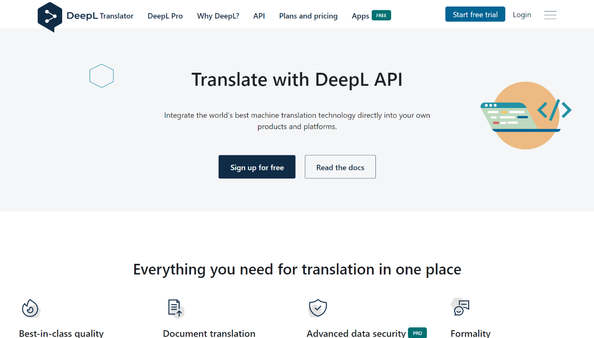
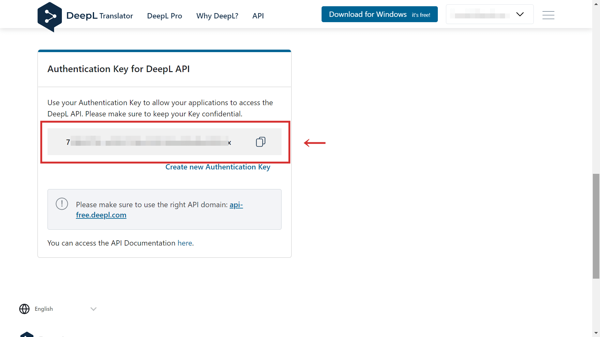
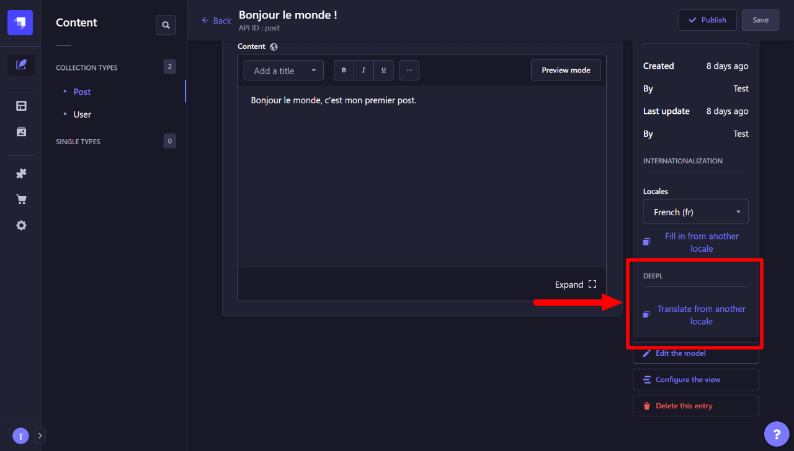

This entry is about how to add the DeepL plugin to Strapi, a Headless CMS.

If you are already used to Strapi, it's not that difficult, I imagine.

You'll need free (or pro) DeepL API key to use this plugin. The free API account contains 500,000 characters per month. For your information, this article is about 2,000 characters.

Working environment:

- Node.js v16.18.0
- Strapi v4.4.3
- @strapi/plugin-i18n v4.4.3
- strapi-plugin-deepl v0.3.8

## Create an account on DeepL (free of charge)

To use DeepL API, you need a free account with credit card registration.

https://www.deepl.com/pro-api



Once you're done with the registration, you can get the API key at "Authentication Key from DeepL API" under the Account tab on [your account page](https://www.deepl.com/account/summary).



## Install official plugins for DeepL to Strapi

To use Strapi with DeepL, two official plugins must be installed.

- [@strapi/plugin-i18n](https://www.npmjs.com/package/@strapi/plugin-i18n)
- [strapi-plugin-deepl](https://market.strapi.io/plugins/strapi-plugin-deepl)

```bash
# with npm
$ npm install @strapi/plugin-i18n
$ npm install strapi-plugin-deepl

# with yarn
$ yarn add @strapi/plugin-i18n
$ yarn add strapi-plugin-deepl
```

## Add DeepL API key to .env

[Official guidance](https://market.strapi.io/plugins/strapi-plugin-deepl) also indicates how to configure the details.

In this entry, let us try just adding the API key to `.env` to make it simpler.

<div class="filename">.env</div>

```md
DEEPL_API_KEY=[yourApiKey]
DEEPL_API_FREE=true
```

## Build then develop Strapi

You are almost there.

Now Strapi must be re-built with the DeepL plugin. So just run build then (or and) develop Strapi.

```bash
# with npm
$ npm run build && npm run develop

# with yarn
$ yarn build && yarn develop
```

Here it is. You can now use DeepL in the editor.

## How to use DeepL in the editor

In the editor view, you'll see "DEEPL - Translate from another locale" on the right sidebar. Just click it.



Then choose the language of the base content. Be careful that the content previously edited will be lost after activating DeepL translation.

That's it.