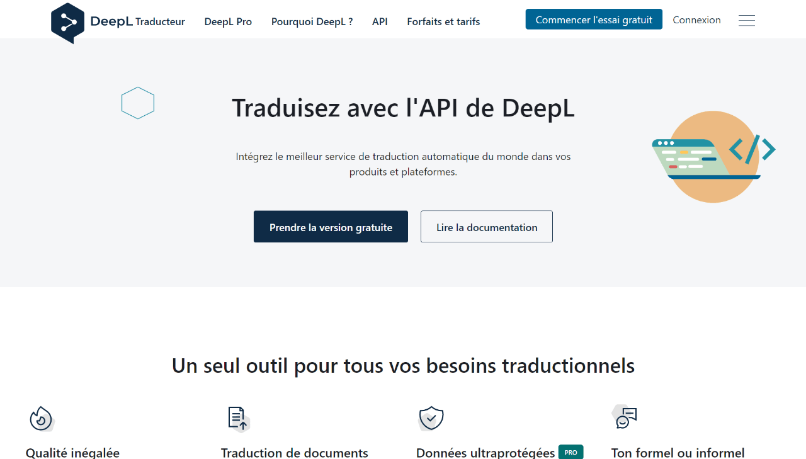
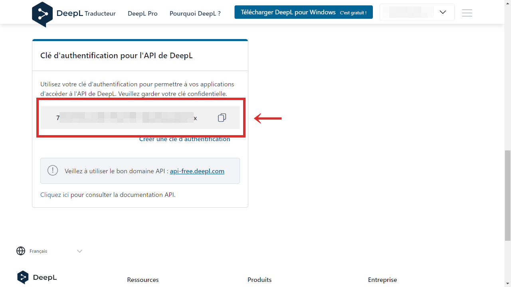

Cet article explique comment ajouter le plugin DeepL à Strapi, un CMS sans tête.

Si vous êtes déjà habitué à Strapi, je ne crois pas que ce ne soit pas si difficile.

Vous aurez besoin d'une clé API gratuite (ou pro) de DeepL pour utiliser ce plugin. Le compte API gratuit contient 500 000 caractères par mois. Pour votre information, cet article fait environ 2 000 caractères.

Environnement de fonctionnement:

- Node.js v16.18.0
- Strapi v4.4.3
- @strapi/plugin-i18n v4.4.3
- strapi-plugin-deepl v0.3.8

## Créer un compte sur DeepL (gratuit)

Pour utiliser l'API DeepL, vous devez disposer d'un compte gratuit avec enregistrement de la carte de crédit.

https://www.deepl.com/pro-api



Une fois l'inscription terminée, vous pouvez obtenir la clé API en cliquant sur "Clé d'authentification de l'API DeepL" sous l'onglet "Compte" de [la page de votre propre compte](https://www.deepl.com/account/summary).



## Installer les plugins officiels pour DeepL à Strapi

Pour utiliser Strapi avec DeepL, 2 plugins officiels doivent être installés.

- [@strapi/plugin-i18n](https://www.npmjs.com/package/@strapi/plugin-i18n)
- [strapi-plugin-deepl](https://market.strapi.io/plugins/strapi-plugin-deepl)

```bash
# avec npm
$ npm install @strapi/plugin-i18n
$ npm install strapi-plugin-deepl

# avec yarn
$ yarn add @strapi/plugin-i18n
$ yarn add strapi-plugin-deepl
```

## Ajouter la clé API de DeepL à .env

[Les directives officielles](https://market.strapi.io/plugins/strapi-plugin-deepl) indiquent également comment configurer les détails.

Dans cet article, essayons juste d'ajouter la clé API à `.env` pour faire plus simple.

<div class="filename">.env</div>

```md
DEEPL_API_KEY=12345678-9012-3456-7890-123456789012
DEEPL_API_FREE=true
```

## Construire puis développer Strapi

Vous y êtes presque.

Maintenant Strapi doit être recompilé avec le plugin DeepL. Il suffit donc de lancer build puis (ou et) develop Strapi.

```bash
# avec npm
$ npm run build && npm run develop

# avec yarn
$ yarn build && yarn develop
```

Voilà. Vous pouvez utiliser maintenant DeepL dans l'éditeur.

## Comment utiliser DeepL dans l'éditeur

Dans la vue de l'éditeur, vous verrez "DEEPL - Translate from another locale" sur la barre latérale droite. Il suffit de cliquer dessus.


Choisissez ensuite la langue du contenu de base. Attention, le contenu précédemment édité sera perdu après avoir activé la traduction de DeepL.

C'est tout.