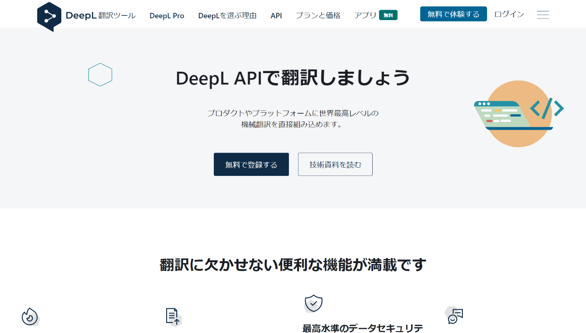
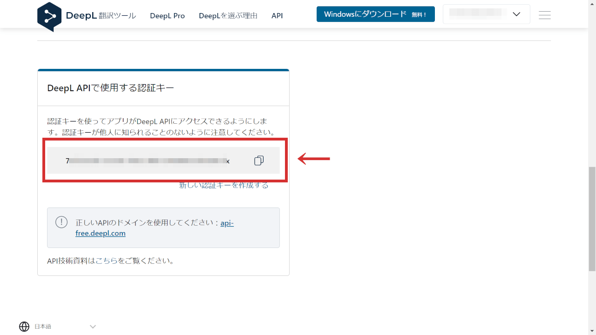

ヘッドレスCMSのStrapiに、DeepLのプラグインを追加する方法です。

すでにStrapiを使ってる方であれば、技量的には問題なくインストールできるでしょう。

DeepL翻訳をこのプラグインで利用するには、無料版APIの認証キー（API key）が必要です。DeepLの無料版APIは、月500,000文字までの制限があります。参考までに、この記事は1,500文字程度です。

動作環境：

- Node.js v16.18.0
- Strapi v4.4.3
- @strapi/plugin-i18n v4.4.3
- strapi-plugin-deepl v0.3.8

## DeepLの無料プランに登録

DeepLのAPIを利用するには、アカウント登録と、無料版でもクレジットカードの登録が必要になります。

https://www.deepl.com/pro-api



アカウント登録とクレジットカードの登録が終わったら、[自分のアカウントページ](https://www.deepl.com/account/summary)の「アカウント」タブをクリック。「DeepL APIで使用する認証キー」で、認証キー確認することができます。



## StrapiにDeepL用プラグインをインストール

StrapiでDeepLを使うには、2種類のプラグインのインストールが必要になるので、インストールします。

- [@strapi/plugin-i18n](https://www.npmjs.com/package/@strapi/plugin-i18n)
- [strapi-plugin-deepl](https://market.strapi.io/plugins/strapi-plugin-deepl)

```bash
# npmの場合
$ npm install @strapi/plugin-i18n
$ npm install strapi-plugin-deepl

# yarnの場合
$ yarn add @strapi/plugin-i18n
$ yarn add strapi-plugin-deepl
```

## .envファイルにDeepLのAPIキーを追加

[公式](https://market.strapi.io/plugins/strapi-plugin-deepl)にはプラグイン用のコンフィグファイルの作り方も載っています。

`.env`ファイルへAPIキーを記載することでも動くので、今回はシンプルにその方法で行きます。

<div class="filename">.env</div>

```md
DEEPL_API_KEY=12345678-9012-3456-7890-123456789012
DEEPL_API_FREE=true
```

## ビルドしてから立ち上げる

ここまで準備が整ったら、ほぼ完了です。

プラグインがインストールされた状態の環境を構築する必要があるため、いったんStrapiをビルドをしてから立ち上げます。

```bash
# npmの場合
$ npm run build && npm run develop

# yarnの場合
$ yarn build && yarn develop
```

これで、編集画面でDeepLが使えるようになります。

## 編集画面での使い方

複数のロケールでの編集画面において、右サイドバーに「DEEPL - Translate from another locale」という項目が出てきていますので、そこをクリックすればOK。


翻訳元の言語を選んで、反映させましょう。尚、それまで編集していた内容はすべて消えてしまうのでご注意ください。

以上です。
