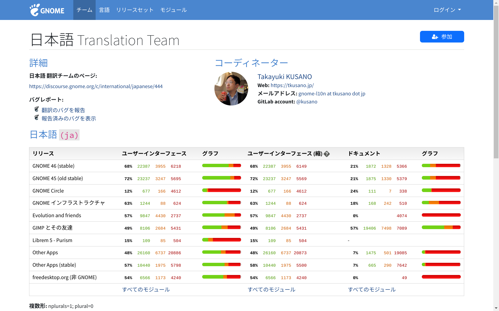

It has been 6 months since I switched from Windows to Linux (first Ubuntu, now Fedora). I'd like to share the pros and cons regarding my Linux life.

Here are my purposes for PC:

- Frontend web programming (using Node.js, Python)
- Reading articles, sending/receiving emails, watching streamings
- No gaming

Although I sometimes feel the disadvantages of Linux, I never want to go back to Windows for now.

## Advantages (about programming) 

### Lightweight, less RAM usage

Before using a native Linux, I used WSL/WSL2 on Windows. It wasn't that slow, but not that fast either. Now with Linux, it always runs fast.

WSL2 uses a maximum of 16GB RAM sometimes when I build an application on local.

With Linux, the RAM usage is less than half that, 6GB or so.

Also, I always had problems with large disk space usage by WSL2 and how to clean it up. With Linux, all you have to do is put files in a trush box or just type `rm -rf`.

Moving files is also easier because it's no longer between "Windows and Linux on WSL".

### Easier setup

To set up a working environment, I just install Node.js (I use nvm) and then clone my repositories from GitHub. Much easier than using WSL2. Git and Python3 are installed by default on Fedora.

Python only requires `venv` preparation. You can try some code on the internet as soon as you think of it. 

On Windows, I always started WSL2 or VS Code to run Node.js or Python. Now I don't have to go through those steps.

Also, [VS Codium](https://vscodium.com) sometimes didn't work well with WSL2, but that never happens on Linux.

### A Linux SSD will work on any PC (I don't know about Mac)

A Windows installed SSD won't work on any other PC because its license is tied to the motherboard.

On the other hand, a Linux installed SSD will work on any other PC (of course, the pins should match). The same goes for the USB connection.

During these 6 months, I sometimes had to work on several PCs, but only one Linux SSD always worked well.

### You can learn a lot of things

When I was using WSL2, I was just using a black window (no GUI) and the Windows file explorer.

After using a native Linux, I can see the meaning of file directories and OS architecture.

Now I understand how `wget` or `make` works on a web hosting service, even though I was just typing these commands blindly.

Also, Linux never hides files and folders, while Windows does. The architecture is crystal clear and simple. You can control everything you want.

It is to say that Linux is for those who love DIY.

## Advantages (daily use) 

### No vendor lock-in (my top priority)

The biggest reason I left Windows is to be free of vendor lock-ins.

I started to get scared of Big Tech, especially after Sam Altman's firing from OpenAI, so I decided to keep my distance from them. I took the time to get my data off their cloud storage, move my email to the more secure Protonmail and so on.

Now I still have about 10 accounts with Outlook and Gmail, that's all for my personal use.

*But I still need to use Google Analytics, Firebase or GCP for work...

Linux doesn't require accounts from specific companies, which means you can switch to any other distribution whenever you want.

Now I have an incredible sense of freedom: much less dependence on any Big Tech.

### Fast OS Updates

Anyone who has ever tried to clean install Windows has had the same experience - it takes at least hours, sometimes half a day. But not with Linux.

Linux provides OS updates (with Fedora it's daily), but it finishes in less than 10 minutes. It is because of its simplicity compared to Windows.

### No problem with Japanese e-Tax

On the surface, the Japanese government still excludes Linux from its browser-based online tax system.

But with user-agent switching and NFC authentication on my Android smartphone, I was able to submit a tax return.

## Disadvantages I feel about Linux

Of course, there are some disadvantages. Mostly they are problems with applications.

It is well known that Adobe doesn't provide its software for Linux. If you are an Adobe user, it seems impossible to change your PC to Linux.

### Office Suite

I used to use WPS Office on Windows. WPS Office is available for Linux, but it has a fatal flaw with the input method for Japanese users.

So I use Libre Office, which is pre-installed on Fedora. It works well in principle, but has small problems with compatibility with MSOffice-based files or with UI localization. I'm still not used to the keyboard shortcut differences.

### No similar application like MS Paint

Although GIMP or Inkscape are available for Linux, I haven't found a "simple painting application" like MS Paint yet.

I tried Drawing, Pinta or KolourPaint, but they can't be the one for me. Or, I just have to get used to them?

### Face authentication is weaker than Windows

There is a face authentication software on Linux like Windows Hello™. It's [Howdy](https://github.com/boltgolt/howdy), a third-party application.

But its accuracy is much lower than that of Windows. The authentication in a dark room always fails, or even if it succeeds, it works slower. Also, according to the [README](https://github.com/boltgolt/howdy), the security level is also lower because it can work with "a well-printed photo of you".

On the other hand, fingerprint authentication can work - it's pre-installed on both Ubuntu and Fedora (though it didn't work well with the slide sensor).

### Japanese localization not completed (Gnome desktop issue)

I now use Fedora40 with Gnome desktop version 46.

Localization is always done by volunteers, and the Japanese localization is only 68% complete as of the end of May 2024.

Link: [Gnome Japanese Translation Team](https://l10n.gnome.org/teams/ja/ "&copy; The GNOME Foundation")

You will never have a problem with daily use because most of the important parts are already translated. However, I can't deny that I feel uncomfortable when there are some English words among the Japanese ones.

With Ubuntu, I imagine these problems are resolved as the Ubuntu Japanese team works on it and releases Ubuntu Japanese Remix.

### Too many application package formats

There are more than 4 application package formats in Linux, such as DEB or RPM, which have OS dependencies, or Flatpack, Snap and AppImage, which do not.

Even if it's the same application, the version is different and the startup speed is different depending on the format. It's hard for beginners to understand the difference and decide what to choose.

Personally, I choose RPM format first, then Flatpak if there is no RPM version.

## What to do before swiching from Windows

### Save Windows fonts

Before elase your Windows, save the Windows fonts onto USB memory. It might help you later.

I face the nessecities when I receive XLXS or DOCS files from Windows users. Only with pre-installed fonts on Linux, the difference may become bigger.

For example, I saved those TTF fonts on USB memory so that I can use them when necessary.

- Century
- Times New Roman
- MSP Gothic (for Japanese)
- MSP Mincho (for Japanese)

### Save IME dictionary (for Japanese users)

If you use IME for input, export your own dictionary that is compatible with the Linux IME system.

### Create a recovery USB drive

If you really want to get back to Windows, you can use a recovery USB drive.

## Conclusion

Before switching to Linux, I practiced the installation several times with an external SSD and lived without Windows for a week. Then I moved.

I still keep a recovery USB drive, but I don't want to go back to Windows.

I'm not at all interested in AI integrations from Microsoft or Google. I prefer to keep my distance from them. I do use AI, but only Codeium or no Big Tech.