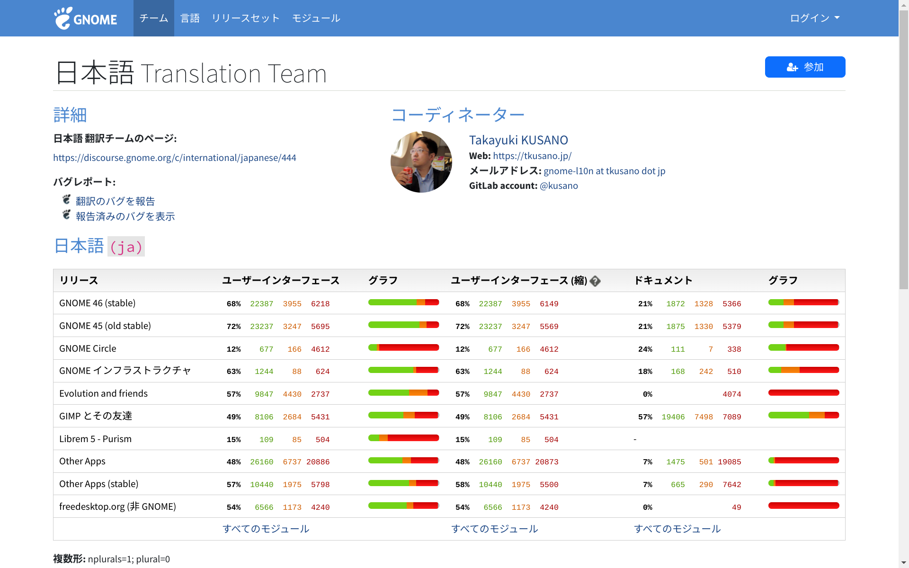
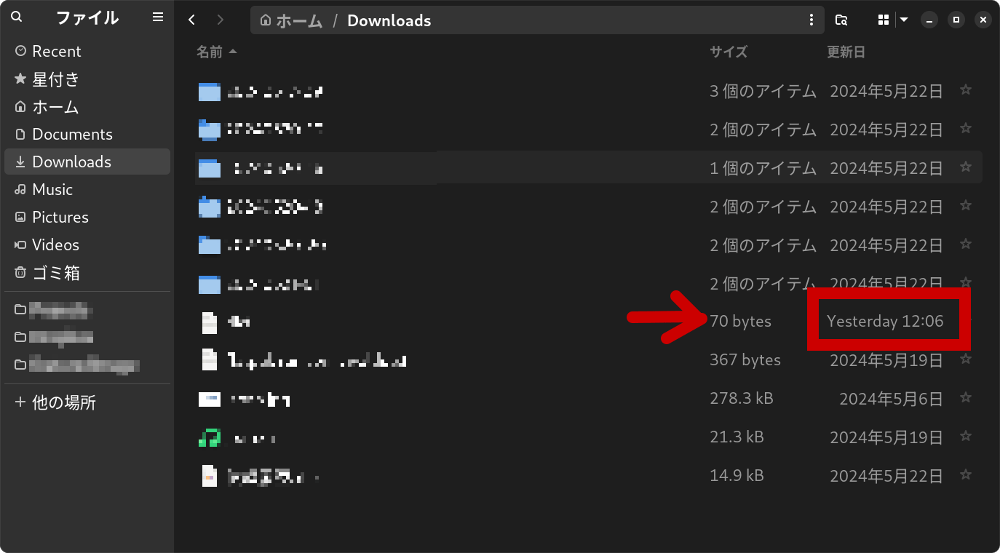

Cela fait 6 mois que je suis passée de Windows à Linux (d'abord Ubuntu, maintenant Fedora). J'aimerais partager les avantages et les inconvénients de ma vie sous Linux.

Voici les objectifs que je poursuis avec mon PC :

- Programmation web frontale (utilisant Node.js, Python)
- Lire des articles, envoyer/recevoir des emails, regarder des streamings
- Pas de jeux vidéo

Bien que je ressente parfois les inconvénients de Linux, je ne veux jamais revenir à Windows pour l'instant.

Traduit avec DeepL.com (version gratuite)

## Avantages (sur la programmation) 

### Léger, moins d'utilisation de RAM

Avant d'utiliser un Linux natif, j'utilisais WSL/WSL2 sous Windows. Ce n'était pas si lent, mais pas si rapide non plus. Maintenant, avec Linux, c'est toujours rapide.

WSL2 utilise parfois un maximum de 16 Go de RAM lorsque je crée une application en local.

Avec Linux, l'utilisation de la RAM est inférieure à la moitié, 6 Go environ.

Par ailleurs, j'ai toujours eu des problèmes avec l'utilisation d'un grand espace disque par WSL2 et la manière de le nettoyer. Avec Linux, tout ce que vous avez à faire est de mettre les fichiers dans une boîte de trush ou de taper `rm -rf`.

Déplacer des fichiers est aussi plus facile car ce n'est plus entre « Windows et Linux sur WSL ».

### Installation plus facile

Pour mettre en place un environnement de travail, il me suffit d'installer Node.js (j'utilise nvm) et de cloner mes dépôts depuis GitHub. C'est beaucoup plus facile que d'utiliser WSL2. Git et Python3 sont installés par défaut sur Fedora.

Python ne nécessite que la préparation `venv`. Vous pouvez essayer du code sur internet dès que vous y pensez. 

Sous Windows, je lançais toujours WSL2 ou VS Code pour exécuter Node.js ou Python. Maintenant, je n'ai plus besoin de passer par ces étapes.

Par ailleurs, [VS Code](https://vscodium.com) ne fonctionnait parfois pas bien avec WSL2, mais cela n'arrive jamais sous Linux.

### Un disque dur SSD Linux fonctionnera sur n'importe quel PC (je ne sais pas pour Mac).

Un disque dur SSD installé sous Windows ne fonctionnera pas sur un autre PC car sa licence est liée à la carte mère.

En revanche, un disque dur SSD installé sous Linux fonctionnera sur n'importe quel autre PC (bien sûr, les broches doivent correspondre). Il en va de même pour la connexion USB.

Pendant ces 6 mois, j'ai parfois dû travailler sur plusieurs PC, mais un seul SSD Linux a toujours bien fonctionné.

### Vous pouvez apprendre beaucoup de choses

Lorsque j'utilisais WSL2, je n'utilisais qu'une fenêtre noire (pas d'interface graphique) et l'explorateur de fichiers de Windows.

Après avoir utilisé un Linux natif, j'ai compris la signification des répertoires de fichiers et de l'architecture du système d'exploitation.

Je comprends maintenant comment `wget` ou `make` fonctionne sur un service d'hébergement web, même si je ne faisais que taper ces commandes à l'aveuglette.

De plus, Linux ne cache jamais les fichiers et les dossiers, contrairement à Windows. L'architecture est claire et simple. Vous pouvez contrôler tout ce que vous voulez.

C'est à dire que Linux est pour ceux qui aiment le bricolage.

## Avantages (utilisation quotidienne) 

### Pas de verrouillage des fournisseurs (ma priorité absolue)

La principale raison pour laquelle j'ai quitté Windows est de me libérer de l'emprise des fournisseurs.

J'ai commencé à avoir peur des Big Tech, surtout après le licenciement de Sam Altman d'OpenAI, et j'ai donc décidé de garder mes distances avec eux. J'ai pris le temps de retirer mes données de leur stockage en nuage, de transférer mon courrier électronique vers Protonmail, qui est plus sûr, et etc.

Aujourd'hui, j'ai encore une dizaine de comptes avec Outlook et Gmail, uniquement pour mon usage personnel.

*Mais j'ai toujours besoin d'utiliser Google Analytics, Firebase ou GCP pour le travail...

Linux ne nécessite pas de comptes auprès d'entreprises spécifiques, ce qui signifie que vous pouvez passer à n'importe quelle autre distribution quand vous le souhaitez.

Je me sens maintenant un incroyable sentiment de liberté : beaucoup moins de dépendance à l'égard des Big Tech.

### Mises à jour rapides du système (OS)

Tous ceux qui ont essayé d'effectuer une installation propre de Windows ont vécu la même expérience : cela prend au moins des heures, parfois une demi-journée. Mais pas avec Linux.

Linux fournit des mises à jour du système d'exploitation (avec Fedora, c'est quotidien), mais cela se termine en moins de 10 minutes. Cela s'explique par sa simplicité par rapport à Windows.

### Pas de problème avec l'e-Tax japonais

À la surface, le gouvernement japonais exclut toujours Linux de son système d'imposition en ligne basé sur un navigateur.

Mais grâce au changement d'agent utilisateur et à l'authentification NFC sur mon smartphone Android, j'ai pu soumettre une déclaration d'impôts.

## Désavantages que je ressens à propos de Linux

Bien sûr, il y a quelques inconvénients. Il s'agit le plus souvent de problèmes liés aux applications.

Il est bien connu qu'Adobe ne fournit pas ses applications pour Linux. Si vous êtes un utilisateur d'Adobe, il semble impossible de changer votre PC pour Linux.

### Suite bureautique

J'avais l'habitude d'utiliser WPS Office sur Windows. WPS Office est disponible pour Linux, mais il présente un défaut fatal en ce qui concerne la méthode de saisie pour les utilisateurs japonais.

J'utilise donc Libre Office, qui est préinstallé sur Fedora. Il fonctionne bien en principe, mais il y a de petits problèmes de compatibilité avec les fichiers basés sur MSOffice ou avec la localisation de l'interface utilisateur. Je ne me suis toujours pas habitué aux différences de raccourcis clavier.

### Pas d'application similaire à MS Paint

Bien que GIMP ou Inkscape soient disponibles pour Linux, je n'ai pas encore trouvé d'application de peinture aussi simple que MS Paint.

J'ai essayé Drawing, Pinta ou KolourPaint, mais ils ne peuvent pas être ceux qui me conviennent. Ou alors, il faut que je m'y habitue ?

### L'authentification faciale est plus faible que celle de Windows

Il existe un logiciel d'authentification faciale sur Linux comme Windows Hello™. Il s'agit de [Howdy](https://github.com/boltgolt/howdy), une application tierce.

Mais sa précision est bien inférieure à celle de Windows. L'authentification dans une pièce sombre échoue toujours, ou même si elle réussit, elle fonctionne plus lentement. De plus, selon le [README](https://github.com/boltgolt/howdy), le niveau de sécurité est également plus faible car il peut fonctionner avec « une photo de vous bien imprimée ».

En revanche, l'authentification par empreinte digitale peut fonctionner - elle est préinstallée sur Ubuntu et Fedora (bien qu'elle n'ait pas bien fonctionné avec le capteur de diapositives).

### La localisation japonaise n'est pas terminée (problème avec le bureau Gnome)

J'utilise maintenant Fedora40 avec Gnome desktop version 46.

La localisation est toujours faite par des volontaires, et la localisation japonaise n'est terminée qu'à 68% à la fin du mois de mai 2024.

Link: [Gnome Japanese Translation Team](https://l10n.gnome.org/teams/ja/ "&copy; The GNOME Foundation")

Vous n'aurez jamais de problème d'utilisation quotidienne car la plupart des éléments importants sont déjà traduits. Cependant, je ne peux pas nier que je me sens mal à l'aise lorsqu'il y a des mots anglais parmi les mots japonais.

Avec Ubuntu, j'imagine que ces problèmes seront résolus lorsque l'équipe japonaise d'Ubuntu y travaillera et publiera Ubuntu Japanese Remix.

### Trop de formats de paquets d'applications

Il existe plus de 4 formats de paquets d'applications dans Linux, tels que DEB ou RPM, qui ont des dépendances avec le système OS, ou Flatpack, Snap et AppImage, qui n'en ont pas.

Même s'il s'agit de la même application, la version est différente et la vitesse de démarrage varie en fonction du format. Il est difficile pour les débutants de comprendre la différence et de décider ce qu'il faut choisir.

Personnellement, je choisis d'abord le format RPM, puis Flatpak s'il n'existe pas de version RPM.

## Ce qu'il faut faire avant de passer à Windows

### Sauvegarder les polices de caractères de Windows

Avant d'effacer votre Windows, sauvegardez les polices de Windows sur une clé USB. Cela pourrait vous être utile dans le futur.

Je suis confrontée à des difficultés lorsque je reçois des fichiers XLXS ou DOCS de la part d'utilisateurs de Windows. Seulement avec les polices préinstallées sur Linux, la différence peut devenir plus importante.

Par exemple, j'ai sauvegardé ces polices TTF sur une clé USB afin de pouvoir les utiliser en cas de besoin.

- Century
- Times New Roman
- MSP Gothic (pour langue japonaise)
- MSP Mincho (pour langue japonaise)

### Sauvegarder le dictionnaire IME (pour les utilisateurs japonais)

Si vous utilisez IME pour la saisie, exportez votre propre dictionnaire compatible avec le système IME de Linux.

### Créer une clé USB de récupération

Si vous voulez vraiment revenir à Windows, vous pouvez utiliser une clé USB de récupération.

## Conclusion

Avant de passer à Linux, j'ai pratiqué l'installation plusieurs fois avec un disque SSD externe et j'ai vécu sans Windows pendant une semaine. Puis j'ai déménagé.

Je garde toujours une clé USB de récupération, mais je ne veux plus retourner à Windows.

Je ne suis pas du tout intéressée par les intégrations d'IA de Microsoft ou de Google. Je préfère garder mes distances avec eux. J'utilise l'IA, mais seulement Codeium ou pas de Big Tech.