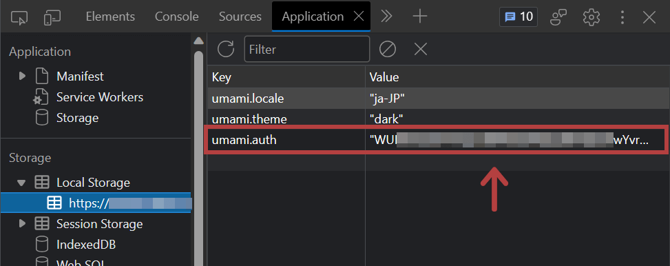
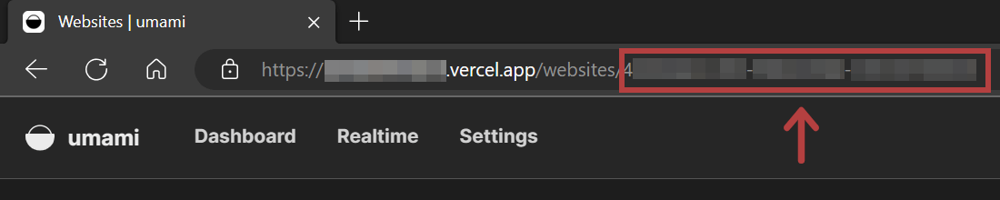

[Umami Analytics](https://umami.is/) is a privacy-first, open source analytics. We can host it by ourselves besides its freemium cloud version with limited features.

Last time, I wrote [how to run Umami Analytics + Supabase + Vercel for free](../umami-supabase/).

This time I'd like to show you how to get the popular posts from Umami API and how to output this data to Gatsby's GraphQL.

I have tested my codes with a self-hosted Umami. I didn't test with Umami Cloud.

Environment

- Umami v2.2.0

## Prerequisite

- Umami is already being running (see [how to run Umami Analytics for free](../umami-supabase/))

## Getting a Token

First you need to get a token to connect to the Umami API.

We can get the token by [the official way](https://umami.is/docs/authentication), but the easiest way is;

**Go to your Umami page and check the umami.auth value from F12 -> Application -> Local Storage.**



Link - [Authentication | Umami](https://umami.is/docs/authentication)

## Checking out the Website ID

Besides the way shown by [Umami official](https://umami.is/docs/websites-api), the easiest way is;

**Go to your Umami page, view the details of your website, and check the URL.**



Link - [Websites | Umami](https://umami.is/docs/websites-api)

## Connecting to the API

Once you have the token and the Website ID, you can use JavaScript `fetch` to the metrics data.

```js
const today = new Date()
const todayTs = today.getTime() // Curent timestamp
const sevenDaysAgoTs = todayTs - 604800000 // Timestamp of 7 days ago from now

const params = { startAt: sevenDaysAgoTs, endAt: todayTs, type: "url" }
const query = new URLSearchParams(params)
const response = await fetch(
  `https://my-umami.example.com/api/websites/[UMAMI_WEBSITE_ID]/metrics?${query}`,
  {
    method: "GET",
    headers: {
      Accept: "application/json",
      Authorization: `Bearer [UMAMI_AUTH]`,
    },
  }
)
const data = await response.json()
console.log(data)
```

Link - [Website statistics](https://umami.is/docs/website-stats)

What we can get here with the code is the paths and the number of visitors. It means it contains the home page or the contact page.

```json
[
  {x: "/", y: 46}
  {x: "/post/my-first-post/", y: 17}
  {x: "/post/my-second-post/", y: 14}
  {x: "/about/", y: 12}
]
```

If you only want the blog pages, filter the json data with the conditions like "including `/post/` value in `x`" when extending it with `forEach` or `map`.

Also, for security reasons, the token and Website ID should be managed in .env files.

<div class="filename">.env</div>

```text
UMAMI_AUTH=123456789012345678901234
UMAMI_WEBSITE_ID=abc-def-ghi-jkl-mno-pqr
```

## What next after getting json data?

To show the popular posts on your website, get the most 5 viewed paths and show the titles and the links regarding to the paths.

### With Gatsby.js

I am good at Gatsby, so I create a schema of popular articles in `gatsby-node.js`; link the paths (obtained from the Umami API) to the article slugs, so that we can retrieve article data from the popular articles schema in GraphQL.

\*Example of a Gatsby site managing articles in Markdown

<div class="filename">gatsby-node.js</div>

```js
const fetch = require("node-fetch")

// Generating PageViews schema
exports.sourceNodes = async ({
  actions,
  createContentDigest,
  createNodeId,
}) => {
  const { createNode } = actions

  const today = new Date()
  const todayTs = today.getTime()
  const sevenDaysAgoTs = todayTs - 604800000

  const params = { startAt: sevenDaysAgoTs, endAt: todayTs, type: "url" }
  const query = new URLSearchParams(params)
  const response = await fetch(
    `https://my-umami.example.com/api/websites/${process.env.UMAMI_WEBSITE_ID}/metrics?${query}`,
    {
      method: "GET",
      headers: {
        Accept: "application/json",
        Authorization: `Bearer ${process.env.UMAMI_AUTH}`,
      },
    }
  )
  const data = await response.json()

  data.forEach(node => {
    node.x.includes("/post/") &&
      createNode({
        slug: node.x.split("/")[2], // slug
        count: node.y, // pageview number
        id: createNodeId(`${node.x}`),
        internal: {
          type: "PageViews",
          contentDigest: createContentDigest(node),
        },
      })
  })
}

// Linking Markdown data to the PageViews schema
exports.createResolvers = ({ createResolvers }) => {
  const resolvers = {
    PageViews: {
      markdownRemark: {
        type: "MarkdownRemark",
        resolve(source, args, context, info) {
          return context.nodeModel.findOne({
            query: {
              filter: {
                fileAbsolutePath: { glob: `**/**/${source.slug}.md` },
              },
            },
            type: "MarkdownRemark",
          })
        },
      },
    },
  }
  createResolvers(resolvers)
}
```

By doing this, the PageViews schema is generated and also has a corresponding Markdown data connected by the same slug.


With GraphQL's `sort`ing or `limit`ing, you can get "the most 5 viewed posts" so easily.

(This flexibility of GraphQL is one of the reasons I love Gatsby.js!)

### Link

- [API | Umami](https://umami.is/docs/api)
