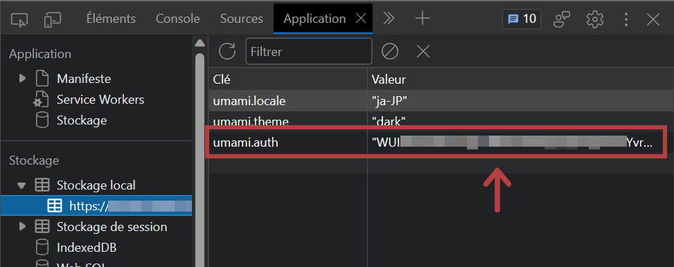
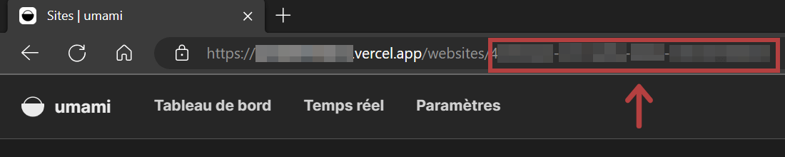

[Umami Analytics](https://umami.is/) est un outil d'analyse open source axé sur la protection de la vie privée. Nous pouvons l'héberger nous-mêmes en plus de sa version freemium cloud avec des fonctionnalités limitées.

La dernière fois, j'ai écrit [comment utiliser Umami Analytics + Supabase + Vercel gratuitement](../umami-supabase/).

Cette fois-ci, j'aimerais vous montrer comment récupérer les articles populaires à partir de l'API Umami et comment sortir ces données vers GraphQL de Gatsby.

J'ai testé mes codes avec un Umami auto-hébergé. Je n'ai pas testé avec Umami Cloud.

Environnement

- Umami v2.2.0

## Prérequis

- Umami est déjà en cours d'exécution (voir [Comment gérer Umami Analytics + Supabase + Vercel gratuitement](../umami-supabase/))

## Obtenir un token

Tout d'abord, vous devez obtenir un token pour vous connecter à l'API Umami.

Nous pouvons obtenir le token par [la méthode officielle](https://umami.is/docs/authentication), mais la méthode la plus simple est la suivante ;

**Allez sur votre page Umami et vérifiez la valeur umami.auth à partir de F12 -> Application -> Stockage Local.**



Lien - [Authentication | Umami](https://umami.is/docs/authentication)

## Vérification de l'ID du site Web

Outre la méthode indiquée par [Umami official](https://umami.is/docs/websites-api), la méthode la plus simple est la suivante :

**Allez sur votre page Umami, affichez les détails de votre site web et vérifiez l'URL.**



Lien - [Websites | Umami](https://umami.is/docs/websites-api)

## Connexion à l'API

Une fois que vous avez le token et l'ID du site Web, vous pouvez utiliser JavaScript `fetch` pour les données de métriques.

```js
const today = new Date()
const todayTs = today.getTime() // Horodatage actuel
const sevenDaysAgoTs = todayTs - 604800000 // Horodatage d'il y a 7 jours à partir de maintenant

const params = { startAt: sevenDaysAgoTs, endAt: todayTs, type: "url" }
const query = new URLSearchParams(params)
const response = await fetch(
  `https://my-umami.example.com/api/websites/[UMAMI_WEBSITE_ID]/metrics?${query}`,
  {
    method: "GET",
    headers: {
      Accept: "application/json",
      Authorization: `Bearer [UMAMI_AUTH]`,
    },
  }
)
const data = await response.json()
console.log(data)
```

Lien - [Website statistics](https://umami.is/docs/website-stats)

Ce que nous pouvons obtenir ici avec le code, ce sont les chemins d'accès et le nombre de visiteurs. Cela signifie qu'il contient la page d'accueil ou la page de contact.

```json
[
  {x: "/", y: 46}
  {x: "/post/my-first-post/", y: 17}
  {x: "/post/my-second-post/", y: 14}
  {x: "/about/", y: 12}
]
```

Si vous ne voulez que les pages du blog, filtrez les données json avec des conditions comme "inclure la valeur `/post/` dans `x`" lorsque vous l'étendez avec `forEach` ou `map`.

De plus, pour des raisons de sécurité, le token et l'identifiant du site web doivent être gérés dans des fichiers .env.

<div class="filename">.env</div>

```text
UMAMI_AUTH=123456789012345678901234
UMAMI_WEBSITE_ID=abc-def-ghi-jkl-mno-pqr
```

## Que faire après avoir obtenu des données json ?

Pour afficher les articles les plus populaires sur votre site, récupérez les 5 chemins les plus consultés et affichez les titres et les liens relatifs à ces chemins.

### Avec Gatsby.js

Je suis bonne en Gatsby, donc je crée un schéma d'articles populaires dans `gatsby-node.js` ; je lie les chemins (obtenus à partir de l'API Umami) aux slugs d'articles, de sorte que nous puissions récupérer les données d'articles à partir du schéma d'articles populaires dans GraphQL.

\*Exemple d'un site Gatsby gérant des articles en Markdown

<div class="filename">gatsby-node.js</div>

```js
const fetch = require("node-fetch")

// Génération du schéma PageViews
exports.sourceNodes = async ({
  actions,
  createContentDigest,
  createNodeId,
}) => {
  const { createNode } = actions

  const today = new Date()
  const todayTs = today.getTime()
  const sevenDaysAgoTs = todayTs - 604800000

  const params = { startAt: sevenDaysAgoTs, endAt: todayTs, type: "url" }
  const query = new URLSearchParams(params)
  const response = await fetch(
    `https://my-umami.example.com/api/websites/${process.env.UMAMI_WEBSITE_ID}/metrics?${query}`,
    {
      method: "GET",
      headers: {
        Accept: "application/json",
        Authorization: `Bearer ${process.env.UMAMI_AUTH}`,
      },
    }
  )
  const data = await response.json()

  data.forEach(node => {
    node.x.includes("/post/") &&
      createNode({
        slug: node.x.split("/")[2], // slug
        count: node.y, // nombre de pages vues
        id: createNodeId(`${node.x}`),
        internal: {
          type: "PageViews",
          contentDigest: createContentDigest(node),
        },
      })
  })
}

// Lier les données Markdown au schéma PageViews
exports.createResolvers = ({ createResolvers }) => {
  const resolvers = {
    PageViews: {
      markdownRemark: {
        type: "MarkdownRemark",
        resolve(source, args, context, info) {
          return context.nodeModel.findOne({
            query: {
              filter: {
                fileAbsolutePath: { glob: `**/**/${source.slug}.md` },
              },
            },
            type: "MarkdownRemark",
          })
        },
      },
    },
  }
  createResolvers(resolvers)
}
```

Ce faisant, le schéma PageViews est généré et a également une donnée Markdown correspondante connectée par le même slug.


Avec le `sort` ou la `limit` de GraphQL, vous pouvez facilement obtenir "les 5 articles les plus consultés".

(Cette flexibilité de GraphQL est l'une des raisons pour lesquelles j'aime Gatsby.js !)

### Lien

- [API | Umami](https://umami.is/docs/api)
