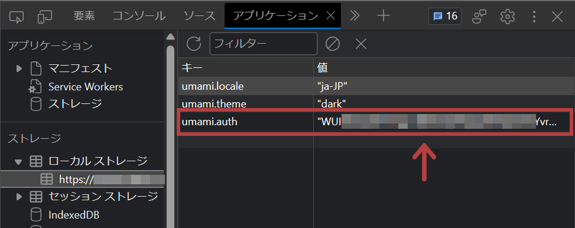
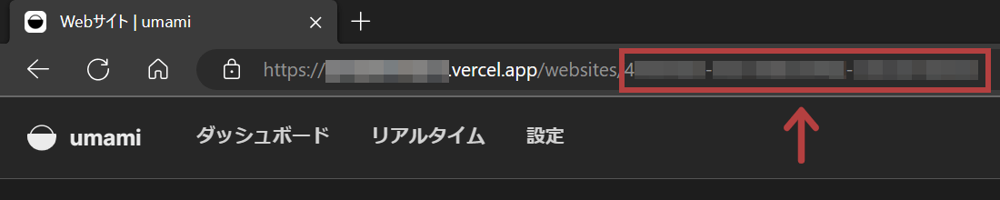

[Umami Analytics](https://umami.is/)は、プライバシー優先のオープンソースのアクセス解析です。クラウド版が提供されている他、自分でホスティングすればすべての機能を無料で使うことができます。

前回、[UmamiをSupabaseとVercelで無料運用する方法](../umami-supabase/)を紹介しました。

今回は、UmamiのAPIを利用して、人気記事を取得する方法と、Gatsbyで人気記事データをGraphQLで出力させる方法を紹介します。

私はセルフホスト環境で動作確認をしています。Umamiクラウド版で同じように動くかどうかは試していません。

動作環境

- Umami v2.2.0

## 前提条件

- すでにUmamiを稼働させている（[Umamiをセルホストで無料利用する方法はこちら](../umami-supabase/)）

## トークンを取得

まずは、Umami APIに接続するためのトークンを取得します。

トークンは[公式に掲載されている方法](https://umami.is/docs/authentication)で取得できますが、もっとも楽な方法は、

【稼働中のUmamiのページへ行き、F12で開発者の開発者ツールの「アプリケーション」→「ローカルストレージ」で、`umami.auth`の値を確認する】

ことです。



リンク - [Authentication | Umami](https://umami.is/docs/authentication)

## Website IDを確認

[Website IDも公式に掲載されている方法](https://umami.is/docs/websites-api)で取得できますが、簡単な方法は、

【稼働中のUmamiの、サイトの詳細を見るページへ行き、URLを確認する】

ことです。



リンク - [Websites | Umami](https://umami.is/docs/websites-api)

## APIに接続

トークンとWebsite IDを確認できたら、JavaScriptの通常の`fetch`を使い、以下のようにしてアクセス数の多い順の記事のデータを取得できます。

```js
const today = new Date()
const todayTs = today.getTime() // 現在の時刻のタイムスタンプ
const sevenDaysAgoTs = todayTs - 604800000 // 現在から7日前のタイムスタンプ

const params = { startAt: sevenDaysAgoTs, endAt: todayTs, type: "url" }
const query = new URLSearchParams(params)
const response = await fetch(
  `https://my-umami.example.com/api/websites/[UMAMI_WEBSITE_ID]/metrics?${query}`,
  {
    method: "GET",
    headers: {
      Accept: "application/json",
      Authorization: `Bearer [UMAMI_AUTH]`,
    },
  }
)
const data = await response.json()
console.log(data)
```

リンク - [Website statistics](https://umami.is/docs/website-stats)

このコードで取得できるのは、「Umami Analyticsを設置しているURLのすべてのページから、アクセス数の多い順のパスとアクセス数」です。つまり、トップページやお問い合わせページも含まれます。

```json
[
  {x: "/", y: 46}
  {x: "/post/my-first-post/", y: 17}
  {x: "/post/my-second-post/", y: 14}
  {x: "/about/", y: 12}
]
```

純粋な記事ページのみのランキングにしたい場合は、得られたjsonデータを`forEach`や`map`で展開する際に、「パス`x`に`/post/`が含まれる」等の条件でフィルタリングしましょう。

また、トークンやWebsite IDはセキュリティの観点から、現実的には`.env`ファイルに入れて管理することになります。

<div class="filename">.env</div>

```text
UMAMI_AUTH=123456789012345678901234
UMAMI_WEBSITE_ID=abc-def-ghi-jkl-mno-pqr
```

## その後の展開

ウェブサイト上で人気記事ランキングを表示させる場合は、アクセス数が上位5件のパスを取得して、パスに合致する記事のリンクやタイトルを出力すればOKです。

### Gatsby.jsの場合

私はGatsbyが得意なので、たとえば`gatsby-node.js`で人気記事のスキーマを作り、Umami APIから得られたパスと記事をスラッグで紐付けて、GraphQLで人気記事スキーマから記事のデータを取得できるようにします。

※Markdownで記事を管理しているGatsbyサイトの例

<div class="filename">gatsby-node.js</div>

```js
const fetch = require("node-fetch")

// PageViewsスキーマを生成
exports.sourceNodes = async ({
  actions,
  createContentDigest,
  createNodeId,
}) => {
  const { createNode } = actions

  const today = new Date()
  const todayTs = today.getTime()
  const sevenDaysAgoTs = todayTs - 604800000

  const params = { startAt: sevenDaysAgoTs, endAt: todayTs, type: "url" }
  const query = new URLSearchParams(params)
  const response = await fetch(
    `https://my-umami.example.com/api/websites/${process.env.UMAMI_WEBSITE_ID}/metrics?${query}`,
    {
      method: "GET",
      headers: {
        Accept: "application/json",
        Authorization: `Bearer ${process.env.UMAMI_AUTH}`,
      },
    }
  )
  const data = await response.json()

  data.forEach(node => {
    node.x.includes("/post/") &&
      createNode({
        slug: node.x.split("/")[2], // スラッグ
        count: node.y, // 閲覧数
        id: createNodeId(`${node.x}`),
        internal: {
          type: "PageViews",
          contentDigest: createContentDigest(node),
        },
      })
  })
}

// PageViewsスキーマに、スラッグが一致するMarkdown記事を紐付け
exports.createResolvers = ({ createResolvers }) => {
  const resolvers = {
    PageViews: {
      markdownRemark: {
        type: "MarkdownRemark",
        resolve(source, args, context, info) {
          return context.nodeModel.findOne({
            query: {
              filter: {
                fileAbsolutePath: { glob: `**/**/${source.slug}.md` },
              },
            },
            type: "MarkdownRemark",
          })
        },
      },
    },
  }
  createResolvers(resolvers)
}
```

これにより、GraphQLに「PageViews」という新たなスキーマが生成され、スラッグが一致するMarkdown記事のタイトルや日付などのデータが紐付けされます。


GraphQLの`sort`や`limit`を使えば、「上位5件の人気記事」ランキングも、簡単に表示できます。

（GatsbyはこのGraphQLの柔軟性が本当に素晴らしいのですよ！！by Gatsby推し）

### リンク

- [API | Umami](https://umami.is/docs/api)
