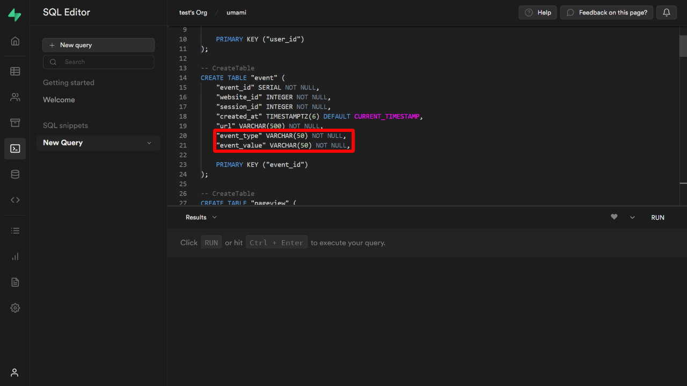
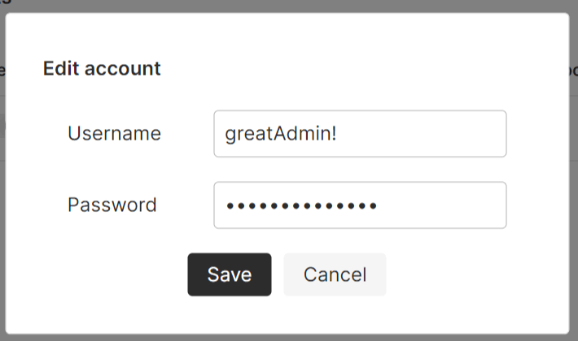

[Umami Analytics](https://umami.is/) is a free, privacy-friendly open-source web analytics. It can replace Google Analytics because Umami meets the privacy requirements of the GDPR (General Data Protection Regulation).

Umami is developed by [Make Cao](https://github.com/mikecao), an ex-Adobe engineer. His Umami Software company is one of the growing startups.

The app is free of charge. However, installation could be difficult for beginners. They are preparing its cloud version as of October 2022.

In this article, I'll explain how to make a database on Supabase and then how to install it on your appropriate website.

Working environment:

- Umami v.1.39.0

## About Umami Analytics

I've tried some Google Analytics alternatives and found that Umami provides **user-friendly UI** and **sufficient functions**. Because it can record even click or input events, you'll be able to follow who bought or who download your services.

### Pros

- free of charge
- open source
- language support
- realtime data
- easily fetching API data
- simple UI

### Cons (being developed)

- You have to be careful of some problems at the first deploy (v1.39.0）

I'll explain how to solve the problems later. You can also refer to the latest Discussions or Issues at [Umami Official GitHub page](https://github.com/umami-software/umami) with the error code you get.

## Preparation

Those three accounts are needed.

- [GitHub](https://github.com/): Store Umami itself
- [Supabase](https://supabase.com/): Database to store website info, access data etc.
- [Vercel](https://vercel.com/): Hosting - integrate data from Umami on GitHub and Supabase together.

Of course, you can use other hosting services such as [Netlify](https://www.netlify.com/). I'll explain the case of Vercel as an example.

## Fork Umami on GitHub

First, fork Umami from their official Umami repository.

*"Fork" is a sort of "copy" that also follows official updates.


Press the `fork` button and create your repository of Umami. The repository name is up to you. I named it "umami" for example.


Press `Create fork` then you'll see the forked repository on your account.

## Create a database on Supabase

Next, create a new project on Supabase and set up a database for storing access data.

On your Supabase account top page, press `+ New Project`.


You can name the project as you like, but I just named it umami again. Then also choose the nearest Region.


Do not forget to memorize the `Database password` as we'll need it later.

Once you're done, go next.

## Create tables on the database to store data

Move on to the project you've just created. From the left menu, go to the **SQL Editor** where we create tables with.

On the SQL Editor, open a new Editor by pressing `+ New query`.


The official doc indicates the code as follows;

[umami/schema.postgresql.sql at master | GitHub](https://github.com/umami-software/umami/blob/master/sql/schema.postgresql.sql)

Because since v.1.37.0 two table column names have been changed, we have to replace them with new ones. (the official code doesn't seem updated yet)

Copy the official SQL code first,


then paste it to SQL Editor. Before pressing `RUN`, edit the 20th and 21st rows of the code;

Before:

```sql
"event_type" VARCHAR(50) NOT NULL,
"event_value" VARCHAR(50) NOT NULL,
```



Those `"event_type"` and `"event_value"` above aren't used now but `"event_name"` `"event_data"` instead. ([Ref.](https://github.com/umami-software/umami/discussions/1391))

After:

```sql
"event_name" VARCHAR(50) NOT NULL,
"event_data" VARCHAR(50) NOT NULL,
```


If the two lines are ready, press `RUN`.

Once the SQL code runs and ends without problem, it says "Success. Now rows returned".

Then open the Table Editor from the left menu, and you'll be able to see the tables created.


## [Caution] How to solve problem at the deployment with v1.39.0

With version 1.39.0, the deployment got failed and the following error on Vercel;

```bash
Error: P3018

A migration failed to apply. New migrations cannot be applied before the error is recovered from. Read more about how to resolve migration issues in a production database: https://pris.ly/d/migrate-resolve
Migration name: 02_add_event_data

Database error code: 42501

Database error:
ERROR: must be owner of table event
```

This error was reported [in this thread](https://github.com/umami-software/umami/discussions/1542) with a solution.

To solve the problem, run the following code ([ref.](https://github.com/umami-software/umami/discussions/1486#discussioncomment-3567397)) on the SQL Editor of Supabase.

```sql
ALTER TABLE account OWNER TO postgres;
ALTER TABLE website OWNER TO postgres;
ALTER TABLE session OWNER TO postgres;
ALTER TABLE pageview OWNER TO postgres;
ALTER TABLE event OWNER TO postgres;
```

Then, follow the steps below ([ref.](https://github.com/umami-software/umami/discussions/1542#discussioncomment-3756936))

1. Clone the forked Umami repository to local
2. Add `DATABASE_URL` environment variable to `.env` of 1 (see *2 below)
3. Run the following code on local

```bash
yarn install
yarn prisma migrate resolve --applied "02_add_event_data"
yarn build
```

The database on Supabase gets ready then. After following the steps above, move on to the next section.

*2 `DATABASE_URL` environment variable should be like this. Read the next section for more detail.

```md
DATABASE_URL=postgres://postgres:[YOUR-PASSWORD]@[HOST]:6543/postgres?pgbouncer=true
```

## Preparation before the deployment on Vercel

You are almost!

Prepare the following information before running the first deployment;

```md
DATABASE_URL=postgres://postgres:[YOUR-PASSWORD]@[HOST]:6543/postgres?pgbouncer=true
HASH_SALT=any-random-string
```

- DATABASE_URL:
  - `[YOUR-PASSWORD]`: the password entered when the new Supabase project was established
  - `[HOST]`: you can see the Supabase project URL
- HASH_SALT: a random string (any string)

The DATABASE_URL is also provided in **Settings > Database > Connection Pooling** (except the password).


About HOST, you can see it in the project URL.


HASH_SALT can be whatever. To generate something, [MD5 Hash Generator](https://www.md5hashgenerator.com/) could be practical.

## Create a new project on Vercel

Go to the [Dashboard on Vercel](https://vercel.com/dashboard) and create a new project for Umami.


Connect to GitHub.


To refer to GitHub repositories, authorize the repositories to Vercel on GitHub.

If you haven't authorized your Umami repository, press "Adjust GitHub App Permissions →" and go GitHub account.

Select the repository to connect, then press Install.


Though it's also possible to authorize all your repositories, for security reasons, it'd be safer to choose the ones to connect to Vercel. Here, I choose "Only Select Repositories" and then select my Umami repository.

As the Vercel account can refer to the GitHub Umami repository now, select it.


Just before the deployment, add **DATABASE_URL** and **HASH_SALT** to Environment Variables. You have to press Add button to add. Then Deploy!


The status must turn Ready after a few minutes. You can see the URL is generated as well.


Umami top page would be displayed on that URL.


## Login to Umami

The default login settings are prepared by Umami as follows;

```md
Username: admin
Password: umami
```

After logging in, go to the Account page, then update your Username and Password.



You can choose a language from 43 languages, which is great!

## Add a tracking code of Umami

Also after logging in to Umami, add a website to analyze, then get a tracking code.

```html
<script async defer data-website-id="xxxxxxxx-xxxx-xxxx-xxxx-xxxxxxxxxxxx" src="https://example.vercel.app/umami.js"></script>
```

This is the script to add to your website.

### For Next.js

In case of the integration to Next.js, use `next/script` and load it in `_app.js`.

<div class="filename">/pages/_app.js</div>

```js
import Script from 'next/script'

function MyApp({ Component, pageProps }) {
  return (
    <>
      <Script strategy="afterInteractive" data-website-id="xxxxxxxx-xxxx-xxxx-xxxx-xxxxxxxxxxxx" src="https://example.vercel.app/umami.js" data-do-not-track="true" />
      <Layout>
        <Component {...pageProps} />
      </Layout>
    </>
  )
}
```

I'm not sure if it depends on the browser settings, but the script loading without `data-do-not-track="true"` returned a 403 error on my environment.

### For Gatsby.js

If you use Gatsby.js, a community [Umami plugin](https://www.gatsbyjs.com/plugins/gatsby-plugin-umami/) could be practical.

## appendix 1: How to update Umami

Umami Analytics is updated constantly.

When the official Umami repository releases a new version, a notice would be displayed on the top of your Umami website.


The way to catch the update, go to your Umami repository on GitHub, then press **Sync fork -> Update branch**. Your repository will be then synchronized with the official Umami.


Once you find the update announcement, I recommend updating your Umami repository as soon as possible. If there is some gap between your Umami and official Umami versions, the update can fail sometimes.

## appendix 2: Exclude specific IPs from tracking

To exclude specific IPs, add the `IGNORE_IP` environment variable with a comma-delimited list of IPs on Vercel (or other hosting services);

**Settings > Environment Variables**


<span class="label warning">Reference</span> [Environment variables | Umami](https://umami.is/docs/environment-variables)

Your IP may change sometimes depending on your contract with the internet provider; in general, because the providers offer dynamic IP addresses, your IP doesn't stay the same. If you want to exclude your IP from Umami tracking, you have to be careful of it.

## appendix 3: Set your own domain

It's also possible pointing your own domain to Umami website. If you have a domain already running, you can set its subdomain to it.

<!-- Set your own domain to Umami -->

One Vercel app can have several domains.

## appendix 4: Usage of Supabase after 6 months

I've been running Umami for a 2,000 pages website for 6 months now, and the usage of the database is still below the limit of the Supabase free plan;


It might be off the subject, but it used to be possible to run Umami for free on [Railway](https://railway.app/) before. They changed their free plan (*), and it's impossible to keep Umami running 24/7 now, sadly.😞

*$5 or 500 hours of usage, it stops when whichever reaches the limit.

We never know if Supabase would charge something in the future, but it's still free of charge. I appreciate it!