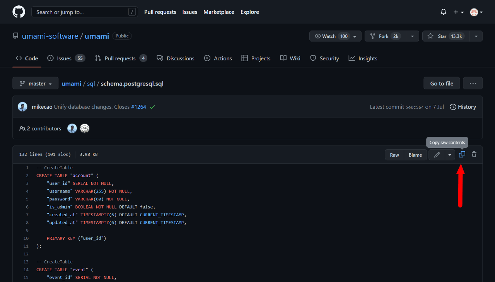
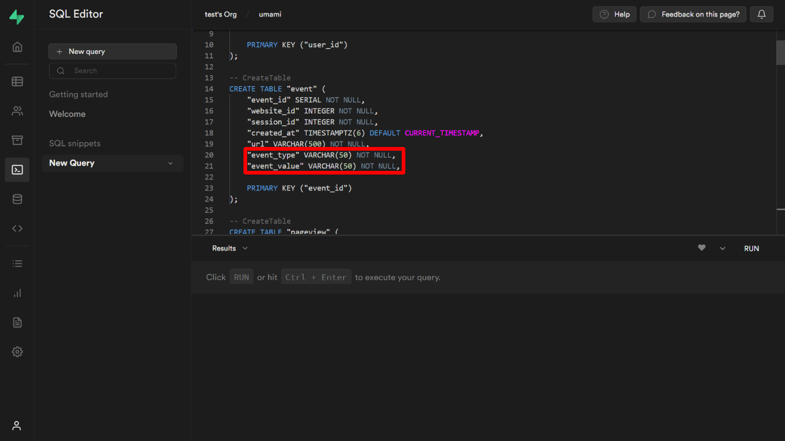
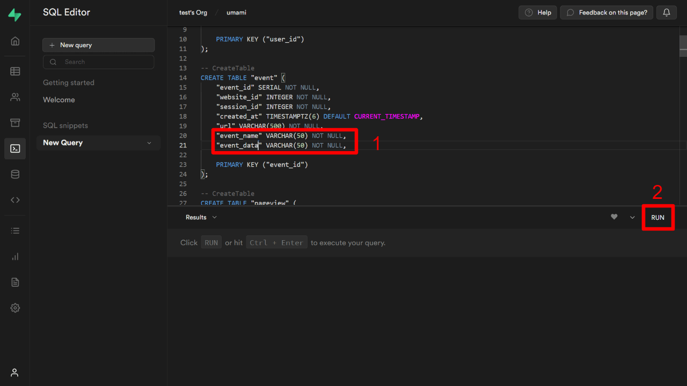
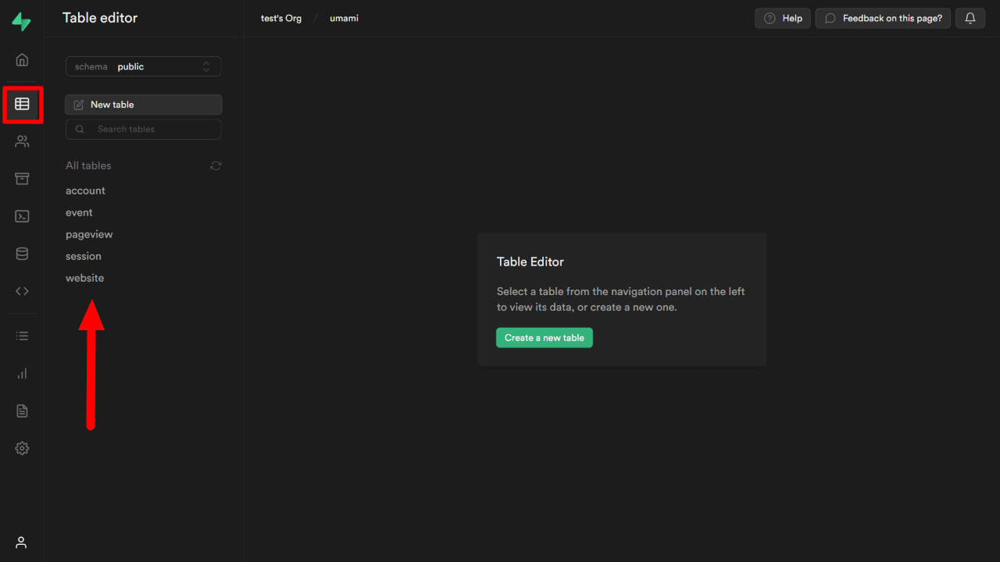
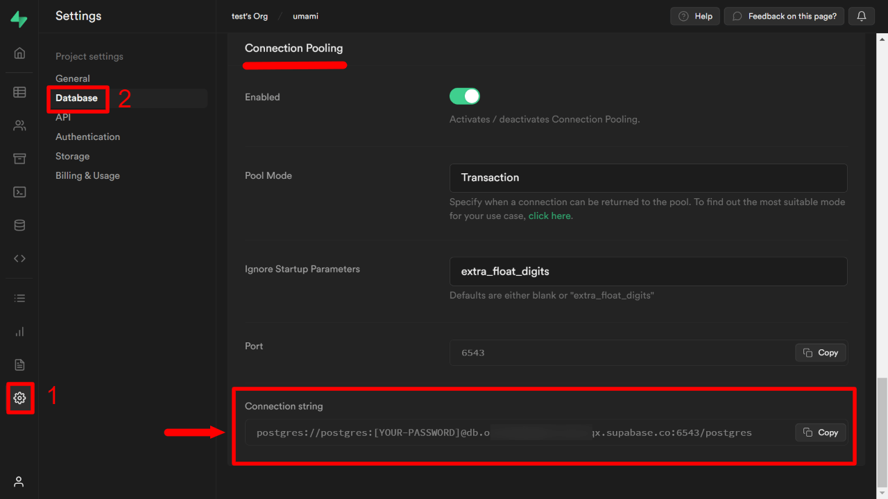
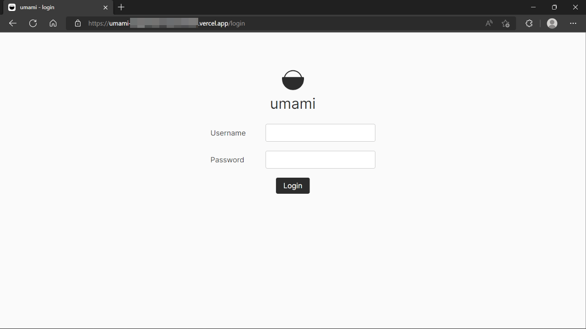
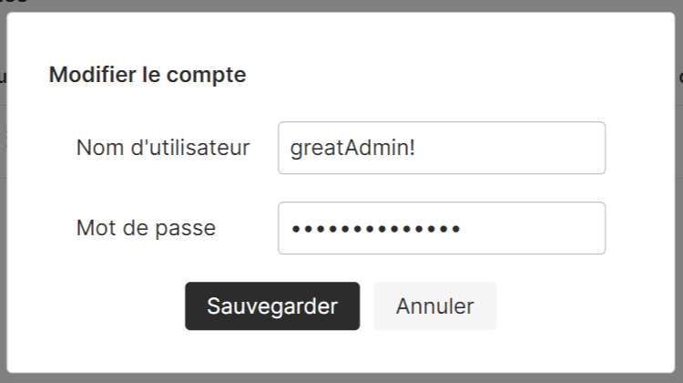
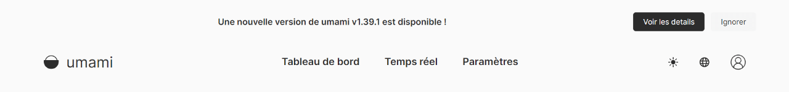

[Umami Analytics](https://umami.is/) est un outil open source d'analyse de site web, gratuit et respectueux de la vie privée. Il peut remplacer Google Analytics car Umami répond aux exigences de confidentialité du RGPD (règlement général sur la protection des données, GDPR en anglais).

Umami est développé par [Make Cao](https://github.com/mikecao), un ancien ingénieur d'Adobe. Sa société Umami Software est l'une des startups en pleine croissance.

L'app est complètement gratuit, mais, l'installation peut être difficile pour les débutants. Ils sont en train de développer sa version cloud maintenant (octobre 2022).

Dans ce billet de blog, je vais expliquer comment démarrer une base de données sur Supabase puis installer-le sur votre site web approprié.

Environnement de fonctionnement :

- Umami v.1.38.0

## À propos de Umami Analytics

J'avais essayé certaines des alternatives de Google Analytics, et j'ai trouvé Umami offre une **UI conviviale** et des **fonctions suffisantes**. Parce qu'il peut enregistrer même les événements de clic ou de saisie, vous pourrez suivre qui a acheté ou téléchargé vos services.

### Avantages

- gratuit
- open source
- multilingue
- données en temps réel
- récupérer facilement les données de l'API
- UI simple

### Désavantages (en cours d'élaboration)

- Vous devez faire attention à certains problèmes lors du premier déploiement  (v1.38.0）

Je vous expliquerai plus tard comment résoudre ces problèmes. Vous pouvez également consulter les dernières discussions ou les derniers problèmes sur [Umami Official GitHub page](https://github.com/umami-software/umami) avec le code d'erreur que vous obtenez.

## Preparation

Ces 3 comptes sont nécessaires.

- [GitHub](https://github.com/): Stocker Umami lui-même
- [Supabase](https://supabase.com/): Base de données pour stocker les informations du site web, les données d'accès, etc.
- [Vercel](https://vercel.com/): Hébergement - intégrer les données de Umami sur GitHub et Supabase ensemble.

Bien sûr, vous pouvez utiliser d'autres services d'hébergement tels que [Netlify](https://www.netlify.com/). Je vais vous expliquer le cas de Vercel à titre d'exemple.

## Fork Umami sur GitHub

Tout d'abord, fork Umami à partir du dépôt officiel d'Umami.

*"Fork" est une sorte de "copie" qui suit également les mises à jour officielles.


Appuyez sur le bouton `fork` et créez votre propre dépôt d'Umami. Le nom du dépôt est à votre choix. Je l'ai nommé "umami" par exemple.


Pressez `Create fork` et vous verrez le dépôt forké sur votre compte.

## Créer une base de données sur Supabase

Ensuite, créer un nouveau projet sur Supabase et définir une base de données pour stocker les données d'accès:

Sur la page d'accueil de votre compte Supabase, cliquez sur `+ New Project`.


Le nom du projet peut être n'importe lequel, je l'ai juste nommé umami à nouveau. Ensuite, choisissez également la région la plus proche.


N'oubliez pas de mémoriser le `Database password` car nous en aurons besoin plus tard.

Une fois que vous avez terminé, passez à la suite.

## Créer des tables dans la base de données pour stocker les données

Passez au projet que vous venez de créer. Dans le menu de gauche, allez dans **SQL Editor** où nous allons créer des tables avec.

Dans l'éditeur SQL, ouvrir un nouvel éditeur en appuyant sur `+ New query`.


Le code est indiqué officiellement comme suit ;

[umami/schema.postgresql.sql at master | GitHub](https://github.com/umami-software/umami/blob/master/sql/schema.postgresql.sql)

Parce que depuis la v1.37.0, deux noms de colonnes de table ont été modifiés, nous devons les remplacer par de nouveaux noms. (le code officiel ne semble pas encore mis à jour)

Copier d'abord le code SQL officiel,



puis coller-le dans l'éditeur SQL. Avant d'appuyer sur `RUN`, éditer les 20ème et 21ème lignes du code ;

Avant:

```sql
"event_type" VARCHAR(50) NOT NULL,
"event_value" VARCHAR(50) NOT NULL,
```



Ces `"event_type"` et `"event_value"` ci-dessus ne sont pas utilisés maintenant mais `"event_name"`"event_data"` à la place. ([réf.](https://github.com/umami-software/umami/discussions/1391))

Après:

```sql
"event_name" VARCHAR(50) NOT NULL,
"event_data" VARCHAR(50) NOT NULL,
```



Si les 2 lignes sont prêtes, appuyez sur `RUN`.

Une fois que le code SQL s'exécute et se termine sans problème, il indique "Success. Now rows returned".

Ouvrir ensuite l'éditeur de tableaux dans le menu de gauche, vous pourrez voir les tableaux créés.



## [Attention] Comment résoudre le problème lors du déploiement avec la v1.38.0

Avec la version 1.38.0, le déploiement a échoué et une erreur suivante est apparue sur Vercel ;

```bash
Error: P3018

A migration failed to apply. New migrations cannot be applied before the error is recovered from. Read more about how to resolve migration issues in a production database: https://pris.ly/d/migrate-resolve
Migration name: 02_add_event_data

Database error code: 42501

Database error:
ERROR: must be owner of table event
```

Cette erreur a été signalée [dans ce fil](https://github.com/umami-software/umami/discussions/1542) avec une solution.

Pour résoudre le problème, exécutez le code suivant ([réf.](https://github.com/umami-software/umami/discussions/1486#discussioncomment-3567397)) sur l'éditeur SQL de Supabase.

```sql
ALTER TABLE account OWNER TO postgres;
ALTER TABLE website OWNER TO postgres;
ALTER TABLE session OWNER TO postgres;
ALTER TABLE pageview OWNER TO postgres;
ALTER TABLE event OWNER TO postgres;
```

Ensuite, suivre les étapes ci-dessous ([réf.](https://github.com/umami-software/umami/discussions/1542#discussioncomment-3756936))

1. Cloner le dépôt Umami forké en local
2. Ajouter la variable d'environnement `DATABASE_URL` au `.env` de 1 (voir *2 ci-dessous)
3. Exécutez le code suivant sur local

```bash
yarn install
yarn prisma migrate resolve --applied "02_add_event_data"
yarn build
```

La base de données sur Supabase est alors prête. Après avoir suivi les étapes ci-dessus, passez à la section suivante.

*2 `DATABASE_URL` variable d'environnement devrait ressembler à ceci. Lisez la section suivante pour plus de détails.

```md
DATABASE_URL=postgres://postgres:[YOUR-PASSWORD]@[HOST]:6543/postgres?pgbouncer=true
```

## Préparation avant le déploiement sur Vercel

Vous y êtes presque !

Préparer les informations suivantes avant d'exécuter le premier déploiement ;

```md
DATABASE_URL=postgres://postgres:[YOUR-PASSWORD]@[HOST]:6543/postgres?pgbouncer=true
HASH_SALT=any-random-string
```

- DATABASE_URL:
  - `[YOUR-PASSWORD]`: the password entered when the new Supabase project was established
  - `[HOST]`: you can see the Supabase project URL
- HASH_SALT: a random string (any string)

La DATABASE_URL est également fourni dans **Settings > Database > Connection Pooling** (sauf le mot de passe).



About HOST, you can see it in the project URL.


HASH_SALT peut être n'importe quoi. Pour générer quelque chose, [MD5 Hash Generator](https://www.md5hashgenerator.com/) peut être utile.

## Créer un nouveau projet sur Vercel

Aller dans le [Tableau de bord Vercel](https://vercel.com/dashboard) et créer un nouveau projet pour Umami.


Se connecter à GitHub.


Afin de référencer les dépôts GitHub, autorisez les dépôts à Vercel sur GitHub.

Si vous n'avez pas autorisé votre dépôt Umami, appuyez sur "Adjust GitHub App Permissions →" et allez compte GitHub.

Sélectionnez le référentiel à connecter, puis appuyez sur Install.


Bien qu'il soit également possible d'autoriser tous vos dépôts, pour des raisons de sécurité, il est plus sûr de choisir ceux qui seront connectés à Vercel. Ici, je choisis "Only Select Repositories" puis je sélectionne mon dépôt Umami.

Comme le compte Vercel peut référencer le dépôt GitHub Umami maintenant, sélectionnez-le.


Juste avant le déploiement, ajouter **DATABASE_URL** et **HASH_SALT** aux variables d'environnement. Vous devez appuyer sur le bouton Add pour les ajouter. Puis déployer !


Le statut doit devenir Ready après quelques minutes. Vous pouvez voir que l'URL est également générée.


La page d'accueil d'Umami sera affichée sur cette URL.



## Connexion à Umami

Les paramètres de connexion par défaut sont préparés par Umami comme suit ;

```md
Username: admin
Password: umami
```

Après avoir été connecté, allez immédiatement à la page Compte puis mettez à jour le nom d'utilisateur et le mot de passe.



Vous pouvez choisir le français parmi 43 langues, ce qui est formidable !

## Ajouter un code de suivi d'Umami

Après vous être connecté à Umami, ajoutez un site Web à analyser et obtenez un code de suivi.

```html
<script async defer data-website-id="xxxxxxxx-xxxx-xxxx-xxxx-xxxxxxxxxxxx" src="https://example.vercel.app/umami.js"></script>
```

C'est le script à ajouter à votre site web.

### Pour Next.js

Afin d'intégrer le script d'Umami à Next.js, on utilize `next/script` dans `_app.js`.

<div class="filename">/pages/_app.js</div>

```js
import Script from 'next/script'

function MyApp({ Component, pageProps }) {
  return (
    <>
      <Script strategy="afterInteractive" data-website-id="xxxxxxxx-xxxx-xxxx-xxxx-xxxxxxxxxxxx" src="https://example.vercel.app/umami.js" data-do-not-track="true" />
      <Layout>
        <Component {...pageProps} />
      </Layout>
    </>
  )
}
```

Je ne suis pas sûre si cela dépend des paramètres du navigateur, mais le chargement du script sans `data-do-not-track="true"` renvoie une erreur 403 sur mon environnement.

### Pour Gatsby.js

Si vous utilisez Gatsby.js, un [plugin Umami] communautaire (https://www.gatsbyjs.com/plugins/gatsby-plugin-umami/) pourrait être utile.

## annexe 1 : Comment mettre à jour Umami

Umami Analytics est constamment mis à jour.

Lorsque le dépôt officiel d'Umami publie une nouvelle version, vous voyez un annonce en haut de votre site web Umami.



La façon de prendre la mise à jour, allez à votre dépôt Umami sur GitHub, puis appuyez sur **Sync fork -> Update branch**. Votre dépôt sera alors synchronisé avec Umami officiel.


Une fois que vous avez trouvé l'avis de mise à jour, je vous recommande de mettre à jour votre dépôt Umami dès que possible. S'il y a un écart entre votre Umami et la version officielle, la mise à jour peut échouer.

## annexe 2 : Exclure des IP spécifiques du suivi

Afin d'exclure des IPs spécifiques, ajoutez la variable d'environnement `IGNORE_IP` avec une liste d'IPs délimitée par des virgules sur Vercel (ou d'autres services d'hébergement) ;

**Settings > Environment Variables**


<span class="label warning">Reference</span> [Environment variables | Umami](https://umami.is/docs/environment-variables)

Votre IP peut parfois changer en fonction de votre contrat avec le fournisseur d'accès à Internet ; en général, comme les fournisseurs offrent une adresse IP dynamique, votre IP ne reste pas toujours la même. Si vous voulez exclure votre IP du suivi d'Umami, vous devez faire attention.

## annexe 3 : Configurez votre propre domaine

Il est également possible de faire pointer votre propre domaine vers le site Umami. Si vous utilisez déjà un domaine, vous pouvez y faire pointer son sous-domaine.

<!-- Configurez votre propre domaine à Umami -->

Une application Vercel peut avoir plusieurs domaines.

## annexe 4 : Utilisation de Supabase après 6 mois

J'utilise Umami pour un site de 2000 pages depuis 6 mois maintenant, et l'utilisation de la base de données est toujours en dessous de la limite du plan gratuit de Supabase ;


C'est peut-être hors sujet, mais il était possible de gérer Umami gratuitement sur [Railway](https://railway.app/) avant. Ils ont changé leur forfait gratuit (*) et maintenant il n'est plus possible de gérer Umami 24/7, malheureusement.😞

*5 $ ou 500 heures d'utilisation, il s'arrête quand il atteint la limite.

Nous ne savons jamais si Supabase facturera quelque chose à l'avenir, mais c'est gratuit pour le moment, j'apprécie !