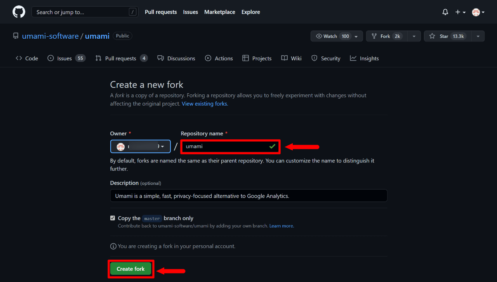
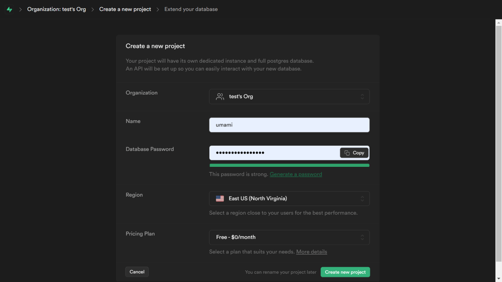
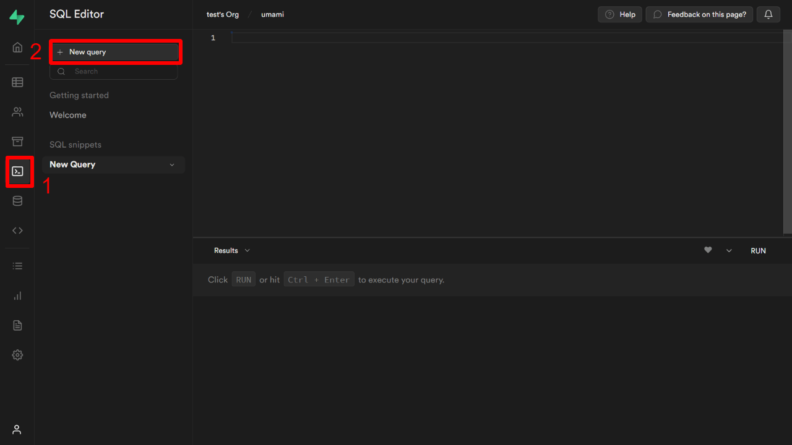
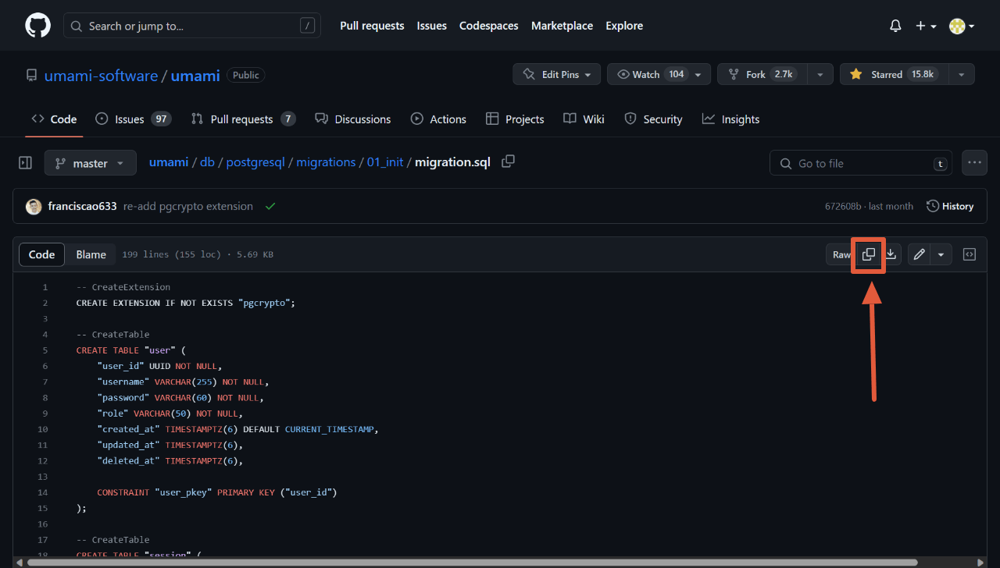
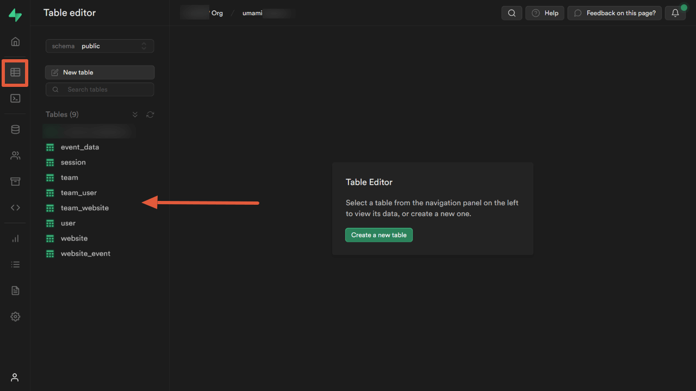
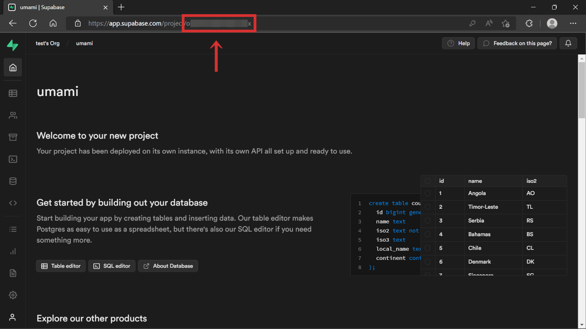
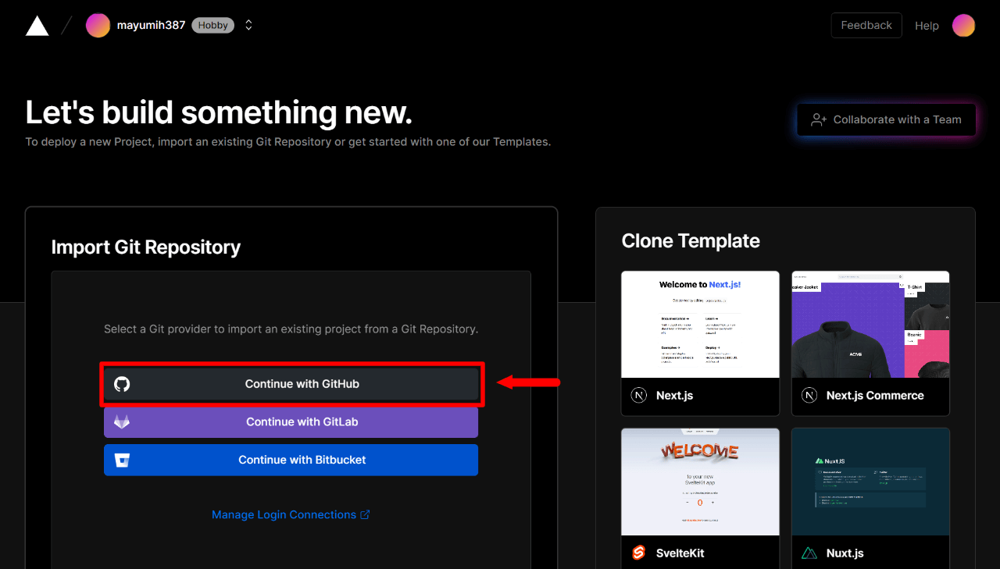
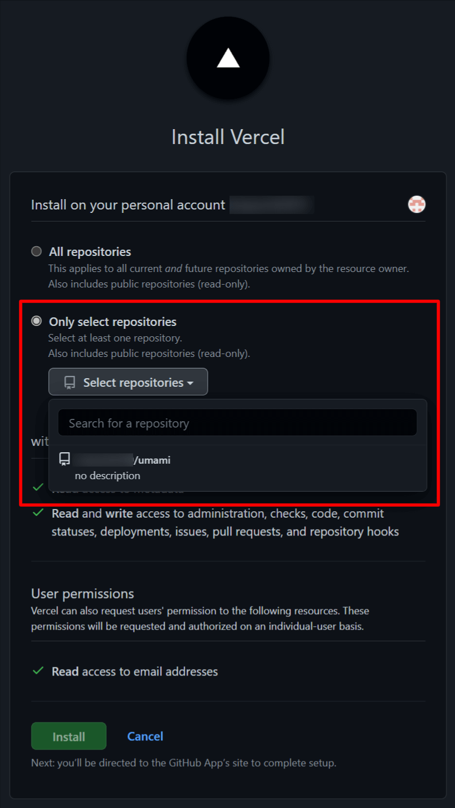
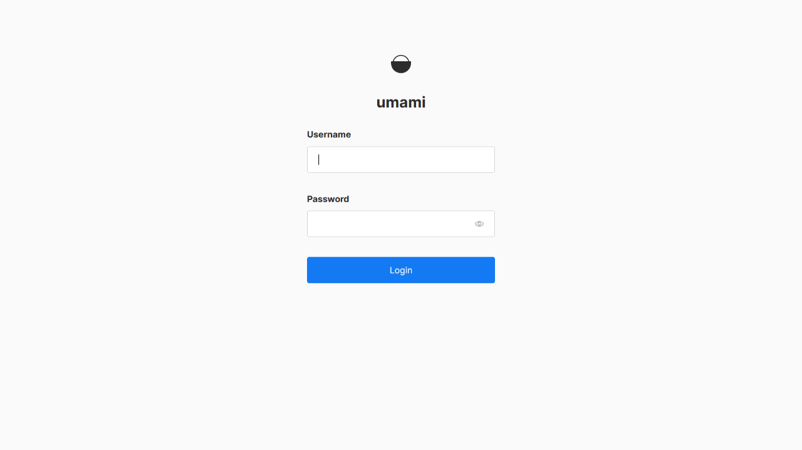
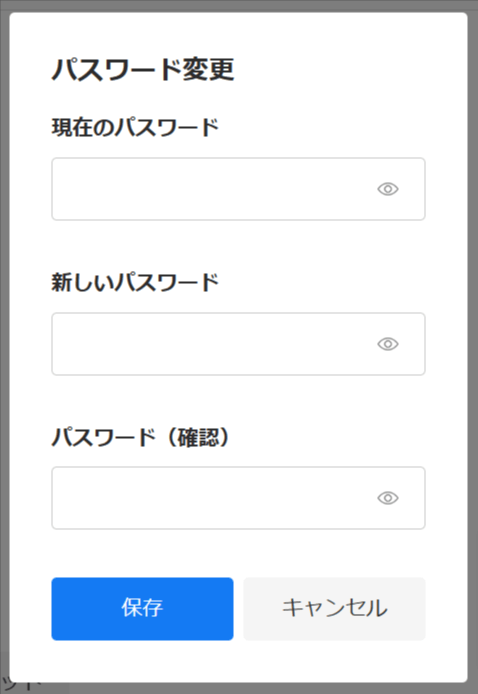

[Umami](https://umami.is/)とは、完全無料で使える、プライバシーに配慮したオープンソースのアクセス解析ツールです。EU一般データ保護規則（GDPR）にも対応しており、Google Analyticsの代替として注目されています。

開発者は元Adobeエンジニアの[Make Cao](https://github.com/mikecao)氏。Umami Softwareは現在注目のスタートアップ企業の1つですね。

Umamiアナリティクスはオープンソースのプログラムなので、自分でホスティングすること（無料のホスティング・データベースのサービスを使うこと）で、無料で使うことができます。※機能が制限された[無料のクラウド版](https://umami.is/pricing)もあります。

今回は、Supabaseにデータベースを作り、最終的にUmamiアナリティクスを使えるところまで解説します。

動作確認: Umami v2.2.0

## Umamiアナリティクスの特徴

脱Googleのためにいくつかのアクセス解析を試してみましたが、その中でもUmamiは**わかりやすいUI**と**必要十分な機能**で私は非常に好きです。クリックや入力のイベント数も記録できるため、成約の状況などもウォッチ可能となっています。

- 無料
- オープンソース
- 日本語表示も可（インストール作業自体は英語環境のみ）
- リアルタイムのアクセス状況がわかる
- APIでデータ取得ができる
- UIがシンプルで見やすい

v2.2.0時点での問題の解消方法は当記事にも掲載していますが、[Umami公式GitHub](https://github.com/umami-software/umami)のDiscussionsやIssuesでエラーコードなどで検索すると、最新の情報が出てきます。

## 前提条件

以下の3つのアカウントが必要です。

- [GitHub](https://github.com/)：Umami本体を保存
- [Supabase](https://supabase.com/)：データベース。サイト情報やアクセスデータを保存（アカウント開設にはGitHubアカウントが必要）
- [Vercel](https://vercel.com/)：ホスティング。GitHubのUmamiとSupabaseのデータを引っ張ってきて、ブラウザ上に表示

尚、Vercelではなく[Netlify](https://www.netlify.com/)などの他のホスティングでも問題ありません。ここではVercelを例に説明します。

## GitHubでUmamiをフォークする

GitHubのUmamiの公式リポジトリから、Umamiのプログラムをフォーク（※）します。

※「フォーク」とは、本家の更新もフォローされるコピー的なこと


「fork」ボタンを押すと、自分のアカウント上にフォークリポジトリを作成する画面に映ります。リポジトリ名は自由ですが、ここではわかりやすく「umami」としました。



Create forkボタンを押して、自分のアカウントにUmamiのリポジトリができていたらOKです。

## Supabaseでプロジェクトを作成する

次に、アクセスデータなどを格納するためのデータベースをSupabaseに用意します。

Supabase上で、新規にプロジェクトを作成するために、トップページで「New Project」をクリック。


プロジェクト名のNameは自由ですが、今回はわかりやすいようにこちらも「umami」にしました。Regionは自分の住んでいる場所に一番近いところを選択。日本なら「Northeast Asia (Tokyo)」です。



この時に入力したDatabase password（パスワード）はコピーして、あとで使うので別のところに保存しておきます。

プロジェクトが無事作成されたら、次に進みます。

## SupabaseでUmami用の格納テーブルを作成

作成できたプロジェクトに移り、左メニューからSQL Editorを開いて、SQLを使ってデータベースにテーブルを作成します。

SQL Editorを開き、「New query」で新規のコード入力欄を開きます。



入力欄に入れるのは、GitHubのUmami本家に掲載されているコード[migration.sql](https://github.com/umami-software/umami/blob/master/db/postgresql/migrations/01_init/migration.sql)です。



コピーできたら、Supabase上にペーストして「RUN」。


無事にコードが走ると「Success. Now rows returned」と表示され、テーブルが作成されます。

完了後、Table Editorを開くと、テーブルが作成されていることが確認できます。



## デプロイ時のエラー対策

このままではVercelでのデプロイ時に以下のようなエラーが出ます。

```bash
Error: P3005

The database schema is not empty. Read more about how to baseline an existing production database: https://pris.ly/d/migrate-baseline
```

同様のエラーが出ているようで、[こちらのスレッド](https://github.com/umami-software/umami/issues/2005)を参照にして解決しました。

1. フォークした自分のUmamiリポジトリを、ローカルにクローン
2. 1の`.env`ファイルに、`DATABASE_URL`の環境変数を記載（※）
3. ローカルで以下を実行

```bash
yarn install
yarn build-db
npx prisma migrate resolve --applied 01_init
```

これでSupabase側の準備がOKになります。これらが無事に実行できてから、次のセクション「Vercelにデプロイするための準備」へ進んでください。

※環境変数の書き方は以下の通りです。次セクション参照。

```md
DATABASE_URL=postgres://postgres:[YOUR-PASSWORD]@[HOST]:6543/postgres?pgbouncer=true
```

## Vercelにデプロイするための準備

ここまで来たらもう少しです。

Vercelにデプロイするために、以下の情報を準備します。

```md
DATABASE_URL=postgres://postgres:[YOUR-PASSWORD]@[HOST]:6543/postgres?pgbouncer=true
HASH_SALT=any-random-string
```

- DATABASE_URL：
  - `[YOUR-PASSWORD]`：Supabaseのプロジェクト作成時に作ったパスワード
  - `[HOST]`：SupabaseのプロジェクトURL等から確認可
- HASH_SALT：任意のランダム文字列（何でも良い）

DATABASE_URLは、Supabaseプロジェクトの **Settings > Database > Connection Pooling** からも確認できます。※パスワード以外


HOSTに関しては、プロジェクトのURLからも確認可能。



HASH_SALTは、[MD5 Hash Generator](https://www.md5hashgenerator.com/)等で適当に作って入れましょう。

## Vercelでプロジェクトを作成する

[Vercelのダッシュボード](https://vercel.com/dashboard)へ行き、Umami用に新規プロジェクトを作成します。


GitHubに接続。



VercelからGitHubに接続してリポジトリを参照するには、GitHub側でVercelからのアクセス権限を付与する必要があります。

GitHubに接続後に表示される「Adjust GitHub App Permissions →」をクリックして、GitHubに飛びます。

GitHub側で、Vercelに接続したいリポジトリを選択して、インストール。



すべてのリポジトリの接続を許可してもいいですが、使いたいリポジトリのみを許可した方が安全です。ここでは「Only Select Repositories」をクリックし、冒頭でフォークして作成した自分のUmamiのリポジトリを選択しています。

VercelからGitHubのリポジトリが参照できるようになったので、インポート元のGitHubリポジトリを選択。


最終のデプロイ直前の画面で、先ほど準備したDATABASE_URLとHASH_SALTを、「Environment Variables」（環境変数）に入力します。Addボタンを押さないと入力内容が追加されないので注意。


Deployして、おおよそ3分程度待ち、表示が「Ready」になれば完了です。URLも生成されています。


表示されたURLにアクセスすると、Umamiのトップページが見られるようになります。



## Umamiにログイン

ログインの初期設定は、以下の状態に固定されています。

```md
Username: admin
Password: umami
```

この情報でログイン後、アカウントページに行きユーザー名とパスワードを変更しておきましょう。



尚、Umami自体は日本語表示も可能です。すごいですね。

## Umamiのトラッキングコードをウェブサイトに導入

Umamiにログインできたら、「設定」からサイトを追加してトラッキングコードを取得します。

```html
<script
  async
  defer
  data-website-id="xxxxxxxx-xxxx-xxxx-xxxx-xxxxxxxxxxxx"
  src="https://example.vercel.app/script.js"
></script>
```

これを運用中のウェブサイトに追加すればOKです。

### Next.jsの場合

Next.jsに埋め込む場合は、`next/script`を使って埋め込みます。

```js
import Script from "next/script"

function Component() {
  return (
    <>
      <Script
        strategy="afterInteractive"
        data-website-id="xxxxxxxx-xxxx-xxxx-xxxx-xxxxxxxxxxxx"
        src="https://example.vercel.app/script.js"
        data-do-not-track="true"
      />
    </>
  )
}
```

ブラウザ設定等によるのかもしれませんが、私の環境では`data-do-not-track="true"`を入れないとスクリプトが403エラーではじかれてしまいました。

### Gatsby.jsの場合

Gatsby.jsの場合は、サードパーティー製の[Umami用のプラグイン](https://www.gatsbyjs.com/plugins/gatsby-plugin-umami/)が公開されています。

## 補足

### 補足1：Umamiのバージョンアップ方法

Umamiは常にアップデートが加えられています。

フォーク元のUmamiでバージョンアップがあると、Umamiの本番画面に「新しいバージョンが利用可能です！」の通知が出ます。


更新の方法は、GitHub上の自分のUmamiレポジトリへ行き、「Sync fork」→「Update branch」をクリックすればOKです。これで本家Umamiの内容を自分のUmamiに同期できます。


更新を放置しすぎると、更新内容とのギャップが大きくなり同期に失敗する場合があるので、更新通知が出ていたらなるべく早めに更新しておきましょう。

### 補足2：Umamiで自分のIPを除外

アクセス解析から自分のIPを除外するには、Vercelで（または他のホスティングでも）環境変数に`IGNORE_IP`を追加します。

Settings > Environment Variables


<span class="label warning">参考</span> [Environment variables | Umami](https://umami.is/docs/environment-variables)

自宅などから接続する一般のインターネットプロバイダーでは、固定IP契約をしない限り、通常は動的IPで接続されます。自分のIPは変わることもあるので、IP除外を設定する場合には自分のIPをときどきチェックする必要があります。

### 補足3：独自ドメインで運用

URLに独自ドメインを設定することもできます。すでに運用中のドメインがあれば、そのサブドメインをVercelにホストされているUmamiに充てることも可能です。

<!-- Umamiに独自ドメインを設定しよう -->

独自ドメインは1つのVercelアプリに複数設定できます。

### 補足4：Supabaseの利用状況

約半年ほどこの方法でUmamiをVercelとSupabaseで動かしていますが、Supabaseのデータは無料の範囲に十分収まっており、問題なく運用できています。


### 補足5：Railwayでは無料運用ができなくなった

以前は[Railway](https://railway.app/)でもSupabaseと同様にUmamiデータを無料の範囲内で運用できていましたが、2022年7月から無料プランの稼働時間が月500時間（または月$5分の早く到達したほう）までに制限され、無料運用ができなくなってしまいました。

Supabaseも今後、無料プランの改変がないとは限りませんが、今のところは有り難く使わせて頂きましょう。
