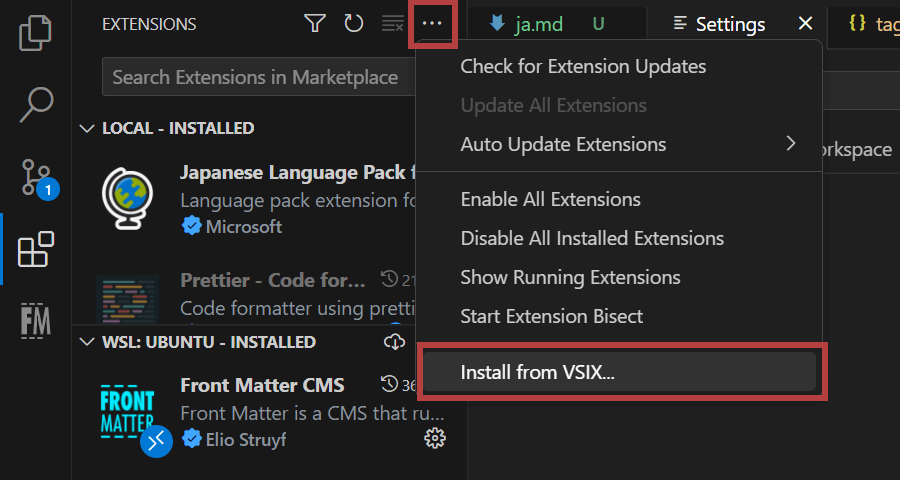

This entry is my note about how to install a VS Code extension on a on-going development branch.

## Overview

1. Pull the branch from the GitHub repository to your local environment
2. Install vsce.
3. Run `vsce package` and package the project into a VSIX file to make it installable.
4. Install the extension from the VSIX file created in step 3.

## Pulling the branch from the GitHub repository to your local environment

Since I wanted to submit pull requests, I forked the official repository to my account and then imported it to my local environment.

Check out to the branch you want to work on.

Then run `npm install` to install all the packages needed.

## Install vsce

Instead of installing an extension from the marketplace, we can use a VSIX file to package the project.

To package as a VSIX file, use the [@vscode/vsce](https://github.com/microsoft/vscode-vsce) module, a VS Code extension manager provided by Microsoft.

```bash
#npm
npm install -g @vscode/vsce
```

Link [Publishing Extensions | Visual Studio Code Extension API](https://code.visualstudio.com/api/working-with-extensions/publishing-extension)

## Run vsce package

Run the following code on the terminal.

```bash
vsce package
```

This will take a while, depending on the size of the project. When it's done, you'll find a newly created vsix file.

## Install the extension from the VSIX file

Then the only thing left to do is to install the extension via `Install from VSIX...` in the extension "..." menu.



Do not update the extension carelessly, because it updates the latest officially released version. In this case, reinstall your development version from the VSIX file.

That's it.
