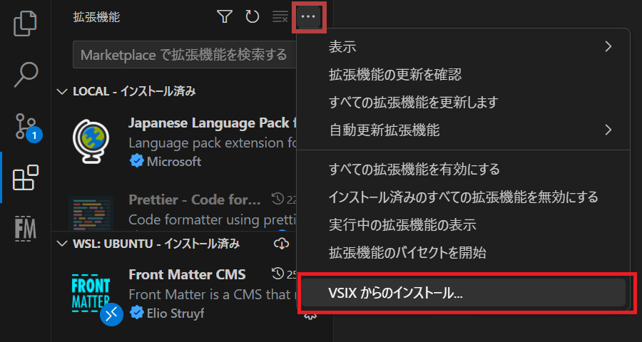

VS Codeのオープンソース拡張機能である「[Front Matter CMS](https://frontmatter.codes/)」の翻訳に参加するにあたり、公式リリース前の特定の開発中ブランチを拡張機能としてインストールすることになったので、その備忘録です。

## 概要

1. GitHub等のリポジトリから拡張機能のデータをローカルに持ってくる
2. vsceをインストール
3. 1を拡張機能として使えるように、`vsce package`を実行してVSIXファイルにパッケージ化
4. 3で生成されたVSIXファイルから拡張機能をインストール

## リポジトリから拡張機能のデータをローカルに持ってくる

私は後でプルリクエストをするため、いったん本家リポジトリを自分のGitHubアカウントへフォークして、それをローカルにダウンロードしました。

画面表示を、開発したいブランチに切り替えます。

`npm install`をして、環境を準備しておきます。

## vsceをインストール

マーケットプレイスにはないVS Codeの拡張機能を自分でインストールする場合は、プロジェクトをVSIXファイルにパッケージングし、VSIXファイルから拡張機能としてインストールします。

VSIXファイルにパッケージングするのに必要なのが、[@vscode/vsce](https://github.com/microsoft/vscode-vsce)というVS Code拡張機能の管理用モジュールです。Microsoftが開発・公開しています。これをインストールしておきます。

```bash
#npm
npm install -g @vscode/vsce
```

リンク [Publishing Extensions | Visual Studio Code Extension API](https://code.visualstudio.com/api/working-with-extensions/publishing-extension)

## vsce packageを実行

ターミナルで以下を実行。

```bash
vsce package
```

拡張機能の規模にもよりますが、しばらく待つとルートディレクトリにvsixファイルが生成されます。

## VSIXファイルから拡張機能をインストール

あとは、拡張機能の･･･メニューで「VSIXからのインストール」を選択し、当該vsixファイルを選択するだけです。



誤って拡張機能の「更新」をしてしまうと、公式の最新版等に上書き更新されてしまうので注意です（その場合は再度VSIXからインストールし直せば戻せます）。

以上です。
