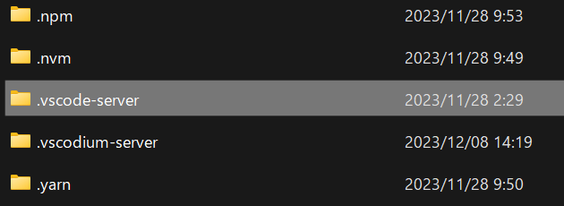

脱マイクロソフトを進めるにあたり、VS Codeを、VS Codeのフリーライセンス化版である[VS Codium](https://vscodium.com)に変更しました。

VS Codiumへ追加できる拡張機能にはVS Codeと互換性がありますが、注意点があります。

VS Codiumの拡張機能は「[Open VSX Registry](https://open-vsx.org)」からインストールできるようになっていますが、[VS Code Marketplace](https://marketplace.visualstudio.com/)に登録されている拡張機能に比べると少ないのです。※権利関係で対応していない拡張機能はOpen VSX Registryにない。

一方、IDEの乗り換えであれば、元のVS Codeに入れてある拡張機能をそのままコピペで問題なく動きます。今回はその方法の紹介です。

## WindowsでVS CodeからVS Codiumに拡張機能を移行する方法

ネイティブのWindowsの場合、VS Codeの拡張機能は以下のフォルダーにあります。

```
C:\Users\[user_name]\.vscode\extensions
```


この`extensions`フォルダーをまるごとコピーし、VS Codiumのフォルダーへペーストします。

```
C:\Users\[user_name]\.vscode-oss
```

※VS Codiumをインストールした直後は、`.vscode-oss`以下に`extensions`フォルダーはありません。

VS Codiumを再起動すると、拡張機能が有効になっているのが確認できると思います。

この方法で、Microsoft謹製のWSL用拡張機能が問題なく動いています。

## WSLでVS Codiumに拡張機能を移行する方法

WSLの場合は、以下フォルダーにVS Codeの拡張機能が格納されています。

```
\\wsl.localhost\Ubuntu\home\[user_name]\.vscode-server\extensions
```



`extensions`フォルダーをまるごとコピーし、VS Codium用のフォルダー内にペーストします。

```
\\wsl.localhost\Ubuntu\home\[user_name]\.vscodium-server
```

※VS Codiumをインストールした直後は、`.vscodium-server`以下に`extensions`フォルダーはありません。

VS Codiumを再起動すると、拡張機能が有効になっているのが確認できると思います。

## LinuxでVS Codiumに拡張機能を移行する方法

Linuxの場合は、以下のフォルダーにVS Codeの拡張機能が格納されています。

```
ホーム\.local\
```


こちらも同様に、`extensions`フォルダーをまるごとコピーし、VS Codium用のフォルダー内にペーストします。

```

```

VS Codiumを再起動すると、拡張機能が有効になっているのが確認できると思います。

## 拡張機能がVS Codium用のマーケットプレイスにない場合

Open VSX Registryに入れたい拡張機能が登録されていない場合は、VS Code Marketplaceからvsixパッケージをダウンロードし、vsixパッケージから拡張機能をインストールします。

### 拡張機能をvsixパッケージからインストールする方法

ブラウザから入れたい拡張機能のページを表示し、「Version History」から「Download」ボタンを押すと、vsixパッケージがダウンロードされます。


あとは、VS Codiumの拡張機能メニューから、「...」を選んで「VSIXからのインストール」をクリック、当該vsixファイルを選択すればOKです。


## まとめ

VS Codeを使い続けたほうがもちろん（主に拡張機能の面で）便利ですが、**このAI時代、私はもうビッグテックに情報を搾取されたくない**。そんな私のような奇特な人も、多少の少はいるはず。

拡張機能の移行はこのように難しくないので、ビッグテックに抗いたい方の参考になれば嬉しいです。

ちなみにですが、Eclipse Foundationの[Theia](https://theia-ide.org)も使ってみました。Theia IDEはまだベータ版のためなのか私の理解が追い付いていないこともあるのか、今回の方法では拡張機能の移植はできませんでした。Theiaは完全なベンダーニュートラルを標榜するOSS IDEなので、正式リリースされたら是非使ってみたいですね。
