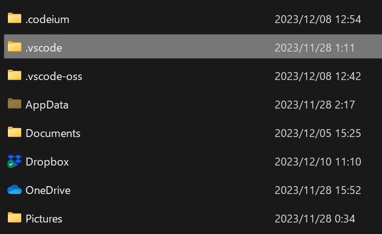
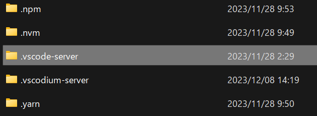
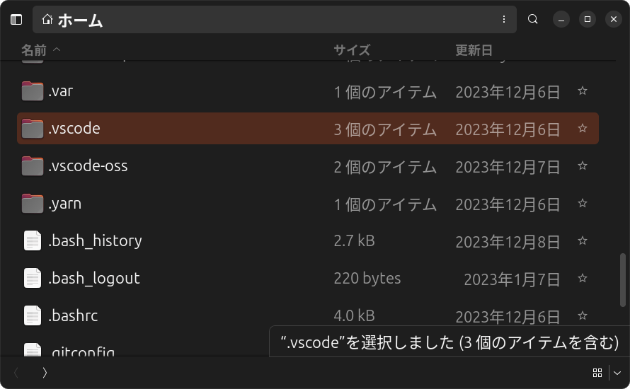
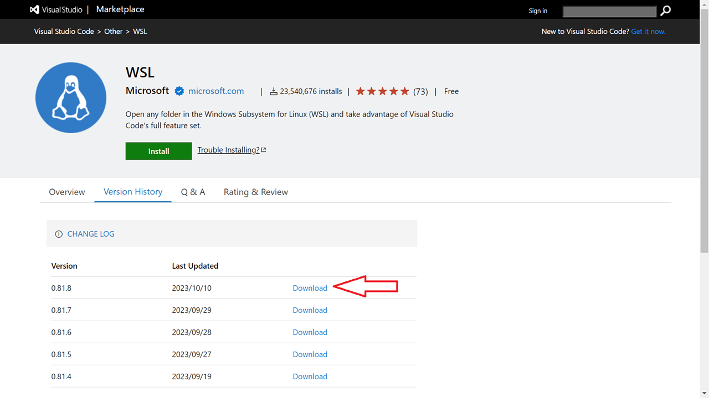
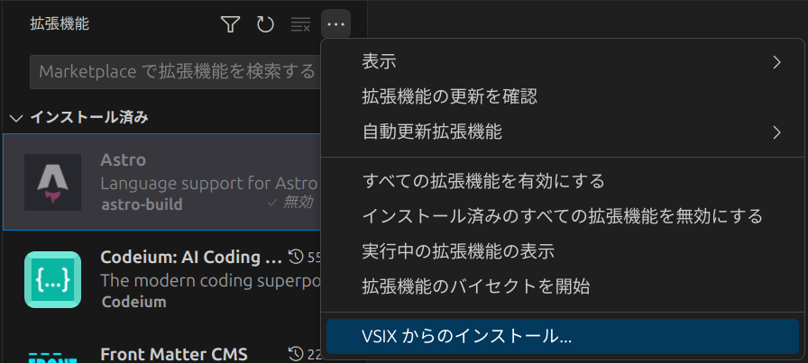

脱マイクロソフトを進めるにあたり、VS Codeを"VS CodeのフリーOSS化版"である[VS Codium](https://vscodium.com)に変更しました。

VS Codiumへ追加できる拡張機能にはVS Codeと互換性がありますが、注意点があります。

VS Codiumの拡張機能は「[Open VSX Registry](https://open-vsx.org)」を通してインストールできるようになっていますが、[VS Code Marketplace](https://marketplace.visualstudio.com/)に登録されている拡張機能に比べるとその数が10分の1以下となっています。※権利関係で対応していない拡張機能はOpen VSX Registryにない。

VS Codiumへの乗り換えであれば、元のVS Codeに入れてある拡張機能をそのままコピペすることで、問題なく動きます。今回はその方法の紹介です。

## WindowsでVS CodeからVS Codiumに拡張機能を移行する方法

ネイティブのWindowsの場合、VS Codeの拡張機能は以下のフォルダーにあります。

```
C:\Users\[user_name]\.vscode\extensions
```



この`extensions`フォルダーをまるごとコピーし、VS Codiumのフォルダーへペーストします。

```
C:\Users\[user_name]\.vscode-oss
```

※VS Codiumをインストールした直後は、`.vscode-oss`以下に`extensions`フォルダーはありません。

VS Codiumを再起動すると、拡張機能が有効になっているのが確認できると思います。

この方法で、Microsoft謹製のWSL用拡張機能が問題なく動いています。

## WSLでVS CodeからVS Codiumに拡張機能を移行する方法

WSLの場合は、以下フォルダーにVS Codeの拡張機能が格納されています（Ubuntu22.04LTSで確認）。

```
\\wsl.localhost\Ubuntu\home\[user_name]\.vscode-server\extensions
```



`extensions`フォルダーをまるごとコピーし、VS Codium用のフォルダー内にペーストします。

```
\\wsl.localhost\Ubuntu\home\[user_name]\.vscodium-server
```

※VS Codiumをインストールした直後は、`.vscodium-server`以下に`extensions`フォルダーはありません。

VS Codiumを再起動すると、拡張機能が有効になっているのが確認できると思います。

## LinuxでVS CodeからVS Codiumに拡張機能を移行する方法

LinuxでVS Code（deb版）をインストールした場合、ホーム直下の`.vscode`フォルダーにVS Codeの拡張機能が格納されています（画像はUbuntu23.10）。

`.vscode`は隠しフォルダーなので、メニュー設定等から「隠しファイルを表示」を有効にしてください。Ubuntuの場合は、左サイドバーメニューのタイトル「ファイル」のハンバーガーメニューを開くと「隠しファイルを表示」項目があります。

```
ホーム\.vscode\extensions
```



こちらも同様に、`extensions`フォルダーをまるごとコピーし、VS Codium用のフォルダー内にペーストします。

```
ホーム\.vscode-oss
```

VS Codiumを再起動すると、拡張機能が有効になっているのが確認できると思います。

## 拡張機能がVS Codium用のマーケットプレイスにない場合

Open VSX Registryに希望する拡張機能が登録されていない場合は、VS Code Marketplaceからvsixパッケージをダウンロードし、vsixパッケージから拡張機能をインストールします。

[VS Code Marketplace](https://marketplace.visualstudio.com/)のウェブサイトを表示し、「Version History」から「Download」ボタンを押すと、vsixパッケージがダウンロードされます。



あとは、VS Codiumの拡張機能メニューから、「...」を選んで「VSIXからのインストール」をクリック、当該vsixファイルを選択すればOKです。



## まとめ

VS Codeを使い続けたほうがもちろん（主に拡張機能の面で）便利ですが、**このAI時代、私はもうビッグテックに情報を搾取されたくない**。そんな私のような奇特な人も、多少の少はいるはず。

拡張機能の移行そのものは難しくないので、ビッグテックに抗いたい方の参考になれば幸いです。

### 余談：Theiaも使ってみた

ちなみにですが、Eclipse Foundationの[Theia](https://theia-ide.org)も使ってみました。Theiaの場合、拡張機能の管理方法が異なるので、同様にコピペでの移植はできないもようです。

Theiaは2023年12月現在はベータ版での公開です。動作やUIに若干難が感じられ、今回はVS Codeからの引っ越し先にはなりませんでした。しかし、こちらは完全ベンダーニュートラルの製品です。正式リリース版になったらぜひ使ってみたいですね。
